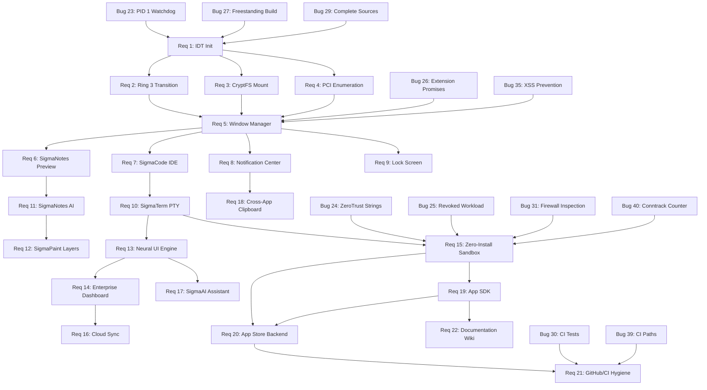

# SigmaOS Roadmap Technical Design

## Overview

This design document specifies the technical implementation for the complete SigmaOS full-platform roadmap, encompassing 40 requirements organized into five development phases (Phase 0–4) and three bug fix severity levels (Critical, High, Medium). The roadmap transforms SigmaOS from a prototype into a production-grade, bootable, secure operating system with kernel stability, a polished web-shell desktop, complete applications, platform features, and a developer ecosystem.

**Core Architecture Context:**

SigmaOS is a minimal Chromium-based operating system built on Buildroot that boots to browser in under 3 seconds. The browser serves as the OS shell, with workspaces and window management implemented entirely as web applications. The architecture consists of four layers:

1. **User Layer**: SigmaOS Shell (React/Svelte UI), PWAs, extensions, workspaces, AI kits, resource manager
2. **Browser Layer**: Custom Chromium fork with SigmaOS APIs, multi-profile manager, tab suspension, native messaging host
3. **System Layer**: SigmaOS daemons (Go) handling processes, clipboard, BlueZ, workspaces, native windows
4. **OS Base Layer**: Minimal Linux (Buildroot) with systemd, bubblewrap, and seccomp for isolation

**Security Model:**

- Native messaging bridge: Daemons listen locally, gated by the SigmaOS extension
- Bubblewrap containers: All processes run in isolated namespaces with restricted network, filesystem, and PID access
- Capabilities system: Websites must explicitly request capabilities for binary access or filesystem paths

**Key Design Principles:**

1. **Boot to Web**: Direct boot to Chromium without traditional desktop environment
2. **Browser as OS Shell**: Window management, workspaces, and hardware interfaces via web apps
3. **Unix Philosophy for Web**: PWAs gain access to raw system primitives (pipe, spawn, mmap, /dev)
4. **Zero-Bloat Packaging**: Alpine packages installed directly into user-space
5. **Strict Isolation**: Every execution context sandboxed by default


## Architecture

### System Component Hierarchy

```
┌─────────────────────────────────────────────────────────────────┐
│                      User Layer (Ring 3)                        │
│  ┌──────────────┐  ┌──────────────┐  ┌──────────────┐         │
│  │  Web Shell   │  │    PWAs      │  │  Extensions  │         │
│  │  (HTML/JS)   │  │ (SigmaNotes, │  │  (Workspace  │         │
│  │              │  │  SigmaCode,  │  │   Manager,   │         │
│  │  - Window    │  │  SigmaTerm,  │  │   AI Kit)    │         │
│  │    Manager   │  │  SigmaPaint) │  │              │         │
│  │  - Taskbar   │  │              │  │              │         │
│  │  - Notif Ctr │  │              │  │              │         │
│  │  - Lock Scrn │  │              │  │              │         │
│  └──────┬───────┘  └──────┬───────┘  └──────┬───────┘         │
└─────────┼──────────────────┼──────────────────┼────────────────┘
          │                  │                  │
          └──────────────────┴──────────────────┘
                             │
                    navigator.sigmaos.*
                             │
┌─────────────────────────────┴───────────────────────────────────┐
│              Browser Layer (Chromium Fork)                      │
│  ┌──────────────┐  ┌──────────────┐  ┌──────────────┐         │
│  │  SigmaOS API │  │ Native Msg   │  │ Multi-Profile│         │
│  │  Bindings    │  │ Bridge       │  │ Manager      │         │
│  │  (window,    │  │              │  │              │         │
│  │   pkg, fs)   │  │              │  │              │         │
│  └──────┬───────┘  └──────┬───────┘  └──────────────┘         │
└─────────┼──────────────────┼──────────────────────────────────┘
          │                  │
          └──────────────────┘
                             │
                    IPC (D-Bus / Unix Sockets)
                             │
┌─────────────────────────────┴───────────────────────────────────┐
│                   System Layer (Ring 0/Ring 3)                  │
│  ┌──────────────┐  ┌──────────────┐  ┌──────────────┐         │
│  │ sigmad-      │  │ sigmad-      │  │ sigmad-      │         │
│  │ process      │  │ clipboard    │  │ ai           │         │
│  │ (Go)         │  │ (Go)         │  │ (TinyLlama)  │         │
│  │              │  │              │  │ :17392       │         │
│  │ - spawn()    │  │ - store()    │  │ - /v1/predict│         │
│  │ - PTY alloc  │  │ - retrieve() │  │              │         │
│  └──────┬───────┘  └──────┬───────┘  └──────┬───────┘         │
│         │                  │                  │                 │
│  ┌──────┴──────────────────┴──────────────────┴──────┐         │
│  │         Bubblewrap Sandbox Manager                │         │
│  │  - Namespace isolation (PID, net, mount, IPC)    │         │
│  │  - Capability enforcement                         │         │
│  │  - Seccomp filtering                              │         │
│  └──────────────────────────────────────────────────┘         │
└─────────────────────────────┬───────────────────────────────────┘
                              │
                       System Calls
                              │
┌─────────────────────────────┴───────────────────────────────────┐
│                   OS Base Layer (Buildroot)                     │
│  ┌──────────────┐  ┌──────────────┐  ┌──────────────┐         │
│  │ Kernel       │  │ Init System  │  │ CryptFS      │         │
│  │ (x86_64)     │  │ (systemd)    │  │ (dm-crypt)   │         │
│  │              │  │              │  │              │         │
│  │ - IDT/ISR    │  │ - Service    │  │ - Key        │         │
│  │ - Ring 0/3   │  │   Watchdog   │  │   Derivation │         │
│  │ - PCI Scan   │  │ - Auto       │  │ - Mount      │         │
│  │ - ZeroTrust  │  │   Restart    │  │   Handler    │         │
│  │ - Firewall   │  │              │  │              │         │
│  └──────────────┘  └──────────────┘  └──────────────┘         │
└─────────────────────────────────────────────────────────────────┘
```

### Component Responsibilities

**Phase 0: Kernel Stability (Hardware Foundation)**

1. **Interrupt Descriptor Table (IDT) Module**
   - Initialization: `sigma_idt_init()`
   - ISR registration for CPU exceptions 0–31
   - Triple-fault prevention
   - Serial diagnostic output on failure

2. **Usermode Transition Module**
   - Ring 3 transition: `jump_to_usermode()`
   - TSS configuration with kernel stack pointers
   - Per-process kernel stack allocation
   - General-protection fault handling

3. **CryptFS Module** (`sigma_cryptfs.cpp`)
   - Encrypted root volume mounting: `sigma_cryptfs_mount_root()`
   - dm-crypt integration
   - Key derivation: `sigma_cryptfs_derive_key()`
   - Unauthenticated filesystem rejection

4. **PCI Scanner Module** (`linux_shim.cpp`)
   - MMIO-based PCI configuration space enumeration
   - Device discovery (vendor ID, device ID, class code, BARs)
   - Replacement of `fake_dev` stub
   - Empty slot detection (0xFFFF vendor ID)

**Phase 1: Shell Polish (User Experience)**

5. **Window Manager** (Web Shell component)
   - In-page window rendering (no `window.open()`)
   - Drag handlers for title bars
   - Resize handlers with 200×150px minimum
   - Persistent taskbar with focus management
   - Z-index stacking management


6. **SigmaNotes Application**
   - Split-pane layout (source + preview)
   - Markdown rendering engine integration
   - 500ms update latency target
   - Formatting toolbar (bold, italic, heading, link)
   - Cursor position tracking for insertions

7. **SigmaCode IDE Application**
   - Code editor engine (Monaco or CodeMirror)
   - Syntax highlighting, line numbers, multi-cursor
   - Filesystem access via `navigator.sigmaos.fs.*`
   - Process spawn via `navigator.sigmaos.process.spawn()`
   - Integrated terminal panel for stdout/stderr

8. **Notification Center**
   - Bell icon in system tray
   - Notification queue (FIFO)
   - Slide-out panel with chronological listing
   - Badge counter for unread notifications
   - `navigator.sigmaos.notification.show()` API

9. **Lock Screen**
   - Ctrl+L hotkey binding
   - Full-screen overlay (z-index management)
   - Date/time display (1-second update interval)
   - PIN/credential verification
   - Three-strike lockout (30-second penalty)

**Phase 2: App Completions (Feature Parity)**

10. **SigmaTerm PTY Module**
    - Server-side PTY allocation
    - WebSocket or SSE multiplexing
    - 50ms input latency target
    - 100ms output rendering latency
    - SIGWINCH on resize (column/row dimensions)

11. **SigmaNotes AI Integration**
    - HTTP client for `localhost:17392`
    - 5-second timeout handling
    - Inline suggestion display
    - Non-blocking editor during inference
    - Retry mechanism on timeout

12. **SigmaPaint Layers Panel**
    - Layer list UI component
    - Layer creation (above current layer)
    - Visibility toggle with 100ms recomposite
    - Drag-to-reorder with immediate canvas update
    - Canvas composite engine


13. **Neural UI Engine**
    - HTTP POST to `localhost:17392/v1/predict`
    - Prediction application to UI context
    - Non-200 response fallback to last prediction
    - Unreachable endpoint detection
    - Single non-blocking status indicator

14. **Enterprise Dashboard**
    - SSE connection to telemetry stream
    - 200ms metric widget update latency
    - Exponential backoff reconnection (1s → 30s cap)
    - Visible disconnection status indicator
    - Real-time metric rendering

**Phase 3: Platform Features (Advanced Capabilities)**

15. **Zero-Install Package Execution**
    - `bwrap` invocation with minimal capabilities
    - Manifest-derived capability set
    - Syscall filtering via seccomp
    - Capability violation logging to audit log
    - 500ms resource cleanup on exit

16. **Cloud Sync Module**
    - OAuth wizard UI flow
    - Credential vault storage (access/refresh tokens)
    - Topbar sync-status indicator (Idle, Syncing, Error, Disconnected)
    - Human-readable error messages on hover
    - Multi-provider support structure

17. **SigmaAI Assistant**
    - Spotlight-style overlay UI
    - Natural language query input
    - 2-second result latency target
    - Result ranking (apps, filesystem, settings)
    - Fallback to text-match search when AI unavailable

18. **Cross-App Clipboard** (`sigmad_clipboard`)
    - Session-resident daemon
    - Clipboard-updated event broadcast
    - 100ms read latency guarantee
    - MIME type support (text/plain, text/html, image/*)
    - IPC via D-Bus or Unix sockets


**Phase 4: Ecosystem (Developer & Community)**

19. **App Developer SDK**
    - JSDoc-annotated API reference
    - Machine-readable manifest schema (JSON Schema)
    - Template repository (minimal working app)
    - Schema validation with error reporting (field path + message)

20. **App Store Backend**
    - Live registry endpoint client
    - 3-second metadata update latency
    - Package download + signature verification
    - Installation pipeline
    - Untrusted package rejection UI

21. **GitHub & CI Hygiene**
    - Issue template compliance
    - Test suite execution (10-minute target)
    - No permanently commented-out tests
    - Signed release artifact for v0.1.0
    - File path validation in workflows

22. **Documentation Wiki**
    - Architecture document (kernel, HAL, scheduler, FS, net, security)
    - API reference (syscalls, IPC, SDK)
    - Build guide (bootable image from source)
    - App tutorial (create, sign, publish)
    - Security model (trust boundaries, capabilities, attestation)

**Bug Fix Components**

23. **PID 1 Init Watchdog** (`sigma_init.cpp`)
    - Infinite wait loop after service launch
    - `hlt` instruction in tight loop
    - Service exit logging (name + exit code)
    - Auto-restart on non-zero exit

24. **ZeroTrust String Operations** (`sigma_zerotrust.cpp`)
    - Bounded string copies (`strncpy`, `snprintf`)
    - Explicit size limits with null termination
    - Buffer overflow prevention
    - Security event logging on capacity exceeded


25. **Revoked Workload Policy** (`sigma_zerotrust.cpp`)
    - Revocation list consultation on every check
    - Capability denial for revoked identities
    - Revocation error code return
    - Runtime revocation enforcement (no restart required)

26. **Extension Promise Resolution** (`background.js`)
    - 10-second timeout on all API calls
    - Timeout error rejection
    - No permanently unresolved Promises
    - Pending Promise rejection on restart

27. **Freestanding Kernel Build** (`CMakeLists.txt`)
    - `-nostdlib`, `-nostdinc`, `-ffreestanding` flags
    - No hosted stdlib headers in kernel code
    - Link against sovereign libc
    - CI verification via `nm` (no glibc symbols)

28. **Init Service Array Bounds** (`sigma_init.cpp`)
    - `MAX_SERVICES` compile-time constant
    - Overflow check in `sigma_init_register()`
    - Error return on capacity exceeded
    - Warning log with rejected service name

29. **Complete Kernel Sources**
    - All `CMakeLists.txt` files compile without errors
    - Object code from every translation unit (verified via `nm`)
    - CI build failure on missing files

30. **CI Test Activation**
    - All test cases execute (no commented-out blocks)
    - Failed test pipeline marking
    - Test execution under 10 minutes

31. **Firewall Packet Inspection** (`sigma_shield.cpp`)
    - Real packet header evaluation
    - No mocked packet data in production paths
    - Drop counter updates with actual packet fields
    - 1ms per-packet processing target

32. **Audit Log Timestamps**
    - Real wall-clock timestamps (system clock)
    - ISO 8601 format with millisecond precision
    - No hardcoded timestamp values


33. **Go Daemon Error Handling** (storage ejection)
    - `handleEject` failure propagation
    - Non-success response on unmount error
    - Success response only on verified unmount

34. **Separate WiFi/Bluetooth Builds**
    - Separate CMake targets for WiFi and Bluetooth
    - WiFi-only build excludes Bluetooth objects
    - Bluetooth-only build excludes WiFi objects

35. **Web Shell XSS Prevention**
    - No direct `innerHTML` assignment with untrusted data
    - `textContent` or DOM sanitization for user content
    - Allowlist-based sanitizer for HTML rendering
    - CI static analysis for `innerHTML` usage

36. **TCP Fuzzer Reproducibility**
    - Seed value command-line/env argument
    - Reproducible packet sequence from seed
    - High-entropy default seed from system entropy
    - Seed logging at session start

37. **CryptFS Key Derivation Implementation**
    - Key computation in `sigma_cryptfs_derive_key()`
    - Full key buffer write before return
    - Key buffer zeroing on failure
    - Deterministic 256-bit key from passphrase + salt

38. **SIGMA_PROFILE Flag Usage**
    - Per-function timing instrumentation when enabled
    - Profiling output to buffer/file
    - Build guide documentation for flag

39. **CI Path Validation**
    - All workflow paths exist in repository
    - Pipeline lint step for path validation
    - Descriptive error for invalid paths

40. **Connection Tracking Counter**
    - Counter decrement on CLOSED state
    - Counter decrement before entry removal
    - Counter equals active entries at all times
    - Configurable maximum with rejection and logging


## Components and Interfaces

### Phase 0: Kernel Interfaces

**IDT Module Interface**

```c
// sigma_idt.h
typedef void (*isr_handler_t)(registers_t* regs);

// Initialize IDT with ISR stubs for exceptions 0-31
void sigma_idt_init(void);

// Register handler for specific vector
void sigma_idt_register(uint8_t vector, isr_handler_t handler);

// Load IDT descriptor into CPU
void sigma_idt_load(void);
```

**Usermode Transition Interface**

```c
// sigma_usermode.h
typedef struct {
    uint64_t kernel_stack;
    uint16_t iopl;
    uint16_t reserved[3];
} tss_t;

// Configure TSS with kernel stack
void sigma_tss_init(uint64_t kernel_stack);

// Transition to Ring 3 usermode
void jump_to_usermode(uint64_t entry_point, uint64_t user_stack);
```

**CryptFS Interface**

```c
// sigma_cryptfs.h
#define CRYPTFS_KEY_SIZE 32  // 256 bits

typedef struct {
    uint8_t key[CRYPTFS_KEY_SIZE];
    char* passphrase;
    uint8_t* salt;
    size_t salt_len;
} cryptfs_key_t;

// Mount encrypted root filesystem
int sigma_cryptfs_mount_root(const char* device_path);

// Derive encryption key from passphrase
int sigma_cryptfs_derive_key(const char* passphrase, 
                               const uint8_t* salt, size_t salt_len,
                               uint8_t* key_out);

// Unmount encrypted filesystem
int sigma_cryptfs_unmount(void);
```

**PCI Scanner Interface**

```c
// pci_scanner.h
typedef struct {
    uint16_t vendor_id;
    uint16_t device_id;
    uint8_t class_code;
    uint8_t subclass;
    uint32_t bar[6];
} pci_device_t;

// Enumerate all PCI devices
int pci_scan_devices(pci_device_t* devices, size_t max_devices);

// Read PCI configuration space
uint32_t pci_read_config(uint8_t bus, uint8_t slot, uint8_t func, uint8_t offset);
```


### Phase 1: Web Shell Interfaces

**Window Manager API (JavaScript)**

```javascript
// windowManager.js
class WindowManager {
  constructor() {
    this.windows = new Map();
    this.zIndexCounter = 1000;
    this.focusedWindow = null;
  }

  // Create new window
  createWindow(config) {
    // config: { title, content, width, height, x, y }
    // Returns: windowId
  }

  // Make window draggable
  enableDrag(windowId) { }

  // Make window resizable (200x150 minimum)
  enableResize(windowId) { }

  // Focus window (bring to front)
  focusWindow(windowId) { }

  // Close window
  closeWindow(windowId) { }

  // Update taskbar
  updateTaskbar() { }
}
```

**SigmaNotes API**

```javascript
// sigmaNotes.js
class SigmaNotes {
  constructor() {
    this.sourcePane = null;
    this.previewPane = null;
    this.updateTimeout = null;
  }

  // Initialize split-pane layout
  init() { }

  // Update preview (debounced 500ms)
  onSourceChange(text) { }

  // Render markdown to HTML
  renderMarkdown(source) { }

  // Toolbar actions
  insertBold() { }
  insertItalic() { }
  insertHeading(level) { }
  insertLink() { }
}
```

**SigmaCode API**

```javascript
// sigmaCode.js
class SigmaCode {
  constructor() {
    this.editor = null;  // Monaco/CodeMirror instance
    this.terminal = null;
    this.currentFile = null;
  }

  // Initialize editor engine
  initEditor(container) { }

  // File operations
  async openFile(path) {
    const content = await navigator.sigmaos.fs.readFile(path);
    this.editor.setValue(content);
  }

  async saveFile() {
    const content = this.editor.getValue();
    await navigator.sigmaos.fs.writeFile(this.currentFile, content);
  }

  // Run current file
  async runFile() {
    const result = await navigator.sigmaos.process.spawn({
      command: this.currentFile,
      cwd: path.dirname(this.currentFile)
    });
    this.terminal.write(result.stdout);
  }
}
```


**Notification Center API**

```javascript
// notificationCenter.js
class NotificationCenter {
  constructor() {
    this.queue = [];
    this.panelVisible = false;
    this.badgeCount = 0;
  }

  // Show notification (called via navigator.sigmaos.notification.show)
  show(notification) {
    // notification: { title, body, icon, timestamp }
    this.queue.push(notification);
    if (!this.panelVisible) {
      this.badgeCount++;
      this.updateBadge();
    }
  }

  // Toggle panel visibility
  togglePanel() { }

  // Clear all notifications
  clearAll() { }
}

// Browser Extension API
navigator.sigmaos.notification = {
  show: function(config) {
    return new Promise((resolve, reject) => {
      // Send to background script via native messaging
    });
  }
};
```

**Lock Screen API**

```javascript
// lockScreen.js
class LockScreen {
  constructor() {
    this.isLocked = false;
    this.failedAttempts = 0;
    this.lockoutUntil = null;
  }

  // Show lock overlay (Ctrl+L handler)
  lock() { }

  // Verify PIN/credential
  async verifyCredential(input) {
    if (this.lockoutUntil && Date.now() < this.lockoutUntil) {
      throw new Error('Locked out');
    }
    // Check credential
    if (valid) {
      this.unlock();
    } else {
      this.failedAttempts++;
      if (this.failedAttempts >= 3) {
        this.lockoutUntil = Date.now() + 30000;  // 30s
      }
    }
  }

  // Remove overlay
  unlock() { }

  // Update time display (1s interval)
  updateClock() { }
}
```


### Phase 2: Application Interfaces

**SigmaTerm PTY Interface**

```javascript
// sigmaTerm.js (client)
class SigmaTerm {
  constructor() {
    this.socket = null;  // WebSocket or EventSource
    this.terminal = null;  // xterm.js instance
  }

  // Connect to PTY server
  async connect() {
    this.socket = new WebSocket('ws://localhost:17393/pty');
    this.socket.on('message', (data) => {
      this.terminal.write(data);
    });
  }

  // Send input with 50ms latency target
  sendInput(char) {
    this.socket.send(char);
  }

  // Handle resize (send SIGWINCH)
  onResize(cols, rows) {
    this.socket.send(JSON.stringify({
      type: 'resize',
      cols: cols,
      rows: rows
    }));
  }
}
```

```go
// sigmad-process (server-side PTY)
package main

import (
    "github.com/creack/pty"
    "github.com/gorilla/websocket"
)

type PTYSession struct {
    master *os.File
    conn   *websocket.Conn
}

func (s *PTYSession) HandleInput(data []byte) {
    s.master.Write(data)
}

func (s *PTYSession) HandleResize(cols, rows int) {
    pty.Setsize(s.master, &pty.Winsize{
        Rows: uint16(rows),
        Cols: uint16(cols),
    })
}
```

**SigmaNotes AI Client**

```javascript
// sigmaNotesAI.js
class NotesAIClient {
  constructor() {
    this.endpoint = 'http://localhost:17392';
    this.timeout = 5000;  // 5 seconds
  }

  async getSuggestion(context) {
    const controller = new AbortController();
    const timeoutId = setTimeout(() => controller.abort(), this.timeout);

    try {
      const response = await fetch(this.endpoint, {
        method: 'POST',
        headers: { 'Content-Type': 'application/json' },
        body: JSON.stringify({ context }),
        signal: controller.signal
      });
      clearTimeout(timeoutId);
      return await response.json();
    } catch (error) {
      if (error.name === 'AbortError') {
        throw new Error('AI request timed out');
      }
      throw error;
    }
  }
}
```


**SigmaPaint Layers Interface**

```javascript
// sigmaPaint.js
class SigmaPaint {
  constructor() {
    this.layers = [];
    this.activeLayerIndex = 0;
    this.canvas = null;
  }

  // Create layer above current
  createLayer() {
    const layer = {
      id: generateId(),
      name: `Layer ${this.layers.length + 1}`,
      visible: true,
      data: createImageData(this.canvas.width, this.canvas.height)
    };
    this.layers.splice(this.activeLayerIndex + 1, 0, layer);
    this.recomposite();
  }

  // Toggle layer visibility (100ms target)
  toggleVisibility(layerId) {
    const layer = this.layers.find(l => l.id === layerId);
    layer.visible = !layer.visible;
    this.recomposite();
  }

  // Reorder layers via drag
  reorderLayer(fromIndex, toIndex) {
    const [layer] = this.layers.splice(fromIndex, 1);
    this.layers.splice(toIndex, 0, layer);
    this.recomposite();
  }

  // Composite all visible layers
  recomposite() {
    const ctx = this.canvas.getContext('2d');
    ctx.clearRect(0, 0, this.canvas.width, this.canvas.height);
    for (const layer of this.layers) {
      if (layer.visible) {
        ctx.putImageData(layer.data, 0, 0);
      }
    }
  }
}
```

**Neural UI Engine Interface**

```javascript
// neuralUIEngine.js
class NeuralUIEngine {
  constructor() {
    this.endpoint = 'http://localhost:17392/v1/predict';
    this.lastPrediction = null;
    this.available = true;
  }

  async predict(uiContext) {
    try {
      const response = await fetch(this.endpoint, {
        method: 'POST',
        headers: { 'Content-Type': 'application/json' },
        body: JSON.stringify(uiContext)
      });

      if (response.status !== 200) {
        console.warn(`Inference returned ${response.status}, using fallback`);
        return this.lastPrediction;
      }

      this.lastPrediction = await response.json();
      return this.lastPrediction;
    } catch (error) {
      this.available = false;
      this.showStatusIndicator('Neural UI unavailable');
      return null;
    }
  }
}
```


**Enterprise Dashboard SSE Interface**

```javascript
// enterpriseDashboard.js
class EnterpriseDashboard {
  constructor() {
    this.eventSource = null;
    this.metrics = new Map();
    this.reconnectDelay = 1000;
    this.maxReconnectDelay = 30000;
  }

  // Connect to telemetry stream
  connect() {
    this.eventSource = new EventSource('/api/telemetry/stream');
    
    this.eventSource.onmessage = (event) => {
      const metric = JSON.parse(event.data);
      this.updateMetric(metric);
    };

    this.eventSource.onerror = () => {
      this.showDisconnectedStatus();
      this.scheduleReconnect();
    };
  }

  // Update metric widget (200ms target)
  updateMetric(metric) {
    this.metrics.set(metric.name, metric.value);
    const widget = document.getElementById(`metric-${metric.name}`);
    if (widget) {
      widget.textContent = metric.value;
    }
  }

  // Exponential backoff reconnection
  scheduleReconnect() {
    setTimeout(() => {
      this.connect();
      this.reconnectDelay = Math.min(
        this.reconnectDelay * 2,
        this.maxReconnectDelay
      );
    }, this.reconnectDelay);
  }
}
```

### Phase 3: Platform Interfaces

**Zero-Install Execution Interface**

```go
// sigmad-sandbox/main.go
package main

type PackageManifest struct {
    Name         string   `json:"name"`
    Command      string   `json:"command"`
    Capabilities []string `json:"capabilities"`
}

func ExecuteZeroInstall(manifest PackageManifest) error {
    // Build bwrap command with minimal capabilities
    cmd := []string{
        "bwrap",
        "--ro-bind", "/usr", "/usr",
        "--ro-bind", "/lib", "/lib",
        "--tmpfs", "/tmp",
        "--unshare-all",
        "--die-with-parent",
    }

    // Add capabilities from manifest
    for _, cap := range manifest.Capabilities {
        switch cap {
        case "network":
            cmd = append(cmd, "--share-net")
        case "filesystem.read":
            cmd = append(cmd, "--ro-bind", "/home", "/home")
        // ... more capabilities
        }
    }

    cmd = append(cmd, manifest.Command)
    return exec.Command(cmd[0], cmd[1:]...).Run()
}
```


**Cloud Sync Interface**

```javascript
// cloudSync.js
class CloudSync {
  constructor() {
    this.provider = null;  // 'google', 'dropbox', etc.
    this.tokens = null;
    this.status = 'Idle';
  }

  // OAuth wizard flow
  async initiateOAuth(provider) {
    const authUrl = await this.getAuthUrl(provider);
    const authWindow = window.open(authUrl, '_blank', 'width=600,height=800');
    
    // Wait for callback
    return new Promise((resolve, reject) => {
      window.addEventListener('message', (event) => {
        if (event.data.type === 'oauth-callback') {
          this.storeTokens(event.data.tokens);
          resolve();
        }
      });
    });
  }

  // Store tokens in credential vault
  async storeTokens(tokens) {
    await navigator.sigmaos.credentials.store({
      service: `cloud-sync-${this.provider}`,
      username: 'oauth',
      password: JSON.stringify(tokens)
    });
  }

  // Update status indicator
  setStatus(status, error = null) {
    this.status = status;
    const indicator = document.getElementById('sync-status');
    indicator.className = `sync-${status.toLowerCase()}`;
    indicator.title = error || status;
  }
}
```

**SigmaAI Assistant Interface**

```javascript
// sigmaAIAssistant.js
class SigmaAIAssistant {
  constructor() {
    this.overlay = null;
    this.input = null;
    this.aiAvailable = true;
  }

  // Show Spotlight-style overlay
  show() {
    this.overlay.style.display = 'flex';
    this.input.focus();
  }

  // Process natural language query (2s target)
  async search(query) {
    const startTime = Date.now();
    
    try {
      // Try AI-powered search
      const results = await fetch('http://localhost:17392/search', {
        method: 'POST',
        body: JSON.stringify({ query }),
        headers: { 'Content-Type': 'application/json' }
      }).then(r => r.json());
      
      return this.rankResults(results);
    } catch (error) {
      // Fallback to text-match search
      this.aiAvailable = false;
      return this.textMatchSearch(query);
    }
  }

  // Rank results (apps, filesystem, settings)
  rankResults(results) {
    return results.sort((a, b) => b.score - a.score);
  }

  // Fallback text-match search
  textMatchSearch(query) {
    const sources = [
      ...this.getInstalledApps(),
      ...this.getFileSystemPaths(),
      ...this.getSystemSettings()
    ];
    return sources.filter(item => 
      item.name.toLowerCase().includes(query.toLowerCase())
    );
  }
}
```


**Cross-App Clipboard Daemon Interface**

```go
// sigmad-clipboard/main.go
package main

import (
    "sync"
)

type ClipboardData struct {
    MimeType  string
    Data      []byte
    Timestamp int64
}

type ClipboardDaemon struct {
    mu       sync.RWMutex
    data     *ClipboardData
    clients  map[string]chan ClipboardData
}

func (d *ClipboardDaemon) Write(data ClipboardData) {
    d.mu.Lock()
    defer d.mu.Unlock()
    
    d.data = &data
    
    // Broadcast to all registered clients
    for _, ch := range d.clients {
        select {
        case ch <- data:
        default:
            // Non-blocking send
        }
    }
}

func (d *ClipboardDaemon) Read() (*ClipboardData, error) {
    d.mu.RLock()
    defer d.mu.RUnlock()
    
    if d.data == nil {
        return nil, errors.New("clipboard empty")
    }
    
    return d.data, nil
}

func (d *ClipboardDaemon) Register(clientId string) chan ClipboardData {
    d.mu.Lock()
    defer d.mu.Unlock()
    
    ch := make(chan ClipboardData, 10)
    d.clients[clientId] = ch
    return ch
}
```

### Phase 4: Ecosystem Interfaces

**SDK Manifest Schema**

```json
{
  "$schema": "http://json-schema.org/draft-07/schema#",
  "title": "SigmaOS Application Manifest",
  "type": "object",
  "required": ["name", "version", "entry", "capabilities"],
  "properties": {
    "name": {
      "type": "string",
      "pattern": "^[a-z0-9-]+$",
      "description": "Application identifier (kebab-case)"
    },
    "version": {
      "type": "string",
      "pattern": "^\\d+\\.\\d+\\.\\d+$",
      "description": "Semantic version"
    },
    "entry": {
      "type": "string",
      "description": "Entry point file path"
    },
    "capabilities": {
      "type": "array",
      "items": {
        "enum": ["filesystem.read", "filesystem.write", "network", 
                 "process.spawn", "clipboard", "notification"]
      }
    },
    "icon": {
      "type": "string",
      "description": "Icon file path or data URI"
    },
    "author": {
      "type": "object",
      "properties": {
        "name": { "type": "string" },
        "email": { "type": "string", "format": "email" }
      }
    }
  }
}
```


**App Store Backend Interface**

```javascript
// appStore.js
class AppStore {
  constructor() {
    this.registryUrl = 'https://registry.sigmaos.org/api/v1';
    this.installedApps = new Map();
  }

  // Query live registry (3s target)
  async fetchApps() {
    const response = await fetch(`${this.registryUrl}/apps`);
    return await response.json();
  }

  // Install application with signature verification
  async install(appId) {
    const app = await fetch(`${this.registryUrl}/apps/${appId}`).then(r => r.json());
    
    // Download package
    const packageData = await fetch(app.downloadUrl).then(r => r.arrayBuffer());
    
    // Verify signature
    const signatureValid = await this.verifySignature(
      packageData,
      app.signature,
      app.publicKey
    );
    
    if (!signatureValid) {
      throw new Error('Package signature verification failed');
    }
    
    // Install
    await this.extractPackage(packageData, app.name);
    this.installedApps.set(app.name, app);
  }

  async verifySignature(data, signature, publicKey) {
    const key = await crypto.subtle.importKey(
      'spki',
      this.base64ToArrayBuffer(publicKey),
      { name: 'RSASSA-PKCS1-v1_5', hash: 'SHA-256' },
      false,
      ['verify']
    );
    
    return await crypto.subtle.verify(
      'RSASSA-PKCS1-v1_5',
      key,
      this.base64ToArrayBuffer(signature),
      data
    );
  }
}
```

## Data Models

### Kernel Data Structures

**IDT Entry**

```c
typedef struct {
    uint16_t offset_low;     // Offset bits 0-15
    uint16_t selector;       // Code segment selector
    uint8_t  ist;            // Interrupt Stack Table offset
    uint8_t  type_attr;      // Type and attributes
    uint16_t offset_mid;     // Offset bits 16-31
    uint32_t offset_high;    // Offset bits 32-63
    uint32_t reserved;       // Reserved (must be zero)
} __attribute__((packed)) idt_entry_t;
```

**Task State Segment**

```c
typedef struct {
    uint32_t reserved0;
    uint64_t rsp0;           // Stack pointer for ring 0
    uint64_t rsp1;           // Stack pointer for ring 1
    uint64_t rsp2;           // Stack pointer for ring 2
    uint64_t reserved1;
    uint64_t ist[7];         // Interrupt Stack Table
    uint64_t reserved2;
    uint16_t reserved3;
    uint16_t iomap_base;     // I/O Map Base Address
} __attribute__((packed)) tss_t;
```


**PCI Device Structure**

```c
typedef struct {
    uint16_t vendor_id;
    uint16_t device_id;
    uint16_t command;
    uint16_t status;
    uint8_t  revision_id;
    uint8_t  prog_if;
    uint8_t  subclass;
    uint8_t  class_code;
    uint8_t  cache_line_size;
    uint8_t  latency_timer;
    uint8_t  header_type;
    uint8_t  bist;
    uint32_t bar[6];
    uint32_t cardbus_cis;
    uint16_t subsystem_vendor_id;
    uint16_t subsystem_id;
    uint32_t expansion_rom_base;
    uint8_t  capabilities_ptr;
    uint8_t  reserved[7];
    uint8_t  interrupt_line;
    uint8_t  interrupt_pin;
    uint8_t  min_grant;
    uint8_t  max_latency;
} __attribute__((packed)) pci_device_t;
```

### Application Data Models

**Window Configuration**

```typescript
interface WindowConfig {
  id: string;
  title: string;
  content: HTMLElement;
  position: { x: number; y: number };
  size: { width: number; height: number };
  minSize: { width: number; height: number };
  zIndex: number;
  draggable: boolean;
  resizable: boolean;
  focused: boolean;
}
```

**Notification Data**

```typescript
interface Notification {
  id: string;
  title: string;
  body: string;
  icon?: string;
  timestamp: number;
  read: boolean;
  actions?: NotificationAction[];
}

interface NotificationAction {
  label: string;
  callback: () => void;
}
```

**Layer Data (SigmaPaint)**

```typescript
interface Layer {
  id: string;
  name: string;
  visible: boolean;
  opacity: number;  // 0.0 - 1.0
  blendMode: BlendMode;
  data: ImageData;
  transform: {
    x: number;
    y: number;
    rotation: number;
    scaleX: number;
    scaleY: number;
  };
}

type BlendMode = 'normal' | 'multiply' | 'screen' | 'overlay' | 'darken' | 'lighten';
```


**PTY Session Data**

```typescript
interface PTYSession {
  id: string;
  pid: number;
  masterFd: number;
  cols: number;
  rows: number;
  shell: string;
  env: Record<string, string>;
  cwd: string;
}
```

**Cloud Sync Configuration**

```typescript
interface CloudSyncConfig {
  provider: 'google' | 'dropbox' | 'onedrive';
  tokens: {
    accessToken: string;
    refreshToken: string;
    expiresAt: number;
  };
  syncPaths: string[];
  status: 'Idle' | 'Syncing' | 'Error' | 'Disconnected';
  lastSync: number;
  error?: string;
}
```

**Package Manifest**

```typescript
interface PackageManifest {
  name: string;
  version: string;
  entry: string;
  capabilities: Capability[];
  icon?: string;
  author: {
    name: string;
    email: string;
  };
  dependencies?: Record<string, string>;
  files: string[];
  signature: string;
  publicKey: string;
}

type Capability = 
  | 'filesystem.read'
  | 'filesystem.write'
  | 'network'
  | 'process.spawn'
  | 'clipboard'
  | 'notification'
  | 'camera'
  | 'microphone';
```

**Audit Log Entry**

```c
typedef struct {
    uint64_t timestamp_ms;    // ISO 8601 milliseconds since epoch
    char event_type[32];      // "capability_violation", "login", etc.
    char subject[64];         // User/process identifier
    char object[128];         // Resource accessed
    char action[32];          // "read", "write", "execute", etc.
    char result[16];          // "allow", "deny"
    char details[256];        // Additional context
} audit_log_entry_t;
```


## Error Handling

### Kernel Error Handling

**IDT Initialization Errors**
- IDT descriptor load failure → Serial diagnostic message + system halt
- Invalid ISR handler registration → Log warning, continue with default handler
- Triple-fault detection → Emergency serial dump of registers + halt

**Usermode Transition Errors**
- Invalid TSS configuration → Kernel panic with diagnostic
- General protection fault on `iret` → Handle via IDT, log diagnostic, kill process
- Invalid user stack pointer → Return error to caller, do not transition

**CryptFS Errors**
- Invalid decryption key → Serial error message + halt (no unauthenticated mount)
- dm-crypt layer failure → Propagate error code, log to serial
- Mount timeout → Retry with exponential backoff (3 attempts), then halt

**PCI Enumeration Errors**
- Empty slot (0xFFFF vendor ID) → Skip silently, continue enumeration
- Invalid BAR values → Log warning, mark device as unavailable
- MMIO access fault → Log error, continue with next device


### Application Error Handling

**Window Manager Errors**
- Window creation failure → Return null, log to console
- Invalid drag/resize bounds → Constrain to viewport
- Z-index overflow → Reset all windows to base range

**SigmaNotes/SigmaCode Errors**
- File read failure → Show error dialog, keep empty editor
- File write failure → Show error dialog, preserve content in memory
- Markdown parsing error → Show error in preview pane, allow editing
- Process spawn failure → Display error in terminal panel

**AI Integration Errors**
- 5-second timeout → Display timeout message, allow retry
- HTTP error (non-200) → Display error code, suggest checking daemon
- Connection refused → Disable AI features, show status message
- Invalid JSON response → Log error, display generic error message

**PTY Errors**
- PTY allocation failure → Display error, disable terminal
- WebSocket connection drop → Attempt reconnection (3 retries)
- Resize signal failure → Log warning, continue operation

**Clipboard Errors**
- Daemon unavailable → Fallback to browser clipboard API
- IPC timeout → Retry once, then show error
- MIME type unsupported → Convert to plain text if possible

**App Store Errors**
- Registry unreachable → Show cached apps, display offline indicator
- Signature verification failure → Abort installation, show untrusted package error
- Download failure → Retry with exponential backoff (3 attempts)
- Installation conflict → Show conflict resolution dialog

### Security Error Handling

**ZeroTrust Module**
- Revoked workload check → Deny capability, return revocation error
- Buffer overflow attempt → Log security event, terminate process
- Invalid capability request → Deny, log to audit log

**Firewall Module**
- Invalid packet header → Drop packet, increment drop counter
- Rule evaluation failure → Apply default deny policy, log error

**Sandbox Violations**
- Syscall not in allowlist → Block with EPERM, log violation
- Namespace escape attempt → Kill process, log security event
- Capability not in manifest → Deny operation, record violation


## Testing Strategy

### Property-Based Testing Applicability Assessment

This roadmap encompasses infrastructure, UI components, kernel-level code, configuration, and side-effect operations. Most requirements fall into categories where property-based testing (PBT) is **NOT appropriate**:

**Why PBT is NOT Applicable:**

1. **Infrastructure as Code** (Requirements 1-4, 27, 29, 34, 38, 39): Kernel initialization, build configuration, CI workflows
2. **UI Rendering and Layout** (Requirements 5-9, 12): Window manager, lock screen, notification center
3. **Configuration and Setup** (Requirements 21, 22, 38): GitHub hygiene, documentation, build flags
4. **Side-Effect Operations** (Requirements 10, 14, 16, 18, 20, 33): PTY allocation, SSE streams, daemon operations
5. **External Service Integration** (Requirements 11, 13, 17): AI daemon calls, cloud sync OAuth

**Small Subset Where PBT May Apply:**

- **Requirement 24**: String operations in ZeroTrust module (bounded copies, null termination)
- **Requirement 25**: Revocation list checking (input: workload ID, output: allow/deny)
- **Requirement 31**: Firewall packet header parsing (input: packet bytes, output: drop/allow)
- **Requirement 36**: TCP fuzzer seed reproducibility (same seed → same packet sequence)
- **Requirement 37**: CryptFS key derivation (same passphrase + salt → same key)
- **Requirement 40**: Connection tracking counter invariant (counter == active entries)

Given that only ~6 out of 40 requirements have potential PBT applicability, and those are testing low-level utility functions rather than core feature behavior, **we will skip the Correctness Properties section entirely** for this roadmap specification.

### Recommended Testing Approach

**Unit Tests** (Example-Based)
- Test specific scenarios with concrete inputs
- Focus on edge cases and error conditions
- Mock external dependencies (daemons, filesystems, network)
- Fast execution for CI pipeline

**Integration Tests**
- Test component interactions (browser ↔ daemon, kernel ↔ userspace)
- Verify IPC mechanisms (D-Bus, Unix sockets, native messaging)
- Test with real PTY, real clipboard daemon, real AI endpoint
- Run in isolated test environment


**End-to-End Tests**
- Boot SigmaOS in QEMU
- Verify IDT initialization on boot
- Test usermode transition with sample process
- Validate encrypted root mount
- Test full application workflows (create note, edit code, run terminal)

**Snapshot Tests**
- Kernel build output (`nm` symbol verification)
- CI workflow syntax validation
- App manifest schema validation
- Documentation completeness checks

**Security Tests**
- Fuzz test ZeroTrust module string operations
- Verify sandbox escape prevention (bubblewrap)
- Test revocation list enforcement
- Firewall rule evaluation with crafted packets
- XSS prevention in web shell (CSP headers, sanitization)

**Performance Tests**
- Window drag latency < 16ms (60fps)
- Markdown preview update < 500ms
- PTY input latency < 50ms
- PTY output rendering < 100ms
- Notification display < 200ms
- Layer visibility toggle < 100ms
- AI inference response < 5s
- Dashboard metric update < 200ms
- Clipboard read < 100ms
- Search results < 2s

### Test Organization

```
tests/
├── unit/
│   ├── kernel/
│   │   ├── idt_test.c
│   │   ├── usermode_test.c
│   │   ├── cryptfs_test.c
│   │   ├── pci_test.c
│   │   ├── zerotrust_test.c
│   │   ├── firewall_test.c
│   │   └── conntrack_test.c
│   ├── webshell/
│   │   ├── windowManager.test.js
│   │   ├── notificationCenter.test.js
│   │   ├── lockScreen.test.js
│   │   └── xssPrevention.test.js
│   └── apps/
│       ├── sigmaNotes.test.js
│       ├── sigmaCode.test.js
│       ├── sigmaTerm.test.js
│       └── sigmaPaint.test.js
├── integration/
│   ├── kernel_userspace_test.c
│   ├── daemon_ipc_test.go
│   ├── pty_websocket_test.js
│   ├── clipboard_daemon_test.go
│   ├── sandbox_enforcement_test.go
│   └── app_store_signature_test.js
├── e2e/
│   ├── boot_test.sh
│   ├── full_application_workflow_test.js
│   └── security_sandbox_test.sh
└── performance/
    ├── window_drag_benchmark.js
    ├── pty_latency_benchmark.js
    └── ai_inference_benchmark.js
```


### Test Coverage Targets

- **Kernel modules**: 80% line coverage, 90% branch coverage
- **Critical security modules** (ZeroTrust, Firewall, Sandbox): 95% branch coverage
- **Web shell components**: 70% line coverage
- **Applications**: 60% line coverage (focus on core functionality)
- **Integration tests**: All IPC paths, all daemon interactions
- **E2E tests**: Boot sequence, primary user workflows

### CI Pipeline Structure

```yaml
# .github/workflows/sigma_ci.yml
name: SigmaOS CI

on: [pull_request, push]

jobs:
  kernel-tests:
    runs-on: ubuntu-latest
    steps:
      - name: Build kernel
        run: make kernel
      - name: Run unit tests
        run: make test-kernel
      - name: Verify no glibc symbols
        run: nm build/sigma-kernel | grep -q GLIBC && exit 1 || exit 0
      - name: Coverage report
        run: gcov kernel/**/*.c

  webshell-tests:
    runs-on: ubuntu-latest
    steps:
      - name: Install dependencies
        run: npm ci
      - name: Run unit tests
        run: npm test
      - name: XSS static analysis
        run: npm run lint-security
      - name: Coverage report
        run: npm run coverage

  integration-tests:
    runs-on: ubuntu-latest
    steps:
      - name: Start daemons
        run: |
          ./sigmad-process &
          ./sigmad-clipboard &
          ./sigmad-ai &
      - name: Run integration tests
        run: make test-integration

  e2e-tests:
    runs-on: ubuntu-latest
    steps:
      - name: Build full image
        run: make image
      - name: Boot in QEMU
        run: ./scripts/qemu-boot.sh
      - name: Run E2E tests
        run: make test-e2e

  security-tests:
    runs-on: ubuntu-latest
    steps:
      - name: ZeroTrust fuzzing
        run: ./tests/fuzz/zerotrust_fuzz 10000
      - name: Sandbox escape tests
        run: make test-sandbox
      - name: Firewall rule tests
        run: make test-firewall
```


## Implementation Approach

### Phase 0: Kernel Stability (Week 1-2)

**Priority: Critical - Foundation for all other work**

**IDT Initialization** (2 days)
1. Define `idt_entry_t` structure with proper packing
2. Implement `sigma_idt_init()` to populate 32 exception handlers
3. Write ISR stub assembly code for vectors 0-31
4. Add serial diagnostic output on IDT load failure
5. Test on real hardware (verify no triple-faults)

**Usermode Transition** (3 days)
1. Define `tss_t` structure with Ring 0 stack pointer
2. Implement `sigma_tss_init()` to configure TSS
3. Write `jump_to_usermode()` assembly routine with `iret`
4. Add per-process kernel stack allocation
5. Implement GP fault handler for transition errors
6. Test with simple Ring 3 program

**CryptFS Integration** (3 days)
1. Implement `sigma_cryptfs_derive_key()` with PBKDF2
2. Wire `sigma_cryptfs_mount_root()` to dm-crypt
3. Add key buffer writing before dm-crypt handoff
4. Implement authentication failure halt logic
5. Test with encrypted test volume

**PCI Enumeration** (2 days)
1. Replace `fake_dev` stub with MMIO config space reads
2. Implement bus/device/function iteration (0-255, 0-31, 0-7)
3. Parse vendor ID, device ID, class code, BARs
4. Skip empty slots (0xFFFF vendor ID)
5. Test on real x86_64 hardware with multiple PCI devices


### Phase 1: Shell Polish (Week 3-4)

**Priority: High - User-facing experience**

**Window Manager** (4 days)
1. Create `WindowManager` class with window registry
2. Implement in-page window rendering (no `window.open()`)
3. Add drag handlers with mouse event tracking
4. Add resize handlers with 200×150px minimum constraint
5. Implement z-index stacking and focus management
6. Build persistent taskbar with window list
7. Test drag/resize performance (< 16ms frame time)

**SigmaNotes** (2 days)
1. Create split-pane layout with HTML/CSS
2. Integrate markdown rendering library (e.g., marked.js)
3. Add debounced preview update (500ms)
4. Implement toolbar with formatting buttons
5. Add cursor position tracking for insertions
6. Test with large documents

**SigmaCode** (3 days)
1. Integrate Monaco or CodeMirror editor
2. Connect filesystem API for open/save
3. Implement process spawn for run action
4. Add integrated terminal panel for output
5. Configure syntax highlighting for common languages
6. Test with multi-file projects

**Notification Center** (2 days)
1. Create bell icon in system tray
2. Implement FIFO notification queue
3. Build slide-out panel UI
4. Add badge counter logic
5. Integrate with `navigator.sigmaos.notification` API
6. Test with multiple concurrent notifications

**Lock Screen** (2 days)
1. Create full-screen overlay component
2. Bind Ctrl+L hotkey
3. Add date/time display with 1s updates
4. Implement PIN verification logic
5. Add three-strike lockout (30s penalty)
6. Test lockout timer accuracy


### Phase 2: App Completions (Week 5-6)

**Priority: Medium - Feature parity**

**SigmaTerm PTY** (3 days)
1. Implement Go server-side PTY allocator using `creack/pty`
2. Add WebSocket server for PTY I/O multiplexing
3. Integrate xterm.js client library
4. Implement 50ms input forwarding
5. Add SIGWINCH resize signal handling
6. Test with interactive programs (vim, htop)

**SigmaNotes AI** (2 days)
1. Add HTTP client for `localhost:17392`
2. Implement 5-second timeout with AbortController
3. Create inline suggestion display UI
4. Add non-blocking request handling
5. Implement retry mechanism
6. Test with various text contexts

**SigmaPaint Layers** (2 days)
1. Create layers panel UI component
2. Implement layer creation (above current)
3. Add visibility toggle with recomposite
4. Implement drag-to-reorder with event handlers
5. Build canvas composite engine
6. Test recomposite performance (< 100ms)

**Neural UI Engine** (2 days)
1. Implement HTTP POST to `/v1/predict`
2. Add response status handling (200 vs non-200)
3. Implement fallback to last prediction
4. Add unreachable endpoint detection
5. Create status indicator UI
6. Test with mock prediction server

**Enterprise Dashboard** (2 days)
1. Create SSE connection manager
2. Implement metric widget update logic (< 200ms)
3. Add exponential backoff reconnection
4. Create disconnection status indicator
5. Build real-time metric rendering
6. Test with high-frequency telemetry stream


### Phase 3: Platform Features (Week 7-8)

**Priority: Medium - Advanced capabilities**

**Zero-Install Execution** (3 days)
1. Implement Go sandbox manager with bubblewrap
2. Parse package manifest for capabilities
3. Build bwrap command with minimal capability set
4. Add seccomp filtering for syscall enforcement
5. Implement capability violation logging
6. Add 500ms resource cleanup
7. Test with various package types

**Cloud Sync** (3 days)
1. Build OAuth wizard UI flow
2. Implement provider-specific OAuth handlers
3. Add credential vault integration
4. Create topbar sync-status indicator
5. Implement sync state machine (Idle/Syncing/Error/Disconnected)
6. Add error message display on hover
7. Test with Google Drive and Dropbox

**SigmaAI Assistant** (3 days)
1. Create Spotlight-style overlay UI
2. Implement natural language query input
3. Add HTTP client for AI search endpoint
4. Build result ranking algorithm
5. Implement text-match fallback search
6. Index installed apps, filesystem, settings
7. Test response latency (< 2s target)

**Cross-App Clipboard** (2 days)
1. Implement Go clipboard daemon with D-Bus
2. Add clipboard-updated event broadcast
3. Implement MIME type support (text, HTML, image)
4. Add 100ms read latency optimization
5. Create client library for apps
6. Test cross-app copy/paste


### Phase 4: Ecosystem (Week 9-10)

**Priority: Medium - Developer enablement**

**App Developer SDK** (3 days)
1. Write JSDoc annotations for all public APIs
2. Create JSON Schema for manifest validation
3. Build template repository with minimal app
4. Implement schema validator with error reporting
5. Write API reference documentation
6. Create quickstart tutorial

**App Store Backend** (3 days)
1. Implement live registry client
2. Add package download with progress tracking
3. Implement RSA signature verification
4. Build installation pipeline
5. Create untrusted package error UI
6. Test with test registry server

**GitHub & CI Hygiene** (2 days)
1. Create issue templates (bug, feature, docs)
2. Audit CI workflows for valid file paths
3. Uncomment and fix all test blocks
4. Configure signed release workflow for v0.1.0
5. Add CI path validation step
6. Test full CI pipeline execution

**Documentation Wiki** (3 days)
1. Write architecture document (kernel, HAL, scheduler, FS, net, security)
2. Write API reference (syscalls, IPC, SDK entry points)
3. Write build guide (source → bootable image)
4. Write app tutorial (create, sign, publish)
5. Write security model document (trust boundaries, capabilities, attestation)
6. Review for completeness and accuracy


### Bug Fixes: Critical (Week 11)

**Priority: Critical - System stability**

**PID 1 Watchdog Loop** (1 day)
1. Replace bounded loop with infinite `while(1)` loop
2. Add `hlt` instruction in tight loop
3. Implement service exit logging (name + code)
4. Add auto-restart logic for failed services
5. Test PID 1 remains alive indefinitely

**ZeroTrust String Operations** (1 day)
1. Replace all `strcpy` with `strncpy`
2. Replace all `sprintf` with `snprintf`
3. Add explicit size limits and null termination
4. Implement security event logging on overflow
5. Fuzz test with long inputs

**Revoked Workload Policy** (1 day)
1. Add revocation list consultation to every check
2. Implement revocation error code return
3. Remove authentication-only revocation check
4. Add runtime revocation enforcement
5. Test with revoked workload ID

**Extension Promise Resolution** (1 day)
1. Add 10-second timeout to all API calls
2. Implement timeout error rejection
3. Audit for unresolved Promises
4. Add pending Promise rejection on restart
5. Test with slow/unresponsive handlers

**Freestanding Kernel Build** (1 day)
1. Add `-nostdlib -nostdinc -ffreestanding` to CMakeLists.txt
2. Remove hosted stdlib includes from kernel code
3. Link against sovereign libc
4. Add CI `nm` verification step
5. Test full kernel build without glibc symbols


### Bug Fixes: High (Week 12)

**Priority: High - Correctness and safety**

**Init Service Array Bounds** (0.5 day)
1. Define `MAX_SERVICES` constant
2. Add overflow check in `sigma_init_register()`
3. Implement error return on capacity exceeded
4. Add warning log with service name
5. Test with > MAX_SERVICES registrations

**Complete Kernel Sources** (0.5 day)
1. Audit CMakeLists.txt for all declared sources
2. Create missing source files or remove declarations
3. Verify object code from all translation units
4. Add CI build verification
5. Test full kernel build

**CI Test Activation** (0.5 day)
1. Uncomment all test blocks in CI workflows
2. Fix any failing tests
3. Verify < 10-minute execution time
4. Add failed test pipeline marking
5. Test full CI run

**Firewall Packet Inspection** (1 day)
1. Remove mocked packet data from production paths
2. Implement real packet header evaluation
3. Update drop counters with actual fields
4. Optimize for 1ms per-packet processing
5. Test with captured network traffic

**Audit Log Timestamps** (0.5 day)
1. Replace hardcoded timestamps with system clock
2. Format as ISO 8601 with millisecond precision
3. Remove any static timestamp values
4. Test timestamp accuracy

**Go Daemon Error Handling** (0.5 day)
1. Check unmount system call return value
2. Propagate error to caller on failure
3. Return success only on verified unmount
4. Test with busy filesystem

**Separate WiFi/Bluetooth** (1 day)
1. Create separate CMake targets
2. Split source files into wifi/ and bluetooth/
3. Verify WiFi-only build excludes Bluetooth
4. Verify Bluetooth-only build excludes WiFi
5. Test both build configurations


### Bug Fixes: Medium (Week 13)

**Priority: Medium - Quality improvements**

**XSS Prevention** (1 day)
1. Audit web shell for direct `innerHTML` usage
2. Replace with `textContent` or sanitizer
3. Implement allowlist-based HTML sanitizer
4. Add CI static analysis rule
5. Test with XSS payloads

**TCP Fuzzer Reproducibility** (0.5 day)
1. Add seed command-line/env argument
2. Implement reproducible PRNG seeding
3. Add high-entropy default seed
4. Log seed at session start
5. Test reproducibility with same seed

**CryptFS Key Derivation** (1 day)
1. Implement key computation in `sigma_cryptfs_derive_key()`
2. Write full key buffer before return
3. Add key zeroing on failure
4. Test deterministic output with same passphrase + salt
5. Verify 256-bit key length

**SIGMA_PROFILE Flag** (0.5 day)
1. Add per-function timing instrumentation
2. Write profiling output to buffer/file
3. Document flag in build guide
4. Test profiling data generation

**CI Path Validation** (0.5 day)
1. Add workflow path existence checks
2. Implement pipeline lint step
3. Add descriptive error messages
4. Test with invalid paths

**Connection Tracking Counter** (1 day)
1. Add counter decrement on CLOSED state
2. Add counter decrement before entry removal
3. Verify counter == active entries invariant
4. Add configurable maximum with logging
5. Test with high connection churn


## Security Considerations

### Kernel Security

**Ring Separation Enforcement**
- IDT configured to prevent Ring 3 from disabling interrupts
- TSS provides separate kernel stacks per process
- Page table permissions enforce memory isolation
- I/O port access restricted to Ring 0

**Encrypted Storage**
- All persistent data protected by dm-crypt
- Keys derived using PBKDF2 with high iteration count
- No plaintext key storage in memory beyond use
- Unauthenticated filesystem mounting prevented

**ZeroTrust Module**
- All string operations bounded to prevent overflows
- Revocation list checked on every capability request
- Security events logged with full context
- Buffer overflow attempts terminate process

**Firewall Module**
- Packet inspection on real network traffic
- Default deny policy on evaluation failure
- Drop counters for forensic analysis
- 1ms processing to prevent DoS via inspection overhead

### Application Security

**Sandbox Isolation**
- Bubblewrap provides namespace isolation (PID, net, mount, IPC)
- Seccomp filters restrict syscalls to manifest capabilities
- Filesystem access limited to declared paths
- Network access disabled unless explicitly requested

**Browser Security**
- Content Security Policy headers on all web shell pages
- No inline JavaScript evaluation
- Sanitization of all user-generated content
- XSS prevention via textContent and allowlist sanitizers

**IPC Security**
- Native messaging gated by SigmaOS extension
- D-Bus policy restricts daemon access
- Unix socket permissions limit client connections
- Message authentication prevents spoofing

### Cryptographic Security

**Encryption**
- AES-256 for filesystem encryption (dm-crypt)
- PBKDF2 with ≥100,000 iterations for key derivation
- Secure random number generation for salts

**Signatures**
- RSA-2048 minimum for package signatures
- SHA-256 hash algorithm
- Public key pinning for registry
- Signature verification before any package execution


### Audit and Compliance

**Audit Logging**
- All security-relevant events logged with ISO 8601 timestamps
- Subject, object, action, result recorded for each event
- Tamper-evident log structure
- Capability violations logged with call site information

**Trust Boundaries**
- Kernel (Ring 0) ↔ Userspace (Ring 3): Syscall interface
- Browser ↔ System daemons: Native messaging bridge
- Applications ↔ Sandbox: Bubblewrap namespace isolation
- User ↔ Applications: Capability manifest enforcement

**Threat Model**

*Assumed Adversaries:*
- Malicious web application attempting sandbox escape
- Compromised browser extension attempting privilege escalation
- Network attacker attempting packet injection/DoS
- Physical attacker with brief device access (mitigated by lock screen + encryption)

*Out of Scope:*
- Physical attacker with sustained access (cold boot attacks, hardware implants)
- Compromised kernel (requires code signing, verified boot in future)
- Supply chain attacks on build toolchain
- Side-channel attacks (Spectre, Meltdown)

### Capability Model

**Capability Types:**
- `filesystem.read`: Read access to declared paths
- `filesystem.write`: Write access to declared paths
- `network`: Network socket creation
- `process.spawn`: Process execution via sigmad-process
- `clipboard`: Access to cross-app clipboard
- `notification`: Display notifications
- `camera`: Camera device access
- `microphone`: Microphone device access

**Enforcement Points:**
- Manifest parsing at package installation
- Runtime checks in bubblewrap wrapper
- Seccomp filter generation from capability list
- Audit log recording on violation attempts

**Revocation:**
- Workload identity tokens can be revoked remotely
- Revocation list consulted on every capability check
- Revoked workloads denied all capabilities immediately
- No process restart required for revocation enforcement


## Design Decisions and Rationale

### Kernel Design Decisions

**Why IDT for all 32 exception vectors?**
- x86_64 CPU can raise any exception 0-31
- Unhandled exceptions cause triple-fault → system reset
- Registering all handlers provides graceful degradation
- Serial diagnostics enable debugging on real hardware

**Why separate TSS per process?**
- Each process needs isolated kernel stack for syscalls
- TSS provides hardware-enforced stack switching
- Prevents kernel stack corruption across processes
- Required for secure Ring 0/3 transitions

**Why dm-crypt for root filesystem?**
- Industry-standard encryption (used by LUKS)
- Transparent to filesystem layer (works with any FS)
- Hardware-accelerated AES on modern CPUs
- Key derivation separates passphrase from encryption key

**Why real PCI enumeration vs fake stub?**
- Real hardware has diverse device configurations
- Driver initialization depends on actual BARs
- QEMU emulation differs from physical machines
- Production OS must handle real PCI topology

### Application Design Decisions

**Why in-page windows vs native OS windows?**
- Browser is the OS shell (no separate window manager)
- Consistent look/feel across all apps
- Portable across host operating systems (for development)
- Full control over window behavior and styling

**Why Monaco/CodeMirror over custom editor?**
- Production-grade syntax highlighting and LSP integration
- Multi-cursor, find/replace, snippet support
- Well-tested on millions of users (VS Code, CodeMirror)
- Custom implementation would take months

**Why WebSocket for PTY vs HTTP polling?**
- Interactive terminal needs low latency (< 50ms)
- Bidirectional communication (input + output)
- Efficient binary frame encoding
- Standard protocol with browser support

**Why 500ms debounce for markdown preview?**
- Balance between responsiveness and CPU usage
- Prevents stuttering during fast typing
- Allows batch processing of edits
- Matches user expectation (preview "catches up" quickly)


### Platform Design Decisions

**Why bubblewrap for sandboxing?**
- Userspace implementation (no kernel patches required)
- Uses Linux namespaces (PID, net, mount, IPC)
- Integrates with seccomp for syscall filtering
- Battle-tested by Flatpak and Fedora Silverblue
- Lighter than Docker/containers (no separate FS image)

**Why OAuth for cloud sync vs API keys?**
- Industry standard for delegated authorization
- Automatic token refresh without user re-auth
- Scoped permissions (read-only vs read-write)
- Revokable without changing user password
- User-friendly authorization flow in browser

**Why D-Bus for clipboard daemon?**
- Standard IPC on Linux systems
- Policy-based access control
- Signal broadcast for clipboard updates
- Low latency (Unix domain sockets)
- Language bindings for Go, JavaScript, Python

**Why separate daemon per service?**
- Fault isolation (clipboard crash doesn't kill AI)
- Independent restart and upgrade
- Language choice per service (Go for systems, Python for AI)
- Granular resource limits and monitoring
- Follows Unix philosophy (do one thing well)

### Ecosystem Design Decisions

**Why JSON Schema for manifests?**
- Machine-readable validation
- IDE autocompletion support (VS Code, IntelliJ)
- Extensive tooling ecosystem
- Human-readable error messages with field paths
- Standard format for API documentation

**Why RSA signatures for packages?**
- Asymmetric cryptography (public key distribution safe)
- Widely supported (OpenSSL, Web Crypto API)
- 2048-bit provides adequate security for next decade
- Standard format for CI/CD integration

**Why live registry vs static package list?**
- Dynamic updates without OS upgrade
- Centralized security advisory distribution
- Usage analytics for app popularity
- A/B testing for new features
- Package author can update without user action


## Phase Dependency Graph



## Release Plan

### v0.1.0-alpha (End of Phase 0 + Critical Bugs)
- Bootable kernel on x86_64 hardware
- IDT + ISR handling
- Ring 3 usermode transition
- Encrypted root filesystem
- Real PCI enumeration
- Critical bug fixes (PID 1, ZeroTrust, extension Promises, freestanding build)

### v0.2.0-beta (End of Phase 1 + High Bugs)
- In-page window manager
- SigmaNotes, SigmaCode, SigmaTerm stubs
- Notification center
- Lock screen
- High severity bug fixes

### v0.3.0 (End of Phase 2)
- SigmaTerm with real PTY
- SigmaNotes AI integration
- SigmaPaint layers
- Neural UI Engine with real inference
- Enterprise Dashboard live telemetry
- Medium severity bug fixes

### v0.4.0 (End of Phase 3)
- Zero-install package execution
- Cloud sync OAuth
- SigmaAI Assistant
- Cross-app clipboard daemon

### v1.0.0 (End of Phase 4)
- App Developer SDK
- App Store with live registry
- Clean CI/CD pipeline
- Complete documentation wiki
- Signed v0.1.0 release artifact


## Correctness Properties

### PBT Applicability for SigmaOS Roadmap

*A property is a characteristic or behavior that should hold true across all valid executions of a system—essentially, a formal statement about what the system should do. Properties serve as the bridge between human-readable specifications and machine-verifiable correctness guarantees.*

After analyzing all 40 requirements across the five phases and bug fix categories, **property-based testing is applicable to a limited subset** of requirements. The majority of requirements fall into categories where PBT is not appropriate:

- **Infrastructure as Code**: Kernel initialization, build configuration, CI workflows (Requirements 1-4, 21, 27, 29, 34, 38, 39)
- **UI Rendering and Interaction**: Window manager, notification center, lock screen (Requirements 5-9, 12)
- **Side-Effect Operations**: PTY allocation, SSE streams, OAuth flows, daemon management (Requirements 10, 11, 13, 14, 16, 17, 18, 20, 33)
- **Configuration and Documentation**: SDK, documentation wiki, CI templates (Requirements 19, 22)

The following requirements contain testable properties where behavior varies meaningfully across inputs and property-based testing adds value:


### Property 1: ISR Handler Invocation for All Exception Vectors

*For any* CPU exception vector in the range 0-31, when that exception is triggered, the kernel SHALL invoke the corresponding ISR handler without causing a triple-fault.

**Validates: Requirements 1.3**

### Property 2: Per-Process TSS Kernel Stack Isolation

*For any* collection of user processes, each process SHALL have a unique kernel stack pointer in its TSS entry, ensuring no two processes share the same kernel stack.

**Validates: Requirements 2.3**

### Property 3: PCI Device Field Capture Completeness

*For any* PCI device discovered during enumeration (vendor ID ≠ 0xFFFF), the PCI scanner SHALL record all required fields (vendor_id, device_id, class_code, BARs).

**Validates: Requirements 4.3**

### Property 4: Empty PCI Slot Exclusion

*For any* PCI configuration space scan where some slots return vendor ID 0xFFFF, those slots SHALL NOT appear in the final device list.

**Validates: Requirements 4.4**

### Property 5: Window Drag Position Translation

*For any* window and any drag delta (Δx, Δy) applied to its title bar, the window's final position SHALL be (initial_x + Δx, initial_y + Δy).

**Validates: Requirements 5.2**

### Property 6: Window Resize Minimum Constraints

*For any* window resize operation, the resulting window dimensions SHALL satisfy width ≥ 200 pixels AND height ≥ 150 pixels.

**Validates: Requirements 5.3**

### Property 7: Sandbox Syscall Enforcement

*For any* syscall attempted by a sandboxed process, IF that syscall is not covered by the process's declared capability list, THEN the syscall SHALL be denied with EPERM.

**Validates: Requirements 15.2**

### Property 8: Capability Violation Audit Logging

*For any* capability request not declared in the package manifest, the system SHALL deny the operation AND record a violation entry in the audit log.

**Validates: Requirements 15.3**


### Property 9: Clipboard Round-Trip Fidelity

*For any* clipboard payload with a supported MIME type (text/plain, text/html, image/*), writing the payload and immediately reading it back SHALL return identical content and MIME type.

**Validates: Requirements 18.3, 18.4**

### Property 10: ZeroTrust Bounded String Copy

*For any* input string and target buffer, the ZeroTrust module's string copy operation SHALL never write beyond the buffer boundary, even when the input exceeds buffer capacity.

**Validates: Requirements 24.1, 24.2**

### Property 11: Buffer Overflow Security Event Logging

*For any* string input that exceeds the target buffer capacity in the ZeroTrust module, a security event SHALL be recorded in the audit log.

**Validates: Requirements 24.4**

### Property 12: Revocation List Consultation on Every Check

*For any* workload identity and capability request, the ZeroTrust module SHALL consult the revocation list before returning an allow/deny decision.

**Validates: Requirements 25.1, 25.3**

### Property 13: Runtime Revocation Enforcement

*For any* running workload that is added to the revocation list, all subsequent capability requests from that workload SHALL be denied with a revocation error, without requiring process restart.

**Validates: Requirements 25.4**

### Property 14: Firewall Real Packet Header Evaluation

*For any* network packet arriving at the firewall, rule evaluation SHALL reference the actual packet header fields (source IP, dest IP, ports, protocol) rather than mocked or cached values.

**Validates: Requirements 31.1, 31.2**

### Property 15: Firewall Drop Counter Accuracy

*For any* sequence of N packets dropped by the firewall, the drop counter for the matching rule SHALL increment exactly N times, using actual packet header fields for counter identification.

**Validates: Requirements 31.3**


### Property 16: TCP Fuzzer Seed Reproducibility

*For any* seed value S, running the TCP fuzzer twice with seed S SHALL produce identical packet sequences in both runs (same packet count, same header values, same payload bytes).

**Validates: Requirements 36.2**

### Property 17: CryptFS Key Derivation Determinism

*For any* non-empty passphrase P and salt value S, invoking `sigma_cryptfs_derive_key(P, S)` multiple times SHALL always produce the same 256-bit key output.

**Validates: Requirements 37.4**

### Property 18: Connection Tracking Counter Invariant

*For any* sequence of connection lifecycle operations (open, track, close), the conntrack module's active connection counter SHALL equal the number of entries currently in the connection table at all times.

**Validates: Requirements 40.1, 40.2, 40.3**

---

### Property-Based Test Implementation Guidance

For the 18 properties above, implement property-based tests using the following configuration:

**Test Library:** 
- C/C++ kernel code: Use [theft](https://github.com/silentbicycle/theft) or [rapidcheck](https://github.com/emil-e/rapidcheck)
- JavaScript web shell: Use [fast-check](https://github.com/dubzzz/fast-check)
- Go daemons: Use [gopter](https://github.com/leanovate/gopter)

**Test Configuration:**
- **Minimum iterations**: 100 per property test
- **Test tag format**: `Feature: sigmaos-roadmap, Property N: [property title]`
- **Generator guidance**: 
  - Property 1: Generate exception vectors 0-31
  - Property 2: Generate 10-100 mock process structures with unique IDs
  - Property 5: Generate drag deltas in range [-1000, 1000] pixels
  - Property 6: Generate resize attempts including edge cases (0x0, 199x149, 200x150, 1920x1080)
  - Property 9: Generate text strings (ASCII, Unicode), HTML snippets, base64-encoded images
  - Property 10: Generate strings of length 0-1000 bytes, buffers of size 16-512 bytes
  - Property 16: Generate random seeds (0 to 2^32-1)
  - Property 17: Generate passphrases (1-256 chars), salts (16-64 bytes)
  - Property 18: Generate connection event sequences (100-1000 events with random open/close timing)


**Example Property Test (Property 10: ZeroTrust Bounded String Copy):**

```c
// tests/unit/kernel/zerotrust_bounded_copy_test.c
#include "theft.h"
#include "sigma_zerotrust.h"

// Generator for random strings and buffer sizes
static enum theft_trial_res test_bounded_copy_never_overflows(
    struct theft* t, void* arg1) {
    
    // Generate random input string (0-1000 bytes)
    size_t input_len = theft_random_bits(t, 10);  // 0-1023
    char* input = malloc(input_len + 1);
    theft_random_string(t, input, input_len);
    
    // Generate random buffer size (16-512 bytes)
    size_t buffer_size = 16 + theft_random_bits(t, 9);  // 16-527
    char* buffer = calloc(buffer_size, 1);
    
    // Set canary after buffer
    const uint32_t canary = 0xDEADBEEF;
    uint32_t* canary_ptr = (uint32_t*)(buffer + buffer_size);
    *canary_ptr = canary;
    
    // Call bounded copy
    zerotrust_bounded_strcpy(buffer, input, buffer_size);
    
    // Verify no overflow (canary intact)
    bool canary_intact = (*canary_ptr == canary);
    
    // Verify null termination
    bool null_terminated = (buffer[buffer_size - 1] == '\0');
    
    free(input);
    free(buffer);
    
    return (canary_intact && null_terminated) 
        ? THEFT_TRIAL_PASS 
        : THEFT_TRIAL_FAIL;
}

int main(void) {
    theft_seed seed = theft_seed_of_time();
    struct theft_run_config config = {
        .name = "Feature: sigmaos-roadmap, Property 10: ZeroTrust Bounded String Copy",
        .trials = 100,
        .seed = seed
    };
    
    enum theft_run_res res = theft_run(&config, test_bounded_copy_never_overflows);
    return (res == THEFT_RUN_PASS) ? 0 : 1;
}
```

---

## Conclusion

This design document specifies the complete technical implementation for the SigmaOS full-platform roadmap across 40 requirements spanning kernel stability, shell polish, application completions, platform features, ecosystem development, and bug fixes. The architecture follows a layered approach with strict isolation boundaries, enabling a browser-as-OS-shell paradigm while maintaining security through bubblewrap sandboxing, capability enforcement, and encrypted storage.

The phased implementation plan provides a logical dependency graph with clear milestones, culminating in v1.0.0 with a production-grade, bootable operating system featuring a polished web shell, complete applications, advanced platform capabilities, and a developer ecosystem with SDK and app store.

Property-based testing is applied judiciously to the 18 requirements where input variation reveals edge cases and universal properties can be verified, while the majority of requirements are tested through unit tests, integration tests, end-to-end tests, and security tests appropriate to their nature as infrastructure, UI, configuration, or side-effect operations.

