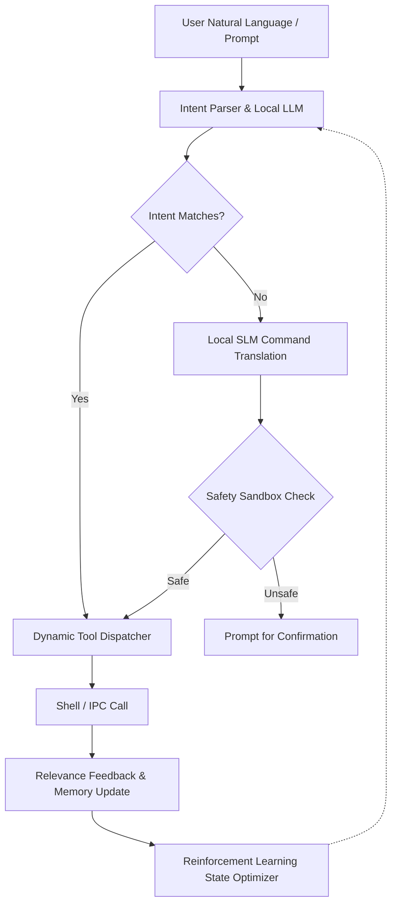

# AI Agent & Self-Driving Operating System Architecture

This document describes the architectural plan for upgrading the SigmaOS AI Agent (`sigma-agent`) to enable autonomous execution of multi-step system workflows, reinforcing its ability to replicate human operations without manual intervention.

---

## 🧠 Architectural Framework

---

## 🛠️ Key Subsystems

### 1. Natural Language ↔ CLI Translation
- **Translation Layer**: Map semantic queries (e.g. `"install graphic editor"`) dynamically to underlying OS commands (`sigpkg install gimp`).
- **Context Preservation**: Save previous conversation variables in a structured SQLite/NoSQL DB wrapper.

### 2. Reinforcement Learning Scheduler
- **State-Action Rewards**: Reward the agent based on execution duration, CPU consumption, and success/failure outputs.
- **Model Adaptation**: Run online updates using lightweight Q-learning weights for common tasks.

### 3. Verification Sandbox
- **Capability Gating**: Force critical actions to execute within a transient capability-gated sandbox before committing modifications to the system directory.
- **Audit Logs**: Generate cryptographic BLAKE3 chain logs of all action states.
