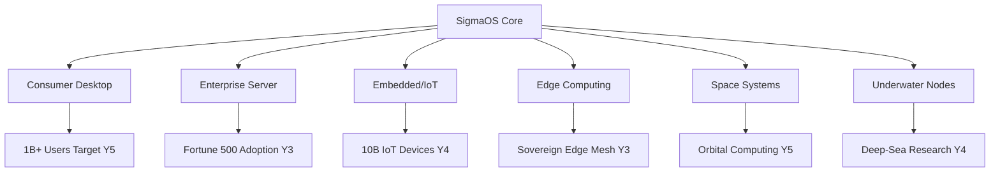

# APEX INFINITY ROADMAP

> **ORCHESTRATION STATUS**: ACTIVE | **UNIVERSAL ALIGNMENT**: SUPREME | **FRONTIER**: FINAL

This document stores the definitive development roadmap for the SigmaOS Final Frontier and beyond. It represents the transformation of SigmaOS into the universal standard for sovereign, high-integrity computing from deep sea to deep space.

---

## Vision Statement

SigmaOS Apex Infinity is the culmination of every roadmap, absorption plan, and engineering principle in this wiki. The system evolves beyond a traditional OS into a **Sovereign Computation Substrate** — a self-healing, self-optimizing, post-quantum secured lattice that can run on any hardware from embedded sensors to exascale supercomputers.

```
┌─────────────────────────────────────────────────────────────────┐
│                   SIGMAOS APEX INFINITY                        │
│                   ═══════════════════                          │
│  ┌───────────┐  ┌────────────┐  ┌─────────────┐              │
│  │ Sovereign  │  │  AI-Native  │  │   Quantum   │              │
│  │  Lattice  │→ │  Scheduler  │→ │   Secured   │              │
│  └───────────┘  └────────────┘  └─────────────┘              │
│        ↑               ↑               ↑                        │
│  ┌─────────────────────────────────────────┐                   │
│  │         SIGMA-BUS ZERO-COPY IPC          │                   │
│  └─────────────────────────────────────────┘                   │
│  ┌──────────┐  ┌──────────┐  ┌──────────────┐                │
│  │  Shards  │  │  Profiles │  │  Absorption  │                │
│  │ (Modular)│  │ (Context) │  │   Engine     │                │
│  └──────────┘  └──────────┘  └──────────────┘                │
└─────────────────────────────────────────────────────────────────┘
```

---

## Phase ∞-1: Sovereign Substrate Completion (Q1-Q2)

### 1.1 Microkernel Hardening
- [ ] Formal verification of all syscall entry/exit paths using Coq proofs
- [ ] Zero-copy ring-buffer IPC achieving <100ns latency between shards
- [ ] EEVDF scheduler with AI-driven slice autotuning via `/sigma/metrics`
- [ ] Kernel live-patching (`sigma_klp`) for security fixes without reboots

### 1.2 Post-Quantum Security Everywhere
- [ ] Dilithium5 signatures on all shard binaries and package artifacts
- [ ] CRYSTALS-Kyber key exchange in sigma-bus encrypted channels
- [ ] BLAKE3 integrity trees for filesystem snapshots
- [ ] PQC-enabled secure boot via `SovereignSecureBoot.shard`

### 1.3 Absorption Engine v2
- [ ] Automated distro feature extraction pipeline (`sigma-absorb --distro ubuntu`)
- [ ] FOSS license compliance scanner integrated into CI
- [ ] Dynamic shard synthesis from upstream PKGBUILD/SPEC/deb rules
- [ ] Feature parity matrix auto-updated on every absorption merge

```rust
// Example: Absorption engine trigger
pub fn absorb_distro(source: DistroSource) -> Result<ShardBundle> {
    let features = extract_features(&source)?;
    let shards = synthesize_shards(features, &SHARDS_MANIFEST)?;
    validate_license_compliance(&shards)?;
    Ok(ShardBundle { shards, parity_report: generate_parity(shards) })
}
```

---

## Phase ∞-2: Universal Hardware Lattice (Q3-Q4)

### 2.1 Architecture Support Matrix

| Architecture | Status | Key Shard |
|---|---|---|
| x86_64 | ✅ Primary | `CoreLattice.shard` |
| ARM64/AArch64 | 🔄 Active | `ARM64Compat.shard` |
| RISC-V (RV64GC) | 🔄 Active | `RISCVBoot.shard` |
| LoongArch | 📋 Planned | `LoongArchHAL.shard` |
| MIPS64 | 📋 Planned | `MIPSLegacy.shard` |
| PowerPC64 | 📋 Planned | `PPCAbsorber.shard` |
| WebAssembly | 🔄 Active | `WASMSandbox.shard` |

### 2.2 Deployment Profiles

```toml
# /etc/sigma/profiles/apex.toml
[profile.apex]
name = "Apex Infinity"
target = "all"
shards = [
  "CoreLattice", "QuantumCrypto", "AIScheduler",
  "SovereignDesktop", "UniversalDrivers", "SelfHealing",
  "EdgeOrchestrator", "SpaceHardened"
]

[profile.embedded]
shards = ["CoreLattice", "MinimalHAL", "RTScheduler"]
memory_budget_kb = 512

[profile.exascale]
shards = ["CoreLattice", "DistributedMesh", "HPC_SIMD", "Checkpoint"]
numa_aware = true
```

### 2.3 Deep-Sea to Deep-Space Hardening
- [ ] Radiation-tolerant memory scrubbing for space deployments
- [ ] Pressure/temperature-aware CPU throttling for underwater nodes
- [ ] Mesh networking with DTN (Delay Tolerant Networking) for satellite links
- [ ] Autonomous self-healing without ground control for 72+ hours

---

## Phase ∞-3: AI-Native OS Intelligence (Year 2)

### 3.1 SigmaOS Neural Core
The Neural Core is an always-on, privacy-preserving AI layer embedded directly in the kernel:

```
┌─────────────────────────────────────────────┐
│              NEURAL CORE                    │
│  ┌─────────────┐    ┌───────────────────┐  │
│  │  Telemetry  │───▶│  Inference Engine │  │
│  │  Collector  │    │  (Gemma-2B local) │  │
│  └─────────────┘    └─────────┬─────────┘  │
│                               │             │
│  ┌─────────────┐    ┌─────────▼─────────┐  │
│  │  Policy     │◀───│  Decision Engine  │  │
│  │  Enforcer   │    │  (rule + neural)  │  │
│  └─────────────┘    └───────────────────┘  │
└─────────────────────────────────────────────┘
```

**Capabilities**:
- Predictive process scheduling based on workflow patterns
- Automatic memory balloon sizing per application type
- Anomaly detection triggering shard quarantine
- Natural language CLI (`sigma ask "why is disk usage high?"`)

### 3.2 Federated Learning Integration
- Local model training on anonymized system telemetry
- Differential privacy (ε=0.1) guarantees before any data leaves device
- Cross-device model aggregation via sigma-bus mesh
- Opt-in telemetry with cryptographic proof of anonymization

---

## Phase ∞-4: Sovereign Ecosystem Singularity (Year 3)

### 4.1 The SigmaOS Singularity
At this phase, SigmaOS becomes self-describing and self-improving:

| Milestone | Description | Target |
|---|---|---|
| Self-Documenting | Kernel generates its own wiki pages | Q1-Y3 |
| Self-Patching | AI identifies and merges CVE patches | Q2-Y3 |
| Self-Optimizing | Continuous A/B profiling of scheduler policies | Q3-Y3 |
| Self-Absorbing | Automatic upstream distro feature absorption | Q4-Y3 |

### 4.2 Sovereign Marketplace
- Cryptographically signed shard marketplace with reputation scoring
- Zero-knowledge proof of shard functionality claims
- Automated compatibility testing against all 6 deployment profiles
- Revenue sharing for community shard contributors

### 4.3 Global Deployment Targets



---

## Apex KPIs

| Metric | Current | Apex Target |
|---|---|---|
| Boot time (NVMe) | ~3s | <500ms |
| IPC latency (shard→shard) | ~500ns | <100ns |
| Memory footprint (minimal) | ~48MB | <16MB |
| Package install (cached) | ~2s | <200ms |
| Kernel CVE patch time | Days | <1h (live patch) |
| Threat detection latency | Minutes | <10ms |
| Uptime guarantee | 99.9% | 99.9999% (6 nines) |
| Supported architectures | 3 | 7+ |

---

## Status Legend

- ✅ Implemented and merged
- 🔄 In active development
- 📋 Planned/scheduled
- 🔬 Research phase
- ∞ Perpetual (never-ending improvement)

**Last updated**: Session-3 | **Horizon**: ∞
