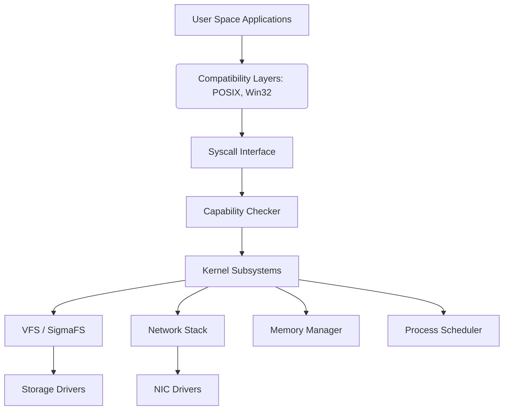
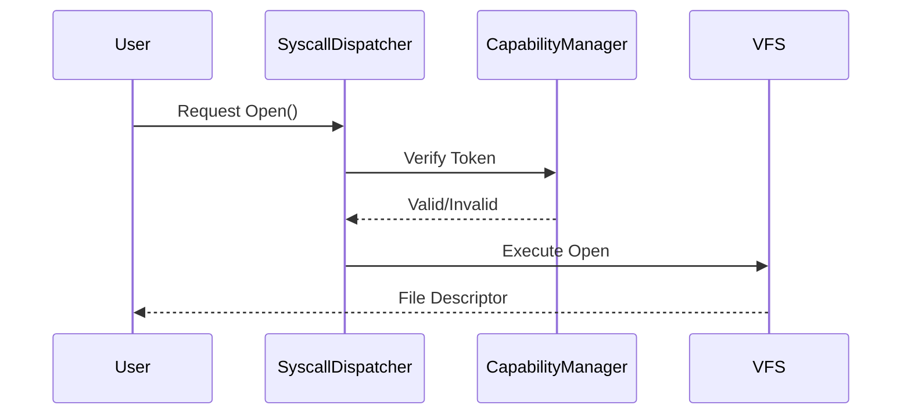

# SigmaOS Architecture

SigmaOS follows a modern, modular monolithic kernel design augmented with microkernel-like capability models.

## Architecture Overview

## Security Layer
Every transition from User Space to Kernel Space requires a verified Capability Token.

## Package Management
SigmaPkg operates immutably:
- Transactions are atomic.
- Configurations are declarative.
