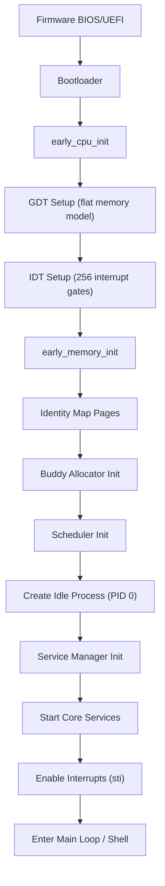

# SigmaOS Architecture Guide

## Overview

SigmaOS is a monolithic Rust-based operating system targeting x86_64. This document describes the high-level architecture, subsystem interactions, and design decisions.

## System Architecture

```
┌─────────────────────────────────────────────────────────┐
│                    User Space (Ring 3)                   │
│  ┌──────────┐ ┌──────────┐ ┌──────────┐ ┌───────────┐  │
│  │ sigma-sh │ │ sigpkg   │ │ Zenith   │ │ AI Agent  │  │
│  │ (shell)  │ │ (pkgmgr) │ │ (desktop)│ │ (runtime) │  │
│  └──────────┘ └──────────┘ └──────────┘ └───────────┘  │
│  ┌─────────────────────────────────────────────────┐    │
│  │  Userland libc (syscall wrappers, stdio, etc.)  │    │
│  └─────────────────────────────────────────────────┘    │
├─────────────────────────────────────────────────────────┤
│              System Call Interface (INT 0x80)            │
├─────────────────────────────────────────────────────────┤
│                   Kernel Space (Ring 0)                  │
│                                                         │
│  ┌──────────────────────────────────────────────────┐   │
│  │              Kernel Core (src/kernel/)            │   │
│  │  ┌───────────┐ ┌───────────┐ ┌────────────────┐  │   │
│  │  │ Scheduler │ │ Memory    │ │ Process        │  │   │
│  │  │ (sched/)  │ │ (mm/)     │ │ Manager (proc/)│  │   │
│  │  └───────────┘ └───────────┘ └────────────────┘  │   │
│  │  ┌───────────┐ ┌───────────┐ ┌────────────────┐  │   │
│  │  │ VFS       │ │ Syscall   │ │ IRQ Handling   │  │   │
│  │  │ (vfs/)    │ │ (syscall/)│ │ (irq/)         │  │   │
│  │  └───────────┘ └───────────┘ └────────────────┘  │   │
│  └──────────────────────────────────────────────────┘   │
│                                                         │
│  ┌──────────────────────────────────────────────────┐   │
│  │            Device Drivers (src/drivers/)          │   │
│  │  ┌────────┐ ┌────────┐ ┌─────┐ ┌──────┐ ┌────┐  │   │
│  │  │ Serial │ │ VGA    │ │ RTC │ │ PS/2 │ │ATA │  │   │
│  │  │(16550) │ │(Text)  │ │CMOS │ │ KBD  │ │PIO │  │   │
│  │  └────────┘ └────────┘ └─────┘ └──────┘ └────┘  │   │
│  └──────────────────────────────────────────────────┘   │
├─────────────────────────────────────────────────────────┤
│                    Hardware (x86_64)                     │
│  CPU • RAM • Storage • Serial • Display • Keyboard      │
└─────────────────────────────────────────────────────────┘
```

## Boot Sequence



## Subsystem Details

### 1. Memory Management

The memory subsystem follows a layered design inspired by Linux's `mm/` subsystem:

| Layer | Component | Description |
|-------|-----------|-------------|
| **Physical** | `BuddyAllocator` | Power-of-2 page frame allocator |
| **Virtual** | `VirtualMemoryManagerV2` | 4-level page table management |
| **Heap** | `SlabObjectCacheAllocator` | Fixed-size object caches (like SLUB) |
| **DMA** | `DmaRingBufferAllocator` | Ring buffer for device I/O |
| **Guard** | `HardenedGuardPageAllocator` | Red-zone pages for overflow detection |
| **NUMA** | `NumaAllocator` | NUMA-aware memory allocation |

### 2. Process Management

Each process is represented by a `TaskControlBlock` containing:
- CPU context (all x86_64 registers)
- Address space (page table root / CR3)
- File descriptor table
- Signal state
- Scheduling parameters (priority, time slice)
- Parent/child relationships

### 3. Scheduler

Multiple scheduling policies available:
- **Round-Robin**: Fixed time quantum, circular queue
- **Priority**: Multi-level queues (140 levels, Linux-compatible)
- **CFS**: Virtual runtime-based fair scheduling
- **EEVDF**: Earliest Eligible Virtual Deadline First

### 4. Virtual File System

The VFS provides a unified interface over concrete filesystems:

```
open() / read() / write() / close()
            │
     ┌──────┴──────┐
     │  VFS Layer  │
     │ (inode,     │
     │  dentry,    │
     │  superblock)│
     └──────┬──────┘
            │
    ┌───────┼───────┐
    │       │       │
  RamFS  FAT16   DevFS
```

### 5. System Calls

System call dispatch uses a function table indexed by syscall number:

| Number | Name | Category |
|--------|------|----------|
| 0 | read | File I/O |
| 1 | write | File I/O |
| 2 | open | File I/O |
| 3 | close | File I/O |
| 39 | getpid | Process |
| 56 | clone | Process |
| 57 | fork | Process |
| 59 | execve | Process |
| 60 | exit | Process |
| 62 | kill | Signal |

### 6. Interrupt Architecture

```
Hardware IRQ → PIC/APIC → IDT Lookup → ISR Stub (asm) →
  Save Registers → C Handler → EOI → Restore → iret
```

- Vectors 0-31: CPU exceptions (divide error, page fault, GPF, etc.)
- Vectors 32-47: Hardware IRQs (timer, keyboard, serial, etc.)
- Vector 0x80: System call interface

## Security Model

SigmaOS implements defense-in-depth security:

1. **Landlock LSM**: Fine-grained filesystem access control
2. **Capsicum**: Capability-based sandboxing
3. **Seccomp-BPF**: System call filtering
4. **Pledge/Unveil**: OpenBSD-style promise-based restrictions
5. **Guard Pages**: Memory corruption detection
6. **ASLR**: Address space layout randomization

## Build System

The project uses Cargo (Rust's build system) with Make as the automation layer:

```
Cargo.toml          → Rust dependencies and features
Makefile            → Build automation targets
rust-toolchain.toml → Toolchain version pinning
```

### Feature Flags

```toml
[features]
microkernel = ["core-shards"]    # Bare-metal kernel binary
desktop = []                      # Desktop environment components
drivers = []                      # Hardware driver modules
ai = []                          # AI runtime integration
scheduler-eevdf = []             # EEVDF scheduler
scheduler-bore = []              # BORE scheduler
landlock-v4 = []                 # Landlock security
```

## Design Principles

1. **Safe by Default**: Use safe Rust everywhere; `unsafe` only for hardware access
2. **Zero Dependencies**: Kernel code uses `#![no_std]` compatible primitives
3. **Modular Architecture**: Each subsystem is a separate module with clean interfaces
4. **Linux-Compatible**: Follow Linux conventions for syscalls, file hierarchy, driver model
5. **Testable**: All components have unit tests runnable on the host OS
