# SigmaOS Architecture

> **Status**: Implemented
> **Last Updated**: 2026-07-13

This document describes the high-level architecture of SigmaOS, including the microkernel design, shard architecture, security model, and component interactions.

## Overview

SigmaOS is a sovereign microkernel operating system built on the principle of capability-based security. The system is composed of modular components called "shards" that can be loaded, unloaded, and updated independently.

## System Architecture

### High-Level Architecture

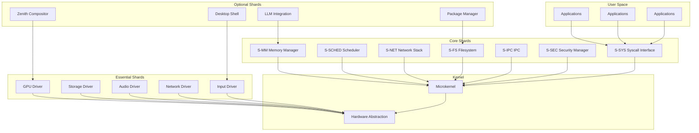

## Microkernel Architecture

### Core Components

The SigmaOS microkernel provides minimal functionality, delegating most services to user-space shards:

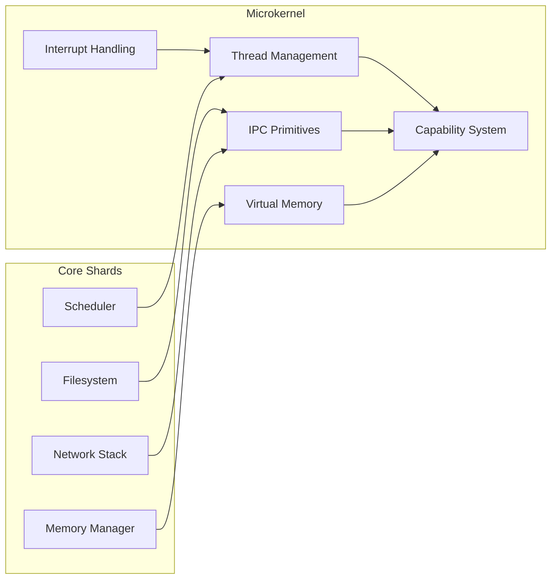

### Capability-Based Security

SigmaOS uses capability-based security where all access is granted through capabilities:

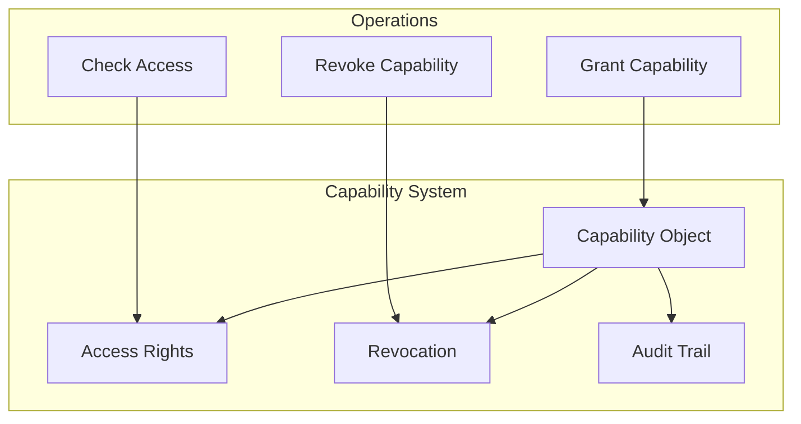

## Shard Architecture

### Shard Types

SigmaOS has four categories of shards:

1. **Core Shards**: Essential kernel components (Rust)
2. **Essential Shards**: Hardware drivers (Rust/Zig)
3. **Optional Shards**: Desktop and AI features (Nim)
4. **Infinite Shards**: Experimental features (Zig)

### Shard Loading

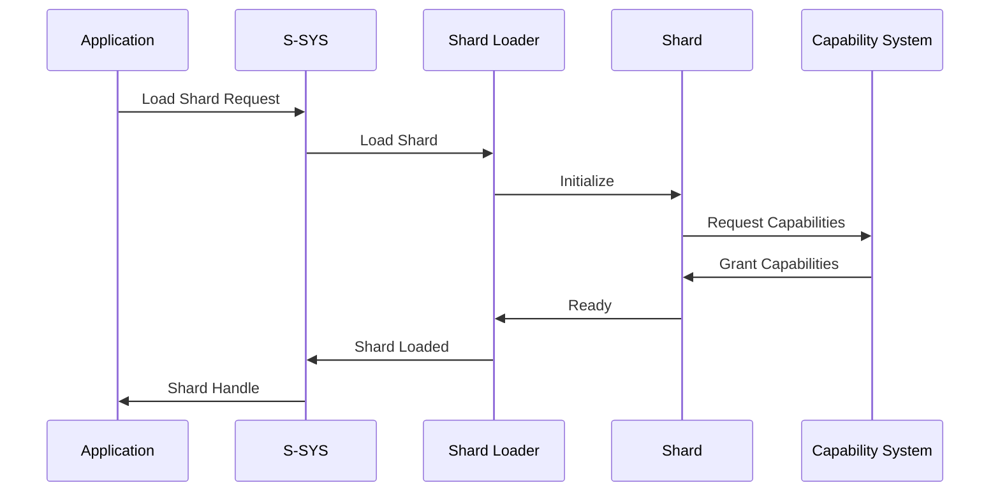

### Shard Communication

Shards communicate through well-defined interfaces:

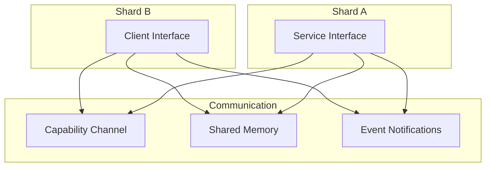

## Core Shards

### S-MM (Memory Manager)

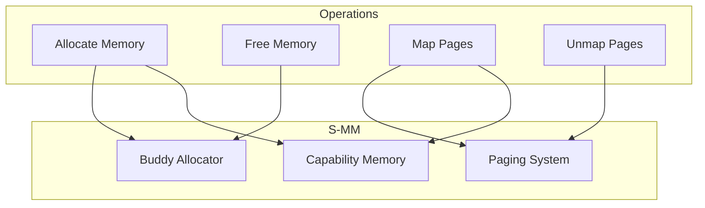

### S-SCHED (Scheduler)

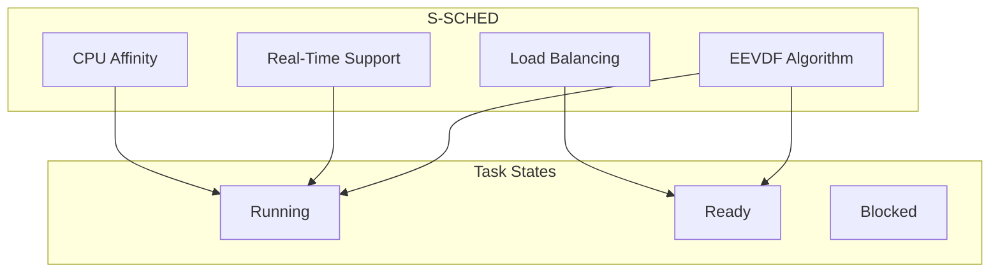

### S-NET (Network Stack)

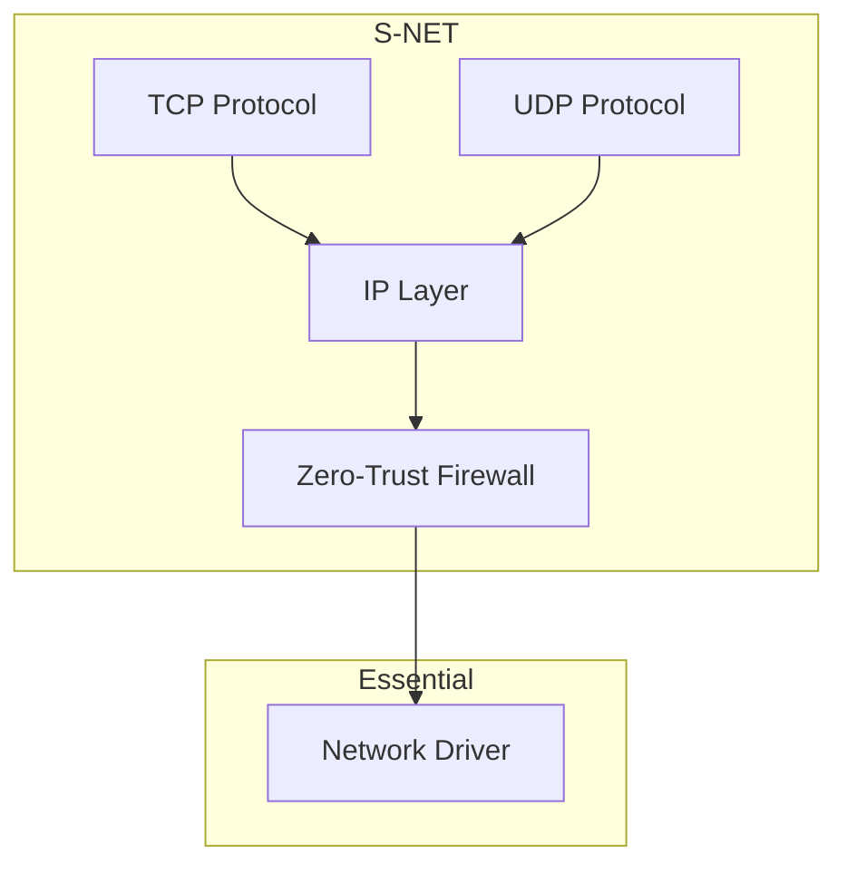

### S-FS (Filesystem)

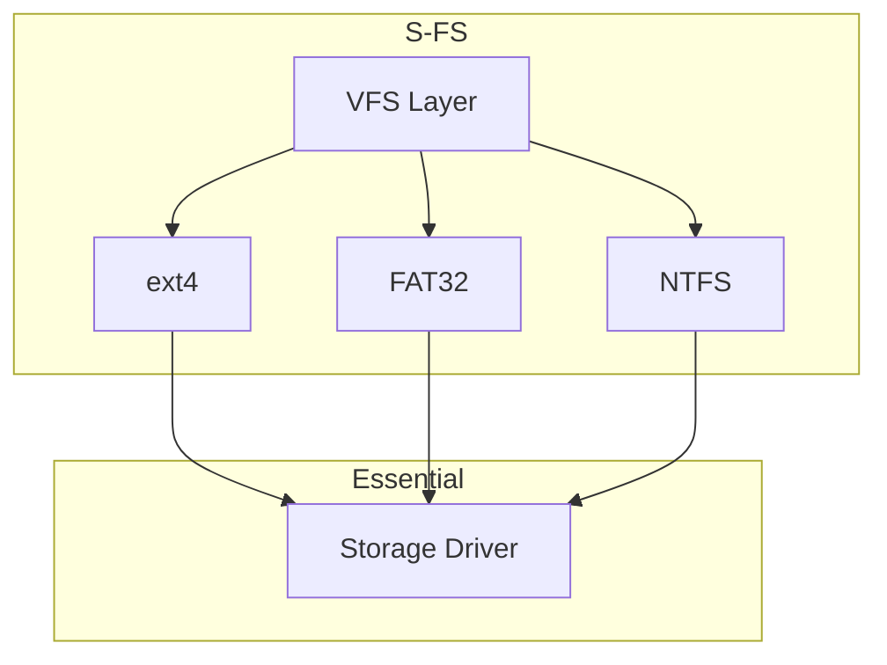

### S-IPC (Inter-Process Communication)

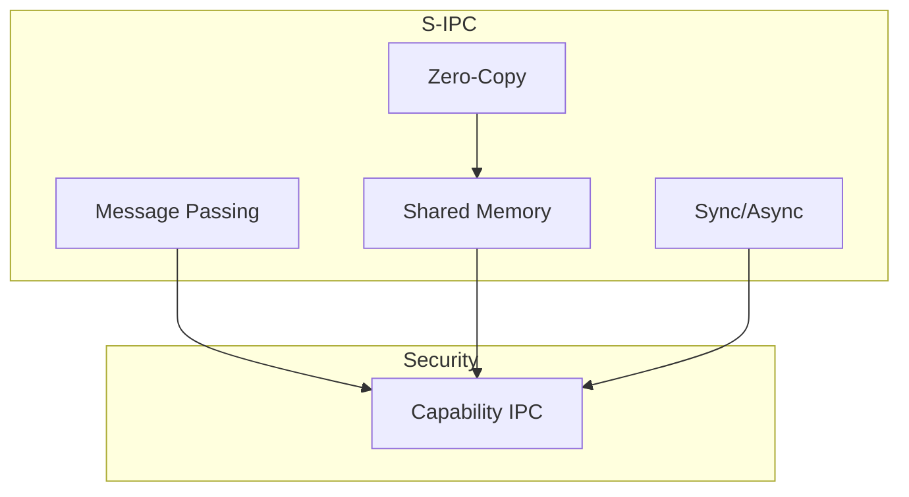

### S-SEC (Security Manager)

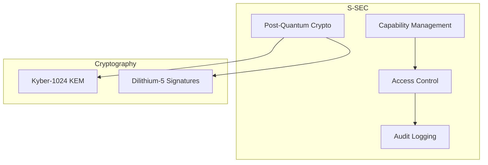

### S-SYS (System Call Interface)

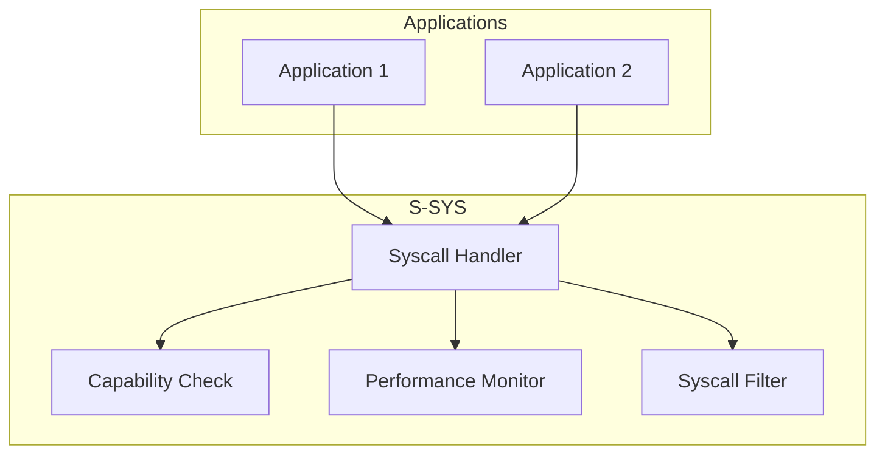

## Essential Shards

### GPU Driver

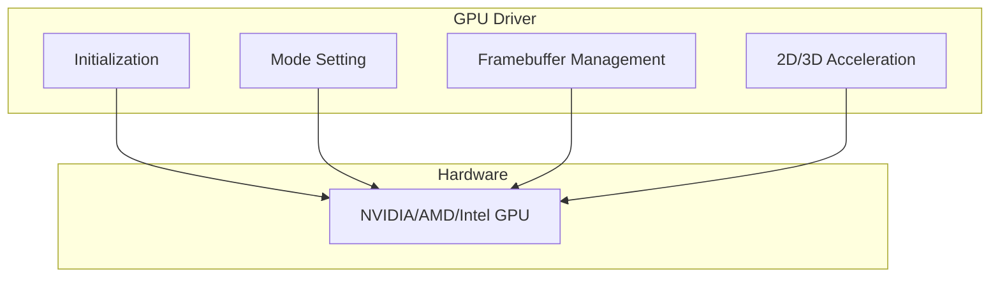

### Storage Driver

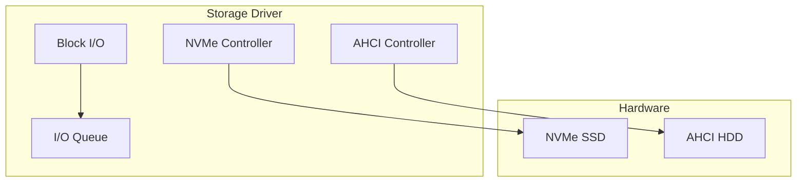

### Audio Driver

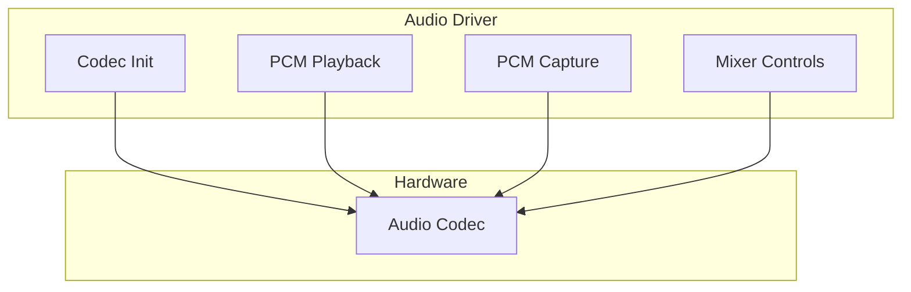

### Network Driver

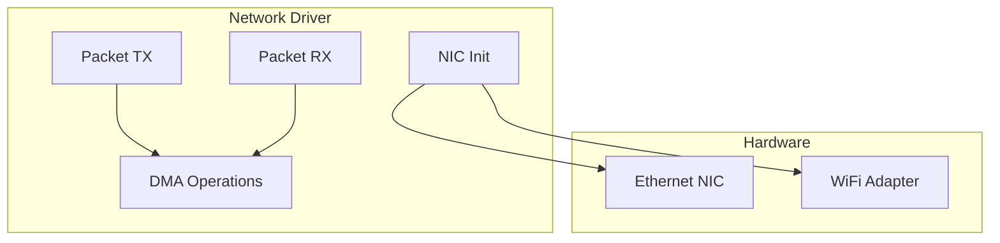

### Input Driver

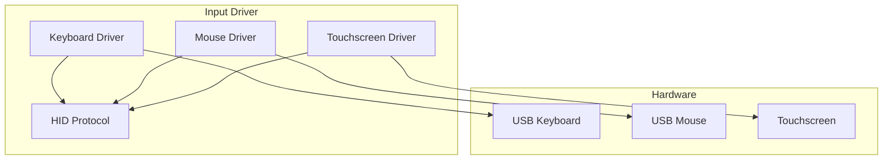

## Security Architecture

### Capability Model

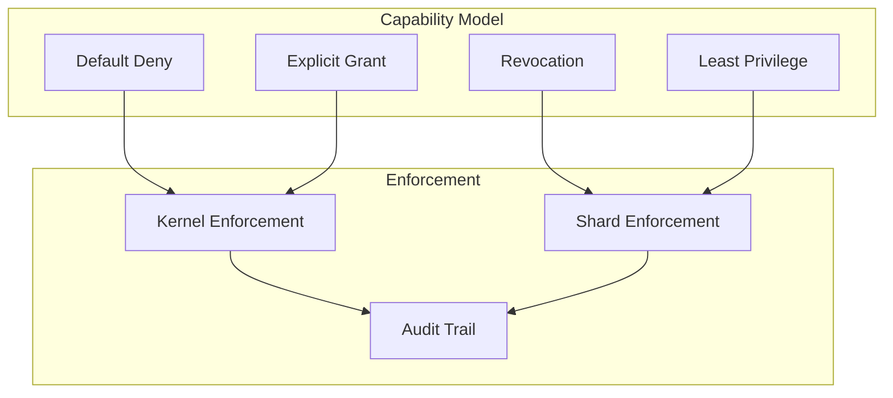

### Post-Quantum Cryptography

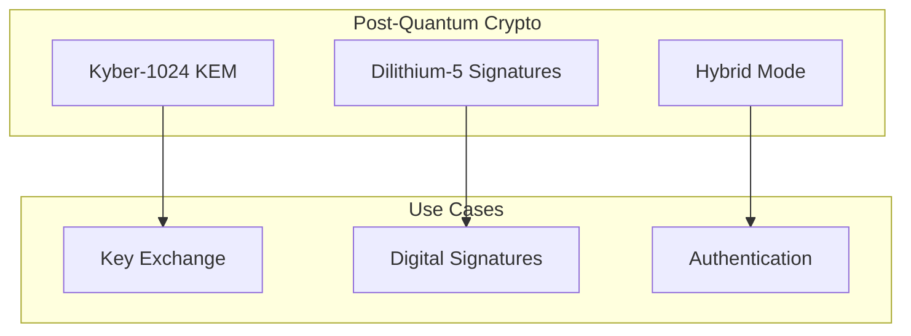

## Deployment Profiles

### Standalone (Full Desktop)

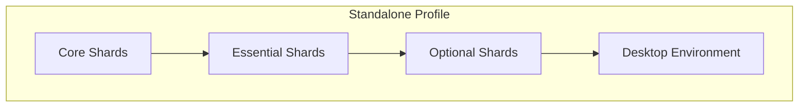

### Microkernel (Embedded)

```mermaid
graph TB
    subgraph "Microkernel Profile"
        Core[Core Shards Only]
        Minimal[Minimal Footprint]
    end
    
    Core --> Minimal
```

### Cloud (Headless)

```mermaid
graph TB
    subgraph "Cloud Profile"
        Core[Core Shards]
        Essential[Essential Shards]
        CloudInit[Cloud-Init]
        SSH[SSH Access]
    end
    
    Core --> Essential
    Essential --> CloudInit
    Essential --> SSH
```

## Component Interactions

### Boot Sequence

```mermaid
sequenceDiagram
    participant Boot as Bootloader
    participant Kernel as Microkernel
    participant Core as Core Shards
    participant Essential as Essential Shards
    participant User as User Space
    
    Boot->>Kernel: Load Kernel
    Kernel->>Kernel: Initialize
    Kernel->>Core: Load Core Shards
    Core->>Kernel: Ready
    Kernel->>Essential: Load Essential Shards
    Essential->>Kernel: Ready
    Kernel->>User: Start Init
    User->>User: System Ready
```

### System Call Flow

```mermaid
sequenceDiagram
    participant App as Application
    participant Sys as S-SYS
    participant Cap as S-SEC
    participant Shard as Core Shard
    participant Kernel as Microkernel
    
    App->>Sys: System Call
    Sys->>Cap: Check Capability
    Cap->>Sys: Access Granted
    Sys->>Shard: Forward Request
    Shard->>Kernel: Kernel Operation
    Kernel->>Shard: Result
    Shard->>Sys: Return Result
    Sys->>App: Return to User
```

## Performance Considerations

### Zero-Copy Operations

```mermaid
graph LR
    subgraph "Zero-Copy"
        Shared[Shared Memory]
        Cap[Capability Access]
        Direct[Direct Access]
    end
    
    subgraph "Benefits"
        Perf[Performance]
        Latency[Low Latency]
        CPU[Low CPU Usage]
    end
    
    Shared --> Cap
    Cap --> Direct
    
    Direct --> Perf
    Direct --> Latency
    Direct --> CPU
```

### EEVDF Scheduling

```mermaid
graph TB
    subgraph "EEVDF"
        Virtual[Virtual Deadline]
        Eligible[Earliest Eligible]
        Fair[Fairness]
        RT[Real-Time Support]
    end
    
    subgraph "Benefits"
        O1[O1 Scheduling]
        LowLat[Low Latency]
        Predictable[Predictable]
    end
    
    Virtual --> Eligible
    Eligible --> Fair
    Fair --> RT
    
    Eligible --> O1
    RT --> LowLat
    Fair --> Predictable
```

## Future Architecture

### Self-Evolving System

```mermaid
graph TB
    subgraph "Self-Evolving"
        Genetic[Genetic Algorithms]
        RL[Reinforcement Learning]
        Auto[Auto-Tuning]
        SelfHeal[Self-Healing]
    end
    
    subgraph "Targets"
        Kernel[Kernel Parameters]
        Sched[Scheduler Tuning]
        Resource[Resource Allocation]
    end
    
    Genetic --> Kernel
    RL --> Sched
    Auto --> Resource
    SelfHeal --> Kernel
```

### AI-Native OS

```mermaid
graph TB
    subgraph "AI-Native"
        NPU[NPU Integration]
        ML[ML-Based Scheduling]
        Adaptive[Adaptive Resources]
        Predictive[Predictive Maintenance]
    end
    
    subgraph "Benefits"
        Opt[Optimized Performance]
        Power[Power Efficiency]
        Smart[Smart Resource Use]
    end
    
    NPU --> ML
    ML --> Adaptive
    Adaptive --> Predictive
    
    ML --> Opt
    Adaptive --> Power
    Predictive --> Smart
```

## Summary

SigmaOS architecture is designed around the following principles:

1. **Modularity**: Shards can be loaded/unloaded independently
2. **Security**: Capability-based security with default deny
3. **Performance**: Zero-copy operations and O(1) scheduling
4. **Sovereignty**: Post-quantum cryptography and local-first design
5. **Extensibility**: Support for experimental and self-evolving features

The architecture enables SigmaOS to be deployed in various environments from embedded systems to cloud platforms while maintaining security and performance.

---

*Last Updated: 2026-07-13*
