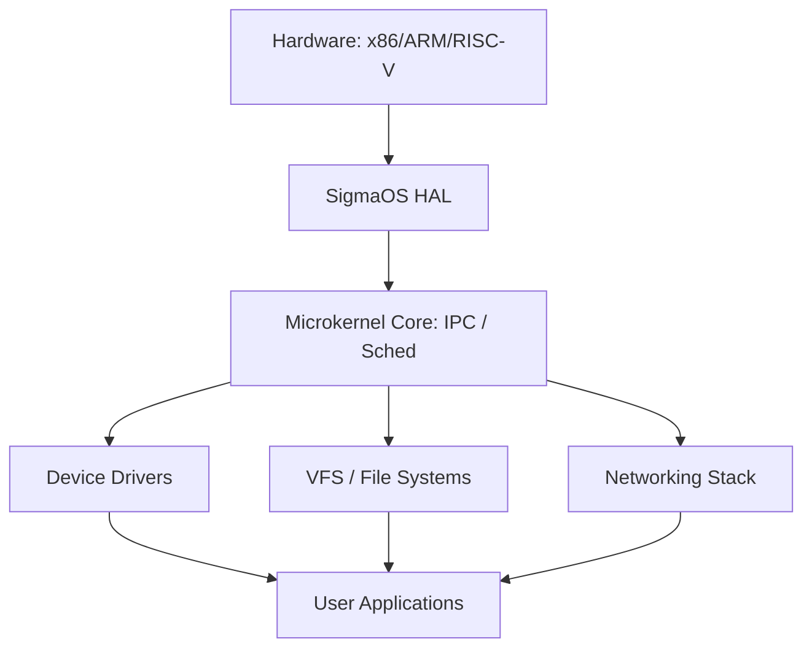

# Architecture Diagrams

```mermaid
graph TD
    A[Hardware: x86/ARM/RISC-V] --> B[SigmaOS HAL]
    B --> C[Microkernel Core: IPC / Sched]
    C --> D[Device Drivers]
    C --> E[VFS / File Systems]
    C --> F[Networking Stack]
    D --> G[User Applications]
    E --> G
    F --> G
```
