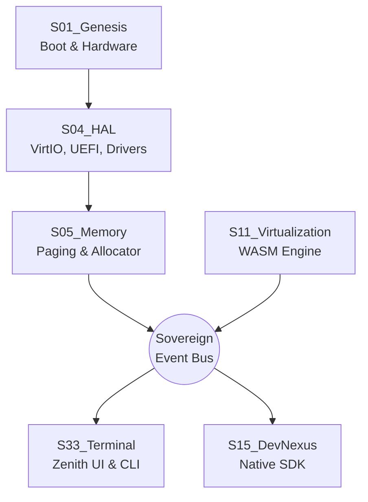

# SigmaOS Lattice Architecture Whitepaper

## Overview
SigmaOS is built upon the "Sovereign Lattice" architecture, a highly modular, shard-based system designed to replace monolithic kernels with a decentralized web of discrete intelligence units. 

## The 33 Suites
The operating system functionality is divided into 33 Sovereign Suites (S01 to S33). 
- **S01 (Genesis):** The foundational boot and core initialization suite.
- **S33 (Terminal Fulfillment):** The highest-level user-facing environment (Zenith UI, CLI).

### Visualizing the Lattice

### How S01 Interacts with S33
The communication between the lowest-level hardware abstraction (S01) and the highest-level UI (S33) happens via the Sovereign Event Bus and Memory Paging. 
Instead of system calls, the Lattice uses a message-passing interface where shards broadcast state changes. The UI layer (S33) subscribes to these state changes asynchronously.

## Zero-Dependency Purity
SigmaOS strives for a dependency-free core. The kernel is written in C11 and Assembly, requiring no external libraries, ensuring ultimate security and immutability.
