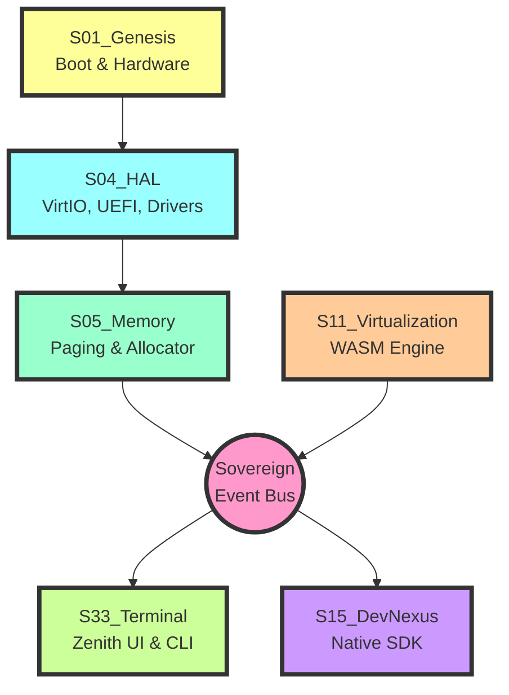

# Architecture Whitepaper

SigmaOS is built upon the "Sovereign Lattice" architecture, a highly modular, shard-based system designed to replace monolithic kernels with a decentralized web of discrete intelligence units.

---

## Sovereign Lattice Architecture

The operating system functionality is divided into 33 Sovereign Suites (S01 to S33), each representing a distinct capability domain.

---

## Communication Model

The communication between the lowest-level hardware abstraction (S01) and the highest-level UI (S33) happens via the Sovereign Event Bus and Memory Paging.

### Event-Driven Architecture

Instead of traditional system calls, the Lattice uses a message-passing interface where shards broadcast state changes. The UI layer (S33) subscribes to these state changes asynchronously.

**Benefits:**
- **Decoupling**: Components are loosely coupled
- **Scalability**: Easy to add new components
- **Performance**: Asynchronous processing
- **Flexibility**: Dynamic component replacement

### Memory Paging

Memory management uses advanced paging techniques:
- **4-level paging**: Hierarchical page tables
- **Copy-on-write**: Efficient memory sharing
- **Demand paging**: Load pages on demand
- **Page sharing**: Shared memory between processes

---

## Sovereign Suites

### S01: Genesis (Boot & Hardware)
- Boot sequence management
- Hardware initialization
- Early boot services
- Firmware interface

### S02: Silicon (CPU & Hardware)
- CPU management
- Power management
- Thermal monitoring
- Hardware telemetry

### S03: ZenithUI (Display & Input)
- Display server
- Input handling
- Window management
- Theme engine

### S04: HAL (Hardware Abstraction Layer)
- Device abstraction
- Driver management
- Hardware interfaces
- Platform-specific code

### S05: Memory (Paging & Allocator)
- Virtual memory management
- Physical memory allocation
- Memory protection
- Memory sharing

### S06: Storage (Filesystems)
- VFS layer
- Filesystem implementations
- Storage drivers
- Block devices

### S07: Network (Networking Stack)
- Protocol stack
- Network drivers
- Network services
- Network security

### S08: Security (Security Subsystem)
- Capability system
- Access control
- Cryptography
- Audit logging

### S09: Intelligence (AI & ML)
- Local LLM integration
- Predictive systems
- Anomaly detection
- Auto-tuning

### S10: Registry (Configuration)
- Configuration storage
- Registry management
- Configuration validation
- Configuration persistence

### S11: Virtualization (WASM Engine)
- WASM runtime
- Container support
- Virtualization
- Sandbox management

### S12: Ecosystem (POSIX Compatibility)
- POSIX layer
- Linux compatibility
- System call translation
- Library compatibility

### S13: LuaBridge (Scripting)
- Lua runtime
- Script execution
- Script management
- Script security

### S14: Transcendence (Advanced Features)
- Experimental features
- Research features
- Future capabilities
- Innovation lab

### S15: DevNexus (Native SDK)
- Development tools
- Build system
- Package management
- Developer experience

### S16-S33: Extended Capabilities
Additional suites for specialized capabilities including:
- Graphics acceleration
- Audio processing
- Video processing
- Database systems
- Messaging systems
- And more...

---

## Dependency-Free Core

SigmaOS strives for a dependency-free core. The kernel is written in C11 and Assembly, requiring no external libraries, ensuring ultimate security and immutability.

### Benefits of Dependency-Free Design

- **Security**: No external vulnerabilities
- **Immutability**: Predictable behavior
- **Performance**: No dependency overhead
- **Reliability**: No dependency conflicts
- **Auditability**: Complete source visibility

### Implementation

- **C11 Kernel**: Modern C11 standard
- **Assembly**: Optimized assembly for critical paths
- **No External Libraries**: All code self-contained
- **Static Linking**: No dynamic linking
- **Reproducible Builds**: Bit-for-bit reproducible

---

## Shard System

SigmaOS is organized into 600+ shards — atomic, independently-testable modules.

### Shard Identification

Shards are identified by `S<N>_<Name>`:
- **S01_Boot**: Boot shard
- **S04_HAL**: Hardware abstraction shard
- **S09_AI**: Artificial intelligence shard
- **S33_Terminal**: Terminal shard

### Shard Lifecycle

1. **Initialization**: Shard loaded and initialized
2. **Registration**: Shard registers capabilities
3. **Operation**: Shard performs its function
4. **Communication**: Shard communicates via event bus
5. **Termination**: Shard cleanly shuts down

### Shard Isolation

- **Capability-based**: Shards have specific capabilities
- **Sandboxed**: Shards run in isolated environments
- **Resource-limited**: Shards have resource quotas
- **Auditable**: All shard operations logged

---

## Performance Characteristics

### Latency Targets

- **IPC Latency**: < 500 ns (local), < 2 µs (cross-CPU)
- **Syscall Latency**: < 100 ns for common operations
- **Memory Allocation**: < 1 µs for typical allocations
- **Context Switch**: < 500 ns for thread switch

### Throughput Targets

- **Network Throughput**: > 10 GB/s (10 GbE)
- **Disk I/O**: > 1 GB/s (NVMe)
- **Graphics**: 120 FPS at 4K resolution
- **AI Inference**: < 100 ms first token latency

### Resource Usage

- **Kernel Memory**: < 512 KB (microkernel profile)
- **Boot Time**: < 2 seconds to desktop
- **Idle Power**: < 5W (typical system)
- **Peak Power**: < 100W (full load)

---

## Security Architecture

### Capability-Based Security

- **Fine-grained**: Capabilities at most granular level
- **Revocable**: Capabilities can be revoked
- **Delegable**: Capabilities can be delegated
- **Auditable**: All capability usage logged

### Post-Quantum Cryptography

- **Kyber-1024**: Key encapsulation
- **Dilithium-5**: Digital signatures
- **Hybrid TLS**: Hybrid key exchange
- **PQC Everywhere**: All crypto uses PQC

### Trusted Platform Module

- **Secure Boot**: TPM-verified boot chain
- **Key Storage**: TPM-sealed keys
- **Remote Attestation**: Device verification
- **Measurement**: Boot measurement chain

---

## Future Roadmap

### Phase 1: Core Stabilization (v15.0 - v15.5)
- Complete all 33 Sovereign Suites
- Implement all 600+ shards
- Achieve dependency-free kernel
- Complete event bus architecture

### Phase 2: Performance Optimization (v15.6 - v16.0)
- Optimize IPC latency
- Improve memory management
- Enhance scheduler performance
- Optimize network stack

### Phase 3: Advanced Features (v16.0 - v16.5)
- Complete AI integration
- Implement advanced virtualization
- Add distributed capabilities
- Enhance security features

### Phase 4: Ecosystem Expansion (v16.6 - v17.0)
- Expand POSIX compatibility
- Add more filesystems
- Enhance driver support
- Improve developer tools

---

*See also: [Architecture Overview](Architecture-Overview.md) · [Architecture Philosophy](Architecture_Philosophy.md) · [Sovereign Lattice Design](Sovereign-Lattice-Design.md) · [Shard Development Guide](Shard-Development-Guide.md)*
