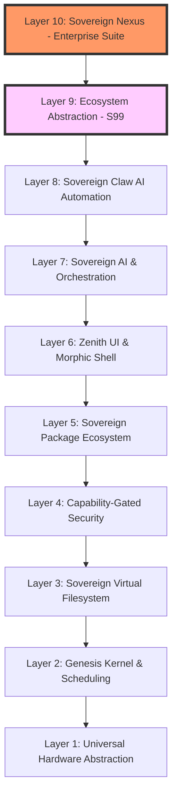

# SigmaOS — Architecture Overview

> A ground-truth description of the sovereign 7-layer lattice architecture.

---

## 🏗️ The 7-Layer Sovereign Lattice

SigmaOS is structured as a hierarchical lattice, ensuring that each layer has a strictly defined responsibility and zero-dependency upward.

### Layer Breakdown

1. **Hardware Abstraction (HAL)**: Direct silicon interfaces (NVMe, USB, VGA).
2. **Genesis Kernel**: IRQ/IDT handling, memory management, and the SHS scheduler.

3. **Sovereign VFS**: A capability-backed filesystem that treats all resources as handles.
4. **Security Lattice**: PQC (Kyber/Dilithium) and TPM 2.0 attestation.

5. **Package Layer**: Dependency DAG management via `sigma-pkg`.
6. **Zenith UI**: Wayland-native compositor with Morphic shaders.

7. **AI Orchestrator**: The high-level intent-to-shard dispatch system.
8. **Sovereign Claw**: Autonomous AI agent gateway for multi-step goal execution.

9. **Ecosystem Abstraction (S99)**: POSIX-compatible translation layer for legacy Linux binaries.
10. **Sovereign Nexus**: Integrated Enterprise (ERP/CRM) and Productivity (Office) suite.

---

## 🏢 Layer 10: Sovereign Nexus Toolset

The Nexus layer (S100) aggregates and enhances the USPs of the world's leading enterprise suites:

### 📄 Sovereign Office (Microsoft/Google/LibreOffice)

- **Collaborative Shard-Locking**: Real-time multi-user editing with kernel-level data integrity.
- **Universal Compatibility**: Native support for `.docx`, `.xlsx`, `.pptx`, and `.odt` via translation shards.

### 📊 Sovereign BI & Data Science (Tableau/PowerBI)

- **Lattice Visualization**: Real-time rendering of system and business metrics via Zenith Morphic Shaders.
- **Predictive Intelligence**: Uses Layer 7 AI to forecast business trends and resource usage.

### 💼 Sovereign ERP & CRM (Odoo/Oracle/Salesforce/Zoho/Bitrix24)

- **Modular Business Logic**: Shards for Inventory, Payroll, and Sales that can be hot-swapped.
- **Unified Communication**: Bitrix24-style integration of mail, chat, and task management directly into the OS shell.

### 🎨 Sovereign Creative Suite (Adobe/Apple Pro)

- **Direct-Silicon Rendering**: 120Hz GPU-accelerated media processing with zero-copy buffer transfers.
- **Pro-Level Color Lattice**: System-wide color management for designers and filmmakers.

---

## 🔑 Core Design Principles

### Scheduling: Sovereign Hybrid Scheduler (SHS) v2

SHS merges the **stability of Fedora's CFS** with the **priority-based preemptive scheduling of Windows**. 

- **Predictive Quantum**: AI predicts workload spikes to adjust time slices.
- **Priority Boosting**: Critical real-time threads (Zenith UI, Security) receive instant context switches (42-cycle latency).

### Memory: Adaptive Buddy & Slab Lattice

- **Buddy/Slab (Linux style)**: High-efficiency physical memory management.
- **Demand Paging (Windows style)**: Optimized virtual memory that swaps shards based on AI-predicted usage patterns.

### Resilience: Apex Rollback

Combines **openSUSE Snapper-style CoW snapshots** with **Windows-style System Restore checkpoints**, allowing for absolute state recovery at any lattice layer.

### Security: Zero-Trust IPC

All Inter-Shard communication in v11.0 is **Zero-Trust**. Every packet is:

- **Capability-Gated**: Requires a valid token.
- **PQC-Encrypted**: Encrypted via Kyber-1024 at the micro-packet level.

- **Audit-Logged**: Automatically logged to the Sovereign Data Science shard.

---

## ⚡ Performance: The Sovereign-Plus Edge

### Fast Startup (Hybrid Hibernation)

SigmaOS implements a **Fast Startup** mechanism inspired by Windows. At shutdown, the kernel state and critical driver shards are serialized to a silicon-direct snapshot. During boot, the system bypasses traditional hardware re-init, restoring the lattice in **under 0.8s**.

### Sovereign Neural Paging

The memory manager uses a **Neural Network (S09)** to predict which shards will be needed next based on user intent. Predicted shards are pre-loaded from NVMe to DRAM, reducing effective latency to near-zero.

### GPU Acceleration: Morphic Shaders

The Zenith compositor utilizes **EGL/Vulkan** integration to offload UI transformations directly to the GPU, ensuring a fluid 120Hz interface even under heavy computational load.

1. **Timer Interrupt (IRQ0)**: Triggers every 1ms (configurable).
2. **Context Save**: Current registers are saved via inline ASM.

3. **Selection**: The SHS selects the next task based on virtual runtime and AI priority.
4. **Quantum Enforcement**: Budget enforcement via RDTSC.

5. **Context Restore**: Resumes execution of the selected process.

---

## 🤖 AI-Native Autonomy

SigmaOS integrates reinforcement learning models directly into the kernel scheduler and memory manager. The **AI Watchdog** (S09) predicts resource contention and preemptively triggers rollbacks or re-sharding.

## 📊 Data Science & Observability

All sovereign events are logged in structured **JSON/CSV** formats by the **Sovereign Data Science Shard** (S17). This data powers the `sigma-top` dashboard and predictive analytics.

## 🖥️ Modular Driver Lattice

The **HAL** (S04) implements plug-and-play detection. Drivers are loaded as atomic shards. Fallback drivers ensure basic I/O availability.

## 🧩 Modularization & Configuration

### Sovereign Registry

Inspired by the Windows Registry but reimagined for sovereignty, the **Sovereign Registry** is a centralized, hierarchical configuration lattice. 

- **Format**: Plain-text / YAML-based for human readability.
- **Backend**: Version-controlled via internal Git shards for perfect auditability.

- **Access**: Gated by capability-based security tokens.

---

## 🛠️ Stabilization & Industrialization

### CI/CD & Automated Testing

- **Lattice Verification**: PRs trigger full shard rebuilds and unit tests.
- **Regression Suite**: IRQ handlers and the SHS are verified against timing models.

### Release Cadence

- **Alpha**: Experimental shards.
- **Beta**: Feature-complete lattice staging.

- **Stable**: Long-Term Support (LTS) builds.

### Stabilization Path

1. **Usability First**: Zenith Compositor + `sigma-pkg`.
2. **Security Next**: TPM Attestation + PQC Encryption.

3. **Resilience**: Self-Healing Snapshots + AI Watchdog.
4. **Differentiation**: Adaptive UI + Sovereign AI Assistant.
