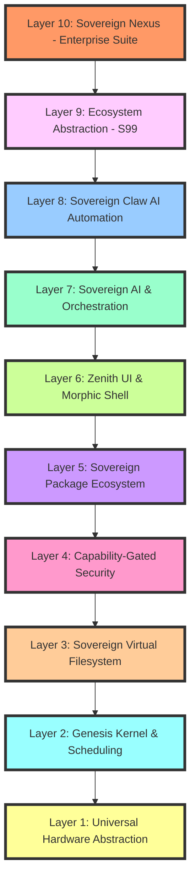

# Architecture Overview

A ground-truth description of the sovereign 10-layer lattice architecture.

---

## Layer Architecture

SigmaOS is structured as a hierarchical lattice, ensuring that each layer has a strictly defined responsibility and zero-dependency upward.

---

## Layer Descriptions

### Layer 1: Universal Hardware Abstraction (HAL)
- Direct silicon interfaces (NVMe, USB, VGA)
- Platform-specific driver initialization
- Hardware capability detection and reporting
- Low-level interrupt routing and management

### Layer 2: Genesis Kernel & Scheduling
- IRQ/IDT handling and interrupt dispatch
- Memory management (S-MM slab allocator)
- SHS (Sovereign Hybrid Scheduler) implementation
- Process lifecycle management
- System call interface

### Layer 3: Sovereign Virtual Filesystem
- Capability-backed filesystem treating all resources as handles
- VFS abstraction for multiple filesystem types
- File descriptor management
- Path resolution and namespace management
- File locking and synchronization

### Layer 4: Capability-Gated Security
- PQC (Kyber/Dilithium) cryptographic operations
- TPM 2.0 attestation and key management
- Capability-based access control (sigma_pledge)
- Mandatory Access Control (MAC) enforcement
- Secure boot chain verification

### Layer 5: Sovereign Package Ecosystem
- Dependency DAG management via sigma-pkg
- Package signature verification
- Reproducible build system
- Package repository management
- Delta update support

### Layer 6: Zenith UI & Morphic Shell
- Wayland-native compositor
- Morphic shader-based theming
- Input device handling
- Window management and composition
- Display server integration

### Layer 7: Sovereign AI & Orchestration
- High-level intent-to-shard dispatch system
- Local LLM integration for system optimization
- Predictive resource allocation
- Workload classification and analysis
- AI-assisted decision making

### Layer 8: Sovereign Claw AI Automation
- Autonomous AI agent gateway
- Multi-step goal execution
- Intent decomposition and planning
- Capability validation and sandboxing
- Live canvas conversational interface

### Layer 9: Ecosystem Abstraction (S99)
- POSIX-compatible translation layer
- Linux binary compatibility
- System call translation
- Library compatibility shims
- Legacy application support

### Layer 10: Sovereign Nexus - Enterprise Suite
- Integrated Enterprise (ERP/CRM) suite
- Productivity (Office) applications
- Professional tool integration
- Business process automation
- Enterprise data management

---

## Key Architectural Features

### SHS (Sovereign Hybrid Scheduler)
Merges the stability of Fedora's CFS with the priority-based preemptive scheduling of Windows:
- Real-time task prioritization
- Fair share resource allocation
- AI-enhanced workload prediction
- Adaptive quantum management

### Snapshot & Restore
Combines openSUSE Snapper-style CoW snapshots with Windows-style System Restore checkpoints:
- Absolute state recovery at any lattice layer
- Instant rollback capability
- Space-efficient storage via copy-on-write
- Boot-time snapshot verification

### Zero-Trust Inter-Shard Communication
All inter-shard communication in v15.0 is Zero-Trust:
- Every packet is capability-verified
- PQC-encrypted by default
- Origin authentication required
- Audit logging for all communications

### Fast Startup Mechanism
SigmaOS implements a Fast Startup mechanism inspired by Windows:
- Kernel state serialized to silicon-direct snapshot at shutdown
- Critical driver shards preserved
- Bypasses traditional hardware re-init during boot
- System restores in under 0.8s

### Neural Memory Management
The memory manager uses a Neural Network (S09) to predict shard access:
- Predicts which shards will be needed next based on user intent
- Pre-loads predicted shards from NVMe to DRAM
- Reduces effective latency to near-zero
- Adapts to usage patterns over time

### GPU-Accelerated UI
The Zenith compositor utilizes EGL/Vulkan integration:
- Offloads UI transformations directly to GPU
- Ensures fluid 120Hz interface under heavy load
- Hardware-accelerated shader effects
- Efficient memory bandwidth utilization

---

## Scheduling Algorithm

1. **Timer Interrupt (IRQ0)**: Triggers every 1ms (configurable)
2. **Context Save**: Current registers saved via inline ASM
3. **Selection**: SHS selects next task based on virtual runtime and AI priority
4. **Quantum Enforcement**: Budget enforcement via RDTSC
5. **Context Restore**: Resumes execution of selected process

---

## AI Integration

SigmaOS integrates reinforcement learning models directly into kernel subsystems:
- **AI Watchdog (S09)**: Predicts resource contention and preemptively triggers rollbacks
- **Predictive Scheduler**: Anticipates workload patterns and optimizes task placement
- **Memory Predictor**: Forecasts memory access patterns for pre-fetching
- **Anomaly Detection**: Identifies and mitigates unusual system behavior

---

## Logging & Telemetry

All sovereign events are logged in structured JSON/CSV formats:
- **Sovereign Data Science Shard (S17)**: Powers sigma-top dashboard
- **Predictive Analytics**: Enables proactive system optimization
- **Structured Logging**: Machine-readable event streams
- **Performance Metrics**: Real-time system health monitoring

---

## Hardware Abstraction Layer

The HAL (S04) implements plug-and-play detection:
- Drivers loaded as atomic shards
- Fallback drivers ensure basic I/O availability
- Capability-based device access
- Hot-plug device support

---

## Sovereign Registry

Inspired by Windows Registry but reimagined for sovereignty:
- Centralized hierarchical configuration lattice
- Capability-gated access to registry keys
- Atomic transactions for configuration changes
- Version-controlled configuration history
- PQC-encrypted sensitive configuration data

---

## Design Principles

1. **Usability First**: Zenith Compositor + sigma-pkg for intuitive user experience
2. **Security Next**: TPM Attestation + PQC Encryption for cryptographic resilience
3. **Resilience**: Self-Healing Snapshots + AI Watchdog for system stability
4. **Differentiation**: Adaptive UI + Sovereign AI Assistant for unique capabilities

---

*See also: [Advanced_Absorption.md](Advanced_Absorption.md) · [ADVANCED_CAPABILITIES.md](ADVANCED_CAPABILITIES.md) · [Kernel Architecture](Kernel-Architecture.md) · [Security Model](Security-Model.md)*
