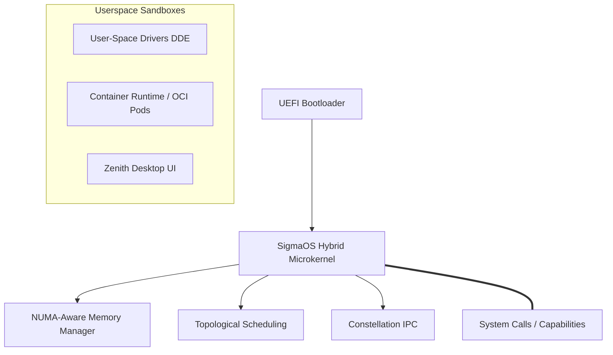

# SigmaOS System Architecture

SigmaOS is designed as a hybrid sovereign microkernel-structured bare-metal operating system. It brings together features from Unix, Linux, and FreeBSD distros into a highly optimized Rust-based codebase.

## Core Components

*   **Kernel (`src/kernel/`, `kernel/`)**: Features memory isolation, lightweight task scheduling, capabilities-based security.
*   **Memory Management**: Inspired by NUMA architectures and FreeBSD virtual memory layout.
*   **IPC (Inter-Process Communication)**: High performance message passing with zero-copy options.
*   **Drivers (`drivers/`)**: EHCI, xHCI, NVMe, and AHCI drivers executed in userspace sandboxes.
*   **Userland (`userland/`, `zenith_desktop/`)**: Zenith Desktop user interface and POSIX/Linux-inspired tools.\n
