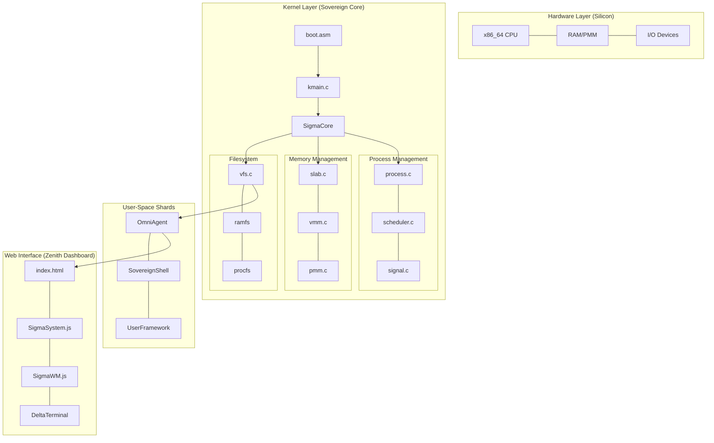

# Σ SIGMAOS ZENITH: SOVEREIGN ARCHITECTURE 🏗️

The architecture of SigmaOS is a **Sharded Monolith** with zero external dependencies, optimized for high-performance silicon execution.

## Component Dependency Graph (Mermaid) 📊

## System Standards 🛡️

- **C11**: Zero-dependency C for industrial reliability.
- **Assembly**: Performance-tight hand-optimized silicon calls.
- **Glassmorphism**: Modern dashboard aesthetics for observability.
- **Atomic Locking (B4/B7)**: System-wide thread safety.

## Memory Model (B2/B6) 🧠

- **Stack-Bottom Canary**: 0xDEADC0DE (B6 Protection).
- **Slab Allocation**: 4MB Pool, thread-safe (B2).
- **VMM Isolation**: PML4/PDP/PD/PT tables for process separation.
