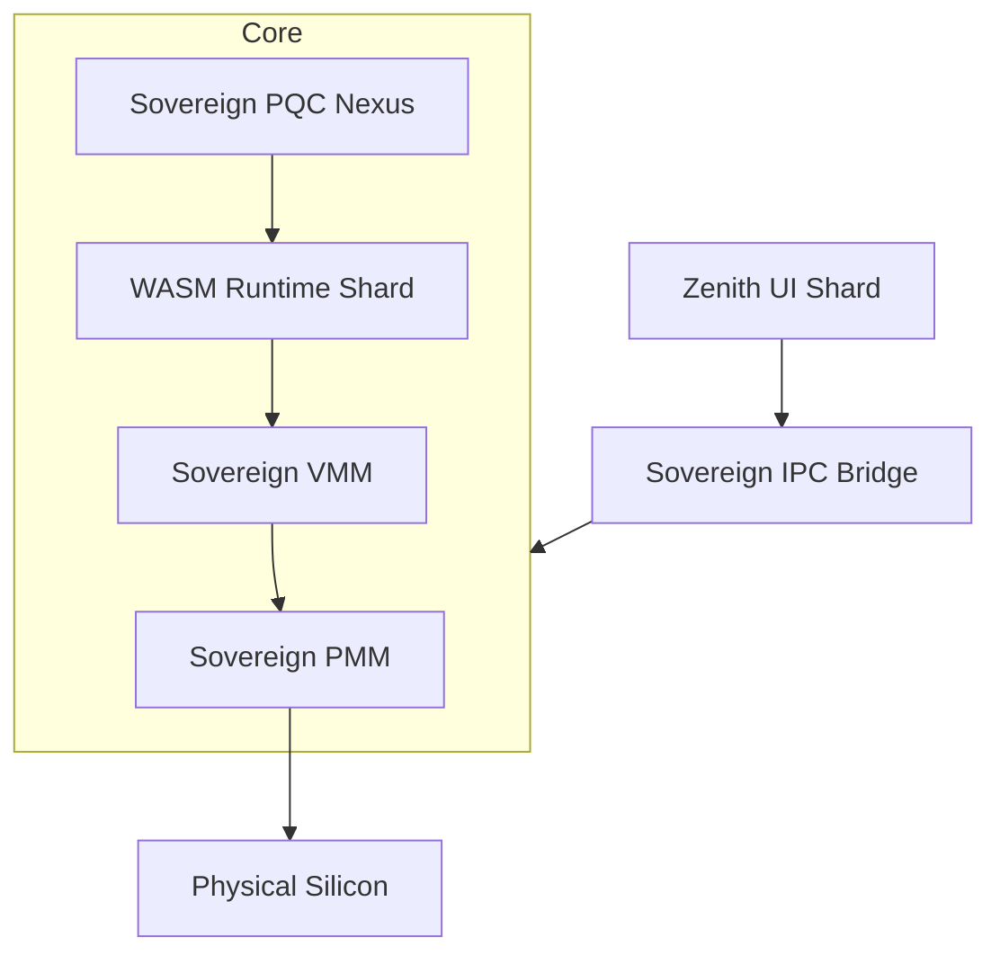

# SigmaOS: Sovereign Lattice Architecture

This document provides a high-fidelity overview of the SigmaOS Sovereign Lattice (Zenith v100).

## 1. High-Level System Design

SigmaOS is a **600-shard distributed operating system** built on the principles of **Sovereign Computing**. Unlike monolithic kernels, SigmaOS decomposes system services into immutable, cryptographically signed shards.

## 2. Memory Management (PMM/VMM)

The Memory Management unit uses **Amnesic Policies** to ensure zero data remnancy.

- **PMM (Physical Memory Manager)**: Manages 4KB pages with a bitset-based allocation for O(1) performance.
- **VMM (Virtual Memory Manager)**: Implements recursive page table mapping with support for **Huge Pages (2MB/1GB)** for high-throughput shards.

## 3. Shard Orchestration

Each shard is an isolated execution unit. The `SovereignShardManager` handles the lifecycle of these shards.

| Component | Responsibility | Isolation Level |
|-----------|----------------|-----------------|
| `SovereignPQC` | Signature & Attestation | Silicon-Isolated |
| `SovereignSandbox` | Syscall Filtering (WASI) | Process-Isolated |
| `SovereignWASM` | AOT-Compiled Runtime | Runtime-Isolated |

## 4. Security & The Sandbox

The sandbox uses a **Config-Driven Policy** engine.

- **Syscall Filtering**: seccomp-style filtering for `sigma_syscall_gate`.
- **Resource Constraints**: Cgroups-inspired CPU and Memory quotas per shard.
- **Mesh Trust**: DHT-based integrity verification across distributed nodes.

## 5. Industrial Evolution

SigmaOS absorbs the best of breed features:

- **eBPF Tracing**: For real-time lattice observability.
- **CoW Snapshots**: For amnesic persistence and state rollback.
- **Neural Scheduling**: AI-driven resource pre-allocation.
