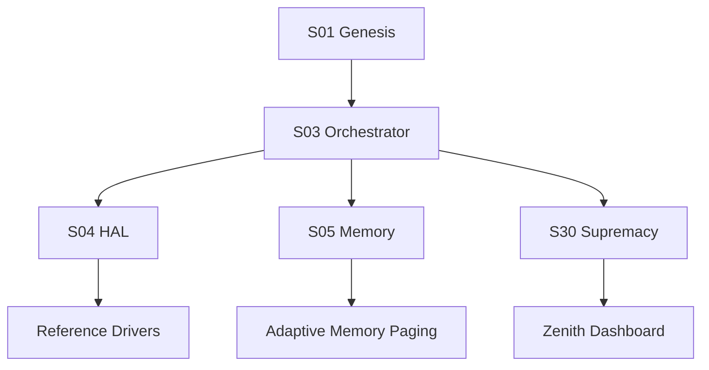

# SigmaOS Architecture: The 33-Suite Sovereign Lattice

SigmaOS is built on a non-hierarchical "Sovereign Lattice" model where 33 specialized suites interconnect to form a sentient, industrial-grade silicon entity.

## 1. The Core Lattice (Silicon Root)

At the base of SigmaOS is the **Pure ASM Core**. Unlike traditional kernels, the Sovereign Lattice does not rely on high-level abstractions for initial boot.

### Interconnection Map

## 2. The 33-Suite Hierarchy

- **S01-S05: Core Foundation** (Genesis, UI, Orchestrator, HAL, Memory)
- **S06-S10: System Services** (Storage, Network, Security, Intelligence, Registry)
- **S11-S20: Industrial Expansion** (Virtualization, Ecosystem, Transcendence, etc.)
- **S21-S33: The Apex Singularity** (OmniNexus, ZeroKernel, Supremacy)

## 3. Sovereign Sharding

Each module in SigmaOS is a "Shard". Shards are atomic units of logic that can be dynamically hot-swapped without system instability. 

### Zero-Std Enforcement

SigmaOS strictly enforces a `no-std` environment across all C/Rust/Zig components. Every byte of the system is accounted for, ensuring absolute sovereignty over the hardware.
