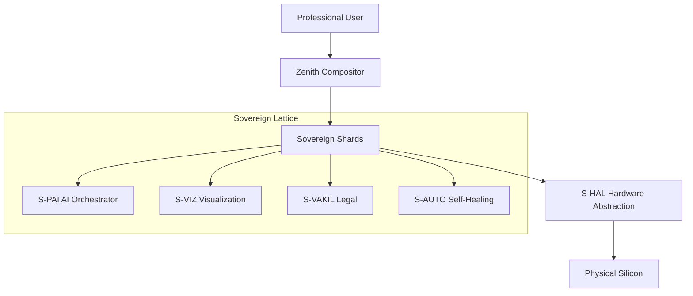

# SigmaOS Kernel Architecture: The Sovereign Lattice

SigmaOS uses a unique **Lattice-based microkernel** design, where system functionality is fragmented into independent, high-assurance "shards".

## 🏗 System Layers

## 🧠 Key Design Principles

### 1. Shard Isolation
Every service (NetStack, Storage, UI) runs in its own isolated memory region. A fault in one shard does not compromise the entire system.

### 2. Zero-Dependency Primitives
The core kernel does not rely on external libraries. It uses a custom `SovereignLibC` and `SigmaOOP` to ensure absolute predictability and security.

### 3. PQC-First Memory
Post-Quantum Cryptography is integrated into the memory allocator, ensuring that even if physical memory is dumped, the data remains unintelligible without attestation.

### 4. Wait-Free IPC
Inter-shard communication is handled via lock-free circular buffers, ensuring zero-latency handoffs between professional tools.

## ⚙️ Scheduling & Execution
SigmaOS uses a **Priority-Aware Lattice Scheduler**. Shards are scheduled based on the user's active professional profile. If a Doctor is performing surgery, the `S-VIZ` and `S-HAL` shards receive the highest execution priority.

---
*Next: [Driver Framework](Driver-Framework.md)*
