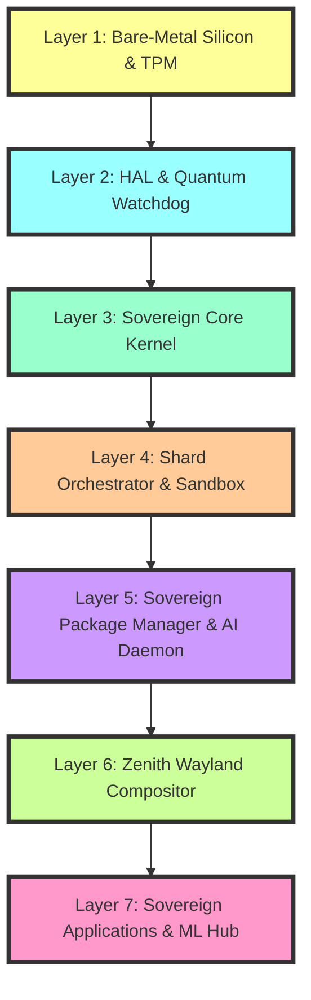

# Architecture Overview

SigmaOS is structured as a hierarchical lattice, ensuring that each layer has a strictly defined responsibility and zero-dependency upward.

---

## Layer Descriptions

### Layer 1: Bare-Metal Silicon & TPM

The foundation layer provides direct hardware access and trusted platform integration:

- **CPU Management**: Direct CPU control, power management, thermal monitoring
- **Memory Controller**: DRAM management, NUMA topology, memory hot-plug
- **TPM 2.0**: Trusted Platform Module for secure boot and key storage
- **Hardware Attestation**: Remote attestation for device verification
- **Silicon Telemetry**: Real-time hardware health monitoring

### Layer 2: HAL & Quantum Watchdog

Hardware Abstraction Layer with quantum-resistant security:

- **SovereignHAL**: Strict interface for hardware interaction
- **Driver Management**: Loadable driver shards with capability checks
- **Quantum Watchdog**: PQC-encrypted hardware monitoring
- **Interrupt Routing**: IRQ/IDT management and dispatch
- **Direct I/O Control**: Secure I/O port mapping with attestation

### Layer 3: Sovereign Core Kernel

The microkernel providing essential OS services:

- **SHS Scheduler**: Sovereign Hybrid Scheduler for task management
- **Memory Management**: Virtual memory, paging, and memory protection
- **System Calls**: Capability-gated syscall interface
- **IPC Foundation**: Inter-process communication primitives
- **Process Management**: Process lifecycle and resource isolation

### Layer 4: Shard Orchestrator & Sandbox

Process isolation and capability enforcement:

- **Shard Manager**: Process lifecycle and resource allocation
- **Capability System**: Fine-grained permission management
- **Sandbox Enforcement**: Isolated execution environments
- **Resource Limits**: CPU, memory, and I/O quotas
- **Audit Logging**: Complete operation audit trail

### Layer 5: Sovereign Package Manager & AI Daemon

Package management and AI integration:

- **sigma-pkg**: Dependency-aware package manager
- **Package Registry**: Signed, reproducible package repository
- **AI Daemon**: Local LLM for system optimization
- **Predictive Services**: Workload prediction and resource allocation
- **Update Management**: Atomic system updates

### Layer 6: Zenith Wayland Compositor

Display server and user interface:

- **Wayland Compositor**: Modern display server protocol
- **Morphic Shaders**: GPU-accelerated UI effects
- **Input Handling**: Keyboard, mouse, and touch input
- **Window Management**: Window composition and decoration
- **Theme Engine**: Dynamic theming system

### Layer 7: Sovereign Applications & ML Hub

User applications and machine learning integration:

- **Professional Apps**: Industry-specific applications
- **ML Hub**: Central machine learning service
- **Application Sandbox**: Isolated application execution
- **Data Management**: Secure data storage and access
- **User Services**: User-facing services and daemons

---

## Communication Model

### Sovereign IPC Bus

Communication between layers is enforced by the **Sovereign IPC Bus**:

- **Typed Messages**: Strongly typed message passing
- **Capability Verification**: O(1) capability check on every message
- **Zero-Copy**: Efficient data transfer without copying
- **Encrypted**: PQC-encrypted communication by default
- **Audit Trail**: All IPC operations logged

### Capability Tokens

No driver can directly access the kernel space without an encrypted capability token:

- **Token Generation**: Tokens generated by TPM during boot
- **Token Validation**: Every IPC message validated
- **Token Revocation**: Tokens can be revoked at runtime
- **Token Scoping**: Tokens scoped to specific operations
- **Token Auditing**: Token usage tracked and logged

---

## Hardware Interaction

### SovereignHAL

The `SovereignHAL` provides a strict interface for hardware interaction:

- **Device Abstraction**: Unified device interface
- **Capability Checks**: Hardware access requires capabilities
- **Resource Management**: Hardware resource allocation
- **Error Handling**: Robust error handling and recovery
- **Performance Monitoring**: Hardware performance metrics

### Direct I/O Protection

Direct I/O port mapping is prohibited unless verified by the Hardware Attestation TPM driver during boot:

- **Boot-time Verification**: All I/O ports verified at boot
- **Runtime Enforcement**: I/O access checked at runtime
- **Audit Logging**: All I/O operations logged
- **Exception Handling**: Secure exception handling
- **Fallback Mechanisms**: Safe fallback on errors

---

## Security Architecture

### Defense in Depth

SigmaOS implements multiple layers of security:

1. **Hardware Layer**: TPM attestation, secure boot
2. **HAL Layer**: Capability-based hardware access
3. **Kernel Layer**: Memory protection, syscall gating
4. **Shard Layer**: Process isolation, sandboxing
5. **Package Layer**: Signed packages, reproducible builds
6. **UI Layer**: Secure display server, input isolation
7. **Application Layer**: Application sandboxing, data protection

### Post-Quantum Security

All security layers use post-quantum cryptography:

- **Kyber-1024**: Key encapsulation mechanism
- **Dilithium-5**: Digital signatures
- **Hybrid TLS**: Hybrid key exchange for compatibility
- **PQC Key Rotation**: Automated key rotation
- **Quantum-Safe Audit**: Quantum-resistant audit logs

---

## Performance Architecture

### Zero-Copy Design

SigmaOS minimizes data copying throughout the system:

- **Zero-Copy IPC**: Direct memory sharing between processes
- **Zero-Copy Networking**: Direct packet access from hardware
- **Zero-Copy Graphics**: Direct GPU memory access
- **Zero-Copy Storage**: Direct storage device access
- **Zero-Copy Audio**: Direct audio device access

### Lock-Free Structures

High-performance data structures minimize contention:

- **Lock-Free Queues**: Lock-free message queues
- **Lock-Free Lists**: Lock-free linked lists
- **Lock-Free Hash Tables**: Lock-free hash tables
- **Lock-Free Ring Buffers**: Lock-free circular buffers
- **Lock-Free Reference Counting**: Lock-free memory management

---

*See also: [Architecture Philosophy](Architecture_Philosophy.md) · [Architecture Deep Dive](Architecture-Deep-Dive.md) · [Kernel Architecture](Kernel-Architecture.md) · [Security Model](Security-Model.md)*
