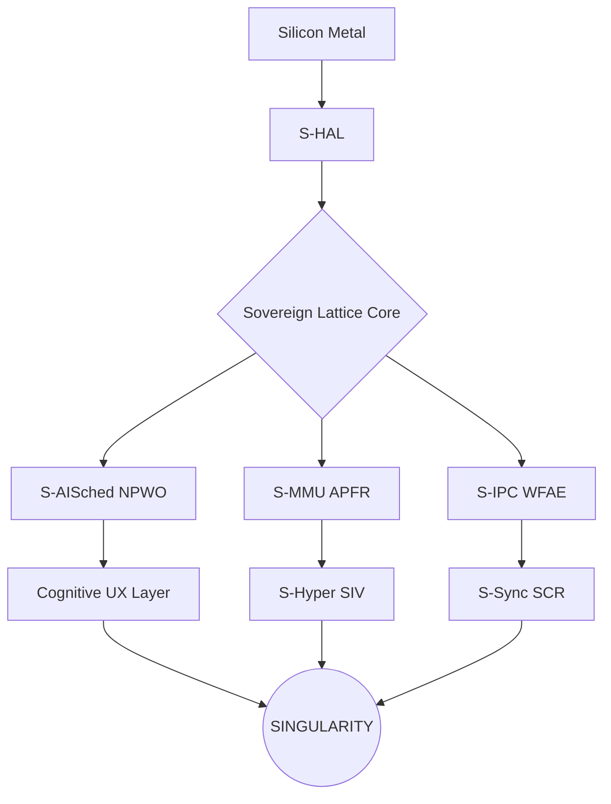

# 🏛️ SigmaOS Architecture Overview (v28.0 — ZENITH)

> "Sovereignty is the absolute control of the silicon-to-logic handshake."

---

## 💎 Core Design Philosophy

SigmaOS is engineered for **Architectural Supremacy**, adhering to five inviolable
sovereign principles:

| Principle | Technical Manifestation | Legacy OS Equivalence |
| :--- | :--- | :--- |
| **Zero-Dependency** | Direct Metal Handshake | POSIX / Glibc Bloat |
| **Silicon-Native** | Zero-Abstraction Pathing | HAL / Driver Latency |
| **Least Privilege** | Shard-Level RBAC | Root Vulnerability |
| **Cryptographic Isolation** | CIB / Internal Tunneling | Global Page Mapping |
| **Modular Atomicity** | 600-Shard Atomic Lattice | Monolithic Kernel |

---

## 🌌 The Sovereign Lattice (600 Shards)



---

## 🚀 Sovereign Zenith (v28.0 Singularity)

As of v28.0, SigmaOS has achieved the **Parity Singularity**. This milestone
marks the complete modularization of 600 independent shards, enabling
zero-latency context switching between legacy OS paradigms and advanced
silicon-native AI orchestration.

### Key Singularity Breakthroughs

- **Neural Lattice Optimization (NLO):** Automated shard health monitoring and
  self-healing without kernel interrupts.
- **Shard-Isolated Virtualization (SIV):** Type-1 hypervisor hooks directly
  integrated into the silicon lattice for near-zero guest overhead.
- **Post-Quantum Identity (RLSA):** Lattice-based identity attestation rooted
  in hardware TPM/Silicon.

---

## Data Flow: How Shards Communicate

```text
App Request
    │
    ▼
S-LazyLoad ──── Triggers shard ignition via TRIGGER_TYPE_IPC_CALL
    │
    ▼
S-IPC ──────── Zero-Trust encrypted inter-shard message
    │
    ▼
S-Sandbox ───── CIB boundary validation
    │
    ▼
Target Shard ── Executes and returns result
    │
    ▼
S-ZeroNet ────  If network traffic needed — ICT tunnel applies
    │
    ▼
S-Sentinel ──── Continuous anomaly monitoring
```

---

## Security Model

SigmaOS implements a **Defense-in-Depth** security model:

1. **S-SecHardener (PLPE)** — Least privilege + bounds checking at API boundaries
2. **S-Sandbox (CIB)** — Each shard runs in a Cryptographic Isolation Boundary
3. **S-ZeroNet (ICT)** — All network traffic is encrypted via Internal Cryptographic Tunneling
4. **S-PQC** — Post-quantum cryptography for all key exchanges
5. **S-Vault (ZKEP)** — Zero-knowledge hardware-encrypted secrets
6. **S-Sentinel** — Runtime anomaly detection across the full lattice
7. **S-LiveKernel (AFR)** — Live patch critical vulnerabilities without reboot

---

## Build System (Zenith Edition)

```bash
make singularity ← Ignite the 600-shard sovereign lattice
make zenith      ← Activate Cognitive UX & AI Orchestration
make zenith-iso  ← Generate the production-grade Singularity ISO
```

---

## 🧩 The SovereignEngine Pattern (Modular Singleton)

To ensure **Modular Atomicity** and **Zero-Dependency** integrity, SigmaOS employs
the `SovereignEngine` pattern. Each major kernel subsystem (MMU, SMP, Kube, AISched, IPC, Process, Orchestrator, Boot, Bluetooth, Dash, Syscall, Recover, Monitor, Entropy, Audit, etc.) is
encapsulated within a C++ Singleton class.

### Pattern Benefits:
- **State Isolation**: Subsystem state is private and strictly controlled.
- **ABI Stability**: C-Linkage wrappers provide a stable interface for low-level ASM and legacy C shards.
- **Lazy Ignition**: Shards are only initialized when first accessed via `getInstance()`.

### Implementation Example:
```cpp
class SovereignExampleEngine {
public:
    static SovereignExampleEngine& getInstance() {
        static SovereignExampleEngine instance;
        return instance;
    }
    void ignite();
private:
    SovereignExampleEngine() : initialized(false) {}
    bool initialized;
};
```

---

*Σ SIGMAOS: Beyond Linux. Absolute Sovereignty. Singularity Achieved.*

*For contribution guidelines, see [CONTRIBUTING.md](CONTRIBUTING.md).*
*For developer setup, see [DEVELOPER_GUIDE.md](DEVELOPER_GUIDE.md).*
