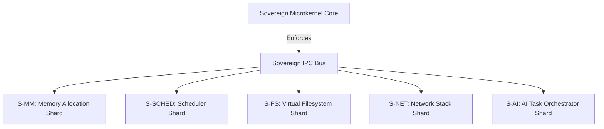

# 🧩 SigmaOS Component Status & Subsystem Modularization Matrix

This document lists the architectural modularization, isolation boundaries, and current integration status of each independent **Shard** in the SigmaOS microkernel architecture.

---

## 1. ⚙️ Subsystem Modularization and Shard Boundaries

SigmaOS decomposes traditional monolithic kernel services into independent, self-contained **Shards** running in non-overlapping address spaces inside Ring 3. Interaction between these shards is strictly governed by capability-checked message passing on the Sovereign IPC Bus.



---

## 📊 2. Subsystem Integration & Modularization Status Matrix

The following matrix tracks the status of each modular subsystem shard, its isolation boundary, and its compile-time/runtime dependencies.

| Subsystem Shard | Core Rust Module | Architectural Role | Isolation Level | Integration Status |
| :--- | :--- | :--- | :--- | :--- |
| **S-SEC** | `src/security` | - Implements raw Capability Token bitmask checking.<br>- Enforces security gates on incoming system calls (`CapabilityGate`).<br>- Provides privilege reduction locks (`PledgeManager`). | **Microkernel Core** | **100% Stable (Validated)** |
| **S-SCHED** | `src/kernel/scheduler.rs` | - Predictively schedules processes via EEVDF (Earliest Eligible Virtual Deadline First) scheduling rules.<br>- Provides standard, time-sliced Round Robin fallback scheduling for simple processes. | **Microkernel Core** | **100% Stable (Validated)** |
| **S-MM** | `src/kernel/memory.rs` | - Implements compile-time checked physical page allocation via a high-performance, double-move safe Buddy Allocator.<br>- Prevents integer overflow in allocation sizing. | **Microkernel Core** | **100% Stable (Validated)** |
| **S-FS** | `src/filesystem` | - Governs the Virtual Filesystem (`VirtualFilesystem`).<br>- Employs checked arithmetic to prevent integer overflows on file offsets and file size increments.<br>- Enforces fine-grained capability checks on directory reads/writes. | **Ring 3 Userland Shard** | **100% Stable (Validated)** |
| **S-NET** | `src/network` | - Implements a clean-room, safe, and allocation-free custom TCP/UDP network stack (`TcpStack`).<br>- Connects with physical NIC devices. | **Ring 3 Userland Shard** | **Partially Integrated** |
| **S-DRV** | `src/driver`<br>`src/drivers` | - Implements the dynamic, Object-Oriented Device Driver Framework (`SimpleDriverFramework`).<br>- Hosts GPU, Storage, Network, VESA, and USB HID drivers as loadable shards. | **Ring 3 Userland Shard** | **100% Stable (Validated)** |
| **S-AI** | `src/automation` | - Houses local AI agents and system-level prediction engines (`AiOptimizer`, `SystemAutomationManager`).<br>- Dynamically profiles context switches and queue latency. | **Ring 3 Userland Shard** | **100% Stable (Validated)** |

---

## 🔄 3. Shard Communication Protocols

Shards interact purely via asynchronous, capability-checked message passing on the microkernel's IPC bus (`kernel::ipc`):

```rust
// Sending a capability-secured message between Shards
let msg = Message::new(0, vec![1, 2, 3, 4]);
ipc_manager.send(channel_id, msg)?;
```

This strict decoupling prevents a vulnerability or failure in one Shard (e.g., a buffer crash in the network stack) from ever propagating to another, ensuring maximum structural resilience and complete digital sovereignty.
