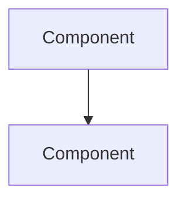

# Contributing to SigmaOS

Thank you for your interest in contributing to SigmaOS! This document provides guidelines and instructions for contributing to the project.

---

## Table of Contents

- [Code of Conduct](#code-of-conduct)
- [Getting Started](#getting-started)
- [Development Workflow](#development-workflow)
- [Coding Standards](#coding-standards)
- [Testing Requirements](#testing-requirements)
- [Documentation](#documentation)
- [Pull Request Process](#pull-request-process)
- [Community Guidelines](#community-guidelines)

---

## Code of Conduct

Please read and follow our [Code of Conduct](CODE_OF_CONDUCT.md). By participating in this project, you agree to abide by its terms.

---

## Getting Started

### Prerequisites

- Follow the [INSTALL.md](INSTALL.md) guide to set up your development environment
- Have a GitHub account
- Understand the basic concepts of operating systems and kernel development

### First Steps

1. **Fork the repository** on GitHub
2. **Clone your fork** locally:
   ```bash
   git clone https://github.com/YOUR_USERNAME/SigmaOS.git
   cd SigmaOS
   ```
3. **Add the upstream remote**:
   ```bash
   git remote add upstream https://github.com/AaryanSinghChauhan09/SigmaOS.git
   ```
4. **Create a branch** for your work:
   ```bash
   git checkout -b feature/your-feature-name
   ```

---

## Development Workflow

### Branch Naming Convention

Use descriptive branch names following these patterns:

- `feature/<area>/<description>` - New features
- `fix/<area>/<description>` - Bug fixes
- `docs/<area>/<description>` - Documentation changes
- `refactor/<area>/<description>` - Code refactoring
- `test/<area>/<description>` - Test additions

Examples:
- `feature/network/tcp-stack`
- `fix/memory/allocator-leak`
- `docs/kernel/scheduler`
- `refactor/drivers/usb-interface`

### Commit Message Convention

Follow conventional commit format:

```
<type>(<scope>): <subject>

<body>

<footer>
```

**Types**: `feat`, `fix`, `docs`, `style`, `refactor`, `test`, `chore`

**Examples**:
```
feat(kernel): implement EEVDF scheduler

Add Earliest Eligible Virtual Deadline First scheduler
with support for real-time tasks and CPU affinity.

Closes #123
```

```
fix(drivers): resolve USB xHCI interrupt handling

Fix race condition in interrupt handler that caused
device detection failures on certain chipsets.

Fixes #456
```

### Development Process

1. **Create an issue** (or comment on an existing one) to discuss your planned changes
2. **Create a branch** from `main` or `develop`
3. **Make your changes** following the coding standards
4. **Write tests** for your changes
5. **Update documentation** as needed
6. **Run tests** locally to ensure everything passes
7. **Commit your changes** with clear messages
8. **Push to your fork**
9. **Open a pull request**

---

## Coding Standards

### Language Policy

SigmaOS uses multiple languages for different purposes:

- **Rust**: System components, kernel shards, security-critical code
- **Zig**: Low-level runtime, driver stubs, memory management
- **Nim**: Tooling, automation utilities, build scripts
- **C**: Legacy compatibility, hardware-specific code (minimal)
- **Ada/SPARK**: Formal verification, safety-critical components

See [LANGUAGE_POLICY.md](LANGUAGE_POLICY.md) for detailed language usage guidelines.

### Rust Guidelines

- Use `cargo fmt` for formatting
- Use `cargo clippy` for linting
- Prefer `unwrap()` over `expect()` only in tests
- Document all public APIs with `///`
- Use `#[derive(Debug)]` for public structs

### Zig Guidelines

- Follow Zig style guide
- Use explicit error handling
- Document all public functions
- Prefer comptime for constants

### Nim Guidelines

- Follow Nim style guide
- Use `nimpretty` for formatting
- Document all exported procedures
- Prefer explicit types over inference

### General Guidelines

- **No external dependencies** unless absolutely necessary
- **Implement from first principles** where possible
- **Use OOP principles**: encapsulation, abstraction, composition
- **Write clear, self-documenting code**
- **Add comments for complex logic**
- **Keep functions focused and small**

---

## Testing Requirements

### Unit Tests

Every feature must include unit tests:

```rust
#[cfg(test)]
mod tests {
    use super::*;

    #[test]
    fn test_feature() {
        assert_eq!(result, expected);
    }
}
```

### Integration Tests

Add integration tests in `tests/` directory:

```rust
// tests/integration_test.rs
use sigmaos::kernel;

#[test]
fn test_integration() {
    // Integration test code
}
```

### Smoke Tests

Add smoke tests in `scripts/smoke-test-*.sh`:

```bash
#!/bin/bash
# Smoke test for your feature
```

### Test Coverage

- Aim for >80% code coverage
- All critical paths must be tested
- Security-related code requires 100% coverage

### Running Tests

```bash
# Run all tests
make test

# Run unit tests only
make test-unit

# Run integration tests
make test-integration

# Run smoke tests
./scripts/smoke-test.sh
```

---

## Documentation

### Code Documentation

- Document all public APIs
- Use doc tests for examples
- Include usage examples in documentation

### README Updates

Update relevant README files in subsystem directories:

```markdown
## Feature Name

Brief description of the feature.

### Usage

```rust
let result = feature_function();
```

### Configuration

Configuration options and examples.
```

### Architecture Documentation

For significant changes, update [ARCHITECTURE.md](ARCHITECTURE.md):



### API Documentation

For public APIs, add documentation to the appropriate spec file.

---

## Pull Request Process

### Before Opening a PR

1. **Ensure your branch is up to date**:
   ```bash
   git fetch upstream
   git rebase upstream/main
   ```

2. **Run all tests**:
   ```bash
   make test
   ./scripts/smoke-test.sh
   ```

3. **Run linters**:
   ```bash
   cargo fmt
   cargo clippy
   ```

4. **Update documentation** as needed

### Opening a PR

1. Use the [PR template](docs/pr_template.md)
2. Fill in all required sections
3. Link to related issues
4. Request review from maintainers

### PR Checklist

- [ ] Code follows project style guidelines
- [ ] Tests added/updated and passing
- [ ] Documentation updated
- [ ] Commit messages follow convention
- [ ] PR description filled completely
- [ ] CI checks passing
- [ ] No merge conflicts

### Review Process

1. **Automated checks** must pass (CI, linting, tests)
2. **At least one maintainer** must approve
3. **Address all review comments**
4. **Update PR** based on feedback
5. **Squash commits** if requested
6. **Merge** using `--no-ff` to preserve history

---

## Community Guidelines

### Communication Channels

- **GitHub Issues**: Bug reports, feature requests
- **GitHub Discussions**: General questions, ideas
- **Discord**: Real-time chat (invite in README)
- **Mailing List**: Announcements, discussions

### Getting Help

- Search existing issues and discussions first
- Provide clear, reproducible bug reports
- Include system information and error logs
- Be patient and respectful

### Reporting Security Issues

See [SECURITY_POLICY.md](SECURITY_POLICY.md) for reporting security vulnerabilities.

---

## High-Impact Contribution Areas

Looking for something to work on? Check these high-impact areas:

### Kernel Components

- **Scheduler**: Round-robin implementation, CPU affinity
- **Memory Management**: Buddy allocator completion, paging
- **IPC**: Zero-latency inter-process communication
- **Syscalls**: POSIX compatibility layer

### Drivers

- **GPU**: NVIDIA, AMD, Intel drivers
- **Network**: Ethernet NIC drivers, Wi-Fi
- **Storage**: NVMe, AHCI improvements
- **Input**: HID devices, touchscreens

### Userland

- **Shell**: sigma-sh REPL implementation
- **Package Manager**: sigma-pkg dependency resolver
- **Desktop**: Zenith compositor improvements
- **Applications**: Core utilities

### Documentation

- **Architecture**: System design documents
- **API**: Internal API documentation
- **Guides**: Tutorial and how-to guides
- **Translations**: Multi-language support

See [TODO.md](TODO.md) and [Roadmap.md](Roadmap.md) for more details.

---

## Recognition

Contributors are recognized in:

- **CONTRIBUTORS.md** - List of all contributors
- **Release notes** - Credits for each release
- **GitHub** - Contribution graph
- **Community** - Shoutouts in discussions

---

## License

By contributing, you agree that your contributions will be licensed under the project's license (MIT + GPL-2.0 dual license).

---

## Questions?

- Check [FAQ.md](FAQ.md) for common questions
- Ask in [GitHub Discussions](https://github.com/AaryanSinghChauhan09/SigmaOS/discussions)
- Contact maintainers via [SECURITY_POLICY.md](SECURITY_POLICY.md) for security issues

---

*Last Updated: 2026-07-13*
