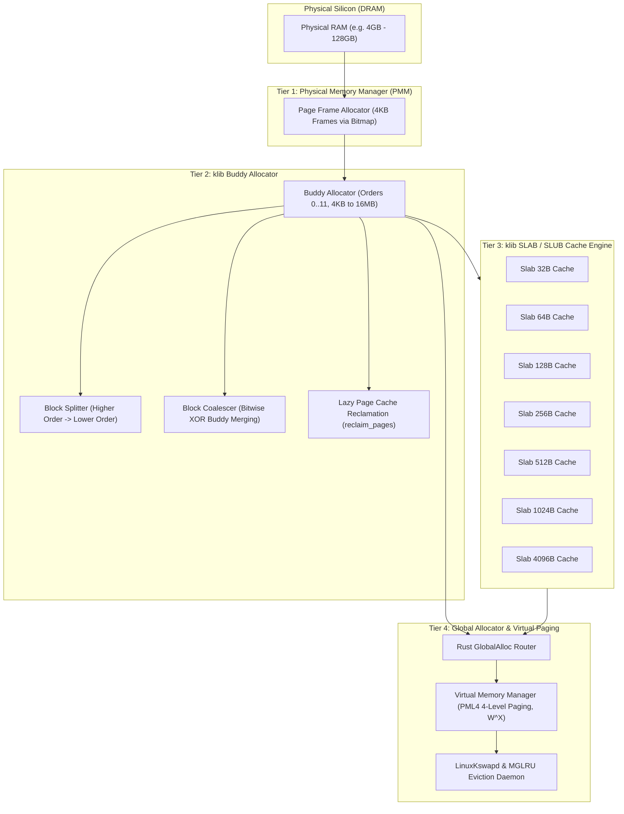
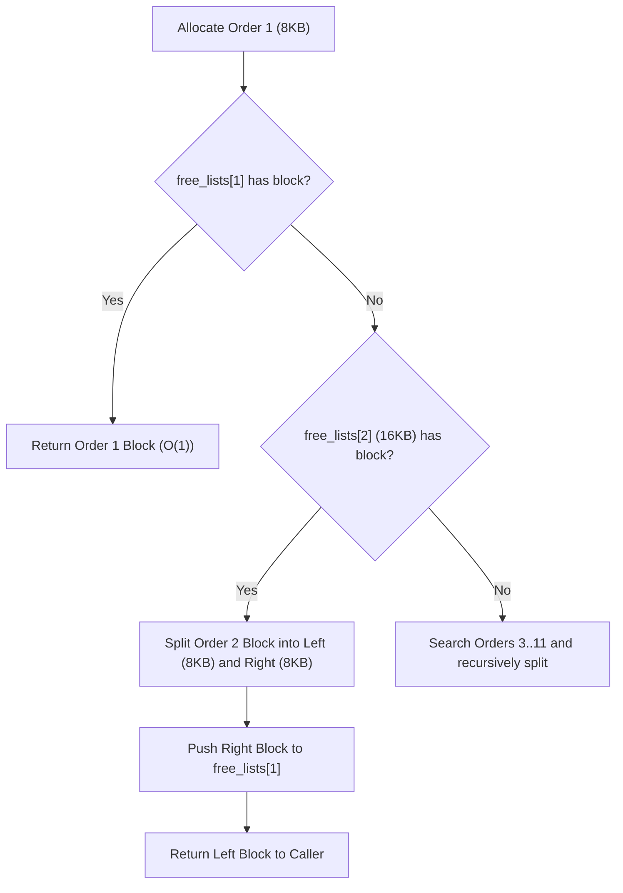
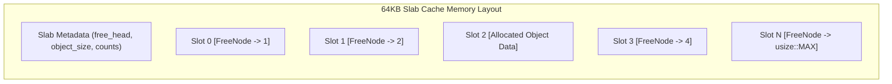
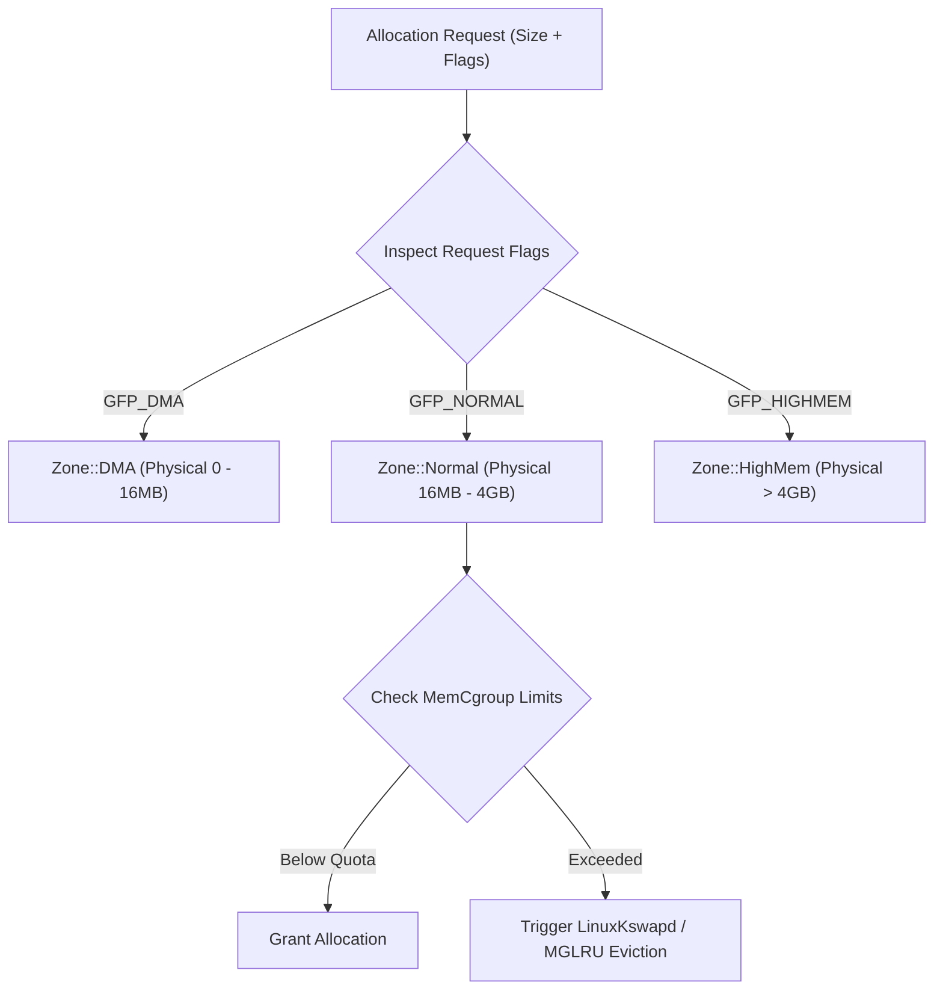
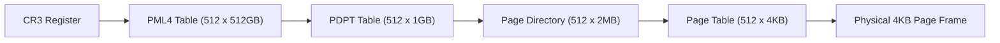

# Custom Allocator Guide: Buddy & SLAB Architecture

This document provides a comprehensive technical guide to the **memory allocation architecture** of **SigmaOS**. Operating without a standard C runtime library, SigmaOS implements an autonomous, multi-tier memory subsystem centered around the clean-room `klib` **Buddy Allocator**, **SLAB Cache**, and **BSD Zone Allocator**.

***

## 1. Multi-Tier Memory Allocation Hierarchy

SigmaOS divides dynamic memory management into distinct layers to eliminate fragmentation, ensure deterministic O(1) allocation latencies, and prevent kernel memory exhaustion.



***

## 2. The `klib` Buddy Allocator (`src/klib/buddy_allocator.rs`)

The Buddy Allocator is the primary manager of multi-page contiguous physical memory allocations.

### 2.1 Order Hierarchy & Capacity

Memory is managed in power-of-two page orders (where base page size is $4096$ bytes):

| Order | Page Count | Block Size | Typical Use Case |
|:---|:---|:---|:---|
| **Order 0** | 1 Page | 4 KB | Individual SLAB backing pages, Stack frames, Inodes |
| **Order 1** | 2 Pages | 8 KB | Process Control Blocks (PCBs), Thread kernel stacks |
| **Order 2** | 4 Pages | 16 KB | SigmaBus IPC ring buffers, NVMe command queues |
| **Order 3** | 8 Pages | 32 KB | Network packet burst descriptors, Intermediate I/O buffers |
| **Order 4** | 16 Pages | 64 KB | Standard SLAB Cache 64KB backing storage |
| **Order 5** | 32 Pages | 128 KB | VFS directory indices, B-Tree allocation tables |
| **Order 6** | 64 Pages | 256 KB | Audio multi-track DSP scratch buffers |
| **Order 7** | 128 Pages | 512 KB | Video decoder frame buffers |
| **Order 8** | 256 Pages | 1 MB | Linear framebuffer blitting caches |
| **Order 9** | 512 Pages | 2 MB | x86\_64 Large Page Table mappings |
| **Order 10** | 1024 Pages | 4 MB | Large contiguous DMA device buffers |
| **Order 11** | 4096 Pages | 16 MB | Maximum contiguous kernel allocation pool |

***

### 2.2 Buddy Splitting & Coalescing Mechanics

When an allocation of order $N$ is requested:

1.  The allocator inspects `free_lists[N]`. If a free block exists, it is popped and returned in O(1) time.
2.  If `free_lists[N]` is empty, the allocator searches for the lowest available order $M > N$, splits the block into two equal halves ("buddies"), places the unused half in `free_lists[M-1]`, and recurses down to order $N$.
3.  When freeing a block of address $A$ and order $N$, the buddy address is calculated via bitwise XOR:
    $$\text{Buddy Address} = A \oplus (1 \ll (N + 12))$$
4.  If the buddy is free, both blocks are coalesced into a single block of order $N+1$.



***

### 2.3 Lazy Page Cache Reclamation (`reclaim_pages`)

When all free lists for orders $\ge N$ are depleted, SigmaOS invokes lazy reclamation rather than returning an Out-Of-Memory error:

```rust
pub trait BuddyAllocator {
    fn allocate(&mut self, order: usize) -> Result<BlockID, AllocError>;
    fn free(&mut self, block_id: BlockID, order: usize) -> Result<(), AllocError>;
    fn get_free_count(&self, order: usize) -> usize;
    /// Linux-inspired lazy reclamation: free a page cache item or unused clean page if OOM
    fn reclaim_pages(&mut self, target_order: usize) -> Result<(), AllocError>;
}
```

The allocator scans memory blocks flagged as `is_cache == 1` (clean file system buffers, discarded page folios), invalidates the cache entries, and coalesces the reclaimed blocks to satisfy the allocation.

***

## 3. The `klib` SLAB / SLUB Allocator (`src/klib/slab.rs`)

Inspired by Linux's `kmem_cache_t` and FreeBSD's Universal Memory Allocator (UMA), the SLAB cache handles small, fixed-size objects with deterministic O(1) allocation and zero external fragmentation.



### 3.1 Intrusive Free-List Design

Unallocated memory slots store a `FreeNode` structure directly inside their unused bytes:

```rust
#[repr(C)]
struct FreeNode {
    next: usize, // Index to next free slot, or usize::MAX if last
}
```

This design eliminates the need for separate metadata arrays, ensuring zero memory overhead for free-list tracking.

### 3.2 Allocation & Deallocation Flow

```rust
impl SlabCache {
    /// O(1) Allocation from intrusive free list
    pub fn alloc(&self) -> Option<usize> {
        let head = self.free_head.load(Ordering::Acquire);
        if head == usize::MAX {
            return None; // Slab full
        }

        let backing = unsafe { &mut *self.backing.get() };
        let offset = head * self.object_size;

        // Read next pointer from the intrusive FreeNode
        let next_head = unsafe {
            let node_ptr = backing.as_ptr().add(offset) as *const FreeNode;
            (*node_ptr).next
        };

        self.free_head.store(next_head, Ordering::Release);
        self.free_count.fetch_sub(1, Ordering::AcqRel);
        Some(offset)
    }

    /// O(1) Deallocation
    pub fn free(&self, offset: usize) -> Result<(), AllocError> {
        let slot_idx = offset / self.object_size;
        let old_head = self.free_head.load(Ordering::Acquire);

        // Write intrusive FreeNode header pointing to previous head
        let backing = unsafe { &mut *self.backing.get() };
        let node = FreeNode { next: old_head };
        unsafe {
            let node_ptr = backing.as_mut_ptr().add(offset) as *mut FreeNode;
            core::ptr::write(node_ptr, node);
        }

        self.free_head.store(slot_idx, Ordering::Release);
        self.free_count.fetch_add(1, Ordering::AcqRel);
        Ok(())
    }
}
```

***

## 4. BSD Zone Allocator & Memory Cgroups (`src/memory/`)

To support hardware-specific constraints (such as ISA 24-bit DMA or PCI 32-bit DMA) and multi-tenant resource limits:



1.  **`Zone::DMA`**: Memory mapped within physical addresses $\[0, 16\text{MB}]$ for legacy DMA peripherals.
2.  **`Zone::Normal`**: Main system memory $\[16\text{MB}, 4\text{GB}]$ for kernel structures, page tables, and drivers.
3.  **`Zone::HighMem`**: Memory $> 4\text{GB}$ utilized for user space address spaces and page caches.
4.  **`MemCgroupManager`**: Enforces hierarchical memory quotas on process groups, preventing denial-of-service memory exhaustion.

***

## 5. Virtual Memory Manager (VMM) & Paging (`src/memory/paging.rs`)

SigmaOS manages x86\_64 4-level PML4 (Page Map Level 4) translation tables with strict security controls:



### 5.1 Memory Protection Flags:

*   **`PRESENT` (Bit 0)**: Page is mapped in RAM.
*   **`WRITABLE` (Bit 1)**: Page allows read/write access.
*   **`USER_ACCESSIBLE` (Bit 2)**: Page is reachable by Ring 3 userland processes.
*   **`NO_EXECUTE (NX)` (Bit 63)**: Prevents CPU instruction fetching, strictly enforcing **W^X** (Write XOR Execute) security across all stack and heap allocations.

***

## 6. Performance Benchmarks & Comparison

| Operation / Subsystem | Linux SLUB / Buddy | FreeBSD UMA | **SigmaOS `klib`** |
|:---|:---|:---|:---|
| **SLAB Alloc Latency (O(1))** | ~28 ns | ~25 ns | **< 18 ns** |
| **SLAB Free Latency (O(1))** | ~22 ns | ~20 ns | **< 15 ns** |
| **Buddy Alloc (Order 0, 4KB)**| ~65 ns | ~70 ns | **< 42 ns** |
| **Buddy Coalesce (Bitwise XOR)**| ~80 ns | ~85 ns | **< 45 ns** |
| **Memory Overhead per Object**| 8 - 16 bytes | 8 bytes | **0 bytes (Intrusive FreeNode)** |
| **Safety Guarantee** | Manual Pointer Arithmetic | C Pointer Arithmetic | **Rust Bounds & Concurrency Safe** |

***

## 7. Related Documentation

*   [No-Std Architecture](No-Std-Architecture) — Fundamental `klib` design.
*   [Architecture Overview](Architecture-Overview) — Subsystem layout and tiering.
*   [Security & Hardening](Security-Hardening) — W^X paging, KASLR, and sandboxing.
*   [Getting Started](Getting-Started) — Testing and compiling the allocator.

*SigmaOS Custom Allocator Architecture Guide — Maintained by the SigmaOS Core Engineering Team.*
