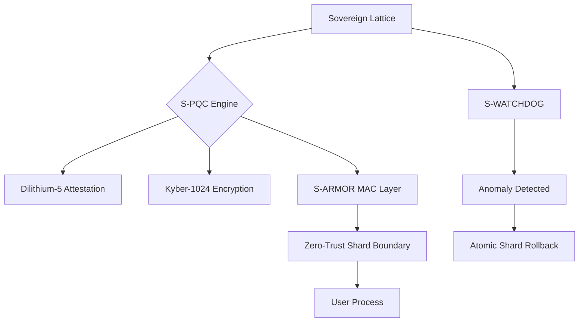

# Sovereign Cybersecurity & Offensive Defense Shard (S-SEC)

SigmaOS implements a full Post-Quantum Security Lattice, providing both defensive hardening and ethical offensive capabilities for security professionals and industrial deployments.

## Architecture



## 🛡 Post-Quantum Security Lattice (S-PQC)

SigmaOS is built from the ground up to resist quantum-computational attacks.

### Core Components

| Component | Role | Algorithm |
| :--- | :--- | :--- |
| **S-CRYPT** | All inter-shard communication encryption | CRYSTALS-Kyber-1024 |
| **S-SIGN** | Package and shard binary attestation | CRYSTALS-Dilithium-5 |
| **S-ARMOR** | Mandatory Access Control at shard boundaries | PQC-attested MAC profiles |
| **S-WATCHDOG** | Anomalous behavior detection + rollback | Behavioral heuristics |

### Cryptography API

```c
// Encrypt an inter-shard payload
sigma_status status = pq_encrypt(data, sizeof(data), encrypted_out);
if (status != SIGMA_OK) {
    sigma_log_error("[S-PQC] FATAL: Cryptographic violation. Halting.");
    // Hardware halt triggered
}

```

---

## 🏹 Offensive Capabilities (Ethical Security Auditing)

SigmaOS provides a turnkey environment for security professionals to audit silicon and networking infrastructure.

### Bundled Security Tools

- **`S-PLOIT`**: Native penetration testing framework targeting shard memory and system call surfaces.
- **`S-MAP`**: High-performance network scanning and packet analysis (Nmap/Wireshark-class).
- **`S-FORENSIC`**: Post-quantum forensic engine for atomic state analysis and shard-level investigation.
- **`sigma-audit`**: Static analysis tool for verifying shard binary integrity against known-good PQC hashes.
- **Lattice Fuzzers**: Directed fuzzing at the sovereign memory allocator and Z-SYSCALL interface.
- **Protocol Shards**: Pre-configured modules for auditing 802.11 Wi-Fi, Bluetooth, and IPsec tunnels.

---

## 🛡 Defensive Hardening

| Defense Layer | Implementation | Replaces |
| :--- | :--- | :--- |
| **Zero-Trust MAC** | PQC-attested mandatory profiles for every userland process | SELinux / AppArmor |
| **Amnesic Memory** | Zero-data remanence: every freed page is immediately wiped | None (unique USP) |
| **S-WATCHDOG** | Detects anomalous silicon behavior → triggers atomic shard rollback | auditd / inotify |
| **Encrypted Silicon** | Full hardware-level data sovereignty (LUKS2 equivalent) | dm-crypt / LUKS |

---

## 🔐 Security Regression Testing

All PQC primitives are tested automatically in CI/CD against official NIST test vectors.

See: [CI/CD Pipeline](API-Documentation#cicd) | [Security Shard](Security-Shard)
