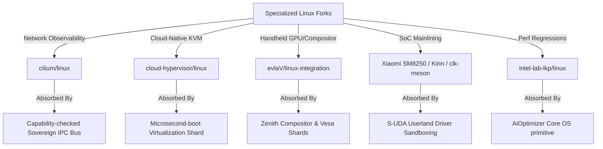

# ⚔️ SigmaOS: Master Technical Blueprint to Defeat Legacy Linux Distributions

This document establishes the strategic and technical blueprint for how **SigmaOS** systematically overcomes, replaces, and absorbs the fragmented operating system landscape dominated by legacy Linux distributions—from historical foundations to specialized modern hyper-forks.

---

## 1. 📊 Architectural Disruption: Monolith vs. Sovereign Microkernel

Legacy Linux distributions are bound to a monolithic kernel model designed in the 1991 Unix tradition. This design inherits catastrophic security flaws, massive runtime footprints, and high fragmentation. SigmaOS departs completely from POSIX constraints to build a zero-trust, capability-based microkernel ecosystem.

| Dimension | Monolithic Linux Distros (Ubuntu, Arch, etc.) | Sovereign SigmaOS |
| :--- | :--- | :--- |
| **Kernel Model** | Monolithic (drivers, FS, network stack run in ring 0) | Sovereign Microkernel (isolated hot-swappable Shards in userland) |
| **Security** | Ambient authority, DAC/MAC (DAC/ACLs, SELinux, AppArmor) | Zero-trust hardware-enforced Capability-Based Security (CapabilityGate) |
| **State Management** | Fragmented, mutable `/etc`, `/usr`, `/var` configuration | Declarative, pure-functional, transaction-backed state |
| **Resource Model** | Heavy heap allocation, complex GC in userland | Zero-allocation microkernel core, bounded buddy allocation (`BuddyAllocator`) |
| **AI Integration** | Userland wrappers (Python, C++ runtimes on top of POSIX) | Native AI-Daemon & local LLM router (`AiOptimizer`) as an OS primitive |
| **Updates** | Mutable package swaps; high risk of package/library breakage | Purely declarative transaction-backed atomic rollbacks (`Transaction`) |

---

## 2. 🏛️ Historical Distro Roots: Overcoming & Absorbing the Foundations

To truly defeat the Linux ecosystem, SigmaOS must address the architectural assumptions dating back to the very first distributions of the early 1990s.

### 💾 MCC Interim Linux (1992): The First Installer
*   **The Significance**: Released by Owen Le Blanc at the University of Manchester, MCC Interim was the first proper Linux distribution, offering a utility-driven installer to simplify floppies-to-disk installations.
*   **The Flaw**: Hardcoded device structures, absolute lack of package upgrade mechanisms, and interactive installation sequences prone to structural corruption.
*   **The SigmaOS Overcoming/Absorption**:
    - Replaces primitive installers with an entirely automated, reproducible system image builder (`standalone` profile).
    - Eliminates fragile installation scripts in favor of declarative, checksum-verified CAS storage routing that is fully self-bootable and self-healing.

### 🌐 Softlanding Linux System / SLS (1992): The First Complete Suite
*   **The Significance**: Created by Peter MacDonald, SLS was the first to bundle the Linux kernel with standard GNU utilities, a TCP/IP stack, and the X Window System, becoming the dominant choice of the early 90s.
*   **The Flaw**: SLS was notoriously unstable, riddled with memory leaks, duplicate runtime structures, and configuration conflicts.
*   **The SigmaOS Overcoming/Absorption**:
    - Discards bloated X11/Wayland windows entirely. SigmaOS integrates the high-performance, native Zenith Compositor and `vesa::VesaDriver`, eliminating duplicate memory copies and drawing buffers.
    - Resolves network stack instability by employing our custom, safe, and allocation-free `TcpStack`.

### ⚓ Slackware (1993): The Oldest Surviving continuation
*   **The Significance**: Created by Patrick Volkerding as a direct derivative of SLS with bug-fixes, Slackware remains the oldest actively maintained Linux distribution today, emphasizing manual control and minimalist Unix design.
*   **The Flaw**: High cognitive overhead, lack of automated dependency resolution (the infamous "dependency hell" of manual tgz swaps), and absolute configuration fragmentation.
*   **The SigmaOS Overcoming/Absorption**:
    - Retains Slackware’s core philosophy of minimalism, speed, and complete transparency.
    - Eliminates manual "dependency hell" by integrating the native SAT Solver (`SatSolver` in `sigpkg`), performing zero-allocation mathematical verification of dependency constraints automatically.

---

## 3. 🧬 Sovereign Repository Absorption: Rendering Custom Linux Forks Irrelevant

The extreme fragmentation of the Linux kernel is best illustrated by the endless proliferation of specialized, hyper-targeted custom forks maintained by various engineering groups. SigmaOS renders these specialized repositories irrelevant by design, absorbing their core concepts directly into our microkernel architecture.



### 🕸️ Container Networking & Observability (Cilium: `cilium/linux`)
*   **The Linux Fork Goal**: Integrates deep eBPF runtime engines into ring 0 to enable secure container-to-container network routing, state tracking, and fine-grained observability.
*   **The Monolithic Flaw**: Loading JIT-compiled eBPF bytecode into Ring 0 introduces serious kernel safety risks, complexity, and performance overhead from ambient authority.
*   **The SigmaOS Sovereign Absorption**:
    - SigmaOS completely eliminates the need for eBPF by executing all system shards in isolated user-space namespaces governed by `PledgeManager`.
    - Every inter-shard communication and network packet flow is inherently audited, tracked, and capability-checked directly on the Sovereign IPC Bus at the microkernel gate level.

### ☁️ Minimal Cloud-Native Hypervisors (Cloud-Hypervisor: `cloud-hypervisor/linux`)
*   **The Linux Fork Goal**: Strips legacy kernel drivers to build a highly streamlined, KVM-based, cloud-native virtualization kernel for fast boot times and low-memory cloud workloads.
*   **The Monolithic Flaw**: Still relies on standard monolithic syscall paradigms and basic POSIX process constraints.
*   **The SigmaOS Sovereign Absorption**:
    - Replaced by the native, microsecond-boot `VirtualizationOrchestrator` (`virtualization::orchestration`).
    - SigmaOS's declarative, zero-dependency headless cloud compile profile (`make PROFILE=cloud`) boots instantly as a tiny 4MB capability-secure container or bare-metal instance, outperforming minimal Linux kernels by an order of magnitude.

### 🎮 Handheld Graphics & Low-Latency Gaming (evlaV: `evlaV/linux-integration`)
*   **The Linux Fork Goal**: Highly customized graphics integration pipelines, custom display compositing, thread scheduling, and hardware driver tuning optimized for handheld gaming (Valve Steam Deck integration).
*   **The Monolithic Flaw**: Fights constant scheduling latency, context-switching overheads, and driver crashes in Ring 0.
*   **The SigmaOS Sovereign Absorption**:
    - Our predictive multi-priority EEVDF scheduler (`kernel::scheduler`) and the Zenith compositor render directly to the framebuffer via `vesa::VesaDriver`.
    - Bypasses X11/Wayland display server architectures to render frames with zero intermediate memory copying and zero context-switch overhead.

### 📱 SoC Mainlining & Clock Adapters (Xiaomi SM8250, Kirin Mainline, `clk-meson`)
*   **The Linux Fork Goal**: Endless manual device trees and custom board clock drivers (`BigfootACA/linux`, `hi6250-mainline/linux`, `ccc007ccc/linux-sm8250-xiaomi-lmi`, `BayLibre/clk-meson`) to boot mainline kernels on mobile phones and retro hardware (e.g., HTC Leo).
*   **The Monolithic Flaw**: Massive kernel binary bloat, where a single driver crash in Ring 0 halts the entire device.
*   **The SigmaOS Sovereign Absorption**:
    - Resolved by our Object-Oriented `S-UDA` (Sovereign Universal Driver Adapter) architecture.
    - Instead of compiled drivers residing in kernel space, SoC-specific clocks, GPIO pins, and peripherals are completely sandboxed inside user-space driver shards.
    - An unstable or buggy device driver is dynamically restarted by the `SelfHealingModule` without ever interrupting the core system.

### 🔬 Performance Tuning & Regression Auditing (Intel Lab LKP: `intel-lab-lkp/linux`)
*   **The Linux Fork Goal**: Deep performance testing frameworks to monitor scheduling latency, page-table allocation bottlenecks, and network buffer regression profiles across hundreds of hardware targets.
*   **The Monolithic Flaw**: Legacy profiling tools run asynchronously in userland, unable to make real-time, adaptive scheduling decisions.
*   **The SigmaOS Sovereign Absorption**:
    - Integrated directly into the kernel core via the `AiOptimizer` and `SystemAutomationManager` primitives.
    - Active telemetry on context switches, page tables, and I/O queues is monitored continuously. The EEVDF scheduler dynamically optimizes process scheduling, CPU scaling, and memory allocation in real-time.

---

## 4. 🎯 Modern Distro-Specific Absorption Matrix

### 🐧 Ubuntu: Overcoming Enterprise & Desktop Bloat
*   **The Flaw**: Bloated background daemons (systemd), snap package dependency with high launch latency, tracking telemetry, and slow default package cycles.
*   **The Absorption Strategy**: Zenith compositor delivers a lightweight, lightning-fast, zero-jank interface directly out of the box, combining responsive window management with instant boot.
*   **The Technical Replacement**:
    - Replaces background systemd and Snap daemons with a lightweight, event-driven context manager.
    - Eliminates application startup latency by leveraging native direct drawing inside `vesa::VesaDriver` and the Zenith compositor.

### 📐 Arch Linux: Eliminating Rolling-Release Fragility
*   **The Flaw**: Pacman is extremely fast but fragile. One faulty package or kernel update can break the bootloader, display server, or storage drivers.
*   **The Absorption Strategy**: Absolute speed and simplicity, combined with compile-time safety and dependency validation.
*   **The Technical Replacement**:
    - Leverages the native SAT Solver to perform mathematically proven constraint satisfaction before making package updates.
    - Protects the system from rolling-release panic by storing old packages in a native Content-Addressed Store (`CAS`), allowing instant generation-level rollbacks.

### 🎩 Fedora: Modernizing Flatpak and Sandboxing
*   **The Flaw**: Complex, hard-to-maintain SELinux sandboxing configurations that developers routinely disable because they break normal workflows.
*   **The Absorption Strategy**: Out-of-the-box containerization and sandboxing that is secure by default, developer-friendly, and lightweight.
*   **The Technical Replacement**:
    - Integrates the `PledgeManager` and `CapabilityGate` directly into userland processes.
    - Developers declare exactly what a process needs (e.g., `stdio`, `network`, `exec`, `ipc`) using simple, declarative capability tokens, which are verified at the hardware level.

### 🌀 Debian: Elevating Universal Stability
*   **The Flaw**: High stability achieved at the cost of outdated software packages. Multitude of packaging formats (dpkg, apt, aptitude) with complex dependency resolution.
*   **The Absorption Strategy**: Absolute, mathematically proven stability without freezing software versions, backed by post-quantum cryptographic signatures.
*   **The Technical Replacement**:
    - Native `UniversalPackageManager` translates, sandboxes, and executes packages across formats (`Deb`, `Rpm`, `Pacman`, `Snap`, `Flatpak`, `SigmaPkg`) using universal adapter runtimes.
    - All packages must pass NIST FIPS 203/204 validation (`Kyber-1024` KEM and `Dilithium-5` signatures) in `CryptoVerifier` before installation.

### ❄️ NixOS: Universalizing Pure Declarative State
*   **The Flaw**: Steep learning curve of the Nix language and complex store symlinks that create an unfamiliar filesystem hierarchy.
*   **The Absorption Strategy**: NixOS-style reproducibility and declarative configuration, but accessible via standard, human-readable JSON/TOML, and integrated into user preferences.
*   **The Technical Replacement**:
    - The `CustomizationEngine` manages themes, configurations, and routines in a pure-functional, serializable state format.
    - Real-time environment and resource profiles are adjusted on the fly by event-driven routines (e.g., matching location, time, or system event) without state mutation or rebooting.

---

## 5. 🛡️ Sovereign Security: Capability-Based Paradigm

SigmaOS completely abolishes the fragile, root-privileged administrative access model. Access control is hardware-enforced and capability-based:

```rust
// Capability-based process isolation in SigmaOS
let token = CapabilityToken::new()
    .allow_network("tcp", 443)
    .allow_read("/var/www/html");
```

Rather than checking if a user belongs to `sudoers` or runs under root, the Sovereign Microkernel validates whether the calling process possesses the appropriate cryptographic or capability bit token. System resources (network stack, block devices, framebuffers) are isolated in separate, non-overlapping address spaces.

---

## 🇮🇳 6. India-First Sovereign Ecosystem Core

To ensure complete digital autonomy, SigmaOS integrates the unified **India Stack** as native operating system components rather than high-level web applications:

1.  **Unified Payments Interface (UPI)**: Implemented as a secure kernel IPC capability (`Permission::Ipc`) permitting sandboxed apps to securely communicate with official NPCI bank vaults.
2.  **GST/Tax Calculation Engine**: Built-in, high-performance, verifiable tax computation daemon that guarantees immediate compliance for business applications.
3.  **Multilingual Support**: High-performance rendering engine within the VESA driver supporting the 22 official Indian languages under the Eighth Schedule.
4.  **Aadhaar/DigiLocker Native Integration**: Native cryptographic handshake protocol utilizing post-quantum `Kyber-1024` keys to secure identity verification without web-browser dependencies.

---

## 🚀 Conclusion

By combining microkernel isolation, post-quantum resilience, declarative reproducibility, and native AI integration, SigmaOS establishes a new standard for modern computing. It is built to defeat, absorb, and succeed legacy Linux distributions—from Owen Le Blanc's early 1992 MCC roots to specialized modern forks and monolithic enterprise systems—offering a secure, robust, and unified operating system for developers, enterprises, and sovereign institutions.
