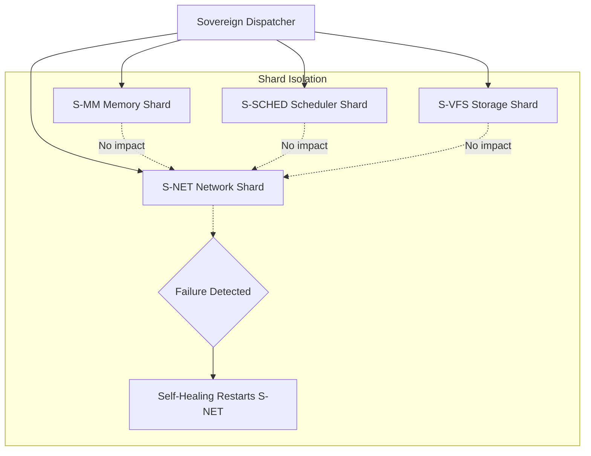
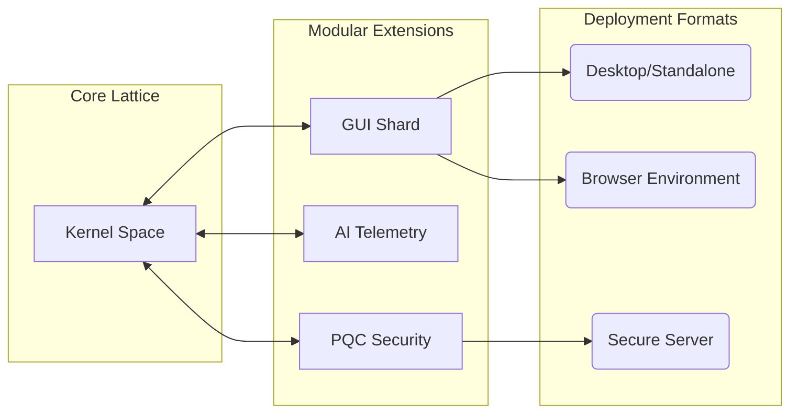
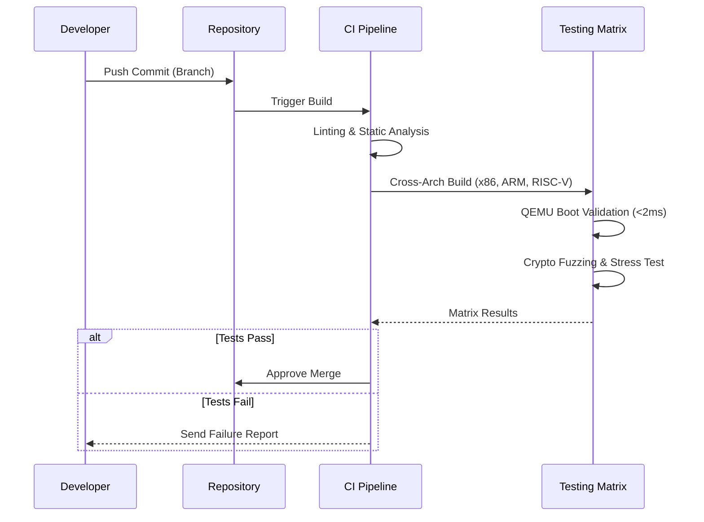

# SigmaOS System Diagrams

This document contains visual representations of SigmaOS's core architectural paradigms, including Shard Autonomy, Lattice Flexibility, and the CI/CD Pipeline Flow.

## 1. Shard Autonomy

Shard autonomy allows individual components (shards) of SigmaOS to run in isolation, fail gracefully, and restart without affecting the rest of the system.

## 2. Lattice Flexibility

Lattice Flexibility represents how the microkernel structure allows shards to dynamically interconnect and form a cohesive system depending on the target format (Core, Browser, App, Dualboot, Standalone).

## 3. CI/CD Flow

The automated pipeline ensures that every commit to the SigmaOS repository is rigorously tested for performance, security, and stability before merging.

