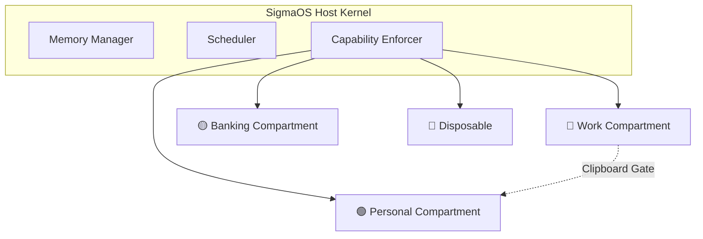

# Distro Absorption: Qubes OS — Security by Compartmentalization

> **Status**: 📋 Planned | **Source Paradigm**: Qubes OS | **Target Shard**: `SigmaOS Sovereign Compartments`

---

## 1. Executive Summary

Qubes OS is a security-focused desktop operating system that uses Xen hypervisor-based virtualization to isolate different activities (work, personal, banking) into separate virtual machines called "qubes". Each qube is a lightweight VM with strict inter-VM communication controls.

SigmaOS absorbs Qubes' **compartmentalization-by-default** model and **disposable VM** pattern, implementing them natively using capability-enforced process groups rather than a full hypervisor, achieving Qubes-level isolation with near-native performance.

---

## 2. Key Features to Absorb

### 2.1 Capability-Enforced Compartments

Instead of Xen VMs, SigmaOS uses capability-enforced compartments (sigma-compartments) where each compartment has a completely isolated filesystem namespace, network namespace, and memory space.

```bash
$ sigma compartment list
Σ [COMPARTMENT] Active compartments:
  NAME        COLOR    MEMORY  NET       SERVICES
  work        🔵       2GB     vpn-corp  browser, slack, vscode
  personal    🟢       1GB     clearnet  browser, spotify
  banking     🟡       512MB   tor       browser-hardened
  untrusted   🔴       256MB   isolated  sandbox-shell
```

### 2.2 Disposable Compartments

For risky operations (opening untrusted attachments, browsing suspicious links), SigmaOS spawns a disposable compartment that is destroyed immediately after use, leaving no persistent state.

```bash
$ sigma compartment disposable --open suspicious-file.pdf
Σ [COMPARTMENT] Spawning disposable compartment...
  Base: untrusted (read-only template)
  Lifetime: until process exits
  Network: NONE
  [Opening file in sandboxed viewer...]
Σ [COMPARTMENT] Disposable destroyed. No state persisted.
```

### 2.3 Secure Inter-Compartment Clipboard

Clipboard transfers between compartments require explicit user confirmation, preventing clipboard-based data exfiltration.

```bash
$ sigma compartment clipboard copy work → personal
Σ [COMPARTMENT] Clipboard transfer requested:
  From: work (🔵)  →  To: personal (🟢)
  Content: 42 characters of text
  [APPROVE / DENY]? █
```

---

## 3. Architecture



---

## 4. References & Standards

- Qubes OS — `qubes-os.org` (GPL-2.0)
- Xen Hypervisor — `xenproject.org` (GPL-2.0)
