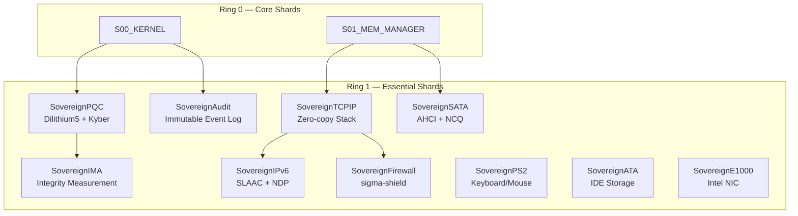

# Essential Shards Specification

> **Status**: ACTIVE | **Component**: Sovereign Lattice | **Ring**: 1

The Essential Shards form the second operational tier of SigmaOS, between the privileged Core Shards (Ring 0) and user-facing Dynamic Shards. Essential Shards run at Ring 1, with hardware-isolated address spaces and explicit capability tokens. They provide security enforcement, networking, and hardware driver abstractions.

---

## Architecture Overview

---

## 🛡️ Security & Verification Shards

These modules enforce cryptographic trust chains, integrity validation, and access policy control.

| Shard ID | Shard Path | System Component | Functional Purpose | Required Capabilities |
| :--- | :--- | :--- | :--- | :--- |
| **E00** | `kernel/security/SovereignPQC.rs` | Cryptographic Engine | Validates Dilithium5 package signatures and handles Kyber-1024 key encapsulation | `CAP_CRYPTO` |
| **E01** | `kernel/security/SovereignAudit.rs` | Audit Trail | Writes immutable, signed events to the physical system log ring buffer | `CAP_AUDIT` |
| **E02** | `kernel/security/SovereignIMA.rs` | Integrity Measurement | Measures files before execution, enforcing state immutability | `CAP_CRYPTO`, `CAP_READ` |

### E00: SovereignPQC — Cryptographic Engine

The PQC shard is the backbone of SigmaOS's zero-trust model. Every package installation, kernel module load, and shard activation must pass through this engine.

**Supported Algorithms:**

| Algorithm | NIST Standard | Key Size | Use Case |
|---|---|---|---|
| Dilithium5 | FIPS 204 | 4864 B pub / 4032 B sec | Package & kernel module signatures |
| Kyber-1024 | FIPS 203 | 1568 B pub / 3168 B sec | Key encapsulation for IPC encryption |
| BLAKE3 | — | 256-bit digest | Content-addressable hashing |
| SPHINCS+-256 | FIPS 205 | 64 B pub / 128 B sec | Stateless hash-based backup signatures |

### E01: SovereignAudit — Tamper-Evident Logging

Every security-sensitive event (shard load, capability grant, package install) is written to a tamper-evident audit ring. Records are chained using BLAKE3 hash pointers, making any retroactive mutation detectable.

### E02: SovereignIMA — Integrity Measurement Architecture

Before any executable is loaded (ELF binary, shard `.spkg`, kernel module), its BLAKE3 hash is measured against the Sovereign Finality Certificate. If the hash mismatches, execution is denied and an audit event is emitted.

---

## 🌐 Network Protocol Shards

The network layer provides robust stateful firewall protections and full IPv6 socket abstractions.

| Shard ID | Shard Path | Component Class | Core Features | Required Capabilities |
| :--- | :--- | :--- | :--- | :--- |
| **E10** | `kernel/net/SovereignTCPIP.rs` | TCP/IP Core | Zero-copy packet parsing, socket buffers, window scaling, BBR congestion control | `CAP_NETWORK` |
| **E11** | `kernel/net/SovereignIPv6.rs` | IPv6 Node | Stateless Address Autoconfiguration (SLAAC), NDP, path MTU discovery | `CAP_NETWORK` |
| **E12** | `kernel/net/sigma_shield.rs` | sigma-shield | Hooks into ingress/egress queues to apply connection rules; default-drop policy | `CAP_NETWORK`, `CAP_ADMIN` |

### E10: SovereignTCPIP — Zero-Copy Network Stack

The TCP/IP shard uses page-frame swapping for zero-copy packet delivery to userspace. Socket buffers are managed as ring-buffer descriptors pointing to physical pages, eliminating memcpy overhead for bulk transfers.

### E12: sigma-shield — Sovereign Firewall

sigma-shield implements a packet filter with connection tracking and rate limiting. Rules are defined in `/etc/sigma/firewall.toml` and enforced at the `sigma-bus` ingress/egress hooks. See the [Knowledge Base](Knowledge-Base.md#sigma-shield-firewall) for configuration details.

---

## 🔌 Layer 2: Core Device Driver Shards

Essential block storage and standard input/output device drivers.

| Shard ID | Shard Path | Device Class | Interface Abstraction | Required Capabilities |
| :--- | :--- | :--- | :--- | :--- |
| **E20** | `kernel/drivers/SovereignPS2.rs` | Keyboard/Mouse | PS/2 controller status loops, scancode mapping | `CAP_DEVICE` |
| **E21** | `kernel/drivers/SovereignATA.rs` | IDE Storage | Disk sector I/O, PIO/DMA transfers, master/slave selection | `CAP_STORAGE` |
| **E22** | `kernel/drivers/SovereignSATA.rs` | AHCI Controller | Command lists, FIS structures, native command queuing (NCQ) | `CAP_STORAGE` |
| **E23** | `kernel/drivers/SovereignE1000.rs` | Ethernet Driver | Intel 8254x NIC driver, DMA rings, descriptor structures | `CAP_NETWORK`, `CAP_DEVICE` |

### Recovery Behavior

Essential Shards are managed by the [Self-Healing Engine](Self-Healing.md). If an Essential Shard crashes:

1. The watchdog logs the crash to the `PanicLog` ring buffer.
2. If `crash_count < 5`, the shard is restarted with exponential backoff (100ms, 200ms, 400ms, ...).
3. If `crash_count >= 5`, the shard is **quarantined** and the user is notified via Zenith.

---

*For Core (Ring 0) shards, see [CORE_SHARDS.md](shards/CORE_SHARDS.md). For optional shards, see [OPTIONAL_SHARDS.md](OPTIONAL_SHARDS.md).*
