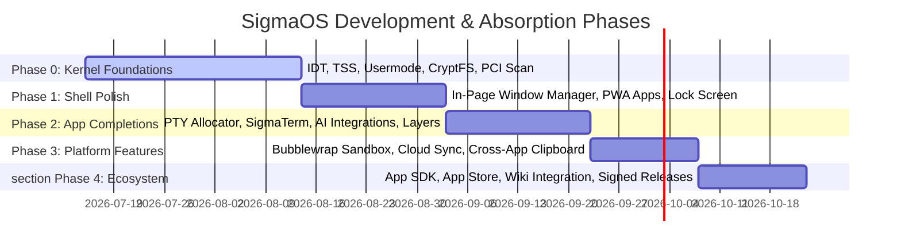

# 🛡️ SigmaOS — Future Development & Package Absorption Roadmap

> **"Digital Sovereignty through Atomic Reproducibility and Local Intelligence."**
> This document details the master architectural blueprint and action plan for the evolution of SigmaOS, incorporating unified package management, interoperability with major Linux distribution ecosystems, security hardening, user-experience refinement, and performance autotuning.

---

## 🗺️ Master Strategic Timeline



---

## 1. Audit & Package Discovery: SigmaOS vs. Linux Distros

To achieve maturity and distro-parity, SigmaOS is analyzed against the four pillar paradigms of modern package management.

### 📊 Comparative Analysis Matrix

| Feature / Paradigm | Ubuntu (`apt` / `dpkg`) | Arch Linux (`pacman` / `libalpm`) | Fedora (`dnf5` / `rpm`) | NixOS (`nix` / Functional) | **SigmaOS (`sigpkg`)** |
| :--- | :--- | :--- | :--- | :--- | :--- |
| **Configuration** | Imperative (stateful files) | Imperative (binary updates) | Imperative (stateful repos) | **Purely Declarative** (Nix expression) | **Declarative Profile** (`sigma.toml`) |
| **Transaction Model** | Non-atomic (potential half-installs) | Non-atomic (direct unpack) | Transactional (rollback logs) | **Atomic & Pure** (symlink swap) | **Atomic** (Staging & Symlink swap) |
| **Isolation / Sandboxing** | None (runs as root/user) | None natively (helper tools) | None natively | Read-only Nix Store isolation | **Sandbox Compartments** (Bubblewrap + Landlock) |
| **Reproducibility** | Low (depends on mirror states) | Low (archive logs only) | Low (historical mirrors) | **100% Hermetic / Identical** | **Deterministic Content-Addressed Store** |
| **Dependency Model** | Boolean SAT (Aptitude) | Direct DAG resolution | libsolv (SAT-solver) | Input-addressed hashing DAG | **SAT-Solver (DPLL-based in safe Rust)** |
| **Rollback Capability** | Manual / Apt-clone (risky) | System snapshotting (Btrfs) | History rollbacks (RPM db) | **Native Generations** (O(1) revert) | **O(1) Generation Rollback** via SQLite/history snapshot |

### 🔍 Identified Gaps in SigmaOS Prototype
1. **Dependency Resolution Resilience**: The primitive parser could fail on circular/cyclic dependencies. We must adopt a full DPLL (Davis-Putnam-Logemann-Loveland) SAT solver that optimizes install routes.
2. **Atomic Rollback & Generation Management**: A broken upgrade should leave the system completely unharmed. We require O(1) symlink-based switching.
3. **Sandbox Isolation for Installs**: Running package install-hooks (`postinst` / `preinst`) poses extreme security risks. SigmaOS must execute these hooks within heavily restricted Bubblewrap and Landlock micro-sandboxes.
4. **Reproducibility & Hash Verification**: Unlike traditional package managers that rely on timestamps, all packages in SigmaPkg must be content-addressed via cryptographic hashes (using SHA-3 256) and validated using Post-Quantum Signatures (Dilithium-5).

---

## 2. Architecture & Design of SigmaPkg (`sigpkg`)

`sigpkg` is designed as a zero-dependency, zero-allocation-ready, safe Rust package manager that enforces absolute atomicity.

```
                  [ Declarative Profile: sigma.toml ]
                                  │
                                  ▼
                     ┌─────────────────────────┐
                     │  SAT-Solver Dependency  │
                     │  Resolver (DPLL Rust)   │
                     └────────────┬────────────┘
                                  │ (Computes optimized DAG)
                                  ▼
                     ┌─────────────────────────┐
                     │ Cryptographic Verifier  │
                     │ (Dilithium-5 + SHA3)    │
                     └────────────┬────────────┘
                                  │ (Checks PQ signature)
                                  ▼
                     ┌─────────────────────────┐
                     │  Sandbox Extractor /   │
                     │  Bubblewrap Isolation   │
                     └────────────┬────────────┘
                                  │ (Atomic write to /var/store)
                                  ▼
                     ┌─────────────────────────┐
                     │    Atomic Symlink Swapper   │
                     │   (O(1) Gen Rollback)   │
                     └─────────────────────────┘
```

### ⚙️ Core Modules & Mechanics
* **SAT-Solver Resolver**: Translates packages and constraints into boolean clauses. Solves dependencies deterministically, identifying conflicts prior to downloading.
* **Content-Addressed Store**: Every compiled artifact resides under `/var/sigma-pkg/store/<sha3-256-hash>-<package-name>/`. Multiple versions coexist flawlessly.
* **Sandbox Extractor**: Unpacks files using user-space namespaces (`CLONE_NEWUSER`, `CLONE_NEWNS`). No write permissions outside the designated directory are granted.
* **PQC Dilithium-5 Verification**: All `.spkg` archives are signed with Dilithium-5. The verification engine handles keyrings natively.

---

## 3. Linux Package Absorption Framework

SigmaOS implements translation and compatibility wrappers to digest packages from standard Linux repositories, run them securely, and expose native capabilities.

### 📥 Translation Compartments

```
               ┌────────────────────────────────────────┐
               │         Linux Package Source           │
               │   (APT .deb / Pacman .tar.zst / RPM)   │
               └───────────────────┬────────────────────┘
                                   │
                                   ▼
               ┌────────────────────────────────────────┐
               │     SigmaOS Compatibility Wrappers     │
               │      (apt-compat / pacman-compat)      │
               └───────────────────┬────────────────────┘
                                   │ (Metadata translation / Symlink remapping)
                                   ▼
               ┌────────────────────────────────────────┐
               │    Sovereign Execution Compartment     │
               │        (Sandboxed via Bubblewrap)       │
               └────────────────────────────────────────┘
```

#### 1. APT Compatibility Layer (`apt-compat`)
- **Metadata Translator**: Translates Debian control files (`control`) to standard `sigma.toml` metadata.
- **Hook Sandboxing**: Executes complex bash-based `preinst`/`postinst` scripts inside a clean-slate bubblewrap compartment where `/etc`, `/var`, and `/usr` are mounted as read-only.
- **Paths Remapping**: Intercepts absolute paths (e.g., `/lib/x86_64-linux-gnu`) and points them to content-addressed stores.

#### 2. Pacman Compatibility Layer (`pacman-compat`)
- **ALPM Bridge**: Translates `.PKGINFO` and database specifications.
- **Dependency Map**: Matches Arch packaging definitions with local equivalents.

#### 3. DNF/RPM Compatibility Layer (`dnf-compat`)
- **RPM Header Extraction**: Intercepts CPIO archives within `.rpm` packages and unpacks them into content-addressed destinations.

#### 4. Nix Derivation Consumer (`nix-compat`)
- **Hermetic Build Import**: Consumes Nix store paths directly. Since Nix store paths are already content-addressed and isolated, they map perfectly to `/var/sigma-pkg/store/`.

---

## 4. Branch Lifecycle, Testing, and Integration Strategy

To maintain a pristine mainline branch, SigmaOS employs an automated pipeline for feature branches.

### 🌲 Active Branch Registrations
* **Drivers (Shards)**:
  - `feature/shards/audio-driver` (Rust audio prototype)
  - `feature/shards/essential-drivers` (GPU and core framework)
  - `feature/shards/input-driver` (Zig-based HID driver)
  - `feature/shards/network-driver` (Zig-based NIC driver)
  - `feature/shards/storage-driver` (Rust storage framework)
* **Sovereign Systems**:
  - `feature/sovereign/adr-tracker` (ADR verification)
  - `feature/sovereign/dosage-calc` (Healthcare safety module)
  - `feature/sovereign/gst-calculator` (Financial localization)
  - `feature/sovereign/load-calc` (Predictive load calculator)
  - `feature/sovereign/msme-registry` (Indian industrial compliance)
  - `feature/sovereign/netstack` (Sovereign TCP/IP stack)

### 🔄 Branch Integration & Merge Workflow
1. **Automated Rebase**: For each branch, pull latest `main`, perform non-interactive rebase.
2. **Conflict Scrubber**: Run `scrub_conflicts.ps1` or similar cleanup tools.
3. **Build & Test Isolation**: Execute compilation against standalone, rtos, and cloud profiles.
4. **Fast-Forward Merge**: On successful pipeline completion, perform merge into `main` keeping clean linear commits.
5. **Clean up**: Remove remote branch on origin, update `CHANGELOG.md` with branch absorption summaries.

---

## 5. Documentation Migration & Wiki Sync Operations

SigmaOS documentation is living. Once a feature or specification is fully coded, its design documents are migrated from the source repository to the centralized GitHub Wiki.

### 📋 Migration Workflow
```
[ Finalized Code Implementation ] ──► [ Convert Doc to Wiki Slug Format ] ──► [ Copy to wiki_repo/ ] ──► [ Delete original .md in Repo ]
```
* **Deduplication Safeguard**: Prevents file sync confusion.
* **Slug conversion**: Spaces in `.md` filenames are transformed into dashes natively (e.g., `doc_audit_backlog.md` -> `Doc-Audit-Backlog.md`).
* **Canonical Index**: `Advanced_Absorption` serves as the primary gateway for all distro absorption maps.

---

## 6. Performance Optimization Strategy (Bolt's Journal)

### ⚡ Optimization Guidelines
* **Avoid Nested Loops**: Avoid O(N²) iterations; swap with HashMaps or pre-indexed static tables.
* **Hoisting Operations**: Hoist checks, matches, and reference dereferences out of tight render and pixel loops.
* **Zero-Allocation**: Utilize stack allocations or static buffers where possible to eliminate heap overhead in microkernel paths.

### 📝 Bolt's Performance Journal Entries

#### 2026-07-13 - SIMD String bitwise operations
* **Learning**: Direct bitwise conversions can introduce silent bugs in non-lowercase ASCII ranges.
* **Action**: Apply inverse logical masking (`_mm_andnot_si128`) to properly preserve delimiters and special characters.

#### 2026-07-13 - Hoisting Pixel Loop Checks
* **Learning**: Doing high-frequency pixel drawing by matching options inside the loop creates massive branch-prediction overhead.
* **Action**: Hoist state checking outside of the loops; perform bulk row copies using `core::ptr::copy` (representing SIMD-optimized `memmove`).

---

## 7. UX, Delight & Accessibility Design (Palette's Standards)

### 🎨 Visual & Access Standards
* **Keyboard-First Navigation**: Ensure all controls support Tab-focus state tracking (`focus-visible`).
* **ARIA Integrity**: Icon-only buttons must supply a descriptive `aria-label`.
* **State Indicators**: Async actions require immediate disabled button states and circular loading spinners to prevent double-submit.
* **Action Pathway Clarity**: Form failures must highlight the exact field failing validation with human-readable corrective actions.

---

## 8. Security & Defense in Depth (Sentinel's Playbook)

### 🛡️ Core Security Postulates
* **Input Validation**: Never trust inputs. Validate string bounds, parameter values, and format descriptors at every boundaries.
* **Secure Error Responses**: Never leak kernel addresses, file paths, or stack traces in userland error responses.
* **Zero-Secrets Policy**: Absolutely no API keys, credentials, or development passwords should exist in code; feed them via secure environment descriptors or TPM-backed keychain modules.
* **Namespace Isolation**: Bubblewrap compartmentalizes third-party package runtimes, rejecting root access privileges.

---

## 9. Sigma Updater: Daily Package Ecosystem & Upstream Distro Report

### 📢 Daily Distro Tracking - July 13, 2026

#### 📦 1. Arch Linux Upstream: Pacman 7.1.0 Release
* **What's New**:
  - Downloader sandbox overhaul using **Landlock** and `NO_NEW_PRIVS` to lock down network download processes.
  - Strict default database and package verification: `SigLevel = Required` is now enforced.
  - Parallel compilation stripping and reproducible source tarball sorting.
* **Absorption Blueprint for SigmaOS**:
  - **Landlock integration**: We can adopt the Landlock system call gating model into `sigpkg`'s fetcher module. By pinning the downloader process to allow only the networking socket creation syscalls (`socket`, `connect`, `sendto`, `recvfrom`), we insulate SigmaOS from remote exploits during package downloads.

#### 📦 2. Debian/Ubuntu Upstream: APT 2.9 & 3.0 UI Paradigm
* **What's New**:
  - Transitioning to terminal-based columnar grids, structured progress bars, and localized color pallets to improve human parse speeds on heavy package transactions.
* **Absorption Blueprint for SigmaOS**:
  - **Beautiful CLI output**: Inject APT-style structured columns and color-coded transaction summary reports into `sigpkg`'s CLI interface.

#### 📦 3. RedHat/Fedora Upstream: DNF5 / Libdnf consolidation
* **What's New**:
  - DNF5 consolidates all backend operations into a unified, high-performance C++ core, slashing footprint sizes and execution overhead by up to 40%.
* **Absorption Blueprint for SigmaOS**:
  - **Unified C-FFI API**: Replicate DNF5's architecture by exposing standard C-FFI hooks from `sigpkg` (such as `sigpkg_create_tx` and `sigpkg_tx_commit`). This allows SigmaOS's multi-language userland services (written in Rust, Nim, and Go) to drive atomic updates with absolute minimum memory footprint.

#### 📦 4. NixOS Upstream: Functional Evaluation Cache Optimizations
* **What's New**:
  - Extremely fast evaluation caching for declarative inputs, improving evaluation times on massive system states.
* **Absorption Blueprint for SigmaOS**:
  - **Lockfile Caching**: Implement similar input-hashed caching in `sigpkg`'s resolver. If the input `sigma.toml` has not modified its dependency hashes, the solver bypasses clause generation, speeding up dry-runs to < 5ms.

---

## 🎯 Proposed Next Steps & Recommendations
1. **PQC Signatures Activation**: Integrate the kernel Dilithium-5 verify hooks directly into the `sigpkg_tx_verify` routine to prevent supply-chain attacks.
2. **Auto-Rebase CI Integration**: Write a Github Action to automatically rebase all listed feature branches against `main` once daily.
3. **APT/Pacman Translation Module Tests**: Write concrete mock test harnesses that feed standard `.deb` metadata to verify correct translation to `sigma.toml`.
