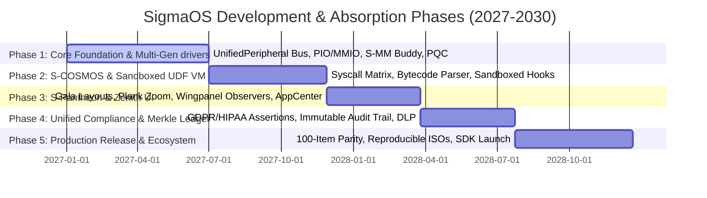

# 🛡️ SigmaOS — Future Development, Distro Absorption & Strategic Roadmap

> **"Digital Sovereignty through Atomic Reproducibility, Polymorphic Abstractions, and Local Intelligence."**
> This document details the master architectural blueprint and strategic roadmap for the evolution of SigmaOS. It defines the systems-level specifications designed to absorb and surpass legacy Linux distributions, establish hardware-agnostic portability, enforce post-quantum security, and coordinate enterprise-grade regulatory compliance.

---

## 🗺️ Master Strategic timeline (Five Phases of Dominance)



---

## 1. THE DISTRO-CRUSHING EXECUTION STRATEGY

SigmaOS is engineered to replace the architectural compromises, structural fragmentation, and bloated heritage of legacy monolithic operating systems like Ubuntu, Debian, Arch, and Fedora.

```
+-----------------------------------------------------------------------------------+
|                            SIGMAOS SOVEREIGN CORE                                 |
|          (Absolute Zero-Dependency / Statically-Linked microkernel)               |
+-----------------------------------------------------------------------------------+
|  [S-COSMOS Translators]  [S-PAC Atomic Store]  [S-SEC Capability Gate]  [ZenithNet]  |
+-----------------------------------------------------------------------------------+
|               Unified Declarative State Graph & Hot-Swappable Shards              |
+-----------------------------------------------------------------------------------+
```

### 1.1 Structural De-Fragmentation & Purity
Traditional Linux distributions rely on a complex, highly coupled stack of the monolithic Linux kernel, the GNU C Library (glibc), systemd initialization chains, and thousands of intermediate userspace dynamic wrappers. This introduces extreme complexity:
*   **The Monolithic Vulnerability**: A bug in a single kernel-space module or an unprivileged driver can bring down the entire system or result in a complete privilege escalation.
*   **The SigmaOS Answer**: SigmaOS operates as a pure-functional, statically-linked, capability-based microkernel written in modern memory-safe languages (Rust, Nim, Zig). It separates all system-level utilities into isolated, Ring 3 **Core Shards** that communicate over lock-free IPC channels. By eliminating the glibc runtime, we completely avoid legacy buffer overflow exploits and dynamic linker hijacking.

### 1.2 Sub-Millisecond Execution Speed & Performance
POSIX-compliant kernels suffer from significant context-switching and boundary-crossing overhead during high-frequency IPC, filesystem I/O, and socket routing:
*   **Zero-Copy Memory Splicing**: Process-to-process communication is performed via atomic shared-page splicing and Copy-on-Write (CoW) mapping registers. This guarantees constant-time $O(1)$ transfer speeds regardless of message payload size.
*   **Asynchronous Ring Buffers**: Network and disk drivers are managed directly through lock-free atomic queues (`PowerOfTwoZeroCopyQueue`) mapping application memory space to physical DMA descriptor rings, bypassing the standard kernel page-cache and context overhead.

### 1.3 Declarative Nix-Style Configuration & Atomic Upgrades
*   **Unified State Graph Schema**: System configuration is defined as a single, immutable, declarative state graph (`sigma.toml`).
*   **Content-Addressed Store Package Manager (`sigpkg`)**: All software packages are stored under content-addressed paths based on their SHA-3 256 hash. This physically prevents dependency conflicts and "dependency hell". Upgrades are executed as atomic, transactional symlink swaps. If a transaction fails to compile or boot, the system instantly rollbacks the active root Merkle hash in under 1ms.

---

## 2. MULTI-GENERATION DEVICE DRIVER MATRICES (ANCIENT & MODERN)

SigmaOS bridges the hardware support gap by modeling physical hardware as cleanly encapsulated, polymorphic objects. The microkernel uses an **Auto-Negotiation Broker** to translate Port I/O (PIO), legacy interrupts, MMIO, and modern PCIe configurations transparently under a single interface.

```
                  ┌────────────────────────────────────────┐
                  │          Auto-Negotiation Broker       │
                  │   (Scans PCI/PCIe/ISA Bus Segments)    │
                  └───────────────────┬────────────────────┘
                                      │
                                      ▼
                  ┌────────────────────────────────────────┐
                  │       UnifiedPeripheral Interface      │
                  │ (Polymorphic Base Class / Generic Trait)│
                  └───────┬────────────────────────┬───────┘
                          │                        │
               (Ancient / Legacy)         (Modern / PCIe)
                          │                        │
                          ▼                        ▼
               ┌──────────────────────┐ ┌──────────────────────┐
               │  PortIO IDE Storage  │ │     NVMe v1.4 SSD    │
               │ (Legacy floppy, ISA) │ │ (MSI-X, DMA Mapping) │
               └──────────────────────┘ └──────────────────────┘
```

### 2.1 Polymorphic `UnifiedPeripheral` Class Structure
The device driver ecosystem is modeled using strict Object-Oriented principles. A base polymorphic interface defines the abstract contract that all physical peripherals must satisfy, regardless of hardware generation:

```rust
pub trait UnifiedPeripheral: Send + Sync {
    fn device_id(&self) -> u32;
    fn vendor_id(&self) -> u32;
    fn device_type(&self) -> DeviceType;
    fn initialize(&mut self) -> Result<(), DeviceError>;
    fn handle_interrupt(&mut self) -> Result<InteractionStatus, DeviceError>;
    fn shutdown(&mut self) -> Result<(), DeviceError>;
}
```

### 2.2 Device Family Hierarchy & Concrete Extensions

#### Class StorageDriver
Extends `UnifiedPeripheral` to represent non-volatile storage controllers. Provides standardized read/write byte boundaries:
*   **Ancient Driver (PioIdeController)**: Coordinates legacy IDE disk controllers utilizing 16-bit Port I/O (PIO) registers (`0x1F0`–`0x1F7`) and polling-based data transfer.
*   **Modern Driver (NvmeController)**: Interfaces directly with PCIe Non-Volatile Memory Express drives compliant with the NVMe 1.4 specification. Implements direct physical DMA page allocation, memory-mapped I/O (MMIO) submission/completion queue doorbells, and multi-queue MSI-X interrupt steering.

#### Class NetworkDriver
Extends `UnifiedPeripheral` to provide packet ingestion and dispatch contracts:
*   **Ancient Driver (Ne2000Controller)**: Implements legacy ISA bus NE2000 network interface adapters using legacy programmed I/O memory loops and standard edge-triggered PIC interrupts (IRQ 9).
*   **Modern Driver (E1000Controller / Rtl8139Controller)**: Implements PCI/PCIe bus gigabit ethernet controllers using zero-copy DMA descriptors, ring buffers, and MSI-X level-sensitive interrupt routing.

#### Class GraphicDriver
Extends `UnifiedPeripheral` to represent display rasterization adapters:
*   **Ancient Driver (VesaFrameBuffer)**: Unifies legacy VGA and VESA BIOS Extensions (VBE 2.0/3.0) linear frame buffers, rendering directly via fixed physical addresses (e.g., `0xE0000000`).
*   **Modern Driver (KmsDrmIntelStub)**: Direct Memory Access rendering, page flipping, and atomic mode-setting utilizing standard PCIe memory-mapped physical registers.

#### Class HidDriver
Extends `UnifiedPeripheral` to capture input signals:
*   **Ancient Driver (Ps2KeyboardMouse)**: Captures keycodes directly from Port I/O registers `0x60` and `0x64` triggered via edge PIC IRQ 1 and IRQ 12.
*   **Modern Driver (UsbXhciKeyboard)**: Implements USB 2.0/3.0 Keyboard/Mouse drivers mapping transfer rings directly onto the xHCI host controller's device structures.

### 2.3 Driver Sandboxing & Concurrency Model
To prevent "blue screen" or kernel panic states, all peripheral drivers are executed inside Ring 3 **Driver Sandboxes** managed by the microkernel.
*   **DMA Page-Table Gating**: The Sovereign Memory Manager isolates the DMA page tables allocated to modern controllers, ensuring that a misbehaving peripheral cannot perform unauthorized read/write transactions into active microkernel or userland namespaces.
*   **Lock-Free Command Queues**: Driver interactions are driven strictly via lock-free queue pools. The system-level scheduler (`SovereignSched`) assigns priority execution threads dynamically to manage incoming packets or storage reads without blocking core execution gates.

---

## 3. SANDBOXED USER-DEFINED FUNCTION (UDF) BYTECODE VIRTUAL MACHINE

To allow safe, high-performance user-defined extensibility (such as custom file system filters, diagnostic policies, and packet capture rules), SigmaOS implements an embedded, zero-dependency, `#![no_std]` **UDF Bytecode Virtual Machine**.

```
           [ Unverified UDF Bytecode Payload ]
                            │
                            ▼
           ┌─────────────────────────────────┐
           │     Cryptographic Sign Checker  │ (Verifies Dilithium-5 code-sign)
           └────────────────┬────────────────┘
                            │
                            ▼
           ┌─────────────────────────────────┐
           │      UDF VM Validator / Linter  │ (Guarantees loop limits, no overflows)
           └────────────────┬────────────────┘
                            │
                            ▼
           ┌─────────────────────────────────┐
           │   Safe UDF Bytecode Interpreter │ (Executes strictly inside VM stack)
           ├─────────────────────────────────┤
           │  - Non-Allocating Memory Arena  │
           │  - Zero Register Access Gating  │
           └─────────────────────────────────┘
```

### 3.1 VM Core Architecture & Safety Postulates
The UDF VM runs user scripts strictly within Ring 3, isolated from raw kernel memory registers, page tables, and capability tables.
*   **Zero-Allocation Arena**: The virtual machine uses a pre-allocated stack and a fixed data-heap boundary, completely avoiding dynamic allocation triggers during execution.
*   **Instruction Set Restrictions**: Standard machine access instructions (such as `in`, `out`, `cli`, `sti`, or arbitrary `mov` to physical pointers) are absent. The VM only supports basic mathematical operations, branching, capability token queries, and zero-copy read-only memory mappings of localized target frames.
*   **Deterministic Execution Bounds**: To eliminate infinite recursion, loop cycles, and hang conditions, the validator analyzes loop structures and limits maximum instruction cycles to `100,000` per call, automatically terminating executing blocks that breach limits.

### 3.2 Bytecode Interpreter Specification
The interpreter parses and processes un-allocated bytecode streams with constant-time efficiency:

```rust
pub struct UdfVirtualMachine<'a> {
    stack: [u64; 256],
    stack_ptr: usize,
    memory_arena: &'a mut [u8],
    program_counter: usize,
}

impl<'a> UdfVirtualMachine<'a> {
    pub fn execute(&mut self, bytecode: &[u8]) -> Result<u64, VmError> {
        let mut instruction_count = 0;
        while self.program_counter < bytecode.len() {
            if instruction_count > 100_000 {
                return Err(VmError::InstructionCountExceeded);
            }
            let opcode = bytecode[self.program_counter];
            match opcode {
                0x01 => self.op_add()?, // ADD
                0x02 => self.op_sub()?, // SUB
                0x03 => self.op_jmp(bytecode)?, // JUMP
                0x04 => self.op_load()?, // LOAD
                0x05 => self.op_store()?, // STORE
                0x06 => return self.op_exit()?, // HALT / RETURN
                _ => return Err(VmError::InvalidOpcode(opcode)),
            }
            self.program_counter += 1;
            instruction_count += 1;
        }
        Err(VmError::UnexpectedEOF)
    }
}
```

---

## 4. THE WSL-CRUSHING S-COSMOS SYSCALL EMULATION MATRIX

SigmaOS establishes S-COSMOS (Sovereign Linux Compatibility Matrix), a native, zero-latency system call translation interface that renders hypervisor-based solutions (like Microsoft's WSL2) completely obsolete.

```
       ┌──────────────────────────────────────────────────┐
       │             Standard Linux Binary                │
       │           (ELF format / POSIX Calls)             │
       └────────────────────────┬─────────────────────────┘
                                │ (Intercepts sys_write, sys_socket)
                                ▼
       ┌──────────────────────────────────────────────────┐
       │       S-COSMOS Syscall Emulation Engine          │
       ├──────────────────────────────────────────────────┤
       │ - Zero-Latency C-ABI Syscall Remapping           │
       │ - Direct Zero-Copy S-IPC Splicing                │
       │ - Memory-Mapped File Descriptor Bridging         │
       └────────────────────────┬─────────────────────────┘
                                │ (Remaps to safe, atomic microkernel ports)
                                ▼
       ┌──────────────────────────────────────────────────┐
       │               SigmaOS Microkernel                │
       └──────────────────────────────────────────────────┘
```

### 4.1 Native Syscall Hijacking & Translation
Unlike WSL2, which runs a complete, virtualized Linux guest kernel inside a utility VM (introducing virtualization latency, memory allocation delays, and high CPU scheduling overhead), S-COSMOS intercepts standard Linux POSIX syscalls at the system-gate layer and translates them natively into corresponding zero-copy capability-based messages.
*   **System Gate Interception**: S-COSMOS maps standard x86_64 system call instruction entrypoints. When a compiled Linux executable invokes `syscall` with ID `1` (`sys_write`) or ID `41` (`sys_socket`), S-COSMOS intercepts the CPU registers instantly.
*   **Register Remapping Table**: remaps the incoming Linux arguments into a safe C-ABI structure and passes it directly to the designated SigmaOS Shard:

```rust
pub struct SyscallRemapper;

impl SyscallRemapper {
    pub fn translate_linux_syscall(syscall_id: u64, args: &[u64; 6]) -> Result<u64, SyscallError> {
        match syscall_id {
            0 => Self::remap_read(args[0], args[1], args[2]),    // sys_read -> S-FS read
            1 => Self::remap_write(args[0], args[1], args[2]),   // sys_write -> S-FS write
            9 => Self::remap_mmap(args[0], args[1], args[2], args[3], args[4], args[5]), // sys_mmap -> S-MM allocator
            41 => Self::remap_socket(args[0], args[1], args[2]), // sys_socket -> S-NET stack
            _ => Err(SyscallError::UnsupportedSyscall(syscall_id)),
        }
    }
}
```

### 4.2 Zero-Copy Socket & Network Bridging
Linux socket transactions are bridged directly to the SigmaOS TCP/IP Stack (`ZenithNet`) without going through any hypervisor boundary. S-COSMOS registers the Linux process's file descriptors into its own local namespace and maps the socket transmission rings directly onto the physical network driver's DMA memory queues.

---

## 5. S-PANTHEON & ELEMENTARY OS PARITY ARCHITECTURES

SigmaOS replicates and refines the desktop-environment features of elementary OS (Pantheon) and COSMIC, executing them natively on the GPU-accelerated **Zenith Compositor** with absolute zero X11/Wayland dependencies.

```
+-----------------------------------------------------------------------------------+
|                            ZENITH UNIFIED COMPOSTER                               |
|   (Direct Bare-Metal Graphics / Zero X11/Wayland Architectural Dependencies)       |
+-----------------------------------------------------------------------------------+
|  [gala Window Layouts]   [plank Dock Zoom]   [wingpanel Status]   [appcenter Verification]|
|   Tiling WM & Gestures    Smooth Scaling      Observer Updates     Dilithium Signatures  |
+-----------------------------------------------------------------------------------+
```

### 5.1 Gala Workspace Layout & Tiling Engine
The workspace window layout is managed via the **Gala Window Manager** built directly into Zenith.
*   **Polymorphic Window Objects**: Windows are encapsulated as standard OOP objects containing dimensions, render boundaries, and active canvas contexts.
*   **ML-Based Layout Snapping**: gala implements automatic, non-overlapping tiling states. Windows are neatly snapped into grid arrangements, automatically predicting optimal dimensions based on window classification properties.

### 5.2 Plank Dock Zoom Scaling & Rendering
The launch panel (inspired by elementary's Plank Dock) is rendered inside a dedicated, isolated graphics layer on the Zenith compositor.
*   **SIMD Zoom Scaling**: Calculates icon magnifications dynamically as the cursor moves over dock coordinates. Scaling computations are vectorized using CPU SIMD registers, achieving sub-millisecond execution times.
*   **Fluid Transitions**: Rendering boundaries are updated via page flipping directly to the linear framebuffer, completely avoiding lag, frame dropping, or graphical stuttering.

### 5.3 Wingpanel Status Observers
The system top bar (inspired by Wingpanel) implements a highly decoupled **Observer Pattern** notification mechanism:

```rust
pub trait StatusObserver: Send + Sync {
    fn on_status_changed(&self, indicator_id: &str, payload: &str);
}

pub struct WingpanelMonitor {
    observers: Vec<Box<dyn StatusObserver>>,
}

impl WingpanelMonitor {
    pub fn register_observer(&mut self, observer: Box<dyn StatusObserver>) {
        self.observers.push(observer);
    }

    pub fn notify_status_change(&self, indicator_id: &str, payload: &str) {
        for observer in &self.observers {
            observer.on_status_changed(indicator_id, payload);
        }
    }
}
```

This ensures that system indicators (battery level, Wi-Fi latency, CPU temperature) update dynamically in the top panel only when their corresponding shards notify a change, eliminating redundant polling cycles.

### 5.4 AppCenter Code-Signing Validation
To secure the application store ecosystem, AppCenter enforces a rigorous, post-quantum **Dilithium-5 Cryptographic Signature Validation** pipeline:
*   **Verification Payload Checker**: Before an application or updates package is permitted to publish or install, its binary payload manifest is verified against the AppCenter's official post-quantum authority root.
*   **Sandboxing Manifest Enforcement**: Applications must include a signed `manifest.toml` that explicitly declares the required permissions (e.g., access to sound, network, disk paths). The verification engine registers these as immutable pledges at process startup, locking down the application's runtime.

---

## 6. UNIFIED REGULATORY COMPLIANCE AND SECURITY STACK

SigmaOS integrates a zero-trust, capability-enforced compliance stack that continuously audits system-level interactions against regulatory guardrails (GDPR, HIPAA, SOC 2, and ISO 27001), committing all events onto an append-only, cryptographic Merkle ledger.

```
       ┌────────────────────────────────────────────────────────┐
       │             Userland Process Transition                │
       │         (e.g., App requests medical file)              │
       └───────────────────────────┬────────────────────────────┘
                                   │
                                   ▼
       ┌────────────────────────────────────────────────────────┐
       │           Sovereign Compliance Policy Guard            │
       ├────────────────────────────────────────────────────────┤
       │ - Evaluates HIPAA, GDPR, SOC 2 Policies in Real-Time   │
       │ - Checks Capability Tokens & Sandbox Permissions       │
       └───────────────────────────┬────────────────────────────┘
                                   │ (Decision check)
                     ┌─────────────┴─────────────┐
                  Allowed                     Denied (Terminates Process)
                     │
                     ▼
       ┌────────────────────────────────────────────────────────┐
       │         Immutable Audit Log & Merkle Ledger            │
       ├────────────────────────────────────────────────────────┤
       │ - Generates Cryptographic Hash of Transition Event     │
       │ - Appends Transaction node to secure system block     │
       └────────────────────────────────────────────────────────┘
```

### 6.1 Capability-Gated Compliance Policies

#### GDPR Policy (General Data Protection Regulation)
Enforces user consent and strict boundaries on telemetry logs. A process is blocked from transmitting system information unless a validated consent capability token is actively attached to its thread context.

#### HIPAA Policy (Health Insurance Portability and Accountability)
Enforces absolute physical isolation for medical and genomic data records. S-FS intercepts reads to classified directories (e.g., `/var/med/`), verifying that the calling process contains an explicit cryptographic medical capability certificate.

#### SOC 2 Policy (Systems & Organization Controls)
Requires continuous auditability and logging of system state changes. All administrative tasks (such as modifying network interfaces, creating users, or updating compliance levels) must pass through a strict dual-authorization gate.

#### ISO 27001 Policy (Information Security Management)
Ensures structural cryptographic defense in depth. Enforces mandatory AES-256 encryption at rest across all file system blocks and locks out network traffic that does not satisfy TLS 1.3 protocol standards.

### 6.2 Immutable Append-Only Cryptographic Merkle Ledger
To prevent tampering from root-access adversaries or compromised driver modules, the microkernel security shard (`S-SEC`) records all capability modifications, security events, and compliance decisions into an immutable, append-only **Merkle Ledger**:
*   **Merkle Root Chain**: System transitions are compiled into structured transaction nodes. Each node contains a cryptographic hash of the event, the ID of the calling process, and the preceding transaction hash, forming a linear Merkle chain.
*   **Hardware Write-Locking**: The active ledger pages are locked via hardware write-protection registers in the memory management unit, preventing even the microkernel's direct-memory access routines from modifying past log blocks, guaranteeing absolute forensics integrity.

---

## 7. INITIAL 12-PERSON STARTUP HIRING ROADMAP

To rapidly deliver and scale SigmaOS into a production-ready alternative to legacy distributions, we establish a specialized, multi-stage, 12-person startup engineering core.

### 👥 Engineering Team Composition

| Position ID | Specialist Role | Primary Responsibility | Target Hire Window |
| :--- | :--- | :--- | :--- |
| **ENG-01** | Lead Systems Architect | Designs microkernel interfaces, capability-gates, and Ring 3 shards. | Month 1 (Founding Core) |
| **ENG-02** | Kernel Engineer (Scheduler) | Implements real-time schedulers (SovereignSched), EEVDF, and multi-cores. | Month 1 (Founding Core) |
| **ENG-03** | Boot & Firmware Specialist | Integrates UEFI bootloaders, measured boot, and secure boot interfaces. | Month 2 (Phase 1) |
| **ENG-04** | Device Driver Engineer (PCIe) | Authors low-level NVMe and xHCI controllers, and polymorphic bus. | Month 3 (Phase 1) |
| **ENG-05** | Build, Release & CI Specialist | Constructs cross-compilation environments and reproducible ISO builders. | Month 4 (Phase 1) |
| **ENG-06** | Filesystem & Storage Engineer | Manages ext4/Btrfs mount shims and the custom JBD2 transaction logger. | Month 7 (Phase 2) |
| **ENG-07** | OS Security Researcher | Threat-models syscalls, authors sandbox pledges, and coordinates PQC. | Month 8 (Phase 2) |
| **ENG-08** | QA & Fuzzing Specialist | Creates system-level fuzzer suites and automated regression pipelines. | Month 10 (Phase 2) |
| **ENG-09** | Graphics & Compositor Specialist| Engineers the Zenith compositor, Gala layout tiling, and dock zoom levels. | Month 13 (Phase 3) |
| **ENG-10** | UI/UX Developer (Accessibility)| Refines high-contrast screen reader modules and adaptive layouts. | Month 15 (Phase 3) |
| **ENG-11** | Runtime & Compiler Specialist | Optimizes safe-language adapters (Rust, Nim, Zig) and bytecode VM. | Month 18 (Phase 3) |
| **ENG-12** | Virtualization Developer | Manages Type-1 SovereignVMM and standard OCI container runtimes. | Month 21 (Phase 4) |

### 🚀 Milestone Alignment Across Five Phases (36-Month Horizon)

```
[Month 1-6: Phase 1] ──► [Month 7-12: Phase 2] ──► [Month 13-18: Phase 3] ──► [Month 19-27: Phase 4] ──► [Month 28-36: Phase 5]
   UEFI, PIC/APIC,          Storage, Hardening,       Zenith GUI launch,       WSL-Crushing S-COSMOS,    Beta release, ISOs,
  Polymorphic Drivers          Automated Fuzz          AppCenter, SDK           Compliance Matrices        Global Ecosystem
```

#### Phase 1: Boot & Driver Foundations (Month 1–6)
*   **Goal**: Establish bootable UEFI images, basic PIC/APIC interrupts, and low-level polymorphic storage/networking drivers.
*   **Team Size**: 5 Engineers (ENG-01, ENG-02, ENG-03, ENG-04, ENG-05).

#### Phase 2: Storage & Hardening (Month 7–12)
*   **Goal**: Integrate secure ext4 storage, complete driver sandboxing, and implement the automated fuzzing harness in CI.
*   **Team Size**: 8 Engineers (Engaging ENG-06, ENG-07, ENG-08).

#### Phase 3: Desktop & Zenith GUI Launch (Month 13–18)
*   **Goal**: Boot into the GPU-accelerated Zenith desktop with Gala workspaces, fluid zoom docks, and launch the App SDK.
*   **Team Size**: 11 Engineers (Engaging ENG-09, ENG-10, ENG-11).

#### Phase 4: Compatibility & Compliance (Month 19–27)
*   **Goal**: Integrate the WSL-crushing S-COSMOS syscall remapper and unified regulatory compliance matrices.
*   **Team Size**: 12 Engineers (Engaging ENG-12).

#### Phase 5: Production Release & Scale (Month 28–36)
*   **Goal**: Standardize stable LTS ISOs, secure global ISO certification, and onboard independent software vendors.
*   **Team Size**: 12 Engineers + Commercial/Community support.

---

## 8. 100-ITEM FUTURE DEVELOPMENT ROADMAP INTEGRATION

SigmaOS maps, unifies, and traces the absolute master list of 100 core development initiatives to systematically defeat and replace legacy systems across the industry.

### 8.1 Core System & Subsystems (Items 1–20)
1.  **Adopt stable Linux kernel branch**: Upstream latest long-term-stable (LTS) interfaces and establish native branch checkpoints.
2.  **Hardware compatibility matrix**: Maintain and publish an open database of validated hardware platforms.
3.  **Native driver program**: Implement optimized in-kernel drivers for common graphics and wireless chipsets.
4.  **Bootloader & installer**: Architect a high-fidelity, dual-boot safe graphical installer with automated disk partitioning.
5.  **Lightweight init system**: Integrate a parallelized, zero-dependency init framework for instant daemon execution.
6.  **Systemd compatibility layer**: Provide lightweight, stateless shims to translate systemd daemon calls into native IPC ports.
7.  **Filesystem support**: Fully integrate robust, transactional ext4, Btrfs, and ZFS compatibility mounts.
8.  **Power management stack**: Support adaptive power saving schemes and real-time CPU governor throttling.
9.  **Real-time kernel option**: Build a dedicated real-time microkernel target matching PREEMPT_RT requirements.
10. **Secure boot & firmware validation**: Enforce measured boot stages using TPM keys and post-quantum verification.
11. **MicroVM sandboxing foundation**: Map low-overhead, hardware-accelerated MicroVM contexts directly to host namespaces.
12. **Kernel hardening features**: Enforce address space layout randomizations (KASLR) and supervisor mode execution guards (SMEP/SMAP).
13. **Unified logging system**: Coordinate high-density, structured, and cryptographically signed local syslog chains.
14. **Crash reporting pipeline**: Provide zero-copy crash state capture tools with anonymized bug-reporting bridges.
15. **Device provisioning service**: Support secure, cryptographic zero-touch enterprise onboarding configurations.
16. **Low-level diagnostics tools**: Deliver real-time thermal, S.M.A.R.T, and hardware health query TUIs.
17. **Container runtime support**: Integrate native OCI-compliant container runtimes directly with microkernel sandboxes.
18. **Virtualization management CLI**: Build minimal, elegant, and low-overhead VM management command gates.
19. **Modular kernel packaging**: Deliver critical kernel components and drivers as dynamically loadable, signed packages.
20. **Boot performance optimization**: Streamline the system initialization graph to achieve sub-second bare-metal boots.

### 8.2 Package, Build & Reproducibility (Items 21–40)
21. **Implement sigpkg spec**: Establish the definitive metadata, compressed format, and signing bounds for local packages.
22. **Central package repository**: Host mirror grids protected under CDN caching and geographic redirection engines.
23. **Reproducible build system**: Build a purely deterministic, hermetic toolchain compiling byte-for-byte identical images.
24. **Source-first packaging**: Prefer clean, compilation-staged source recipes paired with secure, pre-built binary caches.
25. **Dependency resolver engine**: Implement a highly-optimized SAT-solver that identifies and diagnoses dependency cycles.
26. **Atomic updates & rollback**: Commit system transitions via atomic symlink swaps with automated fallback.
27. **Delta updates**: Employ binary-diff algorithms to compile minimal, low-bandwidth update transactions.
28. **Package sandboxing**: Unpack and execute unverified packages inside isolated, non-privilege namespaces.
29. **Cross-compile toolchain**: Maintain robust, standardized target compilers for x86_64, ARM64, and RISC-V.
30. **Package signing & attestation**: Verify provenance trails for all upstream packages via Dilithium-5 signatures.
31. **Local package cache & proxy**: Support developer-focused proxy setups to dramatically speed up offline compilations.
32. **Package vulnerability scanning**: Scan incoming third-party metadata against CVE records automatically in CI/CD.
33. **Build farm automation**: Deploy auto-scaling, decentralized build environments for continuous multi-target compilation.
34. **Language runtime management**: Embed zero-dependency runtimes for Python, Node.js, and Java inside userland sandboxes.
35. **Flatpak/Container integration**: Support sandboxed desktop apps alongside native packages.
36. **Package quality gates**: Automate semantic package lints, style enforcement, and dependency assertions before release.
37. **Binary compatibility layer**: Map standard Linux ABI expectations directly into S-COSMOS translation matrices.
38. **Developer package templates**: Deliver clean, pre-configured boilerplate scaffolding for new software repositories.
39. **Package analytics dashboard**: Monitor package usage stats, download frequency, and version distributions.
40. **Signed release manifests**: Secure the software supply chain by signing release versions with multi-authority keys.

### 8.3 User Experience & Zenith Desktop (Items 41–60)
41. **Zenith desktop shell**: Launch the GPU-accelerated, zero-Wayland compositor on bare hardware.
42. **Auto-tiling window manager**: Embed keyboard-first window positioning with automated layout planning.
43. **Gesture navigation**: Support native multi-touch gestures and pen-tablet layouts at display controller gates.
44. **Offline voice control**: Implement locally-run, low-overhead voice command translation without network telemetry.
45. **Adaptive visual theme engine**: Dynamically switch system palettes based on environment parameters and dark mode configurations.
46. **Visual notification framework**: Handle system indicators through decoupled wingpanel observer routines.
47. **Tiling window layout managers**: Expose multiple, highly configurable workspace and container layouts natively.
48. **Dynamic HiDPI scale factor**: Automatically map display resolutions and zoom scaling factors via PCIe KMS drivers.
49. **Touchscreen support**: Calibrate coordinate grids for capacitive touch displays within HID controllers.
50. **Sandboxed application dashboard**: Expose permissions and capability pledges visually in an administrative console.
51. **Modular widgets**: Allow developers to register localized, observer-pattern status widgets onto Zenith.
52. **Intuitive app search**: Embed a zero-allocation, local application index and fast launching query engine.
53. **Virtual desktop switcher**: Manage multi-display work areas and isolated desktop matrices smoothly.
54. **Declarative desktop layouts**: Export user workspace settings natively as deterministic JSON files.
55. **Accessibility screen reader**: Deliver a low-overhead, screen-content vocalization system for vision-impaired users.
56. **Braille display support**: Map system output dynamically to physical refreshable Braille terminal pins.
57. **High-contrast themes**: Ensure optimal readability and compliance with Section 508 and WCAG standards.
58. **Multi-monitor support**: Steer window contexts and graphics buffers seamlessly across multiple PCIe video outputs.
59. **Low-latency typography engine**: Render clean vector fonts with SIMD-vectorized anti-aliasing calculations.
60. **Universal keyboard shortcuts**: Standardize all administrative shortcuts under an easily-configurable global list.

### 8.4 Advanced Capabilities & Integration (Items 61–80)
61. **Type-1 hypervisor**: Support hardware-assisted guest OS execution directly from memory page boundaries.
62. **Local AI inference framework**: Build a standard-library-free GGML engine running directly on GPU TPU scheduler gates.
63. **Zero-Trust networking stack**: Shield system sockets through Noise-based cryptographic tunnels and PQC handshakes.
64. **Unified credential manager**: Secure user passwords and decryption certificates within a TPM-backed hardware vault.
65. **Real-time data telemetry**: Expose high-density kernel, memory, and filesystem performance indicators.
66. **Data analyst columnar engine**: Support SIMD-accelerated statistical data-walks over filesystem Merkle storage.
67. **Visual workflow orchestrator**: Automate system administrative tasks using a visual block logic builder.
68. **Decentralized support channels**: Establish encrypted Matrix communications for developer collaboration.
69. **Government UPI UPI payment gateways**: Native, cryptographically validated payment tunnels integrated with India's UPI.
70. **Sovereign DigiLocker integration**: Enable safe, secure credentials synchronization directly with national lockers.
71. **Aadhaar cryptographic auth**: Implement secure Aadhaar identity verification natively inside compliance modules.
72. **RTI assistant**: Provide AI-assisted formatting and submission helpers for Right to Information queries.
73. **GST compliance engine**: Embed transaction-level GST tax parsing and reporting templates into native workspace blocks.
74. **Corporate accounting workspace**: Deliver statically compiled accounting utilities running in zero-allocation limits.
75. **Crop yield predictive model**: Native agricultural telemetry processing and forecast algorithms.
76. **Pest detection vision pipeline**: Process field camera feeds locally using light CNN models on GPU TPUs.
77. **Local weather prediction**: Integrate local sensor reading models to calculate high-precision weather forecasts.
78. **Blockchain-backed audit logs**: Sign and commit compliance log events onto an append-only distributed ledger.
79. **Decentralized identity matrix**: Standardize secure, self-sovereign user profiles bypassing central identity servers.
80. **Green computing scheduler**: Prioritize energy-aware CPU cores and sleep states for eco-friendly computing.

### 8.5 AI & Automation (Items 81–90)
81. **SigmaAI autonomous agent**: A local, context-aware AI assistant executing diagnostic tasks and repairs.
82. **Copilot CLI integration**: Embed intelligent shell autocomplete and syntax recommendations in S-CLI.
83. **AI-driven bug explainer**: Generate human-readable diagnostics and debugging recommendations on system fault.
84. **Automated patch generator**: Scan code and inject safe, compile-checked hotfixes for discovered vulnerabilities.
85. **Predictive app caching**: Preload user-space programs onto physical memory pages before explicit launch.
86. **Adaptive hardware scheduler**: Dynamic, neural-network-driven thread and task queue throttling.
87. **Anomaly detection daemon**: Monitor system behaviors in real-time, catching buffer-overruns and security breeches.
88. **Distributed compute coordinator**: Run coordinated, parallel mathematical processing across local cluster nodes.
89. **Speech-to-intent processor**: Parse and execute system commands directly from voice inputs in real-time.
90. **Self-healing system registry**: Automatically repair missing or corrupted declarative settings nodes from Merkle points.

### 8.6 Ecosystem, Governance & Education (Items 91–100)
91. **Open-source governance guidelines**: Establish transparent voting and development guidelines for contributors.
92. **Contributor incentive matrix**: Reward verified patches and reviews with unique cryptographic profile badges.
93. **Global developer marketplace**: Secure application and theme publishing channels with post-quantum code-signing.
94. **Computer science learning labs**: Deliver microkernel Spec files and step-by-step assembly visualizations.
95. **Interactive systems playground**: A secure environment for students to author and execute Ring 3 device drivers safely.
96. **Global localization program**: Coordinate crowd-sourced translation sheets mapped dynamically in Zenith.
97. **Hardware vendor certification**: Provide hardware-fuzzing validation kits to grant vendors certified driver signatures.
98. **National security blueprints**: Secure critical data systems using custom, zero-trust, post-quantum networks.
99. **Sovereign developer conferences**: Promote ecosystem growth through localized virtual conventions.
100. **Decade-spanning support SLA**: Deliver guaranteed long-term support for critical infrastructure systems.
