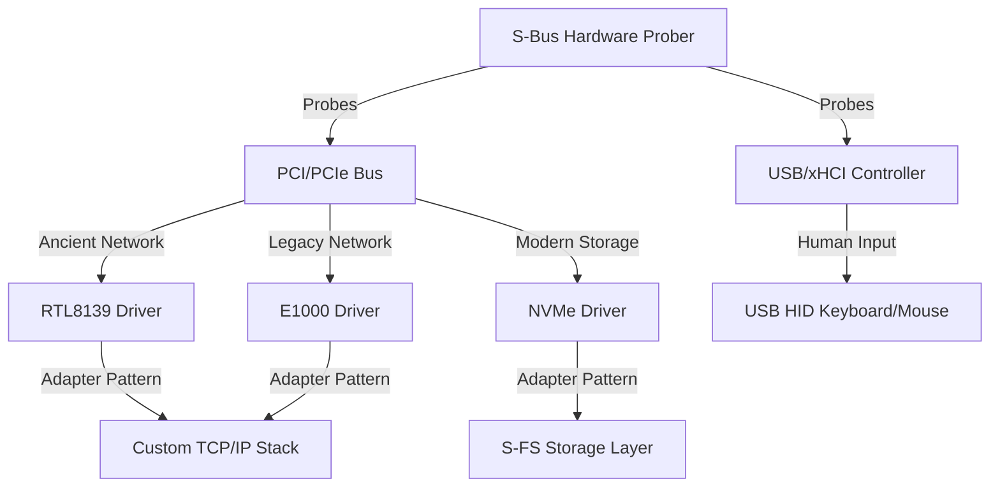
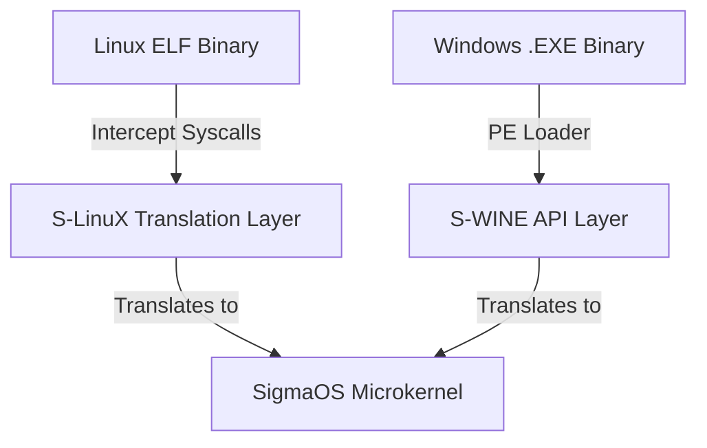

# 🗺️ SigmaOS Unified Future Development Roadmap & Universal Device Compatibility Strategy

This document outlines the unified strategic roadmap, multi-distro analysis, and architectural plans to ensure **SigmaOS** remains backwards-compatible with ancient hardware while fully integrating modern and future standards via a highly disciplined, OOP-based driver model and universal software/hardware compatibility layers.

---

## 1. ⚙️ Universal Device Compatibility Strategy: Ancient & Modern

SigmaOS must operate flawlessly on hardware from any era—ranging from retro 1990s ISA/PCI hardware to cutting-edge PCIe Gen 5 and modern USB-C/Thunderbolt specifications.

### 👴 Ancient Hardware Compatibility Layer (Backwards Compatibility)
*   **Networking (RTL8139 & Intel E1000)**: SigmaOS provides native drivers for the Realtek RTL8139 and Intel E1000 gigabit controllers. The network stack abstracts physical frames via standard ring buffers, allowing legacy network cards to interface seamlessly with modern protocols.
*   **Graphics (Legacy VESA Framebuffer)**: When modern UEFI/KMS/DRM drivers are unavailable, SigmaOS falls back on the legacy VESA BIOS Extensions (VBE) via `vesa::VesaDriver`. This ensures high-resolution desktop rendering even on 20-year-old graphics cards without accelerated GPU pipelines.
*   **Human Input (Legacy PS/2 & USB HID)**: Dual support for legacy PS/2 keyboards/mice and USB HID via our `UsbHidDriver` and `input::InputDriver`, providing unified event queues.
*   **Legacy Bus (PCI Probing)**: The kernel's HAL dynamically probes the legacy PCI bus, mapping device IDs to appropriate drivers using a universal hardware index.

### 🏎️ Modern Hardware Compatibility Layer (Future-Proofing)
*   **Storage (NVMe Storage Shard)**: Native NVMe 1.4 support bypassing legacy IDE/SATA bottlenecks. Uses asynchronous queue management, direct physical page mapping, and MSI-X interrupt routing.
*   **USB Controllers (xHCI)**: Advanced xHCI driver support for high-bandwidth USB 3.0/3.1/3.2, including root-hub routing and power management.
*   **Processors (APIC & Multi-Core SMP)**: Bypasses legacy PIC in favor of APIC/IOAPIC interrupt routing, backed by an EEVDF multiprocessor scheduler to balance loads dynamically across cores.

---

## 2. 🔌 Universal Driver Manager: Disciplined OOP Architecture

SigmaOS applies Object-Oriented Programming (OOP) principles not as a bloated abstraction layer, but as a strict structural discipline that enforces modularity, memory encapsulation, and dynamic scalability.

### 🔑 Core OOP Pillars in the Driver Manager
*   **Encapsulation**: Each driver operates as a self-contained object managing its own memory pool and internal hardware state. This guarantees zero cross-driver interference and makes memory footprint entirely predictable.
*   **Inheritance**: We establish strict inheritance hierarchies. An abstract base `DeviceDriver` defines the common lifecycle interfaces (`init()`, `shutdown()`). Derived category-specific abstract classes (`StorageDriver`, `NetworkDriver`, `GpuDriver`) provide category-specific contracts, which are then concretely implemented by specific drivers (e.g., `NVMeDriver`, `E1000Driver`). This cuts down code duplication dramatically.
*   **Polymorphism**: The microkernel core interacts with all drivers uniformly using polymorphic virtual tables. High-level subsystems invoke `read()` or `write()` without knowing whether they are calling a SATA, NVMe, or USB-mass-storage backend.
*   **Abstraction Layers**: Hardware-specific quirks and register-level operations are completely abstracted inside driver classes, keeping the microkernel core lightweight and hyper-focused.

### ⚡ Design Principles for a Lean Kernel Size
1.  **Microkernel-Inspired Modularity**: Keep the kernel core (scheduler, IPC, basic memory management) minimal. Drivers run as loadable modules in isolated userland pages.
2.  **Dynamic Loading**: Utilize an OOP-based driver registry. Drivers are loaded dynamically upon hardware detection and unloaded when idle to reclaim memory resources.
3.  **Low-Level Efficiency**: Avoid RTTI, exception handling, or massive nested inheritance chains. Virtual tables are statically laid out with minimal indirection to prevent any runtime performance overhead.

---

## 💻 3. Software Compatibility Layer: Universal Binary Execution

To compete directly with Windows and Linux, SigmaOS must execute third-party binaries natively, with zero VM emulation latency.

### 🪟 S-WINE: Windows Application Compatibility Engine
*   **Native PE Loader**: Instead of running a heavy virtual machine, SigmaOS integrates `S-WINE` (Sovereign Windows Integration & Native Execution). It parses the PE (Portable Executable) header, loads binary sections directly into isolated userland virtual address spaces, and resolves dynamic link libraries (DLLs) using clean-room reimplementations.
*   **API Translation Gate**: Intercepts classic Win32 API calls (e.g., `CreateFile`, `VirtualAlloc`, `SendMessage`) and maps them on-the-fly to secure, capability-checked SigmaOS microkernel syscalls and IPC events.

### 🐧 S-LinuX: Linux Application Compatibility Engine
*   **Syscall Translation Engine**: Leverages processor-level syscall interception. When a Linux ELF binary invokes `syscall` / `sys_enter`, the microkernel intercepts the Linux syscall number (e.g., `sys_mmap`, `sys_read`) and instantly routes it to our safe `S-LinuX` translation layer.
*   **`glibc` Emulation & ABI Alignment**: Implements a highly optimized, clean-room POSIX ABI translation layer, translating standard Linux behaviors to SigmaOS capability permissions (`sigma_pledge` / `sigma_unveil`).

---

## 🖨️ 4. Device and Peripheral Compatibility Layer: S-UDA

To ensure immediate compatibility with any hardware peripheral, printer, or customized controller in the market, SigmaOS establishes a universal compatibility wrapper layer.

### 🛡️ S-UDA: Sovereign Universal Driver Adapter
*   **Linux Driver Wrapper**: Provides an emulation layer for standard Linux kernel driver internal structures (e.g., `pci_driver`, `usb_driver`, `net_device`). It allows compiled Linux C/C++ driver binaries to be loaded into a secure, Ring 3 sandboxed environment in userland.
*   **Windows WDM/WDF Adapter**: Houses an asynchronous wrapper for Windows Driver Model (WDM) and Windows Driver Framework (WDF) entry points, executing peripheral drivers safely inside user-space pages.
*   **Sandbox Isolation**: By executing compatibility wrappers inside isolated Ring 3 spaces, buggy or unstable driver implementations are prevented from ever causing kernel panics. If an S-UDA driver crashes, the `SelfHealingModule` instantly restarts the adapter container without affecting other devices.

---

## 📦 5. Package Manager Absorption: Unifying the Ecosystem via `sigpkg`

Instead of creating another isolated packaging standard, SigmaOS's native `UniversalPackageManager` acts as a hyper-compatible packaging engine:

1.  **Native Containerization**: Packages from legacy formats (`Deb`, `Rpm`, `Pacman`, `Snap`, `Flatpak`) are parsed, sandboxed, and executed in secure application containers via `ContainerRuntime` and `CompatibilityManager`.
2.  **Asynchronous Translation Layers**: Standard POSIX applications compiled for Linux or Windows are translated in real-time using built-in translation runtimes with minimal performance overhead.
3.  **SAT-Solver Dependency Resolution**: The native `SatSolver` performs mathematically proven dependency resolution without dynamic heap allocations, ensuring that rollbacks are conflict-free.
4.  **Post-Quantum Verification**: Every package recipe in `RecipeManager` requires mandatory cryptographic sign-off using NIST-approved algorithms (`Kyber-1024` and `Dilithium-5`).

---

## 🏁 6. Step-by-Step Multi-Distro & Driver-Centric Parity Roadmap

The following stepwise milestones establish the concrete implementation roadmap for the SigmaOS kernel, software/hardware compatibility, and driver subsystems.

### Phase 1: Foundation Setup
*   [x] Define OOP base classes for device drivers (`DeviceDriver`, `StorageDriver`, `NetworkDriver`, `GpuDriver`).
*   [x] Enforce strict state encapsulation so each driver manages its own memory buffer limits.
*   [x] Establish standard `panic="abort"` with host-compatible test targets.

### Phase 2: Modular Driver Framework & Dynamic Registry
*   [x] Implement a centralized driver framework (`SimpleDriverFramework`) for registering, loading, and unloading drivers.
*   [ ] Implement runtime dynamic loader to load compiled driver modules on-demand upon PCI/USB device discovery.
*   [ ] Keep kernel core binary size minimal by compiling drivers as separate ELF/WASM shards.

### Phase 3: Linux/Windows Driver Compatibility & Priority Support (S-UDA)
*   [ ] Develop adapter wrappers to interface legacy/existing Linux and Windows WDM drivers with Sigma-native OOP driver APIs.
*   [ ] Implement secure Ring 3 sandboxing for compiled third-party drivers to execute safely.
*   [ ] Optimize high-priority drivers: modern GPUs (NVIDIA/AMD/Intel stubs), high-speed networking (Ethernet, WiFi), storage (NVMe), and standard USB HID peripherals.

### Phase 4: Software Compatibility Layers (S-WINE & S-LinuX)
*   [ ] Build the native PE loader and Win32 syscall translation maps for S-WINE.
*   [ ] Develop the POSIX/glibc ABI translation layer for S-LinuX.
*   [ ] Integrate touch input, graphics compositor, and audio hooks with the translation layers.

### Phase 5: Self-Hosting & Autonomy (Phase G Continuity)
*   [ ] Build a minimal, fast compilation and bootstrap environment inside SigmaOS for self-hosting compiler toolchains.
*   [ ] Automate build pipelines and regression testing in CI/CD.
*   [ ] Implement a kernel-level Recovery Mode that auto-heals or rolls back a failed/corrupted driver load.

### Phase 6: Advanced Security, Benchmarking, & Performance
*   [ ] Perform comprehensive feature benchmarks of the EEVDF scheduler, zero-copy IPC, and Buddy Allocator against monolithic Linux.
*   [ ] Implement sandboxed driver execution pages, ensuring third-party drivers run with restricted capability tokens (`CapabilityGate`).
*   [ ] Enforce post-quantum signed modules to prevent unauthorized module execution in Ring 1/Ring 2.

### Phase 7: India Stack & Localized Integration (Phase H Continuity)
*   [ ] Implement native, secure NPCI UPI capabilities as a secure IPC interface.
*   [ ] Integrate localized taxation (GST calculation daemon) and multi-language support (22 official languages rendered within VESA driver).
*   [ ] Establish verified post-quantum Aadhaar identity verification gates.

### Phase 8: Future-Proofing & AI-Native Orchestration (Phase J Continuity)
*   [ ] Deploy local LLM model weights as a core system optimization service (`AiOptimizer`).
*   [ ] Integrate predictive driver loading/unloading based on device usage patterns to minimize power consumption.
*   [ ] Design native quantum hooks and zero-trust IoT integration layers.
