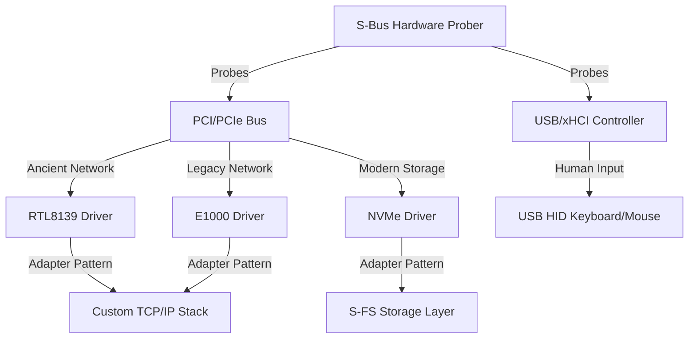
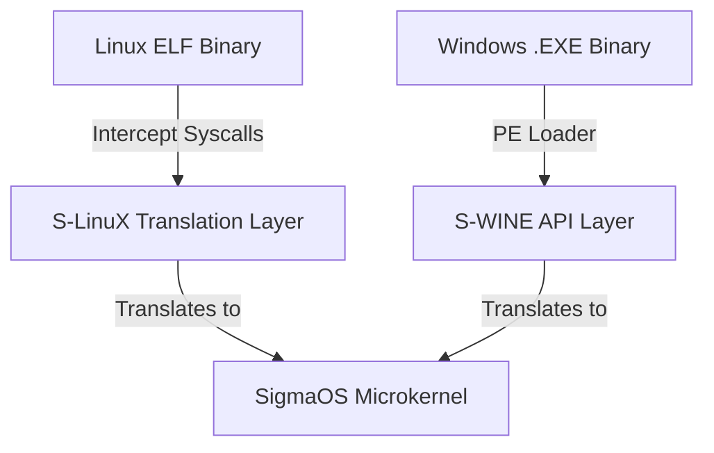

# 🗺️ SigmaOS Unified Future Development Roadmap & Universal Device Compatibility Strategy

This document outlines the unified strategic roadmap, branch consolidation plan, multi-distro analysis, and architectural plans to ensure **SigmaOS** remains backwards-compatible with ancient hardware while fully integrating modern and future standards via a highly disciplined, OOP-based driver model and universal software/hardware compatibility layers.

---

## 1. ⚙️ Universal Device Compatibility Strategy: Ancient & Modern

SigmaOS must operate flawlessly on hardware from any era—ranging from retro 1990s ISA/PCI hardware to cutting-edge PCIe Gen 5 and modern USB-C/Thunderbolt specifications.

### 👴 Ancient Hardware Compatibility Layer (Backwards Compatibility)
*   **Networking (RTL8139 & Intel E1000)**: SigmaOS provides native drivers for the Realtek RTL8139 and Intel E1000 gigabit controllers. The network stack abstracts physical frames via standard ring buffers, allowing legacy network cards to interface seamlessly with modern protocols.
*   **Graphics (Legacy VESA Framebuffer)**: When modern UEFI/KMS/DRM drivers are unavailable, SigmaOS falls back on the legacy VESA BIOS Extensions (VBE) via `vesa::VesaDriver`. This ensures high-resolution desktop rendering even on 20-year-old graphics cards without accelerated GPU pipelines.
*   **Human Input (Legacy PS/2 & USB HID)**: Dual support for legacy PS/2 keyboards/mice and USB HID via our `UsbHidDriver` and `input::InputDriver`, providing unified event queues.
*   **Legacy Bus (PCI Probing)**: The kernel's HAL dynamically probes the legacy PCI bus, mapping device IDs to appropriate drivers using a universal hardware index.

### 🏎️ Modern Hardware Compatibility Layer (Future-Proofing)
*   **Storage (NVMe Storage Shard)**: Native NVMe 1.4 support bypassing legacy IDE/SATA bottlenecks. Uses asynchronous queue management, direct physical page mapping, and MSI-X interrupt routing.
*   **USB Controllers (xHCI)**: Advanced xHCI driver support for high-bandwidth USB 3.0/3.1/3.2, including root-hub routing and power management.
*   **Processors (APIC & Multi-Core SMP)**: Bypasses legacy PIC in favor of APIC/IOAPIC interrupt routing, backed by an EEVDF multiprocessor scheduler to balance loads dynamically across cores.

---

## 2. 🔌 Universal Driver Manager: Disciplined OOP Architecture

SigmaOS applies Object-Oriented Programming (OOP) principles not as a bloated abstraction layer, but as a strict structural discipline that enforces modularity, memory encapsulation, and dynamic scalability.

### 🔑 Core OOP Pillars in the Driver Manager
*   **Encapsulation**: Each driver operates as a self-contained object managing its own memory pool and internal hardware state. This guarantees zero cross-driver interference and makes memory footprint entirely predictable.
*   **Inheritance**: We establish strict inheritance hierarchies. An abstract base `DeviceDriver` defines the common lifecycle interfaces (`init()`, `shutdown()`). Derived category-specific abstract classes (`StorageDriver`, `NetworkDriver`, `GpuDriver`) provide category-specific contracts, which are then concretely implemented by specific drivers (e.g., `NVMeDriver`, `E1000Driver`). This cuts down code duplication dramatically.
*   **Polymorphism**: The microkernel core interacts with all drivers uniformly using polymorphic virtual tables. High-level subsystems invoke `read()` or `write()` without knowing whether they are calling a SATA, NVMe, or USB-mass-storage backend.
*   **Abstraction Layers**: Hardware-specific quirks and register-level operations are completely abstracted inside driver classes, keeping the microkernel core lightweight and hyper-focused.

### ⚡ Design Principles for a Lean Kernel Size
1.  **Microkernel-Inspired Modularity**: Keep the kernel core (scheduler, IPC, basic memory management) minimal. Drivers run as loadable modules in isolated userland pages.
2.  **Dynamic Loading**: Utilize an OOP-based driver registry. Drivers are loaded dynamically upon hardware detection and unloaded when idle to reclaim memory resources.
3.  **Low-Level Efficiency**: Avoid RTTI, exception handling, or massive nested inheritance chains. Virtual tables are statically laid out with minimal indirection to prevent any runtime performance overhead.

---

## 💻 3. Software Compatibility Layer: Universal Binary Execution

To compete directly with Windows and Linux, SigmaOS must execute third-party binaries natively, with zero VM emulation latency.

### 🪟 S-WINE: Windows Application Compatibility Engine
*   **Native PE Loader**: Instead of running a heavy virtual machine, SigmaOS integrates `S-WINE` (Sovereign Windows Integration & Native Execution). It parses the PE (Portable Executable) header, loads binary sections directly into isolated userland virtual address spaces, and resolves dynamic link libraries (DLLs) using clean-room reimplementations.
*   **API Translation Gate**: Intercepts classic Win32 API calls (e.g., `CreateFile`, `VirtualAlloc`, `SendMessage`) and maps them on-the-fly to secure, capability-checked SigmaOS microkernel syscalls and IPC events.

### 🐧 S-LinuX: Linux Application Compatibility Engine
*   **Syscall Translation Engine**: Leverages processor-level syscall interception. When a Linux ELF binary invokes `syscall` / `sys_enter`, the microkernel intercepts the Linux syscall number (e.g., `sys_mmap`, `sys_read`) and instantly routes it to our safe `S-LinuX` translation layer.
*   **`glibc` Emulation & ABI Alignment**: Implements a highly optimized, clean-room POSIX ABI translation layer, translating standard Linux behaviors to SigmaOS capability permissions (`sigma_pledge` / `sigma_unveil`).

---

## 🖨️ 4. Device and Peripheral Compatibility Layer: S-UDA

To ensure immediate compatibility with any hardware peripheral, printer, or customized controller in the market, SigmaOS establishes a universal compatibility wrapper layer.

### 🛡️ S-UDA: Sovereign Universal Driver Adapter
*   **Linux Driver Wrapper**: Provides an emulation layer for standard Linux kernel driver internal structures (e.g., `pci_driver`, `usb_driver`, `net_device`). It allows compiled Linux C/C++ driver binaries to be loaded into a secure, Ring 3 sandboxed environment in userland.
*   **Windows WDM/WDF Adapter**: Houses an asynchronous wrapper for Windows Driver Model (WDM) and Windows Driver Framework (WDF) entry points, executing peripheral drivers safely inside user-space pages.
*   **Sandbox Isolation**: By executing compatibility wrappers inside isolated Ring 3 spaces, buggy or unstable driver implementations are prevented from ever causing kernel panics. If an S-UDA driver crashes, the `SelfHealingModule` instantly restarts the adapter container without affecting other devices.

---

## 🛠️ 5. Subsystem & Branch Consolidation Strategy

To bridge fragmented development tracks and compile a cohesive microkernel operating system, SigmaOS establishes a systematic branch consolidation and code-stabilization workflow. This replaces decentralized prototypes with a unified, high-integrity codebase.

### 👥 1. Subsystem Categorization & Audit
Branches are audited and aggregated into strict structural sub-projects to avoid redundant implementations or duplicate experiments:
*   **Kernel Core**: Scheduler, memory allocation, virtual memory, thread groups, IPC.
*   **Drivers**: Bus probing, PCI, USB, framebuffers, input arrays.
*   **Networking**: TCP/UDP stacks, ethernet cards, routing tables, loopbacks.
*   **Filesystems**: Virtual Filesystem (VFS), Ext4 wrappers, native SigmaFS formats.
*   **Virtualization**: Container engines, VM managers, WASM emulators.
*   **Security**: Capability gates, post-quantum verification blocks, pledge managers.
*   **Performance**: Telemetry aggregators, CPU/GPU profiling scripts.
*   **Documentation**: Subsystem guides, roadmap tables, sync rules.

### 🚀 2. Subsystem Stabilization & Integration Flow
To guarantee stability, code is consolidated into the core branches following a stepwise integration pattern:
1.  **Stabilize the Kernel Core**: Merge the EEVDF scheduler, Buddy Allocator, and safe IPC bus. Add NUMA-aware physical memory mappings and hugepage mappings. Ensure the predictive scheduler is rock-solid under high thread loads before adding advanced user-space routines.
2.  **Unify Driver Registries**: Integrate driver prototypes into the central dynamic `SimpleDriverFramework`. Deploy plug-and-play event triggers to instantiate drivers instantly upon peripheral detection. Sandbox legacy C drivers inside userland Ring 3 pages to guarantee system-wide crash-resistance.
3.  **Asymmetric Networking Expansion**: Consolidate network queues into the core TCP/IP stack. Add robust support for IPv6 routing, WiFi hardware interfaces, and secure container routing layers.
4.  **Filesystem Integration & Snapshots**: Consolidate local disk wrappers (Ext4/FAT32) and map them alongside the core VFS. Develop secure directory snapshots and transaction-level rollbacks within the VFS block manager.
5.  **Virtualization Shards (SigmaContainers)**: Merge WASM execution runtimes into a unified `SigmaContainers` manager. Interface KVM/QEMU stubs with the core hypervisor gates to enable full micro-VM sandboxing for untrusted device drivers.
6.  **Sovereign Post-Quantum Security**: Harden all cryptographic structures with NIST-approved `Kyber-1024` and `Dilithium-5` checks. Integrate mandatory driver and package signing pipelines, and output standard compliance metrics (ISO, GDPR, HIPAA) directly to the system monitoring dashboards.
7.  **Performance Profiling**: Optimize NUMA scheduling queues and GPU-CPU co-scheduling boundaries, establishing a hyper-tuned environment suitable for high-performance computing (HPC) and low-energy handheld architectures.

---

## 📦 6. Package Manager Absorption: Unifying the Ecosystem via `sigpkg`

Instead of creating another isolated packaging standard, SigmaOS's native `UniversalPackageManager` acts as a hyper-compatible packaging engine:

1.  **Native Containerization**: Packages from legacy formats (`Deb`, `Rpm`, `Pacman`, `Snap`, `Flatpak`) are parsed, sandboxed, and executed in secure application containers via `ContainerRuntime` and `CompatibilityManager`.
2.  **Asynchronous Translation Layers**: Standard POSIX applications compiled for Linux or Windows are translated in real-time using built-in translation runtimes with minimal performance overhead.
3.  **SAT-Solver Dependency Resolution**: The native `SatSolver` performs mathematically proven dependency resolution without dynamic heap allocations, ensuring that rollbacks are conflict-free.
4.  **Post-Quantum Verification**: Every package recipe in `RecipeManager` requires mandatory cryptographic sign-off using NIST-approved algorithms (`Kyber-1024` and `Dilithium-5`).

---

## 🏁 7. Multi-Phase Distro & Compatibility Parity Roadmap

The following stepwise milestones establish the concrete implementation roadmap for the SigmaOS kernel, software/hardware compatibility, and driver subsystems.

| Phase | Milestone / Focus | Deliverables & Absorption Target |
| :--- | :--- | :--- |
| **Short-Term**  *(0–6 months)* | **Subsystem Consolidation & Networking** | - Merge scheduler, memory allocator, and core IPC into the `main-dev` branch. - Consolidate the dynamic driver registry. - Stabilize the TCP/IP stack with E1000/RTL8139 adapters. - Launch `sigpkg` with basic `.deb`/`.rpm` adapters. |
| **Mid-Term**  *(6–18 months)* | **Driver Expansion & Containers** | - Expand GPU (Intel, AMD, NVIDIA stubs) and WiFi driver support. - Deploy the `SigmaContainers` WASM container engine and KVM hypervisor micro-VMs. - Implement VFS snapshotting and atomic transaction-level rollbacks. |
| **Long-Term**  *(18–36 months)* | **Application & OS Compatibility** | - Deploy `S-WINE` PE loading and API translation for native Windows software execution. - Deploy `S-LinuX` syscall translation and POSIX ABI emulation. - Build out the full Zenith desktop shell. - Integrate secure compliance dashboards (GDPR, HIPAA). |
| **Future**  *(36+ months)* | **AI-Native & Sovereign Dominance** | - Deploy AI-driven driver optimization and scheduling (`AiOptimizer`). - Integrate hardware quantum hooks and secure edge IoT adapters. - Establish hardware-vendor partnerships and massive enterprise deployment footprints. |

---

## ⚡ Immediate Actionable Next Actions

1.  **Create the `main-dev` Branch**: Establish a unified development branch to merge isolated, stable subsystem commits incrementally.
2.  **Prioritize GPU & WiFi Drivers**: Harden display compositing (Zenith, direct-drawing) and wireless network layers to ensure daily-driver compatibility.
3.  **Launch the `sigpkg` Packaging Adapters**: Deploy initial `.deb`/`.rpm` translation adapters to ensure access to established software repositories from day one.
4.  **Establish Robust CI/CD Pipelines**: Enforce automated cargo testing and static analysis via GitHub Actions to maintain absolute workspace and compilation integrity across all merges.
