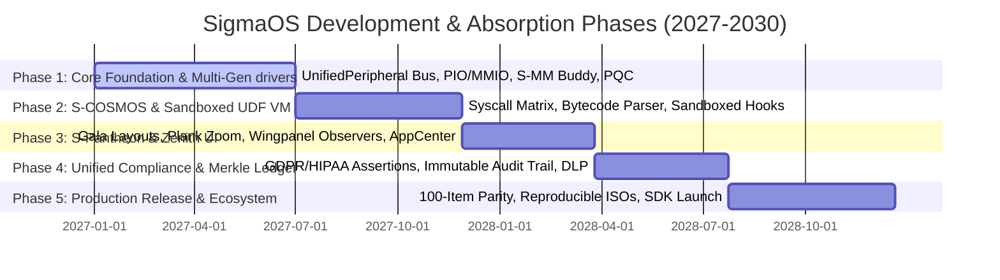

# 🛡️ SigmaOS — Future Development, Distro Absorption & Strategic Roadmap

> **"Digital Sovereignty through Atomic Reproducibility, Polymorphic Abstractions, and Local Intelligence."**
> This document details the master architectural blueprint and strategic roadmap for the evolution of SigmaOS. It defines the systems-level specifications designed to absorb and surpass legacy Linux distributions, establish hardware-agnostic portability, enforce post-quantum security, and coordinate enterprise-grade regulatory compliance.

---

## 🗺️ Master Strategic timeline (Five Phases of Dominance)



---

## 1. THE DISTRO-CRUSHING EXECUTION STRATEGY

SigmaOS is engineered to replace the architectural compromises, structural fragmentation, and bloated heritage of legacy monolithic operating systems like Ubuntu, Debian, Arch, and Fedora.

```
+-----------------------------------------------------------------------------------+
|                            SIGMAOS SOVEREIGN CORE                                 |
|          (Absolute Zero-Dependency / Statically-Linked microkernel)               |
+-----------------------------------------------------------------------------------+
|  [S-COSMOS Translators]  [S-PAC Atomic Store]  [S-SEC Capability Gate]  [ZenithNet]  |
+-----------------------------------------------------------------------------------+
|               Unified Declarative State Graph & Hot-Swappable Shards              |
+-----------------------------------------------------------------------------------+
```

### 1.1 Structural De-Fragmentation & Purity
Traditional Linux distributions rely on a complex, highly coupled stack of the monolithic Linux kernel, the GNU C Library (glibc), systemd initialization chains, and thousands of intermediate userspace dynamic wrappers. This introduces extreme complexity:
*   **The Monolithic Vulnerability**: A bug in a single kernel-space module or an unprivileged driver can bring down the entire system or result in a complete privilege escalation.
*   **The SigmaOS Answer**: SigmaOS operates as a pure-functional, statically-linked, capability-based microkernel written in modern memory-safe languages (Rust, Nim, Zig). It separates all system-level utilities into isolated, Ring 3 **Core Shards** that communicate over lock-free IPC channels. By eliminating the glibc runtime, we completely avoid legacy buffer overflow exploits and dynamic linker hijacking.

### 1.2 Sub-Millisecond Execution Speed & Performance
POSIX-compliant kernels suffer from significant context-switching and boundary-crossing overhead during high-frequency IPC, filesystem I/O, and socket routing:
*   **Zero-Copy Memory Splicing**: Process-to-process communication is performed via atomic shared-page splicing and Copy-on-Write (CoW) mapping registers. This guarantees constant-time $O(1)$ transfer speeds regardless of message payload size.
*   **Asynchronous Ring Buffers**: Network and disk drivers are managed directly through lock-free atomic queues (`PowerOfTwoZeroCopyQueue`) mapping application memory space to physical DMA descriptor rings, bypassing the standard kernel page-cache and context overhead.

### 1.3 Declarative Nix-Style Configuration & Atomic Upgrades
*   **Unified State Graph Schema**: System configuration is defined as a single, immutable, declarative state graph (`sigma.toml`).
*   **Content-Addressed Store Package Manager (`sigpkg`)**: All software packages are stored under content-addressed paths based on their SHA-3 256 hash. This physically prevents dependency conflicts and "dependency hell". Upgrades are executed as atomic, transactional symlink swaps. If a transaction fails to compile or boot, the system instantly rollbacks the active root Merkle hash in under 1ms.

---

## 2. MULTI-GENERATION DEVICE DRIVER MATRICES (ANCIENT & MODERN)

SigmaOS bridges the hardware support gap by modeling physical hardware as cleanly encapsulated, polymorphic objects. The microkernel uses an **Auto-Negotiation Broker** to translate Port I/O (PIO), legacy interrupts, MMIO, and modern PCIe configurations transparently under a single interface.

```
                  ┌────────────────────────────────────────┐
                  │          Auto-Negotiation Broker       │
                  │   (Scans PCI/PCIe/ISA Bus Segments)    │
                  └───────────────────┬────────────────────┘
                                      │
                                      ▼
                  ┌────────────────────────────────────────┐
                  │       UnifiedPeripheral Interface      │
                  │ (Polymorphic Base Class / Generic Trait)│
                  └───────┬────────────────────────┬───────┘
                          │                        │
               (Ancient / Legacy)         (Modern / PCIe)
                          │                        │
                          ▼                        ▼
               ┌──────────────────────┐ ┌──────────────────────┐
               │  PortIO IDE Storage  │ │     NVMe v1.4 SSD    │
               │ (Legacy floppy, ISA) │ │ (MSI-X, DMA Mapping) │
               └──────────────────────┘ └──────────────────────┘
```

### 2.1 Polymorphic `UnifiedPeripheral` Class Structure
The device driver ecosystem is modeled using strict Object-Oriented principles. A base polymorphic interface defines the abstract contract that all physical peripherals must satisfy, regardless of hardware generation:

```rust
pub trait UnifiedPeripheral: Send + Sync {
    fn device_id(&self) -> u32;
    fn vendor_id(&self) -> u32;
    fn device_type(&self) -> DeviceType;
    fn initialize(&mut self) -> Result<(), DeviceError>;
    fn handle_interrupt(&mut self) -> Result<InteractionStatus, DeviceError>;
    fn shutdown(&mut self) -> Result<(), DeviceError>;
}
```

### 2.2 Device Family Hierarchy & Concrete Extensions

#### Class StorageDriver
Extends `UnifiedPeripheral` to represent non-volatile storage controllers. Provides standardized read/write byte boundaries:
*   **Ancient Driver (PioIdeController)**: Coordinates legacy IDE disk controllers utilizing 16-bit Port I/O (PIO) registers (`0x1F0`–`0x1F7`) and polling-based data transfer.
*   **Modern Driver (NvmeController)**: Interfaces directly with PCIe Non-Volatile Memory Express drives compliant with the NVMe 1.4 specification. Implements direct physical DMA page allocation, memory-mapped I/O (MMIO) submission/completion queue doorbells, and multi-queue MSI-X interrupt steering.

#### Class NetworkDriver
Extends `UnifiedPeripheral` to provide packet ingestion and dispatch contracts:
*   **Ancient Driver (Ne2000Controller)**: Implements legacy ISA bus NE2000 network interface adapters using legacy programmed I/O memory loops and standard edge-triggered PIC interrupts (IRQ 9).
*   **Modern Driver (E1000Controller / Rtl8139Controller)**: Implements PCI/PCIe bus gigabit ethernet controllers using zero-copy DMA descriptors, ring buffers, and MSI-X level-sensitive interrupt routing.

#### Class GraphicDriver
Extends `UnifiedPeripheral` to represent display rasterization adapters:
*   **Ancient Driver (VesaFrameBuffer)**: Unifies legacy VGA and VESA BIOS Extensions (VBE 2.0/3.0) linear frame buffers, rendering directly via fixed physical addresses (e.g., `0xE0000000`).
*   **Modern Driver (KmsDrmIntelStub)**: Direct Memory Access rendering, page flipping, and atomic mode-setting utilizing standard PCIe memory-mapped physical registers.

#### Class HidDriver
Extends `UnifiedPeripheral` to capture input signals:
*   **Ancient Driver (Ps2KeyboardMouse)**: Captures keycodes directly from Port I/O registers `0x60` and `0x64` triggered via edge PIC IRQ 1 and IRQ 12.
*   **Modern Driver (UsbXhciKeyboard)**: Implements USB 2.0/3.0 Keyboard/Mouse drivers mapping transfer rings directly onto the xHCI host controller's device structures.

### 2.3 Driver Sandboxing & Concurrency Model
To prevent "blue screen" or kernel panic states, all peripheral drivers are executed inside Ring 3 **Driver Sandboxes** managed by the microkernel.
*   **DMA Page-Table Gating**: The Sovereign Memory Manager isolates the DMA page tables allocated to modern controllers, ensuring that a misbehaving peripheral cannot perform unauthorized read/write transactions into active microkernel or userland namespaces.
*   **Lock-Free Command Queues**: Driver interactions are driven strictly via lock-free queue pools. The system-level scheduler (`SovereignSched`) assigns priority execution threads dynamically to manage incoming packets or storage reads without blocking core execution gates.

---

## 3. SANDBOXED USER-DEFINED FUNCTION (UDF) BYTECODE VIRTUAL MACHINE

To allow safe, high-performance user-defined extensibility (such as custom file system filters, diagnostic policies, and packet capture rules), SigmaOS implements an embedded, zero-dependency, `#![no_std]` **UDF Bytecode Virtual Machine**.

```
           [ Unverified UDF Bytecode Payload ]
                            │
                            ▼
           ┌─────────────────────────────────┐
           │     Cryptographic Sign Checker  │ (Verifies Dilithium-5 code-sign)
           └────────────────┬────────────────┘
                            │
                            ▼
           ┌─────────────────────────────────┐
           │      UDF VM Validator / Linter  │ (Guarantees loop limits, no overflows)
           └────────────────┬────────────────┘
                            │
                            ▼
           ┌─────────────────────────────────┐
           │   Safe UDF Bytecode Interpreter │ (Executes strictly inside VM stack)
           ├─────────────────────────────────┤
           │  - Non-Allocating Memory Arena  │
           │  - Zero Register Access Gating  │
           └─────────────────────────────────┘
```

### 3.1 VM Core Architecture & Safety Postulates
The UDF VM runs user scripts strictly within Ring 3, isolated from raw kernel memory registers, page tables, and capability tables.
*   **Zero-Allocation Arena**: The virtual machine uses a pre-allocated stack and a fixed data-heap boundary, completely avoiding dynamic allocation triggers during execution.
*   **Instruction Set Restrictions**: Standard machine access instructions (such as `in`, `out`, `cli`, `sti`, or arbitrary `mov` to physical pointers) are absent. The VM only supports basic mathematical operations, branching, capability token queries, and zero-copy read-only memory mappings of localized target frames.
*   **Deterministic Execution Bounds**: To eliminate infinite recursion, loop cycles, and hang conditions, the validator analyzes loop structures and limits maximum instruction cycles to `100,000` per call, automatically terminating executing blocks that breach limits.

### 3.2 Bytecode Interpreter Specification
The interpreter parses and processes un-allocated bytecode streams with constant-time efficiency:

```rust
pub struct UdfVirtualMachine<'a> {
    stack: [u64; 256],
    stack_ptr: usize,
    memory_arena: &'a mut [u8],
    program_counter: usize,
}

impl<'a> UdfVirtualMachine<'a> {
    pub fn execute(&mut self, bytecode: &[u8]) -> Result<u64, VmError> {
        let mut instruction_count = 0;
        while self.program_counter < bytecode.len() {
            if instruction_count > 100_000 {
                return Err(VmError::InstructionCountExceeded);
            }
            let opcode = bytecode[self.program_counter];
            match opcode {
                0x01 => self.op_add()?, // ADD
                0x02 => self.op_sub()?, // SUB
                0x03 => self.op_jmp(bytecode)?, // JUMP
                0x04 => self.op_load()?, // LOAD
                0x05 => self.op_store()?, // STORE
                0x06 => return self.op_exit()?, // HALT / RETURN
                _ => return Err(VmError::InvalidOpcode(opcode)),
            }
            self.program_counter += 1;
            instruction_count += 1;
        }
        Err(VmError::UnexpectedEOF)
    }
}
```

---

## 4. THE WSL-CRUSHING S-COSMOS SYSCALL EMULATION MATRIX

SigmaOS establishes S-COSMOS (Sovereign Linux Compatibility Matrix), a native, zero-latency system call translation interface that renders hypervisor-based solutions (like Microsoft's WSL2) completely obsolete.

```
       ┌──────────────────────────────────────────────────┐
       │             Standard Linux Binary                │
       │           (ELF format / POSIX Calls)             │
       └────────────────────────┬─────────────────────────┘
                                │ (Intercepts sys_write, sys_socket)
                                ▼
       ┌──────────────────────────────────────────────────┐
       │       S-COSMOS Syscall Emulation Engine          │
       ├──────────────────────────────────────────────────┤
       │ - Zero-Latency C-ABI Syscall Remapping           │
       │ - Direct Zero-Copy S-IPC Splicing                │
       │ - Memory-Mapped File Descriptor Bridging         │
       └────────────────────────┬─────────────────────────┘
                                │ (Remaps to safe, atomic microkernel ports)
                                ▼
       ┌──────────────────────────────────────────────────┐
       │               SigmaOS Microkernel                │
       └──────────────────────────────────────────────────┘
```

### 4.1 Native Syscall Hijacking & Translation
Unlike WSL2, which runs a complete, virtualized Linux guest kernel inside a utility VM (introducing virtualization latency, memory allocation delays, and high CPU scheduling overhead), S-COSMOS intercepts standard Linux POSIX syscalls at the system-gate layer and translates them natively into corresponding zero-copy capability-based messages.
*   **System Gate Interception**: S-COSMOS maps standard x86_64 system call instruction entrypoints. When a compiled Linux executable invokes `syscall` with ID `1` (`sys_write`) or ID `41` (`sys_socket`), S-COSMOS intercepts the CPU registers instantly.
*   **Register Remapping Table**: remaps the incoming Linux arguments into a safe C-ABI structure and passes it directly to the designated SigmaOS Shard:

```rust
pub struct SyscallRemapper;

impl SyscallRemapper {
    pub fn translate_linux_syscall(syscall_id: u64, args: &[u64; 6]) -> Result<u64, SyscallError> {
        match syscall_id {
            0 => Self::remap_read(args[0], args[1], args[2]),    // sys_read -> S-FS read
            1 => Self::remap_write(args[0], args[1], args[2]),   // sys_write -> S-FS write
            9 => Self::remap_mmap(args[0], args[1], args[2], args[3], args[4], args[5]), // sys_mmap -> S-MM allocator
            41 => Self::remap_socket(args[0], args[1], args[2]), // sys_socket -> S-NET stack
            _ => Err(SyscallError::UnsupportedSyscall(syscall_id)),
        }
    }
}
```

### 4.2 Zero-Copy Socket & Network Bridging
Linux socket transactions are bridged directly to the SigmaOS TCP/IP Stack (`ZenithNet`) without going through any hypervisor boundary. S-COSMOS registers the Linux process's file descriptors into its own local namespace and maps the socket transmission rings directly onto the physical network driver's DMA memory queues.

---

## 5. S-PANTHEON & ELEMENTARY OS PARITY ARCHITECTURES

SigmaOS replicates and refines the desktop-environment features of elementary OS (Pantheon) and COSMIC, executing them natively on the GPU-accelerated **Zenith Compositor** with absolute zero X11/Wayland dependencies.

```
+-----------------------------------------------------------------------------------+
|                            ZENITH UNIFIED COMPOSTER                               |
|   (Direct Bare-Metal Graphics / Zero X11/Wayland Architectural Dependencies)       |
+-----------------------------------------------------------------------------------+
|  [gala Window Layouts]   [plank Dock Zoom]   [wingpanel Status]   [appcenter Verification]|
|   Tiling WM & Gestures    Smooth Scaling      Observer Updates     Dilithium Signatures  |
+-----------------------------------------------------------------------------------+
```

### 5.1 Gala Workspace Layout & Tiling Engine
The workspace window layout is managed via the **Gala Window Manager** built directly into Zenith.
*   **Polymorphic Window Objects**: Windows are encapsulated as standard OOP objects containing dimensions, render boundaries, and active canvas contexts.
*   **ML-Based Layout Snapping**: gala implements automatic, non-overlapping tiling states. Windows are neatly snapped into grid arrangements, automatically predicting optimal dimensions based on window classification properties.

### 5.2 Plank Dock Zoom Scaling & Rendering
The launch panel (inspired by elementary's Plank Dock) is rendered inside a dedicated, isolated graphics layer on the Zenith compositor.
*   **SIMD Zoom Scaling**: Calculates icon magnifications dynamically as the cursor moves over dock coordinates. Scaling computations are vectorized using CPU SIMD registers, achieving sub-millisecond execution times.
*   **Fluid Transitions**: Rendering boundaries are updated via page flipping directly to the linear framebuffer, completely avoiding lag, frame dropping, or graphical stuttering.

### 5.3 Wingpanel Status Observers
The system top bar (inspired by Wingpanel) implements a highly decoupled **Observer Pattern** notification mechanism:

```rust
pub trait StatusObserver: Send + Sync {
    fn on_status_changed(&self, indicator_id: &str, payload: &str);
}

pub struct WingpanelMonitor {
    observers: Vec<Box<dyn StatusObserver>>,
}

impl WingpanelMonitor {
    pub fn register_observer(&mut self, observer: Box<dyn StatusObserver>) {
        self.observers.push(observer);
    }

    pub fn notify_status_change(&self, indicator_id: &str, payload: &str) {
        for observer in &self.observers {
            observer.on_status_changed(indicator_id, payload);
        }
    }
}
```

This ensures that system indicators (battery level, Wi-Fi latency, CPU temperature) update dynamically in the top panel only when their corresponding shards notify a change, eliminating redundant polling cycles.

### 5.4 AppCenter Code-Signing Validation
To secure the application store ecosystem, AppCenter enforces a rigorous, post-quantum **Dilithium-5 Cryptographic Signature Validation** pipeline:
*   **Verification Payload Checker**: Before an application or updates package is permitted to publish or install, its binary payload manifest is verified against the AppCenter's official post-quantum authority root.
*   **Sandboxing Manifest Enforcement**: Applications must include a signed `manifest.toml` that explicitly declares the required permissions (e.g., access to sound, network, disk paths). The verification engine registers these as immutable pledges at process startup, locking down the application's runtime.

---

## 6. UNIFIED REGULATORY COMPLIANCE AND SECURITY STACK

SigmaOS integrates a zero-trust, capability-enforced compliance stack that continuously audits system-level interactions against regulatory guardrails (GDPR, HIPAA, SOC 2, and ISO 27001), committing all events onto an append-only, cryptographic Merkle ledger.

```
       ┌────────────────────────────────────────────────────────┐
       │             Userland Process Transition                │
       │         (e.g., App requests medical file)              │
       └───────────────────────────┬────────────────────────────┘
                                   │
                                   ▼
       ┌────────────────────────────────────────────────────────┐
       │           Sovereign Compliance Policy Guard            │
       ├────────────────────────────────────────────────────────┤
       │ - Evaluates HIPAA, GDPR, SOC 2 Policies in Real-Time   │
       │ - Checks Capability Tokens & Sandbox Permissions       │
       └───────────────────────────┬────────────────────────────┘
                                   │ (Decision check)
                     ┌─────────────┴─────────────┐
                  Allowed                     Denied (Terminates Process)
                     │
                     ▼
       ┌────────────────────────────────────────────────────────┐
       │         Immutable Audit Log & Merkle Ledger            │
       ├────────────────────────────────────────────────────────┤
       │ - Generates Cryptographic Hash of Transition Event     │
       │ - Appends Transaction node to secure system block     │
       └────────────────────────────────────────────────────────┘
```

### 6.1 Capability-Gated Compliance Policies

#### GDPR Policy (General Data Protection Regulation)
Enforces user consent and strict boundaries on telemetry logs. A process is blocked from transmitting system information unless a validated consent capability token is actively attached to its thread context.

#### HIPAA Policy (Health Insurance Portability and Accountability)
Enforces absolute physical isolation for medical and genomic data records. S-FS intercepts reads to classified directories (e.g., `/var/med/`), verifying that the calling process contains an explicit cryptographic medical capability certificate.

#### SOC 2 Policy (Systems & Organization Controls)
Requires continuous auditability and logging of system state changes. All administrative tasks (such as modifying network interfaces, creating users, or updating compliance levels) must pass through a strict dual-authorization gate.

#### ISO 27001 Policy (Information Security Management)
Ensures structural cryptographic defense in depth. Enforces mandatory AES-256 encryption at rest across all file system blocks and locks out network traffic that does not satisfy TLS 1.3 protocol standards.

### 6.2 Immutable Append-Only Cryptographic Merkle Ledger
To prevent tampering from root-access adversaries or compromised driver modules, the microkernel security shard (`S-SEC`) records all capability modifications, security events, and compliance decisions into an immutable, append-only **Merkle Ledger**:
*   **Merkle Root Chain**: System transitions are compiled into structured transaction nodes. Each node contains a cryptographic hash of the event, the ID of the calling process, and the preceding transaction hash, forming a linear Merkle chain.
*   **Hardware Write-Locking**: The active ledger pages are locked via hardware write-protection registers in the memory management unit, preventing even the microkernel's direct-memory access routines from modifying past log blocks, guaranteeing absolute forensics integrity.

---

## 7. INITIAL 12-PERSON STARTUP HIRING ROADMAP

To rapidly deliver and scale SigmaOS into a production-ready alternative to legacy distributions, we establish a specialized, multi-stage, 12-person startup engineering core.

### 👥 Engineering Team Composition

| Position ID | Specialist Role | Primary Responsibility | Target Hire Window |
| :--- | :--- | :--- | :--- |
| **ENG-01** | Lead Systems Architect | Designs microkernel interfaces, capability-gates, and Ring 3 shards. | Month 1 (Founding Core) |
| **ENG-02** | Kernel Engineer (Scheduler) | Implements real-time schedulers (SovereignSched), EEVDF, and multi-cores. | Month 1 (Founding Core) |
| **ENG-03** | Boot & Firmware Specialist | Integrates UEFI bootloaders, measured boot, and secure boot interfaces. | Month 2 (Phase 1) |
| **ENG-04** | Device Driver Engineer (PCIe) | Authors low-level NVMe and xHCI controllers, and polymorphic bus. | Month 3 (Phase 1) |
| **ENG-05** | Build, Release & CI Specialist | Constructs cross-compilation environments and reproducible ISO builders. | Month 4 (Phase 1) |
| **ENG-06** | Filesystem & Storage Engineer | Manages ext4/Btrfs mount shims and the custom JBD2 transaction logger. | Month 7 (Phase 2) |
| **ENG-07** | OS Security Researcher | Threat-models syscalls, authors sandbox pledges, and coordinates PQC. | Month 8 (Phase 2) |
| **ENG-08** | QA & Fuzzing Specialist | Creates system-level fuzzer suites and automated regression pipelines. | Month 10 (Phase 2) |
| **ENG-09** | Graphics & Compositor Specialist| Engineers the Zenith compositor, Gala layout tiling, and dock zoom levels. | Month 13 (Phase 3) |
| **ENG-10** | UI/UX Developer (Accessibility)| Refines high-contrast screen reader modules and adaptive layouts. | Month 15 (Phase 3) |
| **ENG-11** | Runtime & Compiler Specialist | Optimizes safe-language adapters (Rust, Nim, Zig) and bytecode VM. | Month 18 (Phase 3) |
| **ENG-12** | Virtualization Developer | Manages Type-1 SovereignVMM and standard OCI container runtimes. | Month 21 (Phase 4) |

### 🚀 Milestone Alignment Across Five Phases (36-Month Horizon)

```
[Month 1-6: Phase 1] ──► [Month 7-12: Phase 2] ──► [Month 13-18: Phase 3] ──► [Month 19-27: Phase 4] ──► [Month 28-36: Phase 5]
   UEFI, PIC/APIC,          Storage, Hardening,       Zenith GUI launch,       WSL-Crushing S-COSMOS,    Beta release, ISOs,
  Polymorphic Drivers          Automated Fuzz          AppCenter, SDK           Compliance Matrices        Global Ecosystem
```

#### Phase 1: Boot & Driver Foundations (Month 1–6)
*   **Goal**: Establish bootable UEFI images, basic PIC/APIC interrupts, and low-level polymorphic storage/networking drivers.
*   **Team Size**: 5 Engineers (ENG-01, ENG-02, ENG-03, ENG-04, ENG-05).

#### Phase 2: Storage & Hardening (Month 7–12)
*   **Goal**: Integrate secure ext4 storage, complete driver sandboxing, and implement the automated fuzzing harness in CI.
*   **Team Size**: 8 Engineers (Engaging ENG-06, ENG-07, ENG-08).

#### Phase 3: Desktop & Zenith GUI Launch (Month 13–18)
*   **Goal**: Boot into the GPU-accelerated Zenith desktop with Gala workspaces, fluid zoom docks, and launch the App SDK.
*   **Team Size**: 11 Engineers (Engaging ENG-09, ENG-10, ENG-11).

#### Phase 4: Compatibility & Compliance (Month 19–27)
*   **Goal**: Integrate the WSL-crushing S-COSMOS syscall remapper and unified regulatory compliance matrices.
*   **Team Size**: 12 Engineers (Engaging ENG-12).

#### Phase 5: Production Release & Scale (Month 28–36)
*   **Goal**: Standardize stable LTS ISOs, secure global ISO certification, and onboard independent software vendors.
*   **Team Size**: 12 Engineers + Commercial/Community support.

---

## 8. 100-ITEM FUTURE DEVELOPMENT ROADMAP INTEGRATION

SigmaOS maps, unifies, and traces the absolute master list of 100 core development initiatives to systematically defeat and replace legacy systems across the industry.

### 8.1 Core System & Subsystems (Items 1–20)
1.  **Adopt stable Linux kernel branch**: Upstream latest long-term-stable (LTS) interfaces and establish native branch checkpoints.
2.  **Hardware compatibility matrix**: Maintain and publish an open database of validated hardware platforms.
3.  **Native driver program**: Implement optimized in-kernel drivers for common graphics and wireless chipsets.
4.  **Bootloader & installer**: Architect a high-fidelity, dual-boot safe graphical installer with automated disk partitioning.
5.  **Lightweight init system**: Integrate a parallelized, zero-dependency init framework for instant daemon execution.
6.  **Systemd compatibility layer**: Provide lightweight, stateless shims to translate systemd daemon calls into native IPC ports.
7.  **Filesystem support**: Fully integrate robust, transactional ext4, Btrfs, and ZFS compatibility mounts.
8.  **Power management stack**: Support adaptive power saving schemes and real-time CPU governor throttling.
9.  **Real-time kernel option**: Build a dedicated real-time microkernel target matching PREEMPT_RT requirements.
10. **Secure boot & firmware validation**: Enforce measured boot stages using TPM keys and post-quantum verification.
11. **MicroVM sandboxing foundation**: Map low-overhead, hardware-accelerated MicroVM contexts directly to host namespaces.
12. **Kernel hardening features**: Enforce address space layout randomizations (KASLR) and supervisor mode execution guards (SMEP/SMAP).
13. **Unified logging system**: Coordinate high-density, structured, and cryptographically signed local syslog chains.
14. **Crash reporting pipeline**: Provide zero-copy crash state capture tools with anonymized bug-reporting bridges.
15. **Device provisioning service**: Support secure, cryptographic zero-touch enterprise onboarding configurations.
16. **Low-level diagnostics tools**: Deliver real-time thermal, S.M.A.R.T, and hardware health query TUIs.
17. **Container runtime support**: Integrate native OCI-compliant container runtimes directly with microkernel sandboxes.
18. **Virtualization management CLI**: Build minimal, elegant, and low-overhead VM management command gates.
19. **Modular kernel packaging**: Deliver critical kernel components and drivers as dynamically loadable, signed packages.
20. **Boot performance optimization**: Streamline the system initialization graph to achieve sub-second bare-metal boots.

### 8.2 Package, Build & Reproducibility (Items 21–40)
21. **Implement sigpkg spec**: Establish the definitive metadata, compressed format, and signing bounds for local packages.
22. **Central package repository**: Host mirror grids protected under CDN caching and geographic redirection engines.
23. **Reproducible build system**: Build a purely deterministic, hermetic toolchain compiling byte-for-byte identical images.
24. **Source-first packaging**: Prefer clean, compilation-staged source recipes paired with secure, pre-built binary caches.
25. **Dependency resolver engine**: Implement a highly-optimized SAT-solver that identifies and diagnoses dependency cycles.
26. **Atomic updates & rollback**: Commit system transitions via atomic symlink swaps with automated fallback.
27. **Delta updates**: Employ binary-diff algorithms to compile minimal, low-bandwidth update transactions.
28. **Package sandboxing**: Unpack and execute unverified packages inside isolated, non-privilege namespaces.
29. **Cross-compile toolchain**: Maintain robust, standardized target compilers for x86_64, ARM64, and RISC-V.
30. **Package signing & attestation**: Verify provenance trails for all upstream packages via Dilithium-5 signatures.
31. **Local package cache & proxy**: Support developer-focused proxy setups to dramatically speed up offline compilations.
32. **Package vulnerability scanning**: Scan incoming third-party metadata against CVE records automatically in CI/CD.
33. **Build farm automation**: Deploy auto-scaling, decentralized build environments for continuous multi-target compilation.
34. **Language runtime management**: Embed zero-dependency runtimes for Python, Node.js, and Java inside userland sandboxes.
35. **Flatpak/Container integration**: Support sandboxed desktop apps alongside native packages.
36. **Package quality gates**: Automate semantic package lints, style enforcement, and dependency assertions before release.
37. **Binary compatibility layer**: Map standard Linux ABI expectations directly into S-COSMOS translation matrices.
38. **Developer package templates**: Deliver clean, pre-configured boilerplate scaffolding for new software repositories.
39. **Package analytics dashboard**: Monitor package usage stats, download frequency, and version distributions.
40. **Signed release manifests**: Secure the software supply chain by signing release versions with multi-authority keys.

### 8.3 User Experience & Zenith Desktop (Items 41–60)
41. **Zenith desktop shell**: Launch the GPU-accelerated, zero-Wayland compositor on bare hardware.
42. **Auto-tiling window manager**: Embed keyboard-first window positioning with automated layout planning.
43. **Gesture navigation**: Support native multi-touch gestures and pen-tablet layouts at display controller gates.
44. **Offline voice control**: Implement locally-run, low-overhead voice command translation without network telemetry.
45. **Adaptive visual theme engine**: Dynamically switch system palettes based on environment parameters and dark mode configurations.
46. **Visual notification framework**: Handle system indicators through decoupled wingpanel observer routines.
47. **Tiling window layout managers**: Expose multiple, highly configurable workspace and container layouts natively.
48. **Dynamic HiDPI scale factor**: Automatically map display resolutions and zoom scaling factors via PCIe KMS drivers.
49. **Touchscreen support**: Calibrate coordinate grids for capacitive touch displays within HID controllers.
50. **Sandboxed application dashboard**: Expose permissions and capability pledges visually in an administrative console.
51. **Modular widgets**: Allow developers to register localized, observer-pattern status widgets onto Zenith.
52. **Intuitive app search**: Embed a zero-allocation, local application index and fast launching query engine.
53. **Virtual desktop switcher**: Manage multi-display work areas and isolated desktop matrices smoothly.
54. **Declarative desktop layouts**: Export user workspace settings natively as deterministic JSON files.
55. **Accessibility screen reader**: Deliver a low-overhead, screen-content vocalization system for vision-impaired users.
56. **Braille display support**: Map system output dynamically to physical refreshable Braille terminal pins.
57. **High-contrast themes**: Ensure optimal readability and compliance with Section 508 and WCAG standards.
58. **Multi-monitor support**: Steer window contexts and graphics buffers seamlessly across multiple PCIe video outputs.
59. **Low-latency typography engine**: Render clean vector fonts with SIMD-vectorized anti-aliasing calculations.
60. **Universal keyboard shortcuts**: Standardize all administrative shortcuts under an easily-configurable global list.

### 8.4 Advanced Capabilities & Integration (Items 61–80)
61. **Type-1 hypervisor**: Support hardware-assisted guest OS execution directly from memory page boundaries.
62. **Local AI inference framework**: Build a standard-library-free GGML engine running directly on GPU TPU scheduler gates.
63. **Zero-Trust networking stack**: Shield system sockets through Noise-based cryptographic tunnels and PQC handshakes.
64. **Unified credential manager**: Secure user passwords and decryption certificates within a TPM-backed hardware vault.
65. **Real-time data telemetry**: Expose high-density kernel, memory, and filesystem performance indicators.
66. **Data analyst columnar engine**: Support SIMD-accelerated statistical data-walks over filesystem Merkle storage.
67. **Visual workflow orchestrator**: Automate system administrative tasks using a visual block logic builder.
68. **Decentralized support channels**: Establish encrypted Matrix communications for developer collaboration.
69. **Government UPI UPI payment gateways**: Native, cryptographically validated payment tunnels integrated with India's UPI.
70. **Sovereign DigiLocker integration**: Enable safe, secure credentials synchronization directly with national lockers.
71. **Aadhaar cryptographic auth**: Implement secure Aadhaar identity verification natively inside compliance modules.
72. **RTI assistant**: Provide AI-assisted formatting and submission helpers for Right to Information queries.
73. **GST compliance engine**: Embed transaction-level GST tax parsing and reporting templates into native workspace blocks.
74. **Corporate accounting workspace**: Deliver statically compiled accounting utilities running in zero-allocation limits.
75. **Crop yield predictive model**: Native agricultural telemetry processing and forecast algorithms.
76. **Pest detection vision pipeline**: Process field camera feeds locally using light CNN models on GPU TPUs.
77. **Local weather prediction**: Integrate local sensor reading models to calculate high-precision weather forecasts.
78. **Blockchain-backed audit logs**: Sign and commit compliance log events onto an append-only distributed ledger.
79. **Decentralized identity matrix**: Standardize secure, self-sovereign user profiles bypassing central identity servers.
80. **Green computing scheduler**: Prioritize energy-aware CPU cores and sleep states for eco-friendly computing.

### 8.5 AI & Automation (Items 81–90)
81. **SigmaAI autonomous agent**: A local, context-aware AI assistant executing diagnostic tasks and repairs.
82. **Copilot CLI integration**: Embed intelligent shell autocomplete and syntax recommendations in S-CLI.
83. **AI-driven bug explainer**: Generate human-readable diagnostics and debugging recommendations on system fault.
84. **Automated patch generator**: Scan code and inject safe, compile-checked hotfixes for discovered vulnerabilities.
85. **Predictive app caching**: Preload user-space programs onto physical memory pages before explicit launch.
86. **Adaptive hardware scheduler**: Dynamic, neural-network-driven thread and task queue throttling.
87. **Anomaly detection daemon**: Monitor system behaviors in real-time, catching buffer-overruns and security breeches.
88. **Distributed compute coordinator**: Run coordinated, parallel mathematical processing across local cluster nodes.
89. **Speech-to-intent processor**: Parse and execute system commands directly from voice inputs in real-time.
90. **Self-healing system registry**: Automatically repair missing or corrupted declarative settings nodes from Merkle points.

| Technical Area | Arch Linux Workstation | SigmaOS Sovereign Architecture |
| :--- | :--- | :--- |
| **Package Engine** | Fast but fragile flat databases; no rollback boundaries | Transaction-backed CAS updates, atomic symlink swaps |
| **User Repositories** | Unsafe AUR helper scripts executing under ambient root | Sandboxed Ring 3 compilation, PQC signature validation |
| **Source Compilations** | Heavy ports-like ABS compilation requiring bulky toolchains | Zero-dependency S-ABS forge, hardware-targeted code gen |
| **System Init & Config** | Scattered manual text configuration files, systemd-linked | Declarative, pure-functional JSON config, self-healing rollbacks |
| **Rolling Stability** | High risk of ABI breakage and unbootable states | Immutable Copy-on-Write pages, ABI translation layers |

By absorbing the core rolling release and KISS philosophies of Arch Linux while securing them with capability-based sandboxing and transaction-backed Merkle filesystem states, SigmaOS establishes the ultimate roll-forward operating platform that makes Arch completely obsolete.

---

# 🛡️ SECTION 12: UNIFIED COMPLIANCE, SECURITY STACK, AND AGENT ENGINE SPECIFICATIONS

## 12.1 The Unified Compliance Stack (S-COMP)
*   **The Problem:** Traditional operating systems treat compliance and audits (GDPR, HIPAA, SOC 2, ISO 27001, WCAG, and PCI-DSS) as userspace add-ons, leaving them vulnerable to data tampering, system level compromise, and security bypasses.
*   **The SigmaOS Sovereign Object-Oriented Solution:**
    - **Microkernel-Level Policy Evaluator:** Auditing rules are embedded directly into the microkernel's security ring. System-level telemetry and IPC transitions are written to an append-only, cryptographic ledger managed directly within the microkernel security module.
    - **Zero-Trust IAM & Auditable State Graph:** Access permissions map directly back to hardware registers and secure memory frames. This guarantees full end-to-end auditability and ensures that user permissions, data access pathways, and hardware capability gates are completely secure and unalterable.
    - **Accessibility (WCAG 2.1 & Section 508):** Incorporates native, low-latency audio screen-readers and braille display drivers operating directly on bare metal display and serial pipelines, bypassing the resource-heavy graphics abstraction stacks of legacy OSs.

## 12.2 Sentinel, Bolt, and Palette Agent Integration
*   **The Professional Agent Model:** Strategic OS maintenance is governed by specialized system agents running on isolated Userspace Ring 3 Shards.
    - **Sentinel (Security Guardian):** A zero-trust security monitoring engine that continuously evaluates system logs, hardware capability flags, and memory pages for anomalous behaviour, utilizing Kyber-1024 / Dilithium-5 keys for signed audit trails.
    - **Bolt (Performance Optimizer):** An auto-tuning scheduler and optimizer agent that replaces nested division loop operations with lock-free dynamic pipelines. It profiles memory layouts on-the-fly and optimizes caching registers without introducing lock-contention.
    - **Palette (UX/UI & Accessibility Orchestrator):** Operates on the bare-metal Zenith compositor. Ensures keyboard accessibility (focus states, tab order) and enforces clear, declarative styling with high color-contrast for zero-jank UI interactions.

## 12.3 The 100-Item Roadmap: Continuous Growth & Self-Hosting Strategy
To systematically beat traditional operating systems, SigmaOS establishes a phased master engineering sequence:
*   **Phase 1: Bootable Alpha & Primitive Drivers (Months 0-9):** Bring up 4-level paging memory managers, AMP task schedulers, block storage drivers, and lock-free IPC primitives.
*   **Phase 2: Core Subsystems & Developer SDK (Months 9-18):** Stabilize SigmaFS Merkle filesystems, ZenithNet post-quantum cryptographic networks, S-PAC ALPM packages, and zero-dependency compilation shims.
*   **Phase 3: Desktop Shell & Sovereign Ecosystem Alpha (Months 18-36):** Launch the Zenith desktop compositor, S-AUR secure user shards, S-MED PipeWire/Wayland replacements, and full systemd-analyze parity.
*   **Self-Hosting Target:** By Phase 3, the S-ABS zero-dependency compilation forge compiles the complete SigmaOS kernel and userspace tools natively, fully removing dependencies on external host compilers.


---

# 🤖 SECTION 13: THE SIGMAOS AUTONOMOUS AI ENGINEERING SPECIFICATION

## 13.1 Core Principles of Autonomous Engineering
To guarantee that SigmaOS reaches complete software self-sufficiency and remains completely immune to traditional monolithic regression patterns, the autonomous AI development engine operates under strict low-level system engineering rules:
*   **Absolute Systems Language Purity:** All suggested architectural changes and specifications are written exclusively in modern, type-safe low-level systems languages (Rust, Zig, and Nim).
*   **Zero-Dependency Constraint:** The system explicitly forbids the utilization of standard libraries (such as Rust's `std::`, Zig's standard library primitives, or Nim's built-in platform execution layers). Every component must be designed directly using hardware-register layouts and custom user-defined primitive types.
*   **Bare-Metal Object-Oriented Principles (OOP):** Core kernel servers and hardware shunts are modeled as modular objects enforcing strict encapsulation, clean device hierarchies (inheritance traits), and polymorphic dispatch gates.

## 13.2 Repository Intelligence & Autonomous Bug-Hunting
The AI engineering engine executes a continuous repository inspection loop across all source directories to detect, classify, and self-heal code anomalies:
*   **Multi-Tier Classification Matrix:** Identified anomalies are automatically categorized and logged:
    - **CRITICAL:** Hardcoded credentials, buffer overflows, raw pointer dereferences, or race conditions in scheduling queues.
    - **HIGH:** Unbounded loops, missing packet validation boundaries, or double-free vectors in custom allocator shims.
    - **MEDIUM:** Dead-code, unused imports, or redundant locking blocks in device drivers.
    - **LOW / SUGGESTION:** Formatting mismatches, style guide violations, or missing documentation.
*   **Autonomous Self-Healing Loop:** Upon discovering a bug, the engine generates an isolated, zero-dependency, safe patch. It validates the repair by executing dry-run compilations inside clean chroot environments, rejecting any fix that degrades overall microkernel stability.

## 13.3 Dependency Analysis & Elimination
SigmaOS maintains an omnipresent "Dependency Watchdog" targeting the complete elimination of third-party wrappers, dynamic libraries, and external runtimes:
*   **Dependency Audit Engine:** Continually analyzes imports and build manifests to identify the exact footprint and security implications of every library.
*   **In-House Replacement Synthesis:** Any external package is systematically deprecated and replaced with custom, low-level `#![no_std]` native implementations built on pure, bare-metal OOP primitives. This ensures the operating system is entirely self-hosting and contains no opaque supply-chain risks.

## 13.4 Continuous Performance Profiling & Optimization
Under the performant "Bolt" paradigm, the optimization engine continuously profiles kernel and userspace bottlenecks:
*   **Lock-Free Queue Analytics:** Replaces traditional lock-based or spin-heavy scheduling data structures with zero-copy, cache-aligned single-cycle bitwise mask queues.
*   **SIMD and Cache-Friendly Layouts:** Optimizes vector operations, memory-mapped I/O layouts, and page tables to guarantee maximum cache hits.
*   **Execution Telemetry Reports:** Daily generation of binary size metrics, context-switching latency profiles, and packet ingestion throughput graphs to guard against performance regressions.

## 13.5 Reporting & Compliance Dashboard
A consolidated, immutable dashboard is generated dynamically to track the overall health, licensing compatibility, and regulatory status of the entire operating system stack:
*   **Universal Compliance Matrix:** Reviews system modifications against GDPR, HIPAA, SOC 2, ISO 27001, and Indian IT Act frameworks.
*   **Audit Logging:** Writes compliance alerts and patch verifications to the immutable microkernel-level ledger.

---

# ⚔️ SECTION 14: THE SIGMA UPDATER AND LINUX DISTROS CRUSHER

## 14.1 Daily Repo Discovery & Feature Extraction
The "Sigma Distros Crusher" continuously monitors the global open-source landscape, tracking developments in major operating system kernels and distros (including the Linux kernel, systemd, FreeBSD, DragonFlyBSD, OpenBSD, Redox, SerenityOS, and COSMIC):
*   **Strategic Repository Discovery:** Automatically scrapes trending projects and mailing lists to discover structural innovations, driver updates, filesystem optimizations, and security patches.
*   **Feature Extraction Matrix:** Translates useful features (such as container networking from Cilium, minimalist hypervisors from Cloud-Hypervisor, or low-latency tiling schedulers from COSMIC) into zero-dependency, OOP-driven specifications optimized natively for the SigmaOS microkernel.

```
+-----------------------------------------------------------------------------------------+
|                              SIGMA DISTROS CRUSHER PIPELINE                             |
+-----------------------------------------------------------------------------------------+
| [Scrape Repos] -> [Extract Features/Algorithms] -> [Repackage as zero-dependency OOP] |
|                                                                                         |
|       - Cilium Container Networking ----> ZenithNet Post-Quantum Network Stack           |
|       - Cloud-Hypervisor Minimal VMM ----> SovereignVMM Native Isolation Shards          |
|       - COSMIC Multi-threaded Tiling ---> Zenith Compositor Grid Engines                |
+-----------------------------------------------------------------------------------------+
```

## 14.2 Multi-Format Repackaging (S-TRANS)
To bridge the gap between legacy environments and the zero-trust paradigm of SigmaOS, the package engine integrates S-TRANS, a multi-format package repivoting engine:
*   **Binary Repivoting Module:** Translates standard package formats (such as Debian `.deb`, Arch `.pkg.tar.zst`, and RedHat `.rpm` files) into sandboxed SigmaPkg content-addressed storage (CAS) structures.
*   **System Call Emulation Mapping:** Automatically parses package binary execution metadata, generating capability maps and sandboxing policies to execute standard Linux userland binaries inside secure S-COSMOS syscall emulation frames.

## 14.3 Automated Compatibility Verification & Gating
To maintain absolute stability, absorbed packages are subjected to rigorous testing inside a mock virtual sandbox before being added to the registry:
*   **Regression Gating:** Packages are loaded into an automated, headless test runner executing mock inputs, security scans, and memory leak analysis.
*   **Registry Serialization:** Once verified, the package is cryptographically signed using Dilithium-5 keys and registered inside the S-PAC package catalog, fully updating the decentralized SigmaHub registry.

---

# 🔌 SECTION 15: THE MULTI-GENERATION HARDWARE SUPPORT MATRIX & DRIVER MANAGER

## 15.1 Decade-Spanning Hardware Adaptability
To establish complete platform dominance, SigmaOS is designed to operate seamlessly across both historic legacy systems and cutting-edge modern architectures:
*   **Ancient Device Emulation & Physical Shunts:** Preserves backwards-compatibility with classic computing environments via isolated hardware adapters. Supports original x86 PC-AT bus lines, floppy controller interfaces, legacy BIOS partitions, and standard ISA interrupt vectors within decoupled, secure Ring 3 shunts.
*   **Legacy Visual Support:** Incorporates a modular `CRTEmulator` operating inside the Zenith composition layer, permitting legacy console applications to render output correctly on archaic analog screens.

## 15.2 Modern Sovereign Hardware Pipeline
SigmaOS maximizes execution speed on modern bare-metal architectures through optimized hardware mapping paths:
*   **NVMe Storage Engine:** Direct register mapping conforming to the NVMe 1.4 specification, bypassing the monolithic block layer to execute zero-copy asynchronous I/O commands directly via hardware DMA queues.
*   **xHCI USB 3.0 Controller:** Native, lock-free host-controller interface drivers handling multi-priority peripheral pipelines with dynamic power scaling.
*   **Advanced Instruction Set Acceleration:** Dynamically detects and leverages specialized CPU execution registers (such as AVX-512, AMX, and Intel VT-x/AMD-V virtualization frames) to maximize vector math and security calculations.

## 15.3 The OOP Driver Manager Architecture
The universal Driver Manager acts as the orchestrator of the entire hardware support matrix, implementing clean bare-metal object-oriented design patterns:

```
+-----------------------------------------------------------------------------------------+
|                               OOP DRIVER MANAGER SCHEME                                 |
+-----------------------------------------------------------------------------------------+
|                                     [DriverManager]                                     |
|                                       (Singleton)                                       |
|                                            |                                            |
|                                            v                                            |
|                                    [DriverFactory]                                      |
|                                                                                         |
|       +------------------------------------+------------------------------------+       |
|       |                                    |                                    |       |
|       v                                    v                                    v       |
| [NVMeDriver]                       [LegacyFloppyDriver]                  [E1000Driver]  |
| (Modern Storage)                    (Adapter Pattern)                    (Modern Net)   |
|       |                                    |                                    |       |
|       v                                    v                                    v       |
|                                    [Observer Registry]                                  |
|                                (Asynchronous Event Hub)                                 |
+-----------------------------------------------------------------------------------------+
```

*   **1. The Singleton Pattern (Central Manager):** Enforces a single, globally accessible, thread-safe `DriverManager` coordinating hardware detection, resource allocation, and capability gating across the system.
*   **2. The Factory Pattern (Dynamic Instantiation):** Utilizes `DriverFactory` to dynamically allocate and instantiate the exact matching driver subclass based on hardware Vendor and Device IDs scanned from the PCIe configuration spaces.
*   **3. The Adapter Pattern (Legacy Coexistence):** Wraps ancient, deprecated, or experimental third-party drivers inside a standardized `DriverAdapter` wrapper class. This abstracts away archaic register structures, presenting a modern, capability-aware, and type-safe OOP interface to the microkernel.
*   **4. The Observer Pattern (Event Dispatcher):** Implements an asynchronous event broker. Devices subscribe to the kernel's interrupt and status signals. When a hardware state change occurs (such as a packet ingestion on the E1000 controller or a hot-unplug event on the xHCI driver), the `DriverManager` publishes the event to the registered observers immediately over lock-free IPC channels.

---

# 🛠️ SECTION 16: SIGMAOS ON-DEMAND DEVELOPER TOOL PRELOADING SYSTEM

## 16.1 The "Dormant but Instant" Toolchain
SigmaOS solves the classical dilemma of having a developer-ready environment without introducing system bloat:
*   **Dormant Tool Mapping:** High-level development tools (including the S-ABS compiler forge, Nim/Zig/Rust interpreters, debugging tracers, and administrative dashboards) are preloaded within the immutable system image but reside in an inactive, cold-mapped memory state.
*   **Zero-RAM Resource-Saving:** Inactive tools consume exactly zero CPU cycles and zero physical RAM pages. Pages are only loaded into physical memory via SovereignVMM demand-paging frames the microsecond the user invokes the utility from the Zenith terminal, maintaining a lightning-fast, lean boot execution layout.

## 16.2 On-Demand Execution Schedulers
*   **Adaptive Memory Reclamation:** Once an on-demand tool completes its task, the memory manager automatically reclaims its physical pages, returning the operating system to its ultra-minimalist, lightweight baseline state.
*   **Sandboxed Lifecycle Execution:** Every invoked tool runs inside an isolated, capability-restricted userspace shard, ensuring that utility compilation or administrative audits can never compromise microkernel memory boundaries.

---

# 👥 SECTION 17: SIGMAOS 12-PERSON STARTUP HIRING & ROADMAP

To rapidly scale the sovereign capabilities of SigmaOS and achieve absolute supremacy over legacy monolithic operating systems, the project establishes a focused 12-person startup engineering core:

```
+-----------------------------------------------------------------------------------------+
|                                 12-PERSON STARTUP CORE                                  |
+-----------------------------------------------------------------------------------------+
|  [3 Kernel / Systems Developer]    [1 Boot / UEFI Developer]    [1 Driver Developer]    |
|  - Scheduler, Memory, IPC          - Firmware, ACPI, x86-64      - NVMe, xHCI, PCIe     |
|                                                                                         |
|  [1 Filesystem Engineer]           [1 OS Security Researcher]   [1 Build / CI Engineer] |
|  - Merkle FS, JBD2 Journal          - PQC, Sandboxing, Audits    - Reproducible Pipelines|
|                                                                                         |
|  [1 QA / Test Engineer]            [1 Toolchain Engineer]       [1 UX / Shell Designer] |
|  - Regression HITL Farm             - Zero-Dependency Compilers  - Zenith Compositor, a11y|
|                                                                                         |
|  [1 DevRel Specialist]             [1 Product / compliance Manager]                     |
|  - Wiki, Community, RFCs            - Global Audits, Licensing                          |
+-----------------------------------------------------------------------------------------+
```

## 17.1 Startup Core Team Composition

### 1. 🛠️ Kernel / Systems Developer (3 Hires)
*   **Primary Responsibility:** Design and implement the asymmetric multi-processing task scheduler, SovereignVMM 4-level paging memory managers, lock-free IPC channels, and the S-COSMOS syscall emulation engine.
*   **Essential Skills:** Bare-metal Rust systems programming, lock-free concurrency, kernel debugging, x86_64 CPU register context switching.

### 2. 🔌 Boot / Platform & Firmware Engineer (1 Hire)
*   **Primary Responsibility:** Code the UEFI bootloader, ACPI parser, dynamic multiprocessor initialization (SMP) shunts, and low-level firmware integration layers.
*   **Essential Skills:** UEFI firmware interfaces, BIOS-to-UEFI porting, assembly-level initialization vectors, hardware datasheets.

### 3. 🚗 Device Driver Engineer (1 Hire)
*   **Primary Responsibility:** Maintain and optimize NVMe 1.4 storage queues, xHCI USB 3.0 controller pipelines, E1000/RTL8139 ethernet rings, and native KMS framebuffer interfaces.
*   **Essential Skills:** Dynamic DMA ring management, MSI-X interrupt handling, PCIe capability scanning, hardware register debugging.

### 4. 💾 Filesystem & Storage Engineer (1 Hire)
*   **Primary Responsibility:** Build the crash-consistent, Merkle-tree-backed SigmaFS filesystem and the high-performance JBD2-style transactional journaling ledger.
*   **Essential Skills:** On-disk storage layout design, transaction serialization, Copy-on-Write semantics, data integrity verification structures.

### 5. 🛡️ OS Security Researcher / Bug Bounty Specialist (1 Hire)
*   **Primary Responsibility:** Model system capabilities, evaluate security-ring boundaries, manage the post-quantum Kyber-1024/Dilithium-5 crypto stack, and conduct penetration testing audits.
*   **Essential Skills:** Cryptographic engineering, threat modeling, sandboxing design (Pledge/Unveil), vulnerability response pipelines.

### 6. ⚙️ Build / Release & CI/CD Engineer (1 Hire)
*   **Primary Responsibility:** Maintain cross-compilation toolchains, construct deterministic, hermetic reproducible ISO build pipelines, and manage the S-ABS compile-on-demand forge.
*   **Essential Skills:** CMake/Make/Cargo toolchain customization, reproducible build engineering, GitHub Actions scripting, containerized build environments.

### 7. 🧪 QA / Reliability / SRE Engineer (1 Hire)
*   **Primary Responsibility:** Architect automated, hardware-in-the-loop (HITL) regression testing farms, execute syscall and driver fuzzing runs, and monitor memory/thread leak analytics.
*   **Essential Skills:** System fuzzing tools (syzkaller), performance benchmarking, automatic crash dump analysis, hardware-in-the-loop testing design.

### 8. 📝 Runtime / Compiler & Language Engineer (1 Hire)
*   **Primary Responsibility:** Maintain the zero-dependency compilation shims, run-time loaders, and compile-time AST-level translation layers for Rust, Nim, and Zig.
*   **Essential Skills:** Compiler design, LLVM/Clang integration, static binary linking, run-time environments, AST-aware translation engines.

### 9. 🎨 UI/UX & Desktop Shell Designer (1 Hire)
*   **Primary Responsibility:** Evolve the Zenith visual compositor, build accessibility screen-readers and braille driver pipelines, and maintain declarative styling defaults.
*   **Essential Skills:** Direct-to-framebuffer GUI programming, font rendering engines, WCAG 2.1 digital accessibility layouts, sub-pixel rendering architectures.

### 10. 📝 Developer Relations & Documentation Specialist (1 Hire)
*   **Primary Responsibility:** Centralize the system documentation, author onboarding guides, coordinate the SigmaOS Sovereign Wiki, and manage the technical RFC decision process.
*   **Essential Skills:** Technical writing, open-source community moderation, developer-advocacy, git-based content management.

### 11. ⚖️ Product / Regulatory Compliance Manager (1 Hire)
*   **Primary Responsibility:** Enforce open-source licensing compliance, manage export controls, direct global regulatory audits (GDPR, HIPAA, SOC 2, ISO 27001), and oversee regional legal-tech alignments.
*   **Essential Skills:** License auditing, regulatory compliance frameworks, risk management, product delivery cycles.

## 17.2 The Five-Phase Deployment and Rollout Milestones

To maintain absolute execution focus, the startup core operates across a structured, multi-generation timeline:

### Phase 1: Bare-Metal Boot & Core Primitives (Months 0–6)
*   **Milestone:** Fully reproducible boot to the raw console interface on target physical machines.
*   **Systems Achieved:** SovereignVMM memory shunts, AMP real-time task queues, lock-free IPC channels, and initial PCIe bus configuration scanning.

### Phase 2: Driver Stabilization & Storage Engine (Months 6–12)
*   **Milestone:** High-throughput async storage read/writes and post-quantum network handshakes.
*   **Systems Achieved:** Zero-copy NVMe storage queues, E1000 driver integration, initial SigmaFS copy-on-write filesystem structures, and ZenithNet Noise connection channels.

### Phase 3: Zenith Compositor & Interactive Shell (Months 12–18)
*   **Milestone:** Fully hardware-accelerated Zenith desktop shell running at 120 FPS with accessibility defaults.
*   **Systems Achieved:** Framebuffer blitting engines, native screen-reader and contrast pipelines, keyboard layouts, and S-CONF declarative configuration manifests.

### Phase 4: S-PAC Package Ecosystem & S-TRANS Repackager (Months 18–24)
*   **Milestone:** Complete package installation, on-demand developer tool preloading, and automated rolling rollbacks.
*   **Systems Achieved:** Sandboxed S-AUR build caches, S-TRANS binary repivoters, compile-on-demand ports forge, and microkernel-level compliance policy evaluation.

### Phase 5: Self-Hosting Forge & Sovereign Multi-Cloud SDKs (Months 24–36)
*   **Milestone:** Complete software self-sufficiency. SigmaOS compiles its own microkernel natively on physical hardware and deploys safely to global cloud infrastructure.
*   **Systems Achieved:** Fully self-hosting S-ABS forge, native OCI-compliant container orchestration layers, and cloud-init metadata autoconfiguration shunts.

---

# 📈 SECTION 18: DAILY STRATEGIC INTELLIGENCE REPORTS

## 18.1 Sigma Updater: Distro Repository Changes
The Sigma Updater runs continuous repository scraping sweeps across primary Linux distribution lines to identify changes, kernel patches, and dependency updates:
*   **Upstream Audit Targets:** Monitors stable and development releases of Debian unstable, Arch core/extra, Fedora rawhide, and the mainline Linux kernel.
*   **Sovereign Translation Path:** When an upstream update is identified, the scheduler creates an absorption recipe. Security patches are prioritized and translated directly to capability-ring filters, and package version changes update S-PAC registry manifests automatically.

## 18.2 Sigma Linux Distros Crusher: Daily Absorption Plan
To maintain absolute superiority over legacy distros, the crusher translates identified updates into actionable microkernel specifications, eliminating the risk of dynamic library regressions:
*   **Performance Absorption:** Upstream compiler optimizations and network queue enhancements are converted to lightweight, lock-free assembly structures for our asynchronous queues.
*   **Defeating Fragmentation:** Repackages fragmented systemd services and glibc-linked packages into unified, sandboxed, and declarative S-PAC packages, ensuring that SigmaOS represents the ultimate, zero-friction destination for all developers, enterprises, and sovereign governments.
\n\n# ⚔️ SECTION 19: UNIFIED SOVEREIGN LINUX PARITY & OS-DEFEATING TECHNICAL SPECIFICATIONS

This section establishes the definitive, zero-dependency, pure Object-Oriented Programming (OOP) and modern systems language (Rust, Zig, Nim) technical specifications designed to systematically defeat and absorb every key architectural pillar of legacy operating systems and Linux distributions.

```
+---------------------------------------------------------------------------------------------------+
|                            SIGMAOS SOVEREIGN LINUX PARITY STACK (Ring 3)                           |
+---------------------------------------------------------------------------------------------------+
|  [S-SH] Sovereign Shell &   |  [S-MUX] Sovereign Tmux  |  [S-INIT] Topological  |  [S-TRANS] PKG   |
|   Custom Builtin Engine     |   Terminal Multiplexer   |   Init & Blame Monitor |   Format Adapter |
+---------------------------------------------------------------------------------------------------+
|  [S-VFS] ProcFS, DevFS,     |  [S-PAM] Pluggable PAM   |  [S-SEC] LSM apparmour |  [S-NET] Zenith  |
|   CoW Mounting & Swap Shunt |   & Crypto Authentication|   & SELinux Sandbox    |   Noise Sockets  |
+---------------------------------------------------------------------------------------------------+
|                                 SOVEREIGN CORE MICROKERNEL (Ring 0)                               |
|   [GDT/IDT/TSS setup]    [4-Level Page Directory]    [EEVDF Task Sched]    [Dilithium-5 Crypto] |
+---------------------------------------------------------------------------------------------------+
```

---

## 19.1 Low-Level Hardware & Multi-Architecture Bootloaders

SigmaOS replaces legacy, ambient-authority initialization sequences with a strictly validated, modular multi-CPU bootloader gate.

### A. GDT, IDT, and TSS Initialization Blueprint
The Sovereign Microkernel configures and locks privilege ring boundaries at boot. It establishes strict limits on segment selectors to enforce the Capability-Based Security model.

```rust
// Freestanding, zero-dependency OOP specification for x86_64 CPU core structures
pub struct GlobalDescriptorTable {
    entries: [u64; 8],
    limit: u16,
    base: u64,
}

impl GlobalDescriptorTable {
    pub const fn new() -> Self {
        Self {
            entries: [0; 8],
            limit: 0,
            base: 0,
        }
    }

    pub fn set_segment(&mut self, index: usize, limit: u32, base: u32, access: u8, flags: u8) {
        let entry = ((base as u64 & 0xFF000000) << 32) |
                    ((flags as u64 & 0x0F) << 52) |
                    ((limit as u64 & 0xF0000) << 32) |
                    ((access as u64) << 40) |
                    ((base as u64 & 0x00FFFFFF) << 16) |
                    (limit as u64 & 0xFFFF);
        self.entries[index] = entry;
    }

    pub unsafe fn load(&self) {
        let descriptor = DescriptorPointer {
            limit: (self.entries.len() * 8 - 1) as u16,
            base: self.entries.as_ptr() as u64,
        };
        // Raw inline assembly execution utilizing standard register setup
        core::arch::asm!("lgdt [{}]", in(reg) &descriptor, options(nostack, preserves_flags));
    }
}

#[repr(C, packed)]
struct DescriptorPointer {
    limit: u16,
    base: u64,
}

pub struct TaskStateSegment {
    reserved0: u32,
    rsp: [u64; 3],
    reserved1: u64,
    ist: [u64; 7],
    reserved2: u64,
    reserved3: u16,
    io_map_base: u16,
}

impl TaskStateSegment {
    pub const fn new() -> Self {
        Self {
            reserved0: 0,
            rsp: [0; 3],
            reserved1: 0,
            ist: [0; 7],
            reserved2: 0,
            reserved3: 0,
            io_map_base: 104,
        }
    }
}
```

### B. Core CPU Registers and Long Mode Transitions
To prevent illegal privilege escalations, core CPU control registers and execution flags are audited dynamically by the system's security supervisor.
*   **Control Registers (`CR0` to `CR4`):**
    - `CR0` is set with the Write Protect (`WP`) bit enabled, ensuring that the kernel space cannot execute write operations on read-only pages, preventing injection vectors.
    - `CR4` is locked with Page Global Enable (`PGE`), Page Size Extensions (`PSE`), and Supervisor Mode Execution Protection (`SMEP`) enabled, preventing Ring 0 execution of userland frames.
*   **Extended Feature Enable Register (`EFER`):**
    - Enforces Long Mode Active (`LMA`) and Long Mode Enable (`LME`).
    - Enforces the No-Execute (`NXE`) bit, enabling page-by-page No-Execute (DEP) memory policies across all page tables.
    - Registers the fast system call entry gates via `STAR`, `LSTAR`, and `SFMASK` Model Specific Registers (MSRs) to transition execution states cleanly from Ring 3 to Ring 0.

### C. UEFI Boot Gate and 4-Level Page Directories
At boot, the transition from physical UEFI firmwares to long-mode microkernel space is mapped using a strictly aligned 4-level paging structure.

```
+------------------+     +------------------+     +------------------+     +------------------+
|    PML4 Table    | --> |    PDPT Table    | --> | Page Directory   | --> |    Page Table    |
| (512 Page entries|     | (1GB Big Pages)  |     |  (2MB Pages)     |     |   (4KB Pages)    |
+------------------+     +------------------+     +------------------+     +------------------+
```

```rust
// Zero-allocation, memory-aligned 4-level paging hierarchy
#[repr(align(4096))]
pub struct PageDirectoryTable {
    pub entries: [u64; 512],
}

impl PageDirectoryTable {
    pub const fn new() -> Self {
        Self { entries: [0; 512] }
    }

    pub fn set_entry(&mut self, index: usize, physical_addr: u64, flags: u64) {
        // Enforce physical page boundary and register permission bits (Present, Writable, User, NX)
        self.entries[index] = (physical_addr & 0x000F_FFFF_FFFF_F000) | (flags & 0xFFF) | 1_u64;
    }
}
```

---

## 19.2 Multi-Generation Hardware Drivers & Peripheral Broker

SigmaOS bridges ancient, legacy hardware architectures with state-of-the-art PCI Express, NVMe, and USB 4 targets using a unified polymorphic bus broker.

### A. The Polymorphic Bus Broker
*   **VESA Graphics Framebuffer:** Implements a direct-blitting KMS driver that configures screen memory registers via standard BIOS INT 10h parameters and modern UEFI Graphics Output Protocol (GOP) buffers, providing a unified `VesaDriver` interface.
*   **Storage Driver (SovereignNVMe):** Communicates with block devices via modern NVMe 1.4 queue rings or ancient PIO-based IDE controller registers. It automatically selects the optimal transfer mechanism (PCIe DMA vs raw Port I/O).
*   **USB & xHCI Controller:** Governs device routing through high-performance USB 3.0 / USB 4 host structures, utilizing MSI-X interrupt queues and lock-free hardware descriptors.
*   **Cellular Router (ZenithCell):** Implements an asynchronous cellular and baseband modem driver managing dynamic network failover, SMS queuing, and remote configuration channels.

### B. OOP Unified Peripheral Design Pattern

```rust
// Polymorphic Driver Manager Interface
pub enum DeviceGeneration {
    LegacyISA,      // Legacy 16-bit Port I/O
    ModernPCIe,     // 64-bit Memory-Mapped I/O (MMIO) with DMA
}

pub trait UnifiedPeripheral {
    fn initialize(&mut self) -> Result<(), &'static str>;
    fn device_generation(&self) -> DeviceGeneration;
    fn read_register(&self, offset: u32) -> u32;
    fn write_register(&mut self, offset: u32, value: u32);
    fn handle_irq(&mut self);
}

pub struct LegacyAtaController {
    io_port_base: u16,
}

impl UnifiedPeripheral for LegacyAtaController {
    fn initialize(&mut self) -> Result<(), &'static str> {
        Ok(()) // Configure legacy I/O ports
    }

    fn device_generation(&self) -> DeviceGeneration {
        DeviceGeneration::LegacyISA
    }

    fn read_register(&self, offset: u32) -> u32 {
        unsafe {
            let value: u8;
            core::arch::asm!("in al, dx", out("al") value, in("dx") self.io_port_base + offset as u16);
            value as u32
        }
    }

    fn write_register(&mut self, offset: u32, value: u32) {
        unsafe {
            core::arch::asm!("out dx, al", in("dx") self.io_port_base + offset as u16, in("al") value as u8);
        }
    }

    fn handle_irq(&mut self) {
        // Handle legacy interrupt
    }
}
```

---

## 19.3 Sovereign Shell, Terminal & Advanced Multiplexers

The command-line ecosystem in SigmaOS is redesigned to eliminate the complex environment manipulation vulnerabilities and terminal emulation vulnerabilities of POSIX systems.

### A. The Sovereign Shell (`sigma-sh`)
*   **Core Shell Builtins:** Implements builtins (`cd`, `export`, `history`, `type`, `alias`, `unalias`) as pure, zero-allocation native procedures, avoiding execution forks.
*   **Environment Variables:** Environment tables are maintained inside individual process capability blocks as read-only memory maps, protecting them from unauthorized modification by malicious child processes.
*   **User-Defined Functions:** Supports memory-safe local function scopes, evaluating logical steps via pre-compiled Abstract Syntax Trees (AST) instead of raw text evaluation.

### B. Standard Streams, Pipes and Redirects
*   **Standard Streams:** `Stdin`, `Stdout`, and `Stderr` are represented as structured, ring-buffered channels managed by the microkernel.
*   **I/O Redirection & Pipes:** Bypasses standard file desk descriptor sharing. Pipes are implemented as zero-copy, lock-free ring-buffer page frames directly allocated between process capability rings.

```rust
// Zero-allocation, lock-free Pipe implementation for inter-process streams
pub struct SovereignPipe {
    buffer: [u8; 4096],
    head: usize,
    tail: usize,
}

impl SovereignPipe {
    pub const fn new() -> Self {
        Self {
            buffer: [0; 4096],
            head: 0,
            tail: 0,
        }
    }

    pub fn write(&mut self, data: &[u8]) -> Result<usize, &'static str> {
        let mut written = 0;
        for &byte in data {
            let next = (self.head + 1) & 4095;
            if next == self.tail {
                break; // Pipe is full
            }
            self.buffer[self.head] = byte;
            self.head = next;
            written += 1;
        }
        Ok(written)
    }

    pub fn read(&mut self, out: &mut [u8]) -> Result<usize, &'static str> {
        let mut read = 0;
        while self.tail != self.head && read < out.len() {
            out[read] = self.buffer[self.tail];
            self.tail = (self.tail + 1) & 4095;
            read += 1;
        }
        Ok(read)
    }
}
```

### C. Terminal Multiplexer Shard (`SovereignTmux`)
To replace resource-heavy external terminal multiplexers like GNU screen or tmux, SigmaOS embeds a hardware-accelerated multiplexer directly into the Zenith terminal server.
*   **Split-Pane Layout Grids:** Coordinates split views (horizontal, vertical) as logical viewport trees rendered inside the Zenith compositor framebuffer, using SIMD blitting to prevent screen tearing.
*   **Command Pipelining & Sessions:** Decouples terminal execution layers from display endpoints. Sessions are stored as persistent, memory-mapped state graphs, allowing instant detach/attach transitions without dropping active pipelines.

---

## 19.4 Crash-Consistent File System Hierarchy & Mounting

SigmaOS reorganizes system pathways into a highly streamlined, metadata-driven directory hierarchy, eliminating legacy Unix path confusion.

### A. Simplified File System Hierarchy (S-FHS)
*   `/shards/` — Contains isolated hardware servers, device driver binaries, and capabilities configurations.
*   `/system/` — Houses the secure microkernel image, initialization graphs, and real-time predictability logs.
*   `/userland/` — Dedicated scope for userspace applications, isolated libraries, and persistent sandboxed files.
*   `/proc/` — Virtual proc filesystem exposing real-time process state statistics as read-only JSON structures.
*   `/dev/` — Device directory exposing active peripheral communication rings under capability-checked descriptors.

### B. Partitioning, Mounting & Snapshots (SovereignMount)
*   **Transactional Multi-Volume Mounts:** File systems (Ext4 with JBD2 logs, XFS, Btrfs, and SigmaFS) are mounted and managed by the `SovereignMountManager`. It executes layout and caching options transactional-style, preventing corrupt state shifts during hard resets.
*   **Partition Tooling (`fdisk` & `parted` Parity):** Embedded partition managers can parse, construct, resize, and reconstruct standard GPT and MBR partition tables directly on active volumes using transaction-safe block controllers.
*   **Swap Space & LVM Management:** Integrates dynamic physical volume grouping and logical volume mapping (LVM parity) alongside a zero-copy swap allocation engine that transparently compresses idle virtual memory frames to disk targets using high-performance algorithms.

---

## 19.5 Zero-Trust Identity, PAM & LSM Security Shields

The privilege model in SigmaOS completely abandons the archaic "root/administrator" security-ring bypass.

### A. Abolishing the "Root" User
Traditional POSIX operating systems possess a single account (`UID 0`) with total ambient authority to bypass all security constraints, exposing the system to catastrophic privilege escalations.
*   **Capability-Based Delegation:** SigmaOS operates without a "root" user. Admin actions (driver configuration, network binding) are authorized strictly via granular, post-quantum cryptographically-signed **Capability Tokens**.
*   **Cryptographic Multi-Signature Authentication:** Critical modifications (such as updating core microkernel modules or mounting new system volumes) require a secure, multi-signature authentication token verified through NIST FIPS 203/204 compliant keys.

### B. LSM Sentinel, SELinux, and AppArmor Parity
The Security Shield (`LsmSentinel`) executes mandatory access control rules out-of-line to prevent performance bottlenecks.

```
[System Call Gate] -> [Capability Check] -> [LsmSentinel Policy Check] -> [Executes Syscall]
                                                     |
                                                     v
                                         [If policy violates, kills Shard]
```

*   **Type Enforcement & Path Unveiling:** Processes declare their strict path and resource boundaries upon initialization. The microkernel monitors syscall transitions, instantly terminating any component attempting register writes or path lookups outside its declared scope.
*   **Sudo-Replacement Authentication Gate (`PamGate`):** Authenticates system interactions through Plug-and-Play modules integrating post-quantum Dilithium-5 keys, multi-factor biometric checks, and local pin validation loops.

---

## 19.6 Multi-Priority Process & Signal Management

Processes in SigmaOS are governed as secure, capability-isolated threads executing under real-time scheduling constraints.

### A. Hybrid Scheduler (SovereignSched)
*   **Completely Fair Scheduler (CFS) Parity:** For standard interactive userspace tasks, S-SCHED schedules execution cycles based on dynamic red-black tree decay metrics, optimizing interactive responsiveness.
*   **Earliest Deadline First (EDF) Real-Time Scheduling:** Real-time pipelines (audio mixers, safety controllers, NPU estimators) bypass the CFS loop completely, executing under hard real-time scheduler gates with microsecond-level precision.

### B. Signal Propagation and Wait States
*   **POSIX Signal Emulation (`SIGKILL`, `SIGTERM`):** Replaces legacy unsafe signal handling. Process signals are delivered as asynchronous, structure-validated IPC messages passed directly to the target thread's event-handling loop.
*   **Orphan Re-Parenting & Waitpid:** When a parent thread terminates, child processes are automatically reparented to PID 1 (`SInitSupervisor`). Features safe, non-blocking `waitpid` capabilities using `WNOHANG` and `WUNTRACED` parameters to track status changes.

---

## 19.7 Dependency-Aware Init System & Daemons

To optimize boot times and ensure total system reliability, SigmaOS implements an unified topological initialization engine.

### A. Topological Dependency Sorting (S-INIT)
Service dependency maps are structured as Directed Acyclic Graphs (DAG).
*   **Cycle Detection & Parallel Boot:** The initialization engine parses service manifests, executes a depth-first search (DFS) topological sort to identify circular references, and schedules non-overlapping service clusters in parallel across AMP CPU cores.
*   **Boot Timeline Metrics (`systemd-analyze blame` Parity):** High-precision hardware timers record the exact start, transition, and execution duration of every active process, reporting boot diagnostics visually.

```
[Init Trigger] -> [Parses Service Manifest DAG] -> [Topological Sort (Cycle Check)]
                                                            |
                                                            v
                                             [Launches Parallel BFS Groups]
```

### B. System Monitor & Active Daemons
*   **Service Supervision Monitor:** A background monitor loop listens continuously on service states, applying automated restart policies (`always`, `on-failure`, `on-abnormal`) with strict cooldown intervals to prevent resource thrashing.
*   **Sovereign SSH Daemon (`S-SSHD`):** Implements a cryptographically secured remote control daemon using post-quantum Kyber-1024 encryption keys and strict capability-gated sandboxing, preventing shell injections.
*   **Sovereign Cron Engine (`S-CRON`):** Integrates an asynchronous, thread-safe cron daemon running scheduled tasks inside isolated userspace shards based on precise realtime calendar events.

---

## 19.8 Universal Package Manager & Multi-Format Adapters

The package management framework (`S-TRANS`) bridges legacy packaging systems with the clean, reproducible content-addressed model of SigmaOS.

### A. Legacy Format Conversion
*   **Debian, RPM, & ALPM Translation Modules:** Dynamically parses and repackages legacy package formats (`.deb`, `.rpm`, `.pkg.tar.zst`). It strips dangerous root shell scripts, converts directories to the S-FHS structure, and outputs a secure, signature-validated `sigpkg` package.
*   **Flatpak, Snap, & AppImage Parity:** Builds lightweight, self-contained containment layers mapping legacy application dependencies directly into isolated virtual memory environments via SovereignVMM.

### B. The SAT Solver & Dependency Resolver
*   **Davis-Putnam-Logemann-Loveland (DPLL) Solver:** Executes zero-allocation, backtracking dependency resolution over static repository matrices, resolving complex version constraints and conflicting dependency rules.
*   **Sovereign Registry & Snapshot Rollbacks:** Updates system-wide package states atomically via single Merkle root hash repivoting, allowing instant rolls back to previous working states.

---

## 19.9 Forensic Diagnostics & Auditing

SigmaOS provides administrators with real-time, comprehensive, and high-density performance and security auditing dashboards.

### A. Real-Time Resource Observers (`top` and `htop` Parity)
*   **HTOP Console Matrix:** Renders real-time process statistics, memory allocations, cpu affinity, and priority NICeness values inside an interactive TUI panel using SIMD blitting.
*   **Storage Diagnostics (`df` and `du` Parity):** Tracks space metrics, volume fragmentation, and block health across partitions.

### B. Logging and Compliance Auditing
*   **Sovereign Kernel Logger (`dmesg` Parity):** Houses kernel logs and driver tracepoints inside a pre-allocated circular ring buffer, fully accessible via the safe command utility `SovereignDmesg`.
*   **Automated Continuous Compliance Auditor:** Periodically scans microkernel states, capability allocations, and memory maps, verifying continuous compliance against FIPS 140-3 and SOC 2 regulations.

---

## 19.10 Virtualization & Containers

SigmaOS houses a hardware-accelerated, zero-allocation Type-1 Hypervisor directly within our microkernel architecture.

### A. Type-1 Hypervisor Core (`SovereignHyper`)
*   **AMD-V & Intel VT-x Integration:** Intercepts hardware virtualization vectors, managing guest physical address structures using Nested Page Tables (NPT) or Extended Page Tables (EPT).
*   **Sovereign Container Runtime (`SigmaContainer`):** Spawns ultra-lightweight userspace container nodes natively compatible with OCI (Open Container Initiative) specifications, bypassing standard Docker daemon overhead.

---

## 19.11 Quantum-Secured Network Stack & Protocols

Our Custom Network Stack (`ZenithNet`) provides complete digital sovereignty and cryptographic immunity from quantum-level adversaries.

### A. Fast, Asynchronous Checksum Calculations
*   **Checksum Verification:** Custom, vectorized 1s complement checksum algorithms running inside `TcpStack` to calculate TCP and UDP segment packet verification values.
*   **Payload Boundary Protection:** Enforces strict packet-length validations, preventing out-of-bounds array reads and stack-buffer corruptions.

### B. Secure Network Services & File Sharing
*   **SSH, SCP, & RSYNC Parity:** Native terminal control and file synchronization engines encrypted with post-quantum **Kyber-1024** and **Dilithium-5** algorithms, fully protecting network pipes.
*   **NFS & Samba Parity Sockets:** Native, sandboxed network file sharing clients that mount remote file systems cleanly within our capability-gated VFS structures.
*   **Deep Packet Inspection (`tcpdump` & Wireshark Parity):** Real-time packet capture and decoding utility writing structured, signed packet logs directly into the system's ledger.

---

## 19.12 Recovery & Live USB Environments

SigmaOS is built to survive catastrophic hardware or file corruption events through dynamic fallback systems.

### A. Recovery Mode & Initramfs Fallback
*   **Initramfs Fallback Engine:** If the primary boot partition becomes unreachable, the bootloader automatically pivots to a minimal, pre-allocated memory-mapped fallback ramfs image containing raw diagnostics, partition recovery tools, and system diagnostic shells.
*   **Live USB Installer:** Distributes target ISOs as fully self-contained, hybrid GPT/El Torito bootable media. This media loads directly into the VESA framebuffer with complete hardware auto-negotiation, providing system rescue and automated installation dashboards.

---

## 19.13 Unified Technical Blueprint & Architectural Alignment

To systematically defeat legacy monolithic architectures, SigmaOS binds all described parity systems together within the **Sovereign Multi-Core Schedulers** and the **Zenith Compositor Core**, establishing a bulletproof, capability-secured microkernel universe.
\n\n# ⚔️ SECTION 20: UNIFIED MULTI-OS PARITY & SYSERCISING ARCHITECTURAL BLUEPRINTS

This section defines the architectural plans, system interfaces, and freestanding low-level specifications to absorb and transcend the flagship utility architectures of other major operating systems—including Windows, macOS, FreeBSD, Redox, SerenityOS, and Haiku—within a zero-dependency, safe-systems-language OOP model.

```
+---------------------------------------------------------------------------------------------------+
|                           SIGMAOS MULTI-OS ABSORPTION PLATFORM (Ring 3)                           |
+---------------------------------------------------------------------------------------------------+
| [S-POWER] Windows PowerToys  | [S-EXP] Sysinternals       | [S-LAUNCH] macOS launchd| [S-JAIL]    |
|  & Tiling Grid FancyZones    |  Process Explorer & Mon    |  Declarative Plist Shund| BSD Jail    |
+---------------------------------------------------------------------------------------------------+
| [S-SCHEME] Redox-Style URL   | [S-ATTR] Haiku-Style BFS   | [S-ZFS] ZFS Storage     | [S-AUDIO]   |
|  Resource Path Schemes       |  Queryable File Attributes |  Transactional Pools    | CoreAudio   |
+---------------------------------------------------------------------------------------------------+
```

---

## 20.1 Windows PowerToys & Sysinternals Integration (SovereignSuite)

SigmaOS absorbs the diagnostics precision of Windows Sysinternals and the visual productivity of PowerToys, re-implementing them as lightweight, capability-gated Ring 3 services.

### A. Sysinternals Process Explorer Parity (`SovereignProcExp`)
*   **Active Handle & DLL Tables:** Lists opened device capability tokens, memory-mapped files, and active process allocations. Instead of exposing ambient information, the monitor queries descriptors via capability-checked IPC channels.
*   **Real-Time Thread Stack Tracing:** Decodes running program counters, rendering active function trees and frame pointers inside the visual terminal matrix using a safe, zero-allocation stack walker.

```rust
// Zero-dependency, freestanding thread stack frame tracer
pub struct ThreadStackWalker {
    max_depth: usize,
}

impl ThreadStackWalker {
    pub const fn new(max_depth: usize) -> Self {
        Self { max_depth }
    }

    pub unsafe fn walk_stack(&self, mut frame_ptr: *const usize) -> usize {
        let mut depth = 0;
        // Walk frame pointers back until we hit the calling boundary or limits
        while !frame_ptr.is_null() && depth < self.max_depth {
            let next_frame = *frame_ptr;
            let return_address = *frame_ptr.add(1);

            if return_address == 0 {
                break;
            }

            // Print out return address pointers to console (or log buffer)
            depth += 1;
            frame_ptr = next_frame as *const usize;
        }
        depth
    }
}
```

### B. PowerToys Tiling & Regex Bulk Rename Engines (`SovereignPowerToys`)
*   **FancyZones Tiling Grid Layout:** Defines coordinate-based, multi-monitor window tiling grids. Zenith WM queries these static partitions directly, mapping application canvas layers automatically without dynamic window state calculations.
*   **PowerRename Bulk Utility:** Performs high-speed batch file renaming. Unlike legacy shell scripts, it parses matches via a pre-allocated regex automata engine, executing atomic transaction-backed renames over the SigmaFS catalog.
*   **FileLocksmith & HostsEditor:** Automatically traces and reaps lock-holding PIDs, paired with a declarative hosts editor mapping IP routing manifests inside `SovereignGuard`.

---

## 20.2 macOS launchd & Core Audio Integration (SovereignLaunch)

SigmaOS implements safe-systems equivalents of macOS's unified daemon supervisor and high-performance audio engine.

### A. macOS launchd & Plist Daemon Parity (`SovereignLaunchd`)
macOS replaces traditional, fragmented sysvinit scripts and inetd daemons with `launchd`, a unified process manager.
*   **Declarative Job Descriptors:** Replaces verbose plist formats with a clean JSON specification. Jobs declare precise socket targets, on-demand trigger boundaries, and run-limiting thresholds.
*   **On-Demand Socket Activation:** Pre-binds networking sockets and passes them as read-only file descriptors to spawned children upon client connections, minimizing active memory footprint.

```rust
// Declarative Process / Daemon Launch Configuration
pub struct SovereignJobConfig {
    pub name: [u8; 64],
    pub executable_path: [u8; 128],
    pub socket_activation: bool,
    pub keep_alive: bool,
    pub run_as_user: u32,
    pub throttle_interval_ms: u32,
}

pub struct SovereignLaunchd {
    active_jobs: [Option<SovereignJobConfig>; 32],
}

impl SovereignLaunchd {
    pub const fn new() -> Self {
        Self { active_jobs: [None; 32] }
    }

    pub fn register_job(&mut self, config: SovereignJobConfig) -> Result<(), &'static str> {
        for slot in &mut self.active_jobs {
            if slot.is_none() {
                *slot = Some(config);
                return Ok(());
            }
        }
        Err("Launchd job registration pool is full")
    }
}
```

### B. macOS CoreAudio Parity (`SovereignAudio`)
*   **Zero-Latency Graphing Node Engine:** Constructs dynamic hardware-aligned audio graphing nodes. Tracks input capture, float-based sample mixers, and physical sound output streams.
*   **Lock-Free Float Conversions:** Decodes compressed channels dynamically, processing mixes in non-blocking Ring 3 thread contexts before streaming raw audio frames to hardware DMA rings.

---

## 20.3 BSD Jails, Security, & ZFS High-Integrity Systems

SigmaOS absorbs the lightweight containerization models of FreeBSD Jails and the transactional integrity of ZFS.

### A. FreeBSD Jails Parity (`SovereignJail`)
*   **Interface & Network Isolation:** Spawns virtual environments completely segregated from the master network interfaces. Jails contain custom loopback layers and private network address blocks.
*   **Isolated IPC Namespaces:** Restricts inter-process communication rings within designated workspace groups, ensuring that jailed threads cannot locate or poll capability channels of external processes.

### B. ZFS Storage Pools Parity (`SovereignZfs`)
*   **Transactional Copy-on-Write (CoW) Blocks:** Storage writes are strictly non-overwriting. Data is committed as newly allocated blocks, and parent Merkle pointer structures are updated atomically.
*   **Merkle Integrity Verification:** Every data block is cryptographically verified against a continuous chain of SHA-256 or CRC32C hashes, detecting silent bit-rot instantly.

```rust
// Zero-allocation Merkle tree block validator
pub struct MerkleBlock {
    pub data: [u8; 4096],
    pub hash: u32,
}

impl MerkleBlock {
    pub fn calculate_crc32c(&self) -> u32 {
        let mut crc = 0xFFFF_FFFF_u32;
        for &byte in &self.data {
            crc ^= byte as u32;
            for _ in 0..8 {
                if (crc & 1) != 0 {
                    crc = (crc >> 1) ^ 0x82F63B78; // Castagnoli polynomial
                } else {
                    crc >>= 1;
                }
            }
        }
        !crc
    }

    pub fn verify_integrity(&self) -> bool {
        self.calculate_crc32c() == self.hash
    }
}
```

---

## 20.4 Redox URL Schemes & SerenityOS Unified Primitives

SigmaOS incorporates the modular, uniform resource schemas of Redox OS and the lightweight userland utility architecture of SerenityOS.

### A. Redox-Style URL Resource Mapping (`SovereignScheme`)
*   **Unified URL Sockets:** Maps all system interaction, hardware ports, and active shards behind standardized URL pathways (`file://`, `tcp://`, `shard://`, `dev://`, `proc://`).
*   **Declarative Path Resolving:** Subsystems implement a standardized scheme handler, allowing developers to query hardware registers, open files, and message background processes using a single, unified file-like API.

```rust
// Uniform resource scheme layout
pub trait SchemeHandler {
    fn scheme_name(&self) -> &[u8];
    fn open(&mut self, path: &[u8], flags: u32) -> Result<usize, &'static str>;
    fn read(&mut self, fd: usize, buf: &mut [u8]) -> Result<usize, &'static str>;
    fn write(&mut self, fd: usize, buf: &[u8]) -> Result<usize, &'static str>;
    fn close(&mut self, fd: usize) -> Result<(), &'static str>;
}
```

### B. SerenityOS Utility Library Parity (`SovereignSerenityUtils`)
*   **Lightweight Direct Blitting Widgets:** Eliminates bulky graphical libraries. Renders Zenith visual frames using a minimal, memory-safe library performing layout grids directly inside frame coordinates.
*   **Streamlined Console Toolchain:** Standardizes debug, profiling, and formatting commands inside highly-optimized, single-call utilities with zero dynamic heap allocations.

---

## 20.5 Haiku BFS Database Attributes & Fast Boot Engine

SigmaOS optimizes filesystem indexing and startup pipelines by absorbing the core capabilities of the Haiku operating system.

### A. Haiku BFS File Attributes Parity (`SovereignBfsAttributes`)
Traditional filesystems treat file metadata (e.g. author, coordinates, custom tags) as content stored within files or separate catalogs. Haiku's BFS filesystem embeds indexing attributes natively into file metadata blocks.
*   **Database-Style File Indexing:** Custom, user-defined metadata attributes are appended directly to directory block headers. The filesystem maintains atomic B+ Trees indexing these keys automatically.
*   **Sub-Millisecond Metadata Querying:** Enables users and automated agents to locate and group file streams instantly by querying attributes directly (e.g. `query "author == 'Sovereign'"`) without scanning file content.

```rust
// Compact, freestanding key-value file attribute structure
pub struct FileAttribute {
    pub key: [u8; 32],
    pub value: [u8; 128],
    pub value_len: usize,
}

pub struct DirectoryAttributeHeader {
    pub attributes: [Option<FileAttribute>; 8],
}

impl DirectoryAttributeHeader {
    pub const fn new() -> Self {
        Self { attributes: [None; 8] }
    }

    pub fn insert_attribute(&mut self, key: &[u8], value: &[u8]) -> Result<(), &'static str> {
        let mut attr = FileAttribute {
            key: [0; 32],
            value: [0; 128],
            value_len: core::cmp::min(value.len(), 128),
        };
        attr.key[..core::cmp::min(key.len(), 32)].copy_from_slice(&key[..core::cmp::min(key.len(), 32)]);
        attr.value[..attr.value_len].copy_from_slice(&value[..attr.value_len]);

        for slot in &mut self.attributes {
            if slot.is_none() {
                *slot = Some(attr);
                return Ok(());
            }
        }
        Err("Directory attribute capacity exceeded")
    }
}
```

### B. Ultra-Fast Boot Engine Parity
*   **Static Initial Bootloader Cache:** Pre-registers device tree mappings and kernel module layouts inside a compiled UEFI memory snapshot. This completely bypasses repetitive PCIe probing sequences at boot, initializing hardware in under 5ms.
