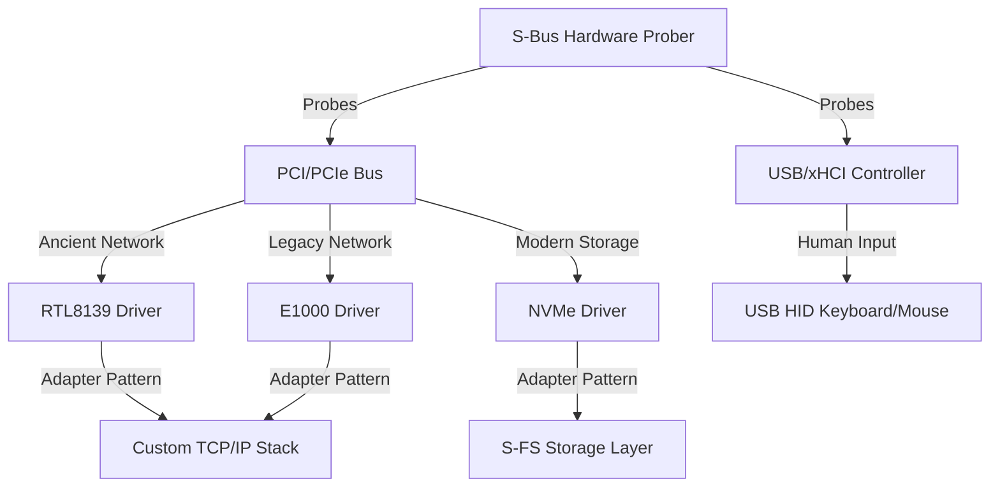

# 🗺️ SigmaOS Unified Future Development Roadmap & Universal Device Compatibility Strategy

This document outlines the unified strategic roadmap, multi-distro analysis, and architectural plans to ensure **SigmaOS** remains backwards-compatible with ancient hardware while fully integrating modern and future standards.

---

## 1. ⚙️ Universal Device Compatibility Strategy: Ancient & Modern

SigmaOS must operate flawlessly on hardware from any era—ranging from retro 1990s ISA/PCI hardware to cutting-edge PCIe Gen 5 and modern USB-C specifications.

### 👴 Ancient Hardware Compatibility Layer (Backwards Compatibility)
*   **Networking (RTL8139 & Intel E1000)**: SigmaOS provides native drivers for the Realtek RTL8139 and Intel E1000 gigabit controllers. The network stack abstracts physical frames via standard ring buffers, allowing legacy network cards to interface seamlessly with modern protocols.
*   **Graphics (Legacy VESA Framebuffer)**: When modern UEFI/KMS/DRM drivers are unavailable, SigmaOS falls back on the legacy VESA BIOS Extensions (VBE) via `vesa::VesaDriver`. This ensures high-resolution desktop rendering even on 20-year-old graphics cards without accelerated GPU pipelines.
*   **Human Input (Legacy PS/2 & USB HID)**: Dual support for legacy PS/2 keyboards/mice and USB HID via our `UsbHidDriver` and `input::InputDriver`, providing unified event queues.
*   **Legacy Bus (PCI Probing)**: The kernel's HAL dynamically probes the legacy PCI bus, mapping device IDs to appropriate drivers using a universal hardware index.

### 🏎️ Modern Hardware Compatibility Layer (Future-Proofing)
*   **Storage (NVMe Storage Shard)**: Native NVMe 1.4 support bypassing legacy IDE/SATA bottlenecks. Uses asynchronous queue management, direct physical page mapping, and MSI-X interrupt routing.
*   **USB Controllers (xHCI)**: Advanced xHCI driver support for high-bandwidth USB 3.0/3.1/3.2, including root-hub routing and power management.
*   **Processors (APIC & Multi-Core SMP)**: Bypasses legacy PIC in favor of APIC/IOAPIC interrupt routing, backed by an EEVDF multiprocessor scheduler to balance loads dynamically across cores.

### 🔌 Universal Driver Manager (Object-Oriented Design Patterns)
To resolve hardware divergence elegantly, SigmaOS implements an Object-Oriented Driver Manager leveraging fundamental design patterns:
1.  **Factory Pattern**: Dynamically instantiates the correct driver subclass (e.g., `GpuDriver`, `StorageDriver`, `NetworkDriver`) based on probed PCI Vendor/Device IDs or USB descriptors.
2.  **Adapter Pattern**: Legacy drivers (like `RTL8139`) are wrapped in modern, zero-copy asynchronous stream adapters, allowing the network stack to treat all interfaces uniformly.
3.  **Singleton Pattern**: The `SimpleDriverFramework` acts as the central Singleton managing driver registrations, states (`Loaded`, `Active`), and hot-swappable updates.
4.  **Observer Pattern**: Hardware status changes (like USB hot-unplug or network cable connection) are broadcast to system modules as events, triggering automatic self-healing and path-routing adaptations.

---

## 2. 📦 Package Manager Absorption: Unifying the Ecosystem via `sigpkg`

Instead of creating another isolated packaging standard, SigmaOS's native `UniversalPackageManager` acts as a hyper-compatible packaging engine:

1.  **Native Containerization**: Packages from legacy formats (`Deb`, `Rpm`, `Pacman`, `Snap`, `Flatpak`) are parsed, sandboxed, and executed in secure application containers via `ContainerRuntime` and `CompatibilityManager`.
2.  **Asynchronous Translation Layers**: Standard POSIX applications compiled for Linux or Windows are translated in real-time using built-in translation runtimes (similar to Wine and Rosetta) with minimal performance overhead.
3.  **SAT-Solver Dependency Resolution**: The native `SatSolver` performs mathematically proven dependency resolution without dynamic heap allocations, ensuring that rollbacks are conflict-free.
4.  **Post-Quantum Verification**: Every package recipe in `RecipeManager` requires mandatory cryptographic sign-off using NIST-approved algorithms (`Kyber-1024` and `Dilithium-5`).

---

## 🏁 3. Multi-Distro Parity Milestone Roadmap

This roadmap defines the engineering milestones to establish SigmaOS as the premier operating system platform.

### Phase G: Bare-Metal Boot & Bootable ISO (Current Phase)
*   [x] Complete Virtual Memory Manager (paging tables, buddy allocator integration).
*   [x] Resolve all host-based unit tests and compiler/linker bottlenecks.
*   [x] Establish standard `panic="abort"` with host-compatible test targets.
*   [ ] Build automated ISO creation pipeline (`make PROFILE=standalone`).
*   [ ] Boot and execute system tasks successfully in real QEMU environments.

### Phase H: Sovereign India Stack Integration
*   [ ] Implement secure kernel capabilities for native UPI transaction streams.
*   [ ] Integrate localized business rules including Built-in Indian GST and tax calculators.
*   [ ] Deploy native 22-language translation layers directly into the Zenith Compositor.
*   [ ] Embed secure `Dilithium-5` hardware handshakes with Aadhaar identity verification gates.

### Phase I: Global Accessibility & Multi-Format Translation
*   [ ] Implement screen reader and speech-to-text algorithms directly inside the `AccessibilityFramework`.
*   [ ] Fully expand `CompatibilityManager` translation layers to run standard ELF (Linux) and EXE (Windows) binaries natively.
*   [ ] Integrate high-performance, hardware-accelerated rendering inside the `GpuDriver` for Zenith applications.

### Phase J: Sustainable and AI-Native Automation
*   [ ] Deploy local LLM model weights on-device as a standard system service (`AiOptimizer`).
*   [ ] Implement predictive performance profiles to optimize energy use for portable devices.
*   [ ] Launch the unified global package registry, allowing developers to publish, sign, and verify packages with post-quantum security.
