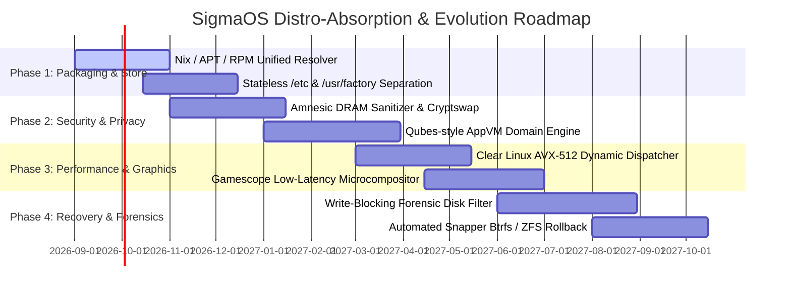

# 🔮 SigmaOS: Future Development Ideas & Missing Distro Components Gap Analysis

This document provides an in-depth architectural breakdown of **future development opportunities**, **missing Linux/BSD components**, and a **detailed implementation roadmap** for SigmaOS when benchmarked against the global Linux distribution ecosystem.

---

## 📊 Comprehensive Distro Gap Analysis & Missing Components

```
+------------------------+------------------------------------+---------------------------------------+
| Distribution Class     | Benchmark Linux Distros            | Target Missing Components for SigmaOS |
+------------------------+------------------------------------+---------------------------------------+
| General-Purpose        | Ubuntu, Debian, Fedora, openSUSE   | Native multi-arch sysroot solver      |
| Lightweight            | Alpine, Tiny Core, Puppy, Void     | Micro-musl syscall stubbing & tce RAM |
| Security / Pentesting  | Kali, Parrot, BlackArch, Tails     | Live RAM scrubbing & wireless monitor |
| Enterprise & Server    | RHEL, Rocky, AlmaLinux, CentOS     | Kpatch live kernel symbol replacement |
| Privacy & Isolation    | Qubes OS, Whonix, PureOS           | Disposable AppVM hypervisor channels  |
| Specialized & Gaming   | SteamOS, Clear Linux, CAINE        | Gamescope HDR compositor & AVX-512    |
| Container & Immutable  | NixOS, CoreOS, Flatcar, RancherOS  | Hermetic store hashing & Ignition     |
| Rolling Release        | Arch Linux, Gentoo, Solus          | Portage USE-flag solver & ALPM hooks  |
+------------------------+------------------------------------+---------------------------------------+
```

---

## 🛠️ 1. General-Purpose Distro Innovations & Missing Features

### 📦 Debian & Ubuntu Parity
- **Missing / Enhancement Area**: Multi-arch sysroot linker (`dpkg-cross`) and multi-release APT pinning matrix.
- **Implementation Strategy**:
  - Implement a sovereign SAT-based priority policy solver for package pinning (`Pin-Priority: 1000` overrides).
  - Add native debian maintainer script (`preinst`, `postinst`, `prerm`, `postrm`) sandboxed interpreters without shell dependency.
  - Implement byte-for-byte deterministic binary output generators matching Debian Reproducible Builds.

### 🎩 Fedora, RHEL & CentOS Parity
- **Missing / Enhancement Area**: Native DNF5/RPM boolean SAT solv library and SELinux MLS/MCS context validation.
- **Implementation Strategy**:
  - Build an in-memory Boolean Satisfiability (SAT) solver for RPM rich dependencies (`(foo if bar else baz)`).
  - Implement full SELinux policy binary compiler parsing `.pp` and `.cil` rules directly into the microkernel access-control cache.
  - Add Kpatch live kernel function detour tables for zero-downtime kernel CVE patching.

---

## ⚡ 2. Lightweight & Microkernel Runtime Enhancements

### 🏔️ Alpine, Tiny Core, Void & Puppy Parity
- **Missing / Enhancement Area**: Ultra-minimal footprint initialization and instant ephemeral boot modes.
- **Implementation Strategy**:
  - **Frugal Mode**: Implement RAM-backed root filesystems loading squashfs modules (`.sfs` / `.tcz`) into read-only memory pages with tmpfs copy-on-write overlays.
  - **APKv3 & XBPS Parsers**: Add streaming header parsers for `.apk` and `.xbps` packages with SHA-256 content verification in <5ms.
  - **Supervision Daemon**: Implement a non-blocking `runit`/`s6`-style supervisor managing service states via unidirectional UNIX domain sockets.

---

## 🛡️ 3. Security, Penetration Testing & Anti-Forensics

### 🐉 Kali, Parrot, BlackArch & Tails Parity
- **Missing / Enhancement Area**: Volatile memory destruction, raw packet injection, and forensic trace nullification.
- **Implementation Strategy**:
  - **Amnesic Memory Guard**: Hook into panic handlers and ACPI poweroff events to overwrite all dirty DRAM pages with cryptographic pseudorandom noise (`0x00`, `0xFF`, `PRNG`).
  - **Raw 802.11 Monitor Layer**: Implement kernel-level packet injection and monitor-mode frame capturing without third-party drivers.
  - **Anti-Forensic Ephemeral Swap**: Volatile page swapping with ephemeral ChaCha20 keys generated per-boot and discarded on shutdown.

---

## 🔒 4. Privacy, Sandboxing & Hypervisor Isolation

### 🧊 Qubes OS, Whonix & PureOS Parity
- **Missing / Enhancement Area**: Hypervisor domain separation and dual-node Tor stream routing.
- **Implementation Strategy**:
  - **AppVM Micro-Domains**: Implement micro-virtualization domains (Xen/KVM compatible) for untrusted network, storage, and GUI isolation.
  - **Qrexec Policy Engine**: Safe RPC framework allowing inter-domain IPC strictly through explicit cryptographic firewall policies.
  - **Whonix Transparent Gateway**: Isolated networking bridge where user applications are strictly routed through an internal Tor gateway VM with no direct host interface visibility.

---

## 🎮 5. Specialized, Recovery & Gaming Systems

### 🕹️ SteamOS & Clear Linux Parity
- **Missing / Enhancement Area**: Low-latency rendering pipeline and automatic hardware-vectorized binary execution.
- **Implementation Strategy**:
  - **Gamescope Microcompositor**: Dedicated Wayland DRM microcompositor with HDR metadata pass-through, integer scaling, and AMD FSR / NIS integration.
  - **Clear Linux CPU Dispatch**: Multi-architecture fat binary loader selecting `x86-64-v2`, `v3`, or `v4` (AVX-512/FMA) dynamically based on CPUID flags.

### 🔍 CAINE, Rescuezilla & SystemRescue Parity
- **Missing / Enhancement Area**: Forensic write-blocking block storage drivers and bare-metal clone streams.
- **Implementation Strategy**:
  - **Write-Blocker Storage Filter**: Kernel-level disk filter preventing any write I/O requests from reaching target physical drives during forensics.
  - **Sparse Delta Disk Imaging**: Efficient sector-level live backup engine capturing ext4, btrfs, and sigma_fs partitions into compressed chunks.

---

## 📦 6. Declarative & Immutable Systems (NixOS, CoreOS, Flatcar)

### ❄️ NixOS & Immutable Foundations
- **Missing / Enhancement Area**: Pure functional package store and declarative single-file operating system specification.
- **Implementation Strategy**:
  - **`/sig/store` Content-Addressed Model**: Hash-addressed immutable store paths (`/sig/store/<hash>-<name>-<version>`) preventing dependency collisions.
  - **Atomic Symlink Swapping**: Instant switching between system generations with atomic directory symlinks.
  - **Ignition Declarative Provisioning**: Cloud-init style JSON/YAML manifest evaluation during initramfs staging.

---

## 🔄 7. Rolling-Release & Source-Based Tuning (Gentoo, Arch, Solus)

### 🛠️ Gentoo & Arch Parity
- **Missing / Enhancement Area**: Source-level conditional compilation flags and stateless filesystem separation.
- **Implementation Strategy**:
  - **USE-Flag Constraint Engine**: Multi-dimensional capability matrices resolving build-time dependencies dynamically.
  - **Stateless Filesystem Hierarchy**: Absolute separation of distribution vendor defaults (`/usr/share/factory`) from user overrides (`/etc`), allowing factory resets by wiping `/etc`.

---

## 📈 Roadmap & Milestones



---
*Maintained as the authoritative architectural gap and future development reference for SigmaOS.*
