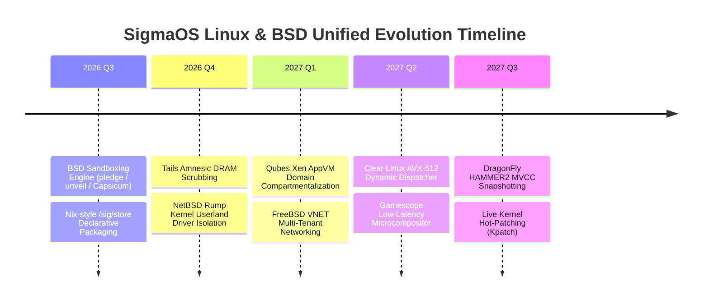

# 🌐 SigmaOS: Future Development Ideas & Missing Components Gap Analysis (Linux & BSD Ecosystem)

This document provides a comprehensive analysis of future development opportunities, architectural innovations, and missing components in **SigmaOS** when benchmarked against both major **Linux distributions** and the **BSD Family** (*FreeBSD, OpenBSD, NetBSD, DragonFly BSD*).

---

## 🧭 High-Level Comparative Architecture Matrix

```
+------------------------------------+-------------------------------------------+----------------------------------------------+
| Distribution / OS Family          | Key Inventions & Benchmark Concepts       | Target Components for SigmaOS                |
+------------------------------------+-------------------------------------------+----------------------------------------------+
| FreeBSD                            | Jails, Capsicum, bhyve, GEOM, ZFS root    | Fine-grained Capability Rights & Jails VNET  |
| OpenBSD                            | pledge(2), unveil(2), W^X, KARL, LibreSSL | Syscall promise enforcement & Kernel ASLR    |
| NetBSD                             | Rump Kernels (Anykernel), pkgsrc, rumpctrl| Anykernel driver virtualization in userland  |
| DragonFly BSD                      | HAMMER2 Filesystem, Hybrid Locks, LWKT    | Lockless Worker Threads & MVCC Snapshots     |
| Linux (General-Purpose/Enterprise) | systemd, DNF5/APT, eBPF, SELinux, Kpatch  | In-kernel eBPF verifier & Live patch tables  |
| Linux (Security & Anti-Forensics)  | Tails Amnesic wipe, Qubes AppVM, Kali     | DRAM crypto-scrub & Xen AppVM domains        |
| Linux (Declarative & Immutable)    | NixOS Store, Ostree, Flatcar Ignition    | Hash-addressed store & Atomic symlink swaps  |
| Linux (Lightweight & Supervised)   | Alpine APKv3/Musl, Void runit, Tiny Core  | Ephemeral RAM overlays & Zero-delay init     |
+------------------------------------+-------------------------------------------+----------------------------------------------+
```

---

## 🔱 1. BSD Ecosystem Inventions & Missing Components

### 🌊 FreeBSD Innovations to Absorb
1. **Capsicum Capability Sandboxing (`cap_enter(2)`, `cap_rights_limit(2)`)**:
   - *Concept*: Once a process enters capability mode, access to global namespaces (e.g., filesystem paths, raw sockets) is revoked; all actions must occur via explicitly delegated file descriptors.
   - *SigmaOS Plan*: Implement a pure `#![no_std]` Capsicum engine that locks process descriptors and checks capability masks on every VFS and network syscall.
2. **VNET Jail Network Virtualization**:
   - *Concept*: Each FreeBSD Jail can possess its own fully virtualized network stack (independent loopbacks, routing tables, firewall rules, and IP addresses).
   - *SigmaOS Plan*: Add virtualized network stack descriptors to SigmaOS container contexts.
3. **GEOM Modular Storage Framework**:
   - *Concept*: Pluggable I/O transformation layers (encryption, striping, mirroring, compression) that plug together like Lego bricks.
   - *SigmaOS Plan*: Implement a modular block-device pipeline in `src/storage/` for chaining crypto, checksumming, and caching layers.

---

### 🐡 OpenBSD Hardening & Security Parity
1. **Fine-Grained `pledge(2)` & `unveil(2)` Path Sandboxing**:
   - *Concept*: Processes voluntarily restrict the syscall subsets (`stdio`, `rpath`, `wpath`, `cpath`, `inet`, `dns`) and visible filesystem subtrees they can touch.
   - *SigmaOS Plan*: Provide automatic compile-time and runtime decorators for userland processes to declare pledge promises.
2. **KARL (Kernel Address Randomized Link)**:
   - *Concept*: Kernel binaries are relinked with randomised internal object order on every boot cycle so internal code offsets are non-deterministic.
   - *SigmaOS Plan*: Implement a boot-time kernel segment relocator and function-order scrambler in the bootloader pipeline.
3. **Strict W^X (Write XOR Execute) Memory Pages**:
   - *Concept*: Enforce at page table level that no virtual memory page can ever be concurrently writable and executable.
   - *SigmaOS Plan*: Native enforcement in page table allocators (`src/memory/`).

---

### 🌐 NetBSD Anykernel & Portability
1. **Rump Kernels (Anykernel Architecture)**:
   - *Concept*: Run unmodified kernel drivers (networking, USB, filesystems) as unprivileged userland servers or micro-VMs.
   - *SigmaOS Plan*: Implement a Rump hyper-layer in `src/driver/` allowing device drivers to crash and restart without affecting the microkernel.
2. **pkgsrc Cross-Platform Package Ecosystem**:
   - *Concept*: Unified package definitions that build identically across dozens of UNIX variants.
   - *SigmaOS Plan*: Provide a native parser for `pkgsrc` Makefiles within the universal package manager (`src/sigpkg/`).

---

### 🐉 DragonFly BSD High-Concurrency & Storage
1. **HAMMER2 Filesystem**:
   - *Concept*: Lock-free directory hashing, multi-volume clustering, zero-overhead live snapshots, and Multi-Version Concurrency Control (MVCC).
   - *SigmaOS Plan*: Integrate HAMMER2 snapshot algorithms into `sigma_fs`.
2. **LWKT (Lightweight Kernel Threads) & Per-CPU Serialization**:
   - *Concept*: Lock-free per-CPU thread scheduling queues eliminating cross-core lock contention.
   - *SigmaOS Plan*: Refactor scheduler dispatch to pin non-preemptible work queues to physical cores.

---

## 🐧 2. Linux Ecosystem Inventions & Missing Components

### 📦 Declarative Storage & Hermetic Isolation (NixOS, Flatcar, CoreOS)
- **Nix-Style Immutable Store (`/sig/store/<hash>-<name>-<ver>`)**:
  - Eliminates "dependency hell" by treating software installations as functional pure derivations.
- **Ignition First-Boot Declarative Engine**:
  - Parses structured YAML/JSON configurations during initial boot to partition disks, configure users, and start system daemons.
- **A/B Partition Failover & Atomic Rollback**:
  - Dual boot slots ensuring that failed system upgrades automatically reboot into the pristine previous generation.

### 🛡️ Hardened Enterprise & Pentesting Features (Kali, Tails, Qubes, RHEL)
- **Amnesic DRAM Scrubber (Tails-Style)**:
  - Cryptographically overwrites all unallocated physical memory on shutdown, suspend, or panic.
- **AppVM Micro-Hypervisor Domains (Qubes-Style)**:
  - Compartmentalizes untrusted user activities (browsing, USB devices, network hardware) into lightweight isolated domains connected via a policy-governed RPC channel (`Qrexec`).
- **Live Kernel Function Detour / Kpatch (RHEL-Style)**:
  - Atomic dynamic redirection of kernel function entry points for zero-reboot security patching.

### ⚡ Low-Latency & Performance Optimizations (Clear Linux, SteamOS, Alpine)
- **Gamescope HDR Wayland Microcompositor (SteamOS)**:
  - Low-latency compositor with direct DRM plane allocation, frame timing prediction, and resolution upscaling.
- **Microarchitecture Vector Dispatch (Clear Linux)**:
  - Multi-version dynamic binary selection optimizing execution for `x86-64-v2`, `v3`, and `v4` (AVX-512).
- **Sub-5ms Ephemeral Boot (Alpine / Tiny Core)**:
  - Compressed kernel + initramfs loaded directly into RAM with copy-on-write tempfs overlays.

---

## 🗺️ Unified Implementation Roadmap & Phased Delivery



---
*Maintained as the authoritative Linux & BSD cross-ecosystem improvement and architectural blueprint for SigmaOS.*
