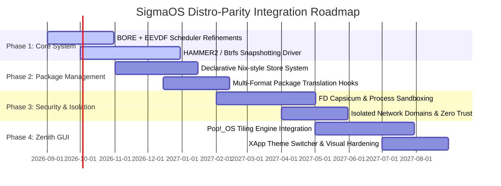

# SigmaOS Future Development Roadmap: Distro-Inspired Innovations

SigmaOS is a bare-metal sovereign operating system designed for modern silicon. To establish global engineering dominance, SigmaOS inherits, adapts, and refines the most successful design paradigms from across the **Linux** and **BSD** ecosystems.

This document outlines the strategic future development plan for SigmaOS, detailing concrete technical feature integrations across five operational layers.

---

## 🗺️ Architectural Parity Matrix & Plan

```
┌────────────────────────────────────────────────────────────────────────┐
│                          SigmaOS Architecture                          │
├───────────────────┬───────────────────┬────────────────┬───────────────┤
│    Kernel/HAL     │   Package/State   │ Security/Audit │ Desktop/User  │
│ - BORE + EEVDF    │ - Declarative Nix │ - OpenBSD      │ - Pop!_OS     │
│   (CachyOS)       │   (NixOS)         │   pledge/unveil│   Tiling WM   │
│ - HAMMER2 CoW     │ - Multi-format    │ - Capsicum     │ - ZApp Theme  │
│   (DragonFly BSD) │   (APT/DNF/APK)   │   (FreeBSD)    │   (Linux Mint)│
└───────────────────┴───────────────────┴────────────────┴───────────────┘
```

---

## 🛠️ Detailed Implementation Plan by Subsystem

### 1. Kernel, Scheduling, and Storage Subsystems
*   **Hybrid Scheduler (CachyOS + Linux 6.13+)**:
    *   *Concept*: Merge the Burst-Oriented Response Enhancer (**BORE**) scheduler with Earliest Eligible Virtual Deadline First (**EEVDF**).
    *   *Implementation*: Refine the `BoreScheduler` in `src/kernel/scheduler.rs` to compute deadlines dynamically using virtual runtime. This guarantees ultra-low UI latency under intense CPU workloads (compilation, database merges) while maintaining scheduling fairness.
*   **Next-Gen Storage Engine (DragonFly BSD + openSUSE)**:
    *   *Concept*: Port the Copy-on-Write (CoW) design of **HAMMER2** and **Btrfs**.
    *   *Implementation*: Build native drivers for snapshotting and subvolumes. Integrate with `sigma-pkg` to trigger automatic filesystem snapshots before package upgrades, enabling instant, atomic rollbacks.

### 2. Package Management and System State (`SigmaPkg`)
*   **Declarative System State (NixOS)**:
    *   *Concept*: Reproducible system builds where the entire OS structure is defined in a single config file.
    *   *Implementation*: Create a declarative translator engine in `src/sigpkg/declarative.rs` that reads a system configuration schema (`/etc/sigmaos/system.toml`) and synchronizes the system state (packages, kernel configuration, modules, and user profiles) to a content-addressable store (`/sigma/store`).
*   **Universal Compatibility Engine (Debian/Ubuntu/Fedora/Gentoo/Alpine)**:
    *   *Concept*: Seamless execution and compilation of packages from standard formats (`.deb`, `.rpm`, `.apk`, Gentoo Ebuilds).
    *   *Implementation*:
        *   Implement package translator bridges (`Dnf5PackageEngine`, `MkinitcpioHookFramework`, `GentooPortageMaskResolver`).
        *   Provide compatibility wrappers for `apt`, `dnf`, `apk`, and `pacman` that map native commands onto the declarative `SigmaPkg` backend.

### 3. Security, Sandboxing, and Isolation
*   **Advanced Capabilities Sandboxing (OpenBSD + FreeBSD)**:
    *   *Concept*: System-wide enforcement of `pledge()`, `unveil()`, and Capsicum capability rights.
    *   *Implementation*:
        *   Add system call restrictions per process domain based on custom capability tables.
        *   Restrict process filesystem visibility to explicit whitelisted paths using path-based `unveil` gates.
        *   Assign fine-grained capability matrices directly to file descriptors (e.g., read-only, append-only, network-bind).
*   **Network Isolation (QUBES OS + WireGuard)**:
    *   *Concept*: Domain isolation for network drivers to prevent driver vulnerabilities from compromising the host.
    *   *Implementation*: Isolate the network stack (`src/net/zero_trust.rs`) into a lightweight virtual container domain. Force all traffic through a secure WireGuard-encrypted interface with zero trust policies.

### 4. Desktop Interface and User Experience (Zenith GUI)
*   **Tiling Window Manager (Pop!_OS + Garuda Linux)**:
    *   *Concept*: Smart auto-tiling layout with high-performance blur/transparency rendering.
    *   *Implementation*:
        *   Extend the custom GTK-inspired UI toolkit (`src/ui/toolkit.rs`) to support dynamic grid tiling, custom workspace layouts, and keyboard-driven navigation (inspired by Pop!_OS Shell).
        *   Implement the Garuda-inspired `XAppThemeEngine` with hardware-accelerated blur, drop shadows, and layout profiles (including a Zorin-inspired Windows-like layout switcher).

---

## 📅 Phased Integration Timeline



---

> [!IMPORTANT]
> All developments must prioritize zero standard library dependency (`#![no_std]`), memory-safe Rust paradigms, and standalone integration test validation to ensure the stability of the bare-metal kernel.
