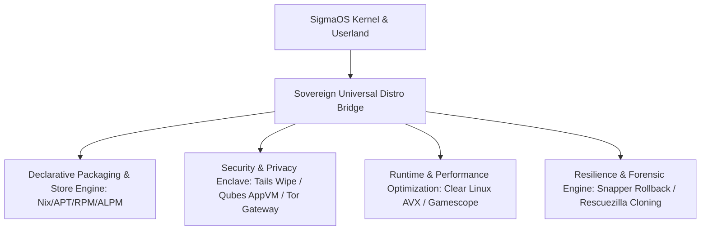

# 🚀 SigmaOS: Comprehensive Multi-Distro Architectural Evolution & Future Roadmap

This blueprint details future development ideas, architectural patterns, and specialized subsystem enhancements absorbed from the broader Linux/BSD distribution ecosystem.

---

## 📑 Distribution Classes & Future Roadmap Matrix

### 1. 🌐 General-Purpose Distributions (Ubuntu, Debian, Fedora, openSUSE, Arch, Gentoo, CentOS, Manjaro)
* **Debian / Ubuntu**:
  * *APT Pinning & Multi-Release Channels*: Deterministic dependency resolution across stable, testing, and experimental repos.
  * *Reproducible Builds*: Cryptographically verifiable bit-for-bit package builds (`dpkg-reproducible`).
  * *AppArmor Profiles*: Dynamic enforcement profiles generated automatically during binary execution.
* **Fedora / CentOS Stream / RHEL**:
  * *DNF5 / RPM Boolean Dependencies*: SAT solver-driven package transactions with rich boolean expressions.
  * *SELinux Strict Multi-Category Enforcement (MCS/MLS)*: Native Rust kernel-level security context validation.
  * *Cockpit & FreeIPA Federation*: Sovereign enterprise identity and telemetry daemon.
* **Arch Linux / Manjaro**:
  * *ALPM Transaction Core*: Transactional delta downloads and pacman hooks natively evaluated in no_std.
  * *AUR Sandboxed Environment*: Automated isolation for source-based user build scripts.
* **Gentoo**:
  * *Portage USE Flag Slot Engine*: Fine-grained per-package capability flags with slot conflict solvers.
  * *Microarchitecture Profile Tuning*: AVX-512, NEON, and RISC-V vector optimization matrix.
* **openSUSE**:
  * *Snapper & Btrfs Integration*: Automatic pre/post transactional snapshot rollbacks across system updates.
  * *YaST Management Schema*: Modular state declarations for system services.

---

### 2. ⚡ Lightweight Distributions (Alpine, Tiny Core, Puppy, Void, Lubuntu)
* **Alpine Linux**:
  * *Musl-Optimized Kernel Boundary*: Ultralight syscall ABI layer avoiding glibc overhead.
  * *APKv3 Manifest Support*: Content-addressed hash indexing for sub-second system bootstrap.
* **Tiny Core Linux**:
  * *Frugal Read-Only Core*: Entire root filesystem loaded directly into memory with TCE overlays.
* **Void Linux**:
  * *Runit Supervisor*: Fast parallel initialization with minimal process tree overhead.
  * *XBPS Transaction Graph*: Memory-efficient topological sorting of package graphs.
* **Puppy & Lubuntu**:
  * *SFS Modular Stacking*: Dynamic Squashed Filesystem layers loaded at runtime without reboots.

---

### 3. 🛡️ Security, Penetration Testing & Anti-Forensics (Kali, Parrot, BlackArch, Tails)
* **Kali & BlackArch**:
  * *Native Penetration Framework*: Automated wireless, binary, and network security audit engines.
  * *Modular Tool Groups*: Instant staging of dedicated assessment suites.
* **Parrot Security OS**:
  * *Anonsurf Tor Routing*: System-wide transparent proxying for network interfaces.
  * *AppArmor/Sandbox Integration*: Hardened containers for live exploit execution.
* **Tails (The Amnesic Incognito Live System)**:
  * *Amnesic RAM Wipe*: Memory zeroing on poweroff, kernel panic, or sudden unmount.
  * *Ephemeral Encrypted Swap*: Volatile cryptswap regenerated every boot cycle.

---

### 4. 🏢 Server & Enterprise Foundations (Rocky, AlmaLinux, RHEL)
* **Enterprise Stability & Long Term Support**:
  * *ABI Stability Verification*: Automated symbol versioning and regression analysis.
  * *Live Kernel Patching (Kpatch)*: Hot-swapping kernel functions without rebooting.
  * *Disaster Recovery Replicas*: Block-level storage mirroring with automated failover.

---

### 5. 🔒 Privacy-Focused Systems (Qubes OS, Whonix, PureOS)
* **Qubes OS**:
  * *Hypervisor AppVM Isolation*: Disposable untrusted VMs for browsing, documents, and networking.
  * *Qrexec Inter-VM RPC*: Policy-governed RPC calls between isolated security domains.
* **Whonix**:
  * *Two-Node Workstation/Gateway Split*: Strict isolation where the workstation has zero direct Internet access.
* **PureOS**:
  * *FSF Respects Your Freedom (RYF)*: Strict enforcement of 100% libre userland and firmware policies.

---

### 6. 🎮 Specialized, Recovery & Gaming (SteamOS, Clear Linux, CAINE, Rescuezilla, SystemRescue, Raspberry Pi OS)
* **SteamOS**:
  * *Gamescope Microcompositor*: Low-latency HDR game frame rendering and resolution upscaling.
  * *Dual A/B Immutable Partitions*: Fail-safe system updates with automatic fallback.
* **Clear Linux**:
  * *Auto-Vectorized Binaries*: Dynamic binary switching based on host CPU microarchitecture level (x86-64-v2/v3/v4).
* **CAINE / Rescuezilla / SystemRescue**:
  * *Unalterable Forensic Live Mounts*: Write-blocking block drivers for pristine forensic analysis.
  * *Sparse Block Disk Cloning*: Rapid delta disk backups across bare-metal environments.

---

### 7. 📦 Container-Based & Declarative Operating Systems (CoreOS, Flatcar, RancherOS, NixOS)
* **NixOS**:
  * *Declarative Hermetic Configuration*: Single-file system specification with immutable store hashing (`/sig/store/...`).
  * *Atomic Generational Rollbacks*: Generation symlink swaps guaranteeing instant rollback.
* **CoreOS & Flatcar**:
  * *Ignition First-Boot Engine*: Automated declarative node configuration from network metadata.
  * *Nebraska / Omaha Automatic Updates*: Managed rolling cluster deployments.

---

### 8. 🔄 Rolling Release Systems (Solus, EndeavourOS)
* **Solus**:
  * *eopkg Stateless Architecture*: Separation of distro defaults (`/usr/share/defaults`) from user config (`/etc`).
* **EndeavourOS**:
  * *Community Troubleshooting Assistant*: Built-in diagnostics and automated log scrubbers.

---

## 🎯 Implementation Strategy in SigmaOS

---
*Maintained as part of the SigmaOS Autonomous Evolution & Ecosystem Absorption Initiative.*
