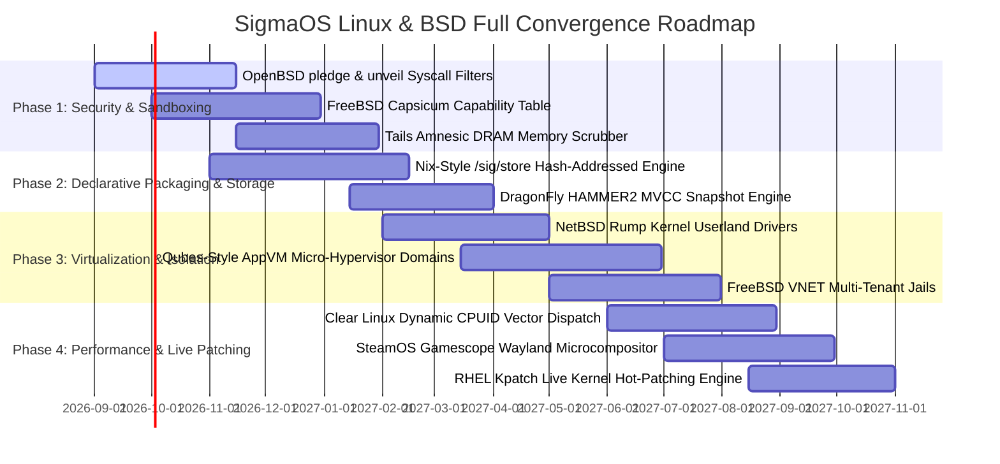

# 🚀 SigmaOS: Comprehensive Architectural Gap Analysis, Missing Components & Future Evolution Roadmap (Linux & BSD Distributions)

This document serves as the master architectural reference for **future development ideas**, **missing technical components**, and **systemic optimizations** for **SigmaOS** when systematically benchmarked against the complete spectrum of **Linux distributions** and **BSD operating systems**.

---

## 📑 1. Global Benchmark Taxonomy & Comparative Architecture Matrix

```
+------------------------------------+-------------------------------------------+----------------------------------------------------+
| Distribution / OS Family          | Pioneering Technologies & Paradigms       | Missing Components / Target Inventions in SigmaOS  |
+------------------------------------+-------------------------------------------+----------------------------------------------------+
| FreeBSD                            | Capsicum, Jails VNET, GEOM, ZFS root      | Descriptor Capability Masks & VNET Network Jails   |
| OpenBSD                            | pledge(2), unveil(2), W^X, KARL, malloc.conf| Syscall Promise Sandboxes & Kernel Relocation Link |
| NetBSD                             | Rump Kernels (Anykernel), pkgsrc, rumpctrl| Userland Isolated Driver Micro-Servers & pkgsrc    |
| DragonFly BSD                      | HAMMER2 Filesystem, LWKT, NullFS, VFS chk | Lock-free Directory Inodes & MVCC Live Snapshots   |
| Linux: General / Enterprise        | systemd, DNF5/APT, eBPF, SELinux, Kpatch  | In-Kernel eBPF Verifier & Live Function Patching   |
| Linux: Security & Anti-Forensics  | Tails Amnesic wipe, Qubes AppVM, Kali     | DRAM RAM-Scrubbing on Panic & Qrexec IPC Channels  |
| Linux: Declarative & Immutable     | NixOS Flakes, OSTree, Flatcar Ignition    | Content-Addressed /sig/store & A/B Atomic Fallback |
| Linux: Lightweight & Ephemeral     | Alpine APKv3/Musl, Void runit, Tiny Core  | Sub-5ms SquashFS Ephemeral RAM Overlays & s6 Init  |
| Linux: Gaming & Specialized        | SteamOS Gamescope, Clear Linux AVX-512    | Low-Latency Wayland DRM Compositor & CPU Dispatch  |
| Linux: Forensics & Recovery        | CAINE, Rescuezilla, SystemRescue          | Kernel Write-Blocking Block I/O & Sparse Imaging   |
+------------------------------------+-------------------------------------------+----------------------------------------------------+
```

---

## 🔱 2. BSD Family: Missing Technical Components & Architecture Blueprints

### 🌊 FreeBSD Parity & Enhancements
1. **Capsicum Capability Sandboxing Engine (`cap_enter`, `cap_rights_limit`)**:
   - **Current Gap**: Process security uses traditional user/group and privilege bit checks.
   - **Missing Component**: A descriptor-based capability table where file descriptors carry strict capability masks (`CAP_READ`, `CAP_WRITE`, `CAP_SEEK`, `CAP_FCNTL`, `CAP_CONNECT`). Once `cap_enter()` is executed, path-based lookups are trapped and denied by the microkernel.
2. **VNET Jail Virtualized Network Stack Instances**:
   - **Current Gap**: Containers share host network stack routing or use simple TAP interfaces.
   - **Missing Component**: An independent instance of the network stack (private loopback, routing table, firewall filters, socket hash tables) per container context.
3. **GEOM Modular Storage Framework**:
   - **Current Gap**: Storage layers interact directly with device block drivers.
   - **Missing Component**: A composable block-layer topology allowing chaining of providers (`gmirror`, `graid`, `geli` encryption, `gcompress`, `gcache`) dynamically.

---

### 🐡 OpenBSD Security & Hardening Parity
1. **Fine-Grained `pledge(2)` & `unveil(2)` Syscall Restriction Framework**:
   - **Current Gap**: Processes cannot voluntarily permanently drop syscall categories after initialization.
   - **Missing Component**: Syscall category filters (`stdio`, `rpath`, `wpath`, `cpath`, `dpath`, `inet`, `unix`, `dns`, `proc`, `exec`) and path unveil masks (`r`, `w`, `x`, `c`).
2. **KARL (Kernel Address Randomized Link)**:
   - **Current Gap**: Kernel binary layout is static across reboots.
   - **Missing Component**: A boot-time linker that re-orders kernel `.text` functions randomly upon every startup, making Return-Oriented Programming (ROP) exploitation impossible.
3. **Strict W^X Enforcement & Hardened Allocator**:
   - **Current Gap**: Memory manager allows standard page allocations without probabilistic guard pages.
   - **Missing Component**: OpenBSD-style `malloc.conf` with randomized chunk placement, double-free trap canaries, and page-level W^X hardware bit validation.

---

### 🌐 NetBSD Anykernel & Portability
1. **Rump Kernel (Anykernel) Isolated Device Drivers**:
   - **Current Gap**: Monolithic drivers run with microkernel/ring-0 privileges.
   - **Missing Component**: Rump hypercall layer enabling native USB, GPU, audio, and network drivers to run inside sandboxed userland micro-servers. If a driver segfaults, the microkernel restarts the rump server in <1ms without dropping system state.
2. **`pkgsrc` Universal Cross-Compiling Parser**:
   - **Current Gap**: Universal package manager requires manual metadata translations.
   - **Missing Component**: Direct parser for BSD `pkgsrc` Makefiles and dependency trees.

---

### 🐉 DragonFly BSD High-Concurrency & Filesystems
1. **HAMMER2 Multi-Version Concurrency Control (MVCC) Storage**:
   - **Current Gap**: Snapshots use copy-on-write pointer updates.
   - **Missing Component**: True MVCC multi-master replication with lockless B-tree directory indexing and zero-delay point-in-time filesystem rollbacks.
2. **LWKT (Lightweight Kernel Threads) Core Pinning**:
   - **Current Gap**: Threads migrate between cores under dynamic scheduler load.
   - **Missing Component**: Lock-free per-CPU scheduling queues that eliminate cross-CPU spinlock contention.

---

## 🐧 3. Linux Distribution Ecosystem: Missing Technical Components

### 📦 Declarative, Hermetic & Immutable Packaging (NixOS, CoreOS, Flatcar)
1. **Functional Content-Addressed Store (`/sig/store/<sha256>-<pkg>-<ver>`)**:
   - Software packages built with hermetic inputs (compiler, flags, dependencies) stored immutably.
2. **Atomic Generational Rollbacks**:
   - System root symlinked atomically (`/sig/current-system -> /sig/store/generation-42`). Rollbacks require only a single atomic pointer swap.
3. **Ignition First-Boot Declarative Parser**:
   - Parses machine-readable JSON/YAML definitions on early boot to partition disks, format filesystems, create users, and inject systemd units.

---

### 🛡️ Security, Penetration Testing & Anti-Forensics (Kali, Tails, Qubes, RHEL)
1. **Amnesic DRAM Sanitization (Tails-Style)**:
   - Kernel hooks executed on panic, ACPI shutdown, or USB unplug that actively overwrite physical memory pages with pseudorandom bytes.
2. **Qubes-Style Xen AppVM Domain Hypervisor Channels**:
   - Micro-virtualization domains isolating untrusted applications, networking, and USB controllers, connected via policy-governed `Qrexec` RPC endpoints.
3. **Kpatch Live Kernel Symbol Replacement (RHEL-Style)**:
   - Dynamic function detour tables in the kernel allowing live hot-patching of vulnerable kernel functions without rebooting.

---

### ⚡ Performance, Low-Latency & Gaming (Clear Linux, SteamOS, Alpine)
1. **Gamescope Low-Latency Wayland Microcompositor**:
   - Direct DRM plane allocation, integer scaling, AMD FSR / NIS spatial upscaling, and HDR metadata tunneling.
2. **Microarchitecture Dynamic Fat-Binary Dispatch (Clear Linux-Style)**:
   - Dynamic library loader checking host CPUID and selecting specialized instruction set binaries (`x86-64-v2`, `v3`, `v4` with AVX-512 / AMX / FMA).
3. **Sub-5ms Ephemeral Memory Boot (Alpine / Tiny Core)**:
   - SquashFS root packages mapped directly into read-only memory pages with tmpfs copy-on-write overlays.

---

### 🔍 Forensics, Diagnostics & System Recovery (CAINE, Rescuezilla, SystemRescue)
1. **Hardware-Level Write-Blocking Block Driver**:
   - Kernel block driver filter completely intercepting and rejecting write requests to physical storage during forensic investigation.
2. **Sparse Chunk Sector Disk Imaging**:
   - Multi-threaded disk cloning engine that skips unallocated filesystem blocks and streams compressed sector images across local or network targets.

---

## 🛠️ 4. Comprehensive Engineering Roadmap



---
*Maintained as the authoritative architectural gap analysis and future technical roadmap for the SigmaOS Operating System.*
