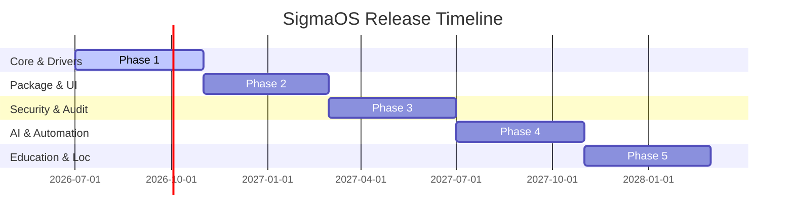

# SigmaOS: Comprehensive Future Development Roadmap

This document outlines the unified, 5-phase strategic engineering plan to evolve SigmaOS into a premier, AI-native, hyper-secure, sovereign desktop and server operating system.

---

## Phase 1: Core System, Virtualization & Drivers (Month 0–4)

### Focus: Hardware compatibility, filesystem recovery, and secure execution layers.

- **Secure Enclaves (Intel SGX):** Integrate hardware enclave startup routines into the scheduler to isolate kernel namespaces.

- **Advanced CoW Storage:** Adapt OpenZFS and Btrfs filesystem structures (such as snapshot trees and pooled allocators) into the SovereignFS (`sigmafs.rs`) layer.

- **Micro-Virtualization:** Integrate Firecracker-inspired KVM abstractions to enable lightweight, sandboxed micro-VM launches.

- **Driver Parity:** Port stable Linux network drivers (e e1000, VirtIO-net) and basic GPU layouts (VirtIO-gpu) to the HAL.

## Phase 2: Unified Package Manager & UI Customization (Month 4–8)

### Focus: Application delivery formats, tiling interfaces, and composition effects.

- **Universal sigpkg manager:** Integrate flatpak-inspired XDG portals and container boundaries to support sandboxed application sandboxes.

- **AwesomeWM/i3 tiling layouts:** Build dynamic tiling capabilities using a tree model inside the Zenith window manager.

- **Compositor visual polish (picom):** Add blurred transparency, Kawase shaders, and shadow overlays directly into the GPU pipeline.

## Phase 3: Cybersecurity audits & Network hardening (Month 8–12)

### Focus: Active defense, network analysis, and cryptographic signatures.

- **Zeek network profiling:** Route kernel stack traffic logs directly to an active Zeek anomaly scanner interface.

- **GnuPG update verification:** Enforce GPG signatures in the package manager registry to prevent side-loading.

- **Intrusion Prevention (fail2ban/Lynis):** Embed automated auditing scripts to verify that execution capabilities match running sandboxes.

## Phase 4: AI Agent, Automation & Data Science (Month 12–16)

### Focus: AI-native operations, local models, and telemetry workflows.

- **Whisper voice command logic:** Quantize Whisper speech-to-text models to run within the local context manager.

- **DVC/MLflow versioning:** Automate telemetry checkpoints using CoW storage snapshots.

- **mlpack/OpenCog engines:** Build cognitive and mathematical execution modules directly on our zero-allocation libraries.

## Phase 5: Regional Indian Localization & Gov-SDKs (Month 16–20)

### Focus: Regional language translation, compliance registries, and agricultural modules.

- **Indic transliteration engines:** Deploy automatic script conversions directly in the text rendering stack.

- **Bharat-FOSS & OpenForge tools:** Bundle e-Gov development toolkits and GST calculation suites natively.

- **QGIS agriculture wrappers:** Connect geographic mappings to localized telemetry analyzers to predict crop yields.

### Last Updated: July 2026
