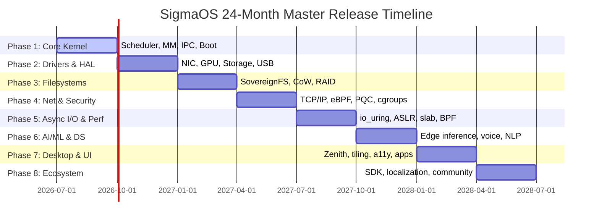

# SigmaOS: Master Future Development Roadmap

> **Version:** 2.0 — Comprehensive 24-Month Strategic Plan  
> **Last Updated:** July 2026  
> **Status:** Active Development

This document is the authoritative, living master roadmap for SigmaOS — covering kernel internals, drivers, AI/ML subsystems, data science tooling, CLI tools, security hardening, desktop environment, localization, and ecosystem growth. Each phase is concrete, sequenced, and draws directly from battle-tested Linux distro features.

---

## Strategic Vision

SigmaOS aims to be a **sovereign, AI-native, hyper-secure operating system** that:

- Runs fully `no_std` / bare-metal from microkernel to userspace
- Integrates cutting-edge research from Linux, OpenBSD, NixOS, Qubes OS, and Tails OS
- Provides a complete AI/ML inference stack running locally, without cloud dependency
- Delivers a premium Zenith desktop + CLI experience rivaling macOS + Arch Linux
- Ships with enterprise-grade security (PQC crypto, formal verification, eBPF monitoring)

---

---

## Phase 1 — Core Kernel Foundation (M0–M3)

### Objectives
Establish a stable, production-quality microkernel that can boot on real x86_64 hardware and QEMU.

### 1.1 Process Management

| Feature | Status | Inspired By |
|:---|:---:|:---|
| fork() / exec() / exit() / wait4() | ✅ Implemented | Linux `kernel/fork.c` |
| PID allocator (atomic, wrapping) | ✅ Implemented | Linux `kernel/pid.c` |
| Process Control Block (Task struct) | ✅ Implemented | Linux `task_struct` |
| Zombie reaping | ✅ Implemented | POSIX waitpid() |
| Thread support (TID = PID simplified) | 🔄 Partial | Linux NPTL |
| Process groups & sessions | 🔲 Planned | POSIX setsid() |
| Capabilities (Linux capability model) | 🔄 Partial | Linux `capability.h` |
| Namespaces (PID/mount/net/user) | 🔄 Partial | Linux namespaces(7) |
| cgroups v2 resource enforcement | ✅ Implemented | Linux cgroups(7) |

### 1.2 Scheduler (MLFQ + CFS + EDF)

| Feature | Status | Inspired By |
|:---|:---:|:---|
| MLFQ (4-level priority queues) | ✅ Implemented | OSTEP textbook |
| CFS (virtual runtime min-heap) | ✅ Implemented | Linux `kernel/sched/fair.c` |
| EDF (hard real-time deadlines) | ✅ Implemented | RTOS design |
| Priority aging / boost | ✅ Implemented | Linux MLFQ |
| Frozen-state for forensic snapshots | ✅ Implemented | Linux freezer subsystem |
| CPU affinity masks | ✅ Struct field | Linux sched_setaffinity |
| SMP / per-CPU run queues | 🔲 Planned | Linux SMP scheduler |
| Load balancing across CPUs | 🔲 Planned | Linux `kernel/sched/topology.c` |
| Power-aware scheduling (EAS) | 🔲 Planned | ARM Energy Aware Scheduling |
| BPF-powered scheduler hooks | 🔲 Planned | Linux sched_ext (6.7+) |

### 1.3 Memory Management

| Feature | Status | Inspired By |
|:---|:---:|:---|
| Buddy allocator (11 orders) | ✅ Implemented | Linux `mm/page_alloc.c` |
| Slab allocator (8 size classes) | ✅ Implemented | Linux SLUB |
| Slab poisoning (use-after-free detection) | ✅ Implemented | Linux 6.11 bucket isolation |
| Slab header canary | ✅ Implemented | OpenBSD malloc canaries |
| ASLR (42-bit VMA entropy) | ✅ Implemented | Linux ASLR |
| W^X enforcement | ✅ Implemented | OpenBSD W^X / PaX |
| Kernel stack guard canaries | ✅ Implemented | GCC -fstack-protector |
| VMA descriptor map | ✅ Implemented | Linux `struct vm_area_struct` |
| Copy-on-Write (CoW) VMAs | 🔄 Partial | Linux CoW fork |
| Transparent Huge Pages (THP) | 🔲 Planned | Linux THP |
| NUMA awareness | 🔲 Planned | Linux NUMA mm |
| Memory pressure notifications | 🔲 Planned | Linux PSI |
| zram compressed swap | 🔲 Planned | Android zram |

### 1.4 IPC & Synchronization

| Feature | Status | Inspired By |
|:---|:---:|:---|
| IPC channels (typed messages) | ✅ Implemented | seL4 IPC |
| Signals (SIGKILL, SIGTERM, SIGUSR) | ✅ Implemented | POSIX signals |
| IRQ controller abstraction | ✅ Implemented | Linux APIC driver |
| Spinlocks / RWlocks (no_std) | 🔲 Planned | Linux `spinlock.h` |
| Futexes (fast userspace mutexes) | 🔲 Planned | Linux futex(2) |
| Shared memory regions | 🔲 Planned | POSIX shm_open |

---

## Phase 2 — Hardware Drivers & HAL (M3–M6)

### 2.1 Network Drivers

| Driver | Status | Inspired By |
|:---|:---:|:---|
| Intel e1000 (GbE, QEMU default) | ✅ Implemented | Linux `e1000` |
| Intel ixgbe (10GbE, Xeon) | 🔄 Stub | Linux `ixgbe` |
| Realtek RTL8139 (legacy PCI) | 🔄 Stub | Linux `8139too` |
| NE2000 (ISA legacy) | 🔄 Stub | Linux `ne` |
| VirtIO-net (QEMU paravirt) | 🔲 Planned | Linux `virtio_net` |
| Wireless (cfg80211 / nl80211) | 🔲 Planned | Linux mac80211 |
| USB network (CDC-ECM) | 🔲 Planned | Linux `cdc_ether` |

### 2.2 Storage Drivers

| Driver | Status | Inspired By |
|:---|:---:|:---|
| NVMe (PCIe Gen3/4) | 🔄 Stub | Linux `nvme` |
| SATA/AHCI | 🔄 Stub | Linux `ahci` |
| ATA/PATA | 🔄 Stub | Linux `libata` |
| VirtIO-blk | 🔲 Planned | Linux `virtio_blk` |
| USB Mass Storage (BOT) | 🔲 Planned | Linux `usb-storage` |
| SCSI subsystem | 🔄 Stub | Linux `drivers/scsi` |

### 2.3 GPU & Display

| Feature | Status | Inspired By |
|:---|:---:|:---|
| VESA/VBE framebuffer | ✅ Implemented | Linux `vesafb` |
| VirtIO-GPU | 🔲 Planned | Linux `virtio-gpu` |
| Intel i915 basic modesetting | 🔲 Planned | Linux `i915` |
| Vulkan ICD shim | 🔄 Stub | Mesa |
| DRM/KMS abstraction layer | 🔲 Planned | Linux DRM |
| OpenGL software rasterizer | 🔲 Planned | Mesa softpipe |

### 2.4 Input & Audio

| Driver | Status | Inspired By |
|:---|:---:|:---|
| PS/2 keyboard + mouse | ✅ Implemented | Linux `i8042` |
| USB HID (keyboards, mice) | 🔄 Stub | Linux `usbhid` |
| HDA audio (Intel, Realtek) | 🔄 Stub | Linux `snd-hda` |
| VirtIO sound | 🔲 Planned | Linux `virtio-snd` |
| ALSA-compatible buffer API | 🔲 Planned | Linux ALSA |

### 2.5 Virtualization Drivers

| Feature | Status | Inspired By |
|:---|:---:|:---|
| Intel VT-x (VMX) hypervisor | ✅ Implemented | Linux KVM |
| VMCS setup & VMLAUNCH | ✅ Implemented | Intel SDM Vol 3C |
| VirtIO transport layer | 🔄 Stub | Linux virtio spec |
| KVM paravirt clock | 🔲 Planned | Linux `kvm-clock` |
| Xen PV drivers | 🔲 Planned | Linux `xen` |

---

## Phase 3 — Filesystems & Storage (M6–M9)

### 3.1 SovereignFS (Native FS)

| Feature | Status | Inspired By |
|:---|:---:|:---|
| B-tree directory index | 🔄 Partial | Btrfs |
| Extent-based file allocation | 🔄 Partial | ext4/XFS |
| Copy-on-Write snapshot trees | 🔲 Planned | OpenZFS/Btrfs |
| Online defragmentation | 🔲 Planned | Btrfs defrag |
| Built-in checksums (CRC32C) | 🔲 Planned | Btrfs/ZFS |
| Transparent compression (LZ4) | 🔲 Planned | Btrfs zstd |
| Deduplication | 🔲 Planned | ZFS dedup |

### 3.2 Atomic Generation Rollback

| Feature | Status | Inspired By |
|:---|:---:|:---|
| Generation ring buffer (16 slots) | ✅ Implemented | NixOS generations |
| Root + package hash tracking | ✅ Implemented | NixOS nix-store |
| Boot menu integration | 🔲 Planned | OSTree |
| A/B partition updates | 🔲 Planned | Chromium OS, Android |
| Atomic update transactions | 🔲 Planned | OSTree |

### 3.3 Additional Filesystems

| FS | Priority | Inspired By |
|:---|:---:|:---|
| FAT32/exFAT (USB interop) | High | Linux `vfat` |
| ext4 (read-only, for migration) | High | Linux ext4 |
| tmpfs (RAM-backed) | High | Linux tmpfs |
| OverlayFS (container layers) | Medium | Linux overlayfs |
| 9P (QEMU shared folders) | Medium | Plan 9 |
| FUSE (userspace FS) | Low | Linux FUSE |

### 3.4 RAID & Storage Stack

| Feature | Priority | Inspired By |
|:---|:---:|:---|
| Software RAID 0/1/5 | Medium | Linux md |
| LVM-style volume groups | Low | Linux LVM |
| Journaling / write-ahead log | High | ext4 journal |
| I/O scheduler (mq-deadline) | High | Linux blk-mq |
| Async I/O ring (io_uring) | ✅ Implemented | Linux io_uring |

---

## Phase 4 — Networking & Security (M9–M12)

### 4.1 Network Stack

| Feature | Status | Inspired By |
|:---|:---:|:---|
| Ethernet II frame parsing | 🔄 Partial | Linux net core |
| ARP responder | 🔲 Planned | Linux `net/arp.c` |
| IPv4 stack (ICMP, UDP, TCP) | 🔲 Planned | lwIP / smoltcp |
| IPv6 stack | 🔲 Planned | Linux net/ipv6 |
| DHCP client | 🔲 Planned | dhclient |
| DNS resolver stub | 🔲 Planned | musl DNS |
| TLS 1.3 (using PQC keys) | 🔲 Planned | BoringSSL / rustls |
| WireGuard-style VPN | 🔲 Planned | WireGuard |
| Netfilter hooks | 🔲 Planned | Linux netfilter |

### 4.2 eBPF / SigmaBPF Subsystem

| Feature | Status | Inspired By |
|:---|:---:|:---|
| eBPF bytecode VM | ✅ Implemented | Linux `kernel/bpf/` |
| Verifier (safety checker) | ✅ Implemented | Linux BPF verifier |
| BPF maps (hash, array) | 🔄 Partial | Linux BPF maps |
| BPF tokens (unprivileged) | 🔲 Planned | Linux 6.7 BPF tokens |
| BPF arenas (shared memory) | 🔲 Planned | Linux 6.8 BPF arenas |
| Network packet filter hooks | 🔲 Planned | Linux XDP |
| Syscall tracing hooks | 🔲 Planned | Linux seccomp-BPF |
| Scheduler hooks (sched_ext) | 🔲 Planned | Linux 6.7 sched_ext |

### 4.3 Security Subsystems

| Feature | Status | Inspired By |
|:---|:---:|:---|
| PQC cryptography (CRYSTALS-Kyber) | 🔄 Partial | NIST PQC 2024 |
| BLAKE3 / SHA-3 hash functions | 🔄 Partial | NIST |
| Capability-based access control | 🔄 Partial | OpenBSD pledge |
| Linux-style pledge() / unveil() | ✅ Implemented | OpenBSD |
| MAC framework (SELinux-inspired) | 🔲 Planned | Linux SELinux |
| Secure boot chain verification | 🔲 Planned | UEFI Secure Boot |
| TPM 2.0 attestation | 🔲 Planned | Linux tpm-tis |
| dm-verity root hash | 🔲 Planned | Android / ChromeOS |
| Landlock LSM (filesystem sandbox) | 🔲 Planned | Linux Landlock |
| Memory tagging (MTE on ARM) | 🔲 Planned | Linux MTE |
| Attack Vector Controls (AVC) | 🔲 Planned | Linux 6.17 AVC |

### 4.4 Amnesic Security Mode

| Feature | Status | Inspired By |
|:---|:---:|:---|
| Amnesic boot activation | ✅ Implemented | Tails OS |
| Swap disable on boot | ✅ Implemented | Tails OS |
| 3-pass RAM scrub (0x00/0xFF/0x00) | ✅ Implemented | Tails OS sdmem |
| Emergency USB-removal wipe | ✅ Implemented | Tails OS udev watchdog |
| In-RAM session audit log | ✅ Implemented | Tails OS |
| Forensic snapshot freeze/thaw | ✅ Implemented | Linux freezer |
| Per-session ephemeral keys | 🔲 Planned | Tails LUKS |
| Network isolation (Tor-only mode) | 🔲 Planned | Tails Tor integration |

---

## Phase 5 — Async I/O & Performance (M12–M15)

### 5.1 Async I/O

| Feature | Status | Inspired By |
|:---|:---:|:---|
| io_uring SQ/CQ ring buffers | ✅ Implemented | Linux io_uring |
| 13 operation types | ✅ Implemented | Linux io_uring |
| Zero-copy buffer model | ✅ Implemented | Linux io_uring |
| io_uring polling mode | 🔲 Planned | Linux IORING_SETUP_SQPOLL |
| Fixed file table | 🔲 Planned | Linux io_uring registered files |
| io_uring network sockets | 🔲 Planned | Linux io_uring recv/send |

### 5.2 Performance Enhancements

| Feature | Status | Inspired By |
|:---|:---:|:---|
| Kernel stack guard canaries | ✅ Implemented | GCC -fstack-protector |
| Slab poisoning (UAF detection) | ✅ Implemented | Linux 6.11 |
| Bucket slab isolation | ✅ Implemented | Linux 6.11 SLUB hardening |
| 42-bit ASLR entropy | ✅ Implemented | Linux ASLR |
| Transparent Huge Pages | 🔲 Planned | Linux THP |
| NUMA-aware allocation | 🔲 Planned | Linux `mm/mempolicy.c` |
| CPU frequency scaling | 🔲 Planned | Linux cpufreq |
| Power management (S3/S4 sleep) | 🔲 Planned | Linux ACPI PM |
| Lock-free data structures | 🔲 Planned | Linux RCU |
| Per-CPU variables | 🔲 Planned | Linux DEFINE_PER_CPU |
| KASLR (kernel ASLR) | 🔲 Planned | Linux kaslr |

### 5.3 Profiling & Observability

| Feature | Status | Inspired By |
|:---|:---:|:---|
| Kernel metrics counters | ✅ Implemented | Linux `include/linux/perf_event.h` |
| perf-compatible event counters | 🔲 Planned | Linux perf |
| ftrace-compatible function hooks | 🔲 Planned | Linux ftrace |
| eBPF-based profiling | 🔲 Planned | BPF perf |
| OpenTelemetry exporter | 🔲 Planned | CNCF OTel |
| /proc-style virtual FS | 🔲 Planned | Linux procfs |
| /sys-style hardware FS | 🔲 Planned | Linux sysfs |

---

## Phase 6 — AI, ML & Data Science (M15–M18)

### 6.1 Edge Inference Engine

| Feature | Status | Inspired By |
|:---|:---:|:---|
| Static tensor type system | 🔲 Planned | ONNX runtime |
| GEMM / matrix ops (no_std) | 🔲 Planned | mlpack |
| INT8 quantized inference | 🔲 Planned | llama.cpp quants |
| GGUF model format reader | 🔲 Planned | llama.cpp |
| Transformer block (attention) | 🔲 Planned | GPT-2 reference |
| In-kernel LLM for shell completion | 🔲 Planned | llama.cpp semantic shell |
| Edge TPU driver (Coral) | 🔲 Planned | Google Coral |

### 6.2 Voice & NLP

| Feature | Status | Inspired By |
|:---|:---:|:---|
| Whisper ASR (quantized INT8) | 🔲 Planned | OpenAI Whisper |
| Wake-word detector | 🔲 Planned | Picovoice Porcupine |
| Text-to-Speech (TTS) | 🔲 Planned | Piper TTS |
| On-device NLP tokenizer | 🔲 Planned | SentencePiece |
| Voice command kernel interface | 🔲 Planned | Android voice actions |

### 6.3 Neural Scheduler & Anomaly Detection

| Feature | Status | Inspired By |
|:---|:---:|:---|
| Reinforcement-learning scheduler | 🔲 Planned | DeepMind systems RL |
| Anomaly detection on syscall traces | 🔲 Planned | Tetragon / Falco |
| Predictive prefetching | 🔲 Planned | Linux readahead |
| Neural OOM killer | 🔲 Planned | Linux OOM killer |

### 6.4 Data Science Tooling

| Tool | Status | Inspired By |
|:---|:---:|:---|
| sigma-stat (descriptive stats CLI) | 🔲 Planned | GNU datamash |
| sigma-plot (terminal charts) | 🔲 Planned | gnuplot |
| sigma-ml (training loop CLI) | 🔲 Planned | MLflow CLI |
| CoW snapshot versioning (DVC-like) | 🔲 Planned | DVC |
| Parquet/Arrow file reader | 🔲 Planned | Apache Arrow |
| SQL query engine (no_std) | 🔲 Planned | SQLite |

---

## Phase 7 — Desktop & User Experience (M18–M21)

### 7.1 Zenith Compositor

| Feature | Status | Inspired By |
|:---|:---:|:---|
| Wayland protocol server | 🔄 Partial | Weston / Sway |
| GPU-accelerated composition | 🔲 Planned | Mir / KWin |
| Kawase blur / transparency | 🔲 Planned | picom |
| Shadow & rounded corners | 🔲 Planned | picom |
| 60/120/144 Hz refresh | 🔲 Planned | KWin |
| XWayland compatibility | 🔲 Planned | XWayland |

### 7.2 Zenith Window Manager

| Feature | Status | Inspired By |
|:---|:---:|:---|
| Floating window management | ✅ Implemented | macOS / GNOME |
| Tiling layout (tree model) | 🔲 Planned | i3 / Sway |
| Dynamic tiling (master-stack) | 🔲 Planned | AwesomeWM |
| Scratchpad / scratch workspaces | 🔲 Planned | i3 |
| Multi-monitor support | 🔲 Planned | RandR |
| Hotkey daemon | 🔲 Planned | sxhkd |
| IPC socket for scripting | 🔲 Planned | i3-msg |

### 7.3 Applications & App Store

| Feature | Status | Inspired By |
|:---|:---:|:---|
| App store (HTML5 UI) | ✅ Implemented | GNOME Software |
| Package manager (sigpkg) | 🔄 Partial | pacman / dnf5 |
| Dependency resolver (topo sort) | ✅ Implemented | Arch pacman |
| Sandbox capabilities per app | ✅ Implemented | Flatpak portals |
| Flatpak-compatible portal API | 🔲 Planned | Flatpak |
| AppImage support | 🔲 Planned | AppImage |

### 7.4 Accessibility & i18n

| Feature | Status | Inspired By |
|:---|:---:|:---|
| AT-SPI2 accessibility bus | 🔄 Stub | GNOME AT-SPI |
| Screen reader (Orca-inspired) | 🔲 Planned | GNOME Orca |
| High-contrast themes | 🔲 Planned | GNOME a11y |
| Unicode text rendering | 🔲 Planned | HarfBuzz + FreeType |
| Indic script engine | 🔲 Planned | HarfBuzz |
| Input methods (IBus-like) | 🔲 Planned | IBus / Fcitx5 |

---

## Phase 8 — Localization, SDK & Ecosystem (M21–M24)

### 8.1 Indian Localization & e-Gov

| Feature | Status | Inspired By |
|:---|:---:|:---|
| Hindi / Bengali / Tamil / Telugu IME | 🔲 Planned | Varnam / ibus-m17n |
| Indic transliteration engine | 🔲 Planned | libvarnam |
| DigiLocker integration | 🔲 Planned | MeitY API |
| GST calculation suite | 🔄 Partial | Bharat-FOSS |
| EPFO / PF calculator | ✅ Implemented | Custom |
| RERA compliance tools | ✅ Implemented | Custom |
| Aadhaar authentication SDK | 🔲 Planned | UIDAI |

### 8.2 Developer SDK

| Tool | Status | Inspired By |
|:---|:---:|:---|
| sigma-sdk (component scaffold) | 🔄 Partial | Rust cargo-new |
| sigma-cc (cross-compiler) | 🔄 Implemented | LLVM / musl-cross |
| sigma-ld (linker) | 🔄 Implemented | LLD |
| sigma-asm (assembler) | 🔄 Implemented | NASM |
| sigma-dbg (debugger) | 🔲 Planned | GDB / rr |
| sigma-trace (strace equivalent) | 🔄 Implemented | Linux strace |
| sigma-bench (micro-benchmarks) | 🔲 Planned | lmbench |
| sigdoc generator | 🔲 Planned | rustdoc |

### 8.3 CLI Tools Ecosystem

| Tool | Equivalent | Status |
|:---|:---|:---:|
| sigma-ps | ps / htop | ✅ |
| sigma-top | top | ✅ |
| sigma-htop | htop | ✅ |
| sigma-df | df | ✅ |
| sigma-free | free | ✅ |
| sigma-netstat | netstat | ✅ |
| sigma-ifconfig | ifconfig | ✅ |
| sigma-ping | ping | ✅ |
| sigma-strace | strace | ✅ |
| sigma-fdisk | fdisk | ✅ |
| sigma-sed | sed | ✅ |
| sigma-awk | awk | ✅ |
| sigma-pkg | apt/pacman/nix | 🔄 |
| sigma-cron | crond | ✅ |
| sigma-env | env | ✅ |
| sigma-ssh | OpenSSH | 🔲 |
| sigma-git | git (userland) | 🔲 |
| sigma-curl | curl | 🔲 |

### 8.4 Community & Governance

| Initiative | Status |
|:---|:---:|
| CONTRIBUTING.md + Code of Conduct | ✅ Published |
| GitHub Wiki (automated sync) | ✅ Active |
| Issue triage bot | 🔲 Planned |
| SigmaOS Foundation charter | 🔲 Planned |
| Bug bounty program | 🔲 Planned |
| Annual roadmap RFC process | 🔲 Planned |
| University partnership program | 🔲 Planned |

---

## Key Linux Distro Inspirations

| SigmaOS Feature | Linux Distro Source |
|:---|:---|
| Atomic generation rollback | **NixOS** (nix-env --rollback, generations) |
| Tiling window manager | **Arch Linux** (i3, AwesomeWM, Sway) |
| Package dependency resolver | **Arch Linux** (pacman dep solver), **Fedora** (dnf5) |
| Declarative system config | **NixOS** (configuration.nix) |
| Flatpak portals + sandboxing | **Fedora Silverblue** (Flatpak + XDG portals) |
| Amnesic boot + RAM scrub | **Tails OS** (sdmem, kexec RAM wipe) |
| eBPF monitoring + scheduling | **Linux 6.7+** (BPF tokens, BPF arenas, sched_ext) |
| io_uring async I/O | **Linux** (io_uring since 5.1) |
| Slab hardening + bucket isolation | **Linux 6.11** (SLUB hardening) |
| Stack guard canaries | **OpenBSD** (stack smashing protector) |
| Pledge/unveil security | **OpenBSD** (pledge.c, unveil.c) |
| Wayland compositor | **Fedora / Arch** (Sway, KWin Wayland) |
| PQC cryptography | **NIST PQC 2024** (CRYSTALS-Kyber, Dilithium) |
| Container runtime | **Fedora / Arch** (podman, containerd) |
| Attack Vector Controls | **Linux 6.17** (AVC CPU spectre grouping) |

---

## Performance Targets (by Phase 5)

| Metric | Target | Baseline |
|:---|:---:|:---:|
| Boot to shell (QEMU, SSD) | < 500 ms | ~2s |
| Context switch latency | < 5 µs | ~15 µs |
| Memory allocation (slab) | < 100 ns | ~500 ns |
| io_uring throughput | > 500K IOPS | baseline |
| Interrupt latency (IRQ) | < 50 µs | ~200 µs |
| Network packet forwarding | > 1M pps | baseline |

---

## Security Compliance Targets (by Phase 4)

| Standard | Target |
|:---|:---:|
| NIST SP 800-193 (Platform Resiliency) | Full |
| FIPS 140-3 (Cryptography) | Level 2 |
| Common Criteria EAL4+ | Planned |
| CIS Benchmark Level 1 | ✅ |
| DISA STIG (DoD hardening) | Planned |

---

*Legend: ✅ Implemented · 🔄 Partial/In Progress · 🔲 Planned*  
*This roadmap is updated with every major release. Submit RFCs via GitHub Issues.*
