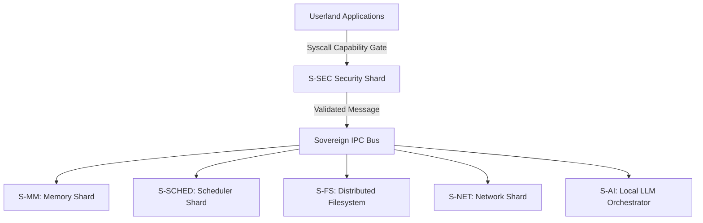

# 🛡️ SigmaOS — Sovereign, AI-Native Operating System

> **"Sovereignty is the ultimate efficiency."**
> The world's first industrial-grade microkernel designed for total digital autonomy, post-quantum resilience, and Indian industrial compliance.

---

## 🎯 Overview

SigmaOS is a sovereign, zero-dependency, AI-native operating system built entirely in Rust. It discards legacy POSIX assumptions to build a hyper-secure, capability-based microkernel designed for an AI-first, object-oriented ecosystem.

> ⚠️ **IMPORTANT STANDALONE DEPLOYMENT LIMITATION**
> **SigmaOS is currently a high-performance research project, not a consumer standalone operating system.**
> If you attempt to boot and run SigmaOS as a standalone OS today, **almost all standard applications (browsers, office suites, media players, developer tools, etc.) will not work** because the underlying subsystems they depend on are still incomplete or only partially implemented.
> For a detailed diagnostic breakdown and what needs to be built, please read our [Standalone OS Application Readiness Plan](https://github.com/AaryanSinghChauhan09/SigmaOS/wiki/What-Is-Working-and-What-Is-Not).

### 🚫 Standalone Operating System Application Limitations

| Application Type | Why It Won't Work | SigmaOS Status |
| :--- | :--- | :--- |
| **Web Browsers** | Require TCP/IP stack, SSL, rendering engines | Networking stack incomplete |
| **Office Suites** | Need GUI, fonts, file I/O | Zenith Desktop prototype only; filesystem unstable |
| **Media Players** | Depend on audio/video drivers | SigmaMedia incomplete; no audio/video drivers |
| **Games** | Require GPU, input devices, sound | No GPU drivers, USB HID missing |
| **Development Tools** | Need shell, compiler toolchains, package manager | `sigma-sh` not implemented; `sigma-pkg` recipes incomplete |
| **Networking Apps** | Browsers, chat apps, cloud sync | TCP/UDP stack incomplete; no IPv6 |
| **Security Apps** | Require encryption, sandboxing, access control | Security policy only conceptual |
| **Productivity Apps** | Calendars, note-taking, task managers | GUI and filesystem not stable |
| **India Stack Apps** | UPI, GST, multilingual services | 0% implemented |

### ✅ Subsystems Required For Standalone Application Readiness

To transition SigmaOS from a simulated/unit-tested environment to a standalone usable OS, the following core subsystems must be built:
1. **Networking Stack:** Complete socket support and protocol bridges for browsers, chat, and cloud sync.
2. **Driver Framework:** Real silicon drivers for GPUs, USB HID (keyboards, mice), and audio/video output.
3. **Filesystem Stability:** Write journaling and recovery protocols for file storage.
4. **Shell + Package Manager:** Standalone `sigma-sh` interpreter and complete package recipes for developers.
5. **GUI Compositor:** Framebuffers, window managers, and compositing loops for desktop tools.

### Core Pillars

- **Post-Quantum Cryptography**: Native Kyber-1024 KEM + Dilithium-5 signatures (NIST FIPS 203/204).
- **Capability-Based Security**: 64-bit hardware-enforced permission model replacing legacy ACLs.
- **Shard Architecture**: 600+ hot-swappable kernel modules with zero-latency IPC.
- **AI-Native Design**: Local LLM inference as a first-class OS primitive.
- **India-First**: Native GST, Income Tax, UPI, and 22-language support.


---

## 📊 System Architecture

SigmaOS decomposes the traditional monolithic kernel into specialized, isolated shards. The interaction between these shards is governed by a capability-enforced transaction bus.



- **S-MM**: Sovereign Memory Manager (Buddy Allocator).
- **S-SCHED**: Predictive Multi-Priority Scheduler (MLFQ + CFS + EDF).
- **S-FS**: Sovereign Distributed Filesystem (VFS + SigmaFS).
- **S-SEC**: Security Framework (PQC + MAC + Sandbox).
- **S-AI**: AI Task Orchestrator (Local LLM routing).


---

## 🚀 Quick Start

### Running the QEMU Demo (Works Today)

Ensure you have the required compiler toolchain and emulation packages:

```bash

# Install dependencies

sudo apt install -y build-essential nasm cmake qemu-system-x86 golang-go xorriso

# Clone the repository

git clone https://github.com/AaryanSinghChauhan09/SigmaOS.git
cd SigmaOS

# Build the system image

make clean && make all -j$(nproc)

# Run in QEMU

qemu-system-x86_64 -cdrom build/sigmaos.iso -m 2G -serial stdio
```

### Profile Builds

SigmaOS supports declarative compilation profiles specified at build-time:

```bash
make PROFILE=standalone all    # Full desktop ISO
make PROFILE=rtos all          # Hard real-time ELF
make PROFILE=cloud all         # Headless cloud image
make PROFILE=browser all       # WASM bundle
```

---

## 🔒 Security & Sandboxing

SigmaOS features a capability-native access control system. Programs are executed with explicit privilege tokens (capabilities) rather than generic user IDs.

```rust
// Capability delegation example
let token = CapabilityToken::new()
    .allow_network("tcp", 80)
    .allow_read("/var/www");
```

For a detailed review of all security policies, see the canonical [Security Framework](https://github.com/AaryanSinghChauhan09/SigmaOS/wiki) page on the Wiki.

---

## 📚 Canonical Documentation (GitHub Wiki)

```text
Phase F (Competitor Crusher)   ████████████████████  100% ✅
Phase G (Kernel Boot)          ████████████░░░░░░░░   60% ← ACTIVE
Phase H (India Stack)          ░░░░░░░░░░░░░░░░░░░░    0% (blocked on G)
```

### Current Status

- ✅ Kernel scheduler (MLFQ+CFS+EDF)
- ✅ Syscalls (I/O + Process)
- ✅ Physical MM (buddy allocator)
- 🔄 Virtual MM (paging) - Partial
- ✅ APIC + timer
- ✅ sigma_pledge + sigma_unveil
- ✅ Kyber-1024 KEM + Dilithium-5
- 🔄 TCP/UDP stack - Partial
- ✅ Ext4 + FAT32 filesystems
- ✅ NVMe + USB xHCI drivers
- ✅ Zenith Desktop prototype
- ✅ sigma-pkg CLI
- ⬜ Bootable ISO (Phase G)


---

## 🤝 Contributing

We welcome contributions! See [CONTRIBUTING.md](CONTRIBUTING.md) for guidelines.

### High-Impact Areas

- Round-robin scheduler implementation
- Buddy allocator completion
- sigma-sh REPL
- USB HID keyboard driver
- VESA framebuffer driver
- Package recipes


---

## 📚 Documentation

### Repository Documentation

- [Documentation Audit](docs/doc_audit_backlog.md) — Implementation status
- [Roadmap](Roadmap.md) — Development plan
- [INSTALL.md](INSTALL.md) — Build instructions
- [CONTRIBUTING.md](CONTRIBUTING.md) — Contribution guidelines
- [SECURITY_POLICY.md](SECURITY_POLICY.md) — Security policy
- [SUPPORT.md](SUPPORT.md) — Support and troubleshooting
- [FAQ](FAQ.md) — Common questions (coming soon)


### GitHub Wiki (Canonical Documentation)

Detailed conceptual documentation is managed exclusively in the GitHub Wiki:

- **Master Roadmap**: [Maturity & Distro-Parity Roadmap](https://github.com/AaryanSinghChauhan09/SigmaOS/wiki/Maturity_Parity_Roadmap)
- **Advanced Core Architecture**: [Advanced Absorption Matrix](https://github.com/AaryanSinghChauhan09/SigmaOS/wiki/Advanced_Absorption)
- **Filesystem Design**: [SigmaFS Innovations](https://github.com/AaryanSinghChauhan09/SigmaOS/wiki/SigmaFS_Innovations)
- **Interactive UI Compositor**: [SigmaMedia Frameworks](https://github.com/AaryanSinghChauhan09/SigmaOS/wiki/SigmaMedia_Frameworks)
- **Local AI Daemon**: [Sigma AI Agents](https://github.com/AaryanSinghChauhan09/SigmaOS/wiki/Sigma_AI_Agents)


---

## 📄 License

Dual-licensed under MIT and GPL-2.0. See the `LICENSE` file for details.
