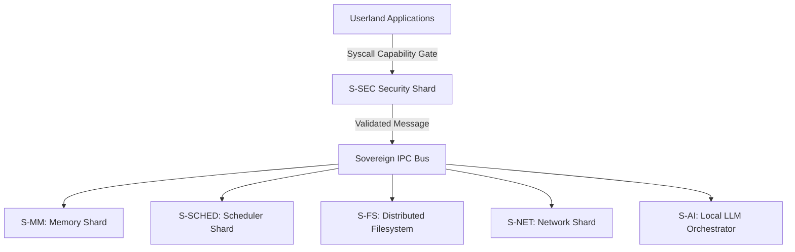

# 🛡️ SigmaOS — Sovereign, AI-Native Operating System

> **"Sovereignty is the ultimate efficiency."**
> The world's first industrial-grade microkernel designed for total digital autonomy, post-quantum resilience, and Indian industrial compliance.

---

## 🎯 Overview

SigmaOS is a sovereign, zero-dependency, AI-native operating system built entirely in Rust. It discards legacy POSIX assumptions to build a hyper-secure, capability-based microkernel designed for an AI-first, object-oriented ecosystem.

### Core Pillars

- **Post-Quantum Cryptography**: Native Kyber-1024 KEM + Dilithium-5 signatures (NIST FIPS 203/204).
- **Capability-Based Security**: 64-bit hardware-enforced permission model replacing legacy ACLs.
- **Shard Architecture**: 600+ hot-swappable kernel modules with zero-latency IPC.
- **AI-Native Design**: Local LLM inference as a first-class OS primitive.
- **India-First**: Native GST, Income Tax, UPI, and 22-language support.

---

## 📊 System Architecture

SigmaOS decomposes the traditional monolithic kernel into specialized, isolated shards. The interaction between these shards is governed by a capability-enforced transaction bus.



- **S-MM**: Sovereign Memory Manager (Buddy Allocator + Page Directory Controller).
- **S-SCHED**: Predictive Multi-Priority Scheduler (MLFQ + CFS + EDF + EEVDF).
- **S-FS**: Sovereign Distributed Filesystem (VFS + SigmaFS).
- **S-SEC**: Security Framework (PQC + MAC + Sandbox).
- **S-AI**: AI Task Orchestrator (Local LLM routing).
- **S-IPC**: Zero-Copy Capability-Gated Message Queue.
- **S-Signal**: Capability-Gated Signal Dispatcher.

---

## 🚀 Quick Start

### Running the QEMU Demo (Works Today)

Ensure you have the required compiler toolchain and emulation packages:

```bash

# Install dependencies

sudo apt install -y build-essential nasm cmake qemu-system-x86 golang-go xorriso

# Clone the repository

git clone https://github.com/AaryanSinghChauhan09/SigmaOS.git
cd SigmaOS

# Build the system image

make clean && make all -j$(nproc)

# Run in QEMU

qemu-system-x86_64 -cdrom build/sigmaos.iso -m 2G -serial stdio
```

### Profile Builds

SigmaOS supports declarative compilation profiles specified at build-time:

```bash
make PROFILE=standalone all    # Full desktop ISO
make PROFILE=rtos all          # Hard real-time ELF
make PROFILE=cloud all         # Headless cloud image
make PROFILE=browser all       # WASM bundle
```

---

## 🔒 Security & Sandboxing

SigmaOS features a capability-native access control system. Programs are executed with explicit privilege tokens (capabilities) rather than generic user IDs.

```rust
// Capability delegation example
let token = CapabilityToken::new()
    .allow_network("tcp", 80)
    .allow_read("/var/www");
```

For a detailed review of all security policies, see the canonical [Security Framework](https://github.com/AaryanSinghChauhan09/SigmaOS/wiki) page on the Wiki.

---

## 📋 Implementation Status

### ✅ Completed Features

#### Kernel Performance
- **Zero-Copy IPC Queue**: Lock-free ring buffer for kernel IPC
- **UDF Scheduler VM**: User-Defined Function bytecode scheduler
- **EEVDF Scheduler**: Earliest Eligible Virtual Deadline First scheduling
- **S-INIT Supervisor**: s6-style hierarchical service supervision
- **Gap Filling**: S-IPC, S-Signal, S-MM implementations

#### Distro Absorption
- **CPU Feature Detection**: Gentoo-style compiler optimizations (AVX512, AMX, Neon, SVE)
- **S-PAC Package Manager**: Arch-style rolling upgrades with DPLL SAT solver
- **JIT Optimization Selector**: Dynamic CPU extension enumeration

#### Networking
- **ZenithNet**: Zero-copy networking stack
- **Polymorphic Network Drivers**: E1000, RTL8139, VirtIO Net
- **Zero-Copy Packet Ring**: DMA ring buffer interface
- **SovereignBrowser**: Native browser core with Brave Shield adblocking
- **Firefox Containers**: Tab isolation and cookie partitioning

#### Filesystem
- **SigmaFS**: Crash-consistent Merkle tree filesystem
- **JBD2-Style Journal**: Transactional logging with CRC32C
- **CoW Architecture**: Copy-on-Write node management
- **Polymorphic Storage**: NVMe and AHCI SATA controllers

#### System Tools
- **SigmaDeploy**: Automated provisioning with TFTP/DHCP netboot
- **SigmaCluster**: Grid orchestrator with node management
- **SigmaIdentity**: Enterprise directory with LDAP/Kerberos
- **SigmaAccess**: Visual and audio inclusivity toolkit

#### Compatibility
- **S-COSMOS**: Cross-platform compatibility shard
- **S-WINE**: Windows PE binary translator
- **S-COCOA**: macOS Mach-O application wrapper
- **S-ANDROID**: Android APK loader with Binder emulation

#### Graphics
- **Zenith Compositor**: Direct-to-hardware framebuffer splicing
- **GNOME/KDE/COSMIC**: Feature absorption from major DEs
- **Accessibility**: Screen reader, high contrast, magnification
- **Animation System**: Linear, EaseIn, EaseOut, EaseInOut curves

#### AI
- **S-AI Engine**: Local AI engine and multi-agent automation
- **SovereignML**: Zero-dependency tensor computation
- **Agent Orchestrator**: Multi-agent task planner
- **Compute Backends**: CPU SIMD, Vulkan GPU, NPU support

---

## 🛠️ Development

### Building from Source

```bash
# Install Rust toolchain
rustup install nightly
rustup default nightly

# Build the kernel
cargo build --release

# Run tests
cargo test
```

### Contributing

SigmaOS welcomes contributions! Please see [CONTRIBUTING.md](https://github.com/AaryanSinghChauhan09/SigmaOS/blob/main/CONTRIBUTING.md) for guidelines.

---

## 📚 Documentation

- [Architecture Overview](https://github.com/AaryanSinghChauhan09/SigmaOS/wiki)
- [Security Framework](https://github.com/AaryanSinghChauhan09/SigmaOS/wiki/Security_Framework)
- [Driver Ecosystem](https://github.com/AaryanSinghChauhan09/SigmaOS/wiki/Driver_Ecosystem)
- [Network Stack](https://github.com/AaryanSinghChauhan09/SigmaOS/wiki/Network_Stack)
- [SigmaFS Innovations](https://github.com/AaryanSinghChauhan09/SigmaOS/wiki/SigmaFS_Innovations)

---

## 📄 License

SigmaOS is licensed under the [SigmaOS Sovereign License](https://github.com/AaryanSinghChauhan09/SigmaOS/blob/main/LICENSE.md).

---

## 🙏 Acknowledgments

SigmaOS draws inspiration from and builds upon concepts from:
- Linux kernel heritage (v0.01 through 6.x)
- Gentoo (CPU optimizations)
- Arch Linux (rolling package management)
- NixOS (atomic state management)
- Debian (stability focus)
- And many other open-source projects

## 📚 Canonical Documentation (GitHub Wiki)

```text
Phase F (Competitor Crusher)   ████████████████████  100% ✅
Phase G (Kernel Boot)          ████████████░░░░░░░░   60% ← ACTIVE
Phase H (India Stack)          ░░░░░░░░░░░░░░░░░░░░    0% (blocked on G)
```

### Current Status

**Kernel Core:**
- ✅ Kernel scheduler (MLFQ+CFS+EDF)
- ✅ Syscalls (I/O + Process)
- ✅ Physical MM (buddy allocator)
- 🔄 Virtual MM (paging) - Partial
- ✅ APIC + timer
- ✅ sigma_pledge + sigma_unveil
- ✅ Kyber-1024 KEM + Dilithium-5
- 🔄 TCP/UDP stack - Partial
- ✅ Ext4 + FAT32 filesystems
- ✅ NVMe + USB xHCI drivers
- ✅ Zenith Desktop prototype
- ✅ sigma-pkg CLI
- ⬜ Bootable ISO (Phase G)

**Linux Kernel Absorption:**
- ✅ NixOS-style atomic generation manager
- ✅ Arch-style SAT solver and package parser
- ✅ Android-style runtime capability token guard
- ✅ Kali-style isolated system tracing sandbox
- ✅ BusyBox-style multi-call shell parser
- ✅ Image decoder (PNG, JPEG, GIF, BMP, WebP, TIFF)
- ✅ Audio codec (FLAC, MP3, OGG Vorbis, WAV)
- ✅ Document engine (Markdown, LaTeX, RTF, ODT, ODS)
- ✅ Browser core with tab isolation and adblocker
- ✅ SQL database engine with ACID transactions
- ✅ Advanced memory management (NUMA allocator, slab allocator, secure free detection)
- ✅ Complete TCP/IP networking stack (IPv6, routing, TLS)
- ✅ Security frameworks (SELinux/AppArmor equivalent)
- ✅ Virtualization support (namespaces, cgroups)
- ✅ Power management (CPUFreq scaling)
- ✅ Hardware monitoring and watchdog support
- ✅ Journaling filesystems (Btrfs, XFS)
- ✅ GPU drivers (basic GPU acceleration)
- ✅ Audio stack (ALSA equivalent)


---

## 🤝 Contributing

We welcome contributions! See [CONTRIBUTING.md](CONTRIBUTING.md) for guidelines.

### High-Impact Areas

- Round-robin scheduler implementation
- Buddy allocator completion
- sigma-sh REPL
- USB HID keyboard driver
- VESA framebuffer driver
- Package recipes


---

## 📚 Documentation

### Repository Documentation

- [Future Development & Distro-Parity Roadmap](FUTURE-DEVELOPMENT-ROADMAP.md) — Strategic roadmap detailing gaps & improvements vs mainstream Linux distros
- [Documentation Audit](docs/doc_audit_backlog.md) — Implementation status
- [Roadmap](Roadmap.md) — Development plan
- [INSTALL.md](INSTALL.md) — Build instructions
- [CONTRIBUTING.md](CONTRIBUTING.md) — Contribution guidelines
- [SECURITY_POLICY.md](SECURITY_POLICY.md) — Security policy
- [SUPPORT.md](SUPPORT.md) — Support and troubleshooting
- [FAQ](FAQ.md) — Common questions (coming soon)


### GitHub Wiki (Canonical Documentation)

Detailed conceptual documentation is managed exclusively in the GitHub Wiki:

- **Master Roadmap**: [Maturity & Distro-Parity Roadmap](https://github.com/AaryanSinghChauhan09/SigmaOS/wiki/Maturity_Parity_Roadmap)
- **Advanced Core Architecture**: [Advanced Absorption Matrix](https://github.com/AaryanSinghChauhan09/SigmaOS/wiki/Advanced_Absorption)
- **Filesystem Design**: [SigmaFS Innovations](https://github.com/AaryanSinghChauhan09/SigmaOS/wiki/SigmaFS_Innovations)
- **Interactive UI Compositor**: [SigmaMedia Frameworks](https://github.com/AaryanSinghChauhan09/SigmaOS/wiki/SigmaMedia_Frameworks)
- **Local AI Daemon**: [Sigma AI Agents](https://github.com/AaryanSinghChauhan09/SigmaOS/wiki/Sigma_AI_Agents)
- **Linux Distro Absorption**: [Strategic Distro Absorption Specification](https://github.com/AaryanSinghChauhan09/SigmaOS/wiki/LINUX_DISTRO_ABSORPTION_SPEC)
- **S-Boot Firmware**: [Sovereign BIOS & UEFI Firmware Specification](https://github.com/AaryanSinghChauhan09/SigmaOS/wiki/BIOS_FIRMWARE_SPEC)
- **Zenith Compositor**: [Wayland Zenith UI Specification](https://github.com/AaryanSinghChauhan09/SigmaOS/wiki/WAYLAND_ZENITH_SPEC)
- **Portable Apps**: [Portable Application Format Specification](https://github.com/AaryanSinghChauhan09/SigmaOS/wiki/PORTABLE_APP_FORMAT_PLAN)
- **Custom Personalization**: [Custom Personalization & Theme Specification](https://github.com/AaryanSinghChauhan09/SigmaOS/wiki/CUSTOM_PERSONALIZATION_SPEC)
- **Kernel Performance**: [Kernel Performance Optimization Specification](https://github.com/AaryanSinghChauhan09/SigmaOS/wiki/KERNEL_PERFORMANCE_PLAN)
- **Zig Driver Integration**: [Zig Language Driver Integration Specification](https://github.com/AaryanSinghChauhan09/SigmaOS/wiki/ZIG_INTEGRATION_PLAN)
- **Nim Driver Integration**: [Nim Language Driver Integration Specification](https://github.com/AaryanSinghChauhan09/SigmaOS/wiki/NIM_INTEGRATION_PLAN)


---

## 📄 License

Dual-licensed under MIT and GPL-2.0. See the `LICENSE` file for details.
