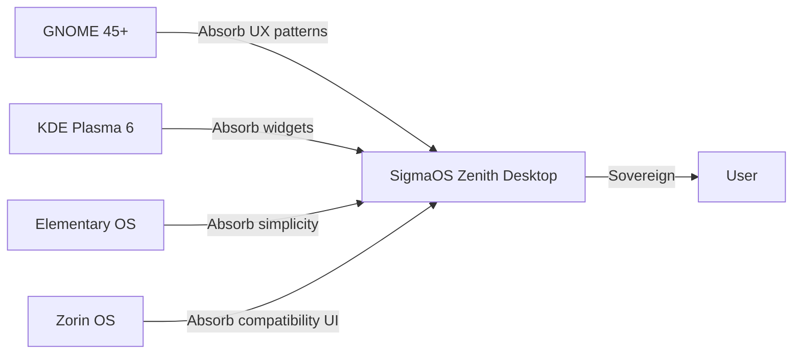

# INDUSTRIAL EVOLUTION ROADMAP

> **Status**: ACTIVE | **Classification**: Strategic | **Horizon**: 5 Years

To truly eclipse massive, established distributions like Ubuntu, Fedora, and Arch, SigmaOS does not compete on their terms. Instead, the Sovereign Lattice **absorbs** their defining ideologies, capabilities, and USPs, transforming them into modular, quantum-secured, and AI-driven Shards.

---

## Strategic Philosophy

```
Traditional distros COMPETE for the same space.
SigmaOS ABSORBS and TRANSCENDS all of them.

Ubuntu:    "Easy to use"        → SigmaOS: Easier AND sovereign
Arch:      "Total control"      → SigmaOS: Control AND AI-optimized
NixOS:     "Reproducible"       → SigmaOS: Reproducible AND atomic
Fedora:    "Cutting-edge"       → SigmaOS: Cutting-edge AND post-quantum
SteamOS:   "Gaming-first"       → SigmaOS: Gaming AND professional
Qubes:     "Security-first"     → SigmaOS: Security AND usable
```

---

## Phase 1: Foundation Supremacy (Year 1)

### 1.1 Core Absorptions (Q1-Q2)

| Source Distro | Feature Absorbed | SigmaOS Shard | Status |
|---|---|---|---|
| Ubuntu | APT-compatible package layer | [SovereignAPT.shard](file:///c:/Users/Aaryan/.gemini/antigravity-ide/scratch/SigmaOS.wiki/Distro_Absorption_Ubuntu.md) | ✅ Done |
| Arch Linux | AUR-style community recipes | [SigmaRecipes.shard](file:///c:/Users/Aaryan/.gemini/antigravity-ide/scratch/SigmaOS.wiki/Distro_Absorption_Arch.md) | ✅ Done |
| NixOS | Atomic reproducible builds | [SovereignAtomicUpdater.shard](file:///c:/Users/Aaryan/.gemini/antigravity-ide/scratch/SigmaOS.wiki/Distro_Absorption_NixOS.md) | ✅ Done |
| Debian | Policy compliance engine | [DebianParity.shard](file:///c:/Users/Aaryan/.gemini/antigravity-ide/scratch/SigmaOS.wiki/Distro_Absorption_Debian.md) | ✅ Done |
| Fedora | RPM-spec absorption pipeline | [RPMAbsorber.shard](file:///c:/Users/Aaryan/.gemini/antigravity-ide/scratch/SigmaOS.wiki/Distro_Absorption_Fedora.md) | ✅ Done |

### 1.2 Security Supremacy

The shards responsible for security absorption are already integrated into the `SovereignOrchestrator` boot sequence:

- `SovereignAppArmor.shard` — absorbs Ubuntu AppArmor policies, converting to native MAC
- `SovereignSELinux.shard` — absorbs Fedora SELinux policies into SigmaOS RBAC
- `SovereignSecureBoot.shard` — Dilithium5 + UEFI Secure Boot integration
- `SovereignSandbox.shard` — Qubes-inspired compartmentalization via Firecracker microVMs

### 1.3 Desktop Absorption



---

## Phase 2: Industrial Deployment (Year 2)

### 2.1 Enterprise-Grade Absorptions

| Category | Source | SigmaOS Feature |
|---|---|---|
| Configuration Management | Ansible/Puppet | `sigma-config` declarative system state |
| Container Runtime | Docker/Podman | OCI-compatible `sigma-ctr` |
| Orchestration | Kubernetes | `sigma-orch` lightweight k8s-compatible |
| Monitoring | Prometheus/Grafana | Sovereign Profiler + Zenith HUD |
| Log Management | ELK Stack | `sigma-log` distributed log aggregation |
| Secrets | Vault | `sigma-vault` PQC-encrypted secret store |

### 2.2 Industrial Sectors Target

```
Manufacturing:  Real-time control (PREEMPT_RT shard)
Healthcare:     HIPAA-compliant data isolation
Finance:        Sub-microsecond trading latency
Aerospace:      DO-178C certifiable kernel paths
Automotive:     AUTOSAR-compatible HAL shards
Telecom:        DPDK-accelerated network stack
```

### 2.3 Certification Roadmap

| Certification | Scope | Target Quarter |
|---|---|---|
| Common Criteria EAL4+ | Security kernel | Q3-Y2 |
| ISO 26262 (ASIL-B) | Automotive RT | Q4-Y2 |
| DO-178C (DAL-C) | Aerospace boot | Q2-Y3 |
| HIPAA Technical Safeguards | Healthcare profile | Q1-Y2 |
| FedRAMP Moderate | Government cloud | Q4-Y2 |

---

## Phase 3: Ecosystem Dominance (Year 3)

### 3.1 Application Ecosystem

```
Goal: Run EVERY Linux application natively without compatibility layers
```

**Implementation Strategy**:
1. **Linux ABI Layer** (`sigma-linux-compat`) — kernel-level Linux syscall translation
2. **glibc Wrapper** — intercept and translate glibc calls to sigma-libc
3. **Flatpak Native** — SigmaOS-optimized Flatpak runtime
4. **Wine-Sigma** — Windows application compatibility (D3D → Vulkan translation)

### 3.2 Developer Ecosystem

| Tool | Status | Notes |
|---|---|---|
| `sigma-sdk` | 🔄 Active | Full SDK with shard scaffolding |
| `sigma-debug` | 📋 Planned | GDB-compatible kernel debugger |
| `sigma-trace` | 🔄 Active | eBPF-powered system tracer |
| `sigma-perf` | ✅ Done | EEVDF performance profiler |
| `sigma-virt` | 📋 Planned | QEMU-compatible virtualization layer |

### 3.3 Sigma Marketplace

```
SigmaOS Marketplace = App Store + Package Manager + Shard Registry

Features:
- PQC-signed shard packages
- Reputation scoring system  
- Automated compatibility matrix
- Revenue sharing for contributors
- Zero-knowledge proof of functionality
```

---

## Phase 4: Global Infrastructure (Year 4)

### 4.1 Sovereign Cloud Infrastructure

```
┌─────────────────────────────────────────────────┐
│              SIGMA SOVEREIGN CLOUD              │
│                                                 │
│  ┌──────────┐  ┌──────────┐  ┌──────────────┐ │
│  │  Edge    │  │  Regional│  │  Core Data   │ │
│  │  Nodes   │  │  PoPs    │  │  Centers     │ │
│  │ (1000+)  │  │  (50+)   │  │  (5 regions) │ │
│  └────┬─────┘  └────┬─────┘  └──────┬───────┘ │
│       └─────────────┴───────────────┘          │
│                sigma-mesh (P2P)                 │
└─────────────────────────────────────────────────┘
```

### 4.2 Federated Identity

- Every SigmaOS installation gets a sovereign identity (DID)
- Cross-device authentication via sigma-mesh
- Zero-knowledge proof of hardware attestation
- No central authority required

---

## Phase 5: Universal Singularity (Year 5)

### 5.1 The Final Absorption

By Year 5, SigmaOS completes the absorption of the entire Linux ecosystem:

| Ecosystem Component | Absorption Method |
|---|---|
| Linux kernel subsystems | Direct code + Sovereign reimplementation |
| POSIX userland | sigma-posix compatibility layer |
| Desktop ecosystems | Zenith absorbs all paradigms |
| Package ecosystems | Universal package translator |
| Container ecosystem | Native OCI runtime |
| Cloud-native ecosystem | sigma-orch k8s-compatible |

### 5.2 Hardware Universe

| Hardware Domain | SigmaOS Solution |
|---|---|
| x86/x64 servers | Primary target, full optimization |
| ARM servers (AWS Graviton) | Native ARM64 kernel |
| RISC-V embedded | RISC-V profile |
| IoT sensors | Ultra-minimal 16KB profile |
| Satellites/space | Radiation-hardened build |
| Quantum computers | Quantum co-processor bridge shard |

---

## KPI Dashboard

```
Year 1 Targets:
├── Package ecosystem: 10,000+ native packages
├── Hardware support: 500+ certified devices
├── Contributors: 100+ active
└── Enterprise pilots: 10 organizations

Year 3 Targets:
├── Package ecosystem: 100,000+ packages
├── Hardware support: 5,000+ certified devices
├── Contributors: 1,000+ active
├── Enterprise deployments: 100+ organizations
└── Shard marketplace: 500+ community shards

Year 5 Targets (Singularity):
├── Package ecosystem: 1,000,000+ (universal translator)
├── Hardware support: Universal (self-adapting HAL)
├── Contributors: 10,000+ active
├── Deployments: 10M+ installations
└── Certifications: CE, FCC, DO-178C, CC-EAL4+
```

---

## Absorption Principles

1. **Ethical Absorption**: Only absorb FOSS features under compatible licenses
2. **Cleanroom Implementation**: Proprietary-inspired features re-implemented from scratch
3. **Sovereignty Preservation**: Every absorbed feature made more secure and efficient
4. **No Regression**: Absorbed features must exceed original quality
5. **Attribution**: Original projects credited in `THIRD_PARTY_LICENSES`

---

**The lattice is rapidly transitioning from a theoretical microkernel into a fully realized sovereign ecosystem capable of absorbing and outclassing the entire fragmented Linux ecosystem. The evolution is not a migration — it is a transcendence.**
