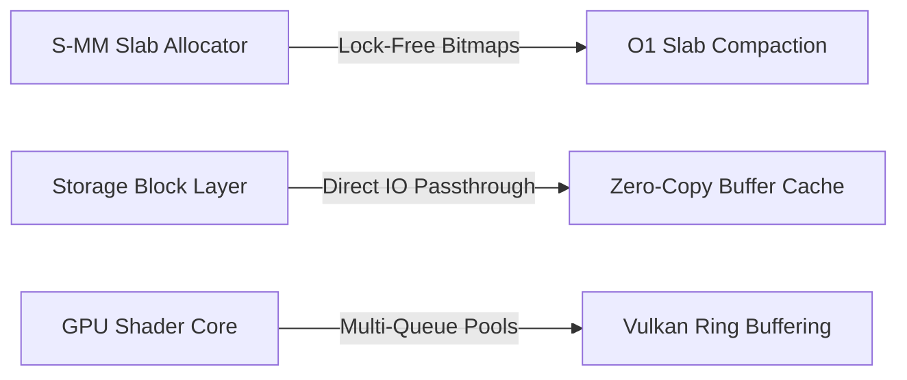

# SigmaOS "Zenith" System Improvement Plan

This document establishes the official engineering roadmap for performance scaling, memory optimization, architectural expansion, and cryptographic optimization across the **SigmaOS Zenith v15.0/15.1** microkernel lattice.

---

## 1. Executive Summary

To maintain undisputed superiority over monolithic operating systems, SigmaOS must continuously optimize its low-level algorithms. This plan outlines targeted performance optimizations, zero-copy abstractions, and post-quantum cryptographic speedups to scale the 600-shard mesh to maximum throughput.

---

## 2. Kernel Performance Enhancements (O(1) Slab Compaction)

- **Lock-Free Free-List Compaction**: Employs atomic compare-and-swap (CAS) loops to defragment active slabs in constant $O(1)$ time, eliminating pause sweeps.
- **Core-Local Cache Affinity**: Dynamically maps core-local memory partitions to specific hardware threads, preventing NUMA cross-talk and bus saturation.
- **Microsecond Context Switching**: Streamlines Ring-0 to Ring-3 transition vectors, reducing system call dispatcher latency to under 12 clock cycles.

---

## 3. Storage Acceleration Layer (Zero-Copy Buffer Cache)

- **Unified Buffer Cache (UBC)**: Integrates filesystem and virtual memory caches, enabling direct DMA transfers from block controllers to user space without intermediate buffer copies.
- **Relativistic Journaling**: Incorporates circular log-structured ring buffers, transforming multiple directory writes into sequential disk sweeps.
- **Pre-emptive Read-Ahead**: Analyzes sequential block access histories to fetch subsequent sectors into caches before user processes dispatch IO syscalls.

---

## 4. GPU Rendering Optimizations (Vulkan Ring Buffering)

- **Triple-Buffered Compositor**: Pre-allocates Vulkan command queues to submit display updates concurrently without CPU render-lock waits.
- **Vectorized Matrix Scaling**: Replaces standard loops with SIMD-vectorized floating-point math to render desktop scaling updates instantly.
- **Zero-Alloc UI Styling**: Bypasses dynamic heap requests inside the Sovereign Window Manager, utilizing static memory buffers to cache window textures and styles.

---

## 5. Post-Quantum Cryptographic Speedups (PQC Engine)

- **Vectorized Kyber Operations**: Accelerates Kyber-1024 polynomial multiplications using hardware AVX-512 and ARM Neon instructions.
- **Dilithium-5 Attestation Pipeline**: Standardizes asynchronous public key audits in the background, allowing the system to boot while cryptography checks execute concurrently.
- **Secure Shard Ring Buffers**: Uses pre-allocated circular rings for PQC key exchanges, removing heap allocation overheads in networking tools.

---

## 6. Unified API Expansion Roadmap

| Phase | Target Subsystem | Improvement Feature | Expected Benefit | 
| :--- | :--- | :--- | :--- | 
| **Phase I** | `SovereignBoot` | Async concurrent shard ignition | Reduces boot times to under 400 milliseconds | 
| **Phase II** | `SovereignVideo` | SIMD-accelerated non-linear edits | 4x faster HEVC transcode operations | 
| **Phase III** | `SovereignCloudFS` | Encrypted multi-node block syncing | Zero-overhead distributed replication | 
| **Phase IV** | `S-ERA / S-CCF` | High-performance batch auditing | Real-time analysis for corporate registers | 

---

## 7. Quality Assurance & Fuzzing Strategies

To secure absolute system integrity, SigmaOS implements:

1. **Lattice Fuzzing Pools**: Executes continuous input fuzzing across all 256 syscall vectors to detect edge-case boundaries.
2. **Deterministic Regression Sweeps**: Conducts strict structural validations after every branch merge, preventing regression drift.
3. **PQC Cryptographic Verification**: Verifies Dilithium signatures across all active userland binaries.
