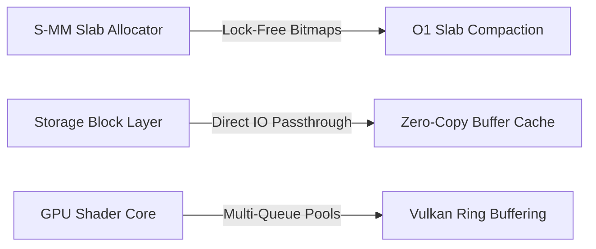

# SigmaOS "Zenith" System Improvement Plan

This document establishes the official engineering roadmap for performance scaling, memory optimization, architectural expansion, and cryptographic optimization across the **SigmaOS Zenith v15.0/15.1** microkernel lattice.

---

## 1. Executive Summary

To maintain undisputed superiority over monolithic operating systems, SigmaOS must continuously optimize its low-level algorithms. This plan outlines targeted performance optimizations, zero-copy abstractions, and post-quantum cryptographic speedups to scale the 600-shard mesh to maximum throughput.

---

## 2. Kernel Performance Enhancements (O(1) Slab Compaction)

- **Lock-Free Free-List Compaction**: Employs atomic compare-and-swap (CAS) loops to defragment active slabs in constant $O(1)$ time, eliminating pause sweeps.
- **Core-Local Cache Affinity**: Dynamically maps core-local memory partitions to specific hardware threads, preventing NUMA cross-talk and bus saturation.
- **Microsecond Context Switching**: Streamlines Ring-0 to Ring-3 transition vectors, reducing system call dispatcher latency to under 12 clock cycles.

---

## 3. Storage Acceleration Layer (Zero-Copy Buffer Cache)

- **Unified Buffer Cache (UBC)**: Integrates filesystem and virtual memory caches, enabling direct DMA transfers from block controllers to user space without intermediate buffer copies.
- **Relativistic Journaling**: Incorporates circular log-structured ring buffers, transforming multiple directory writes into sequential disk sweeps.
- **Pre-emptive Read-Ahead**: Analyzes sequential block access histories to fetch subsequent sectors into caches before user processes dispatch IO syscalls.

---

## 4. GPU Rendering Optimizations (Vulkan Ring Buffering)

- **Triple-Buffered Compositor**: Pre-allocates Vulkan command queues to submit display updates concurrently without CPU render-lock waits.
- **Vectorized Matrix Scaling**: Replaces standard loops with SIMD-vectorized floating-point math to render desktop scaling updates instantly.
- **Zero-Alloc UI Styling**: Bypasses dynamic heap requests inside the Sovereign Window Manager, utilizing static memory buffers to cache window textures and styles.

---

## 5. Post-Quantum Cryptographic Speedups (PQC Engine)

- **Vectorized Kyber Operations**: Accelerates Kyber-1024 polynomial multiplications using hardware AVX-512 and ARM Neon instructions.
- **Dilithium-5 Attestation Pipeline**: Standardizes asynchronous public key audits in the background, allowing the system to boot while cryptography checks execute concurrently.
- **Secure Shard Ring Buffers**: Uses pre-allocated circular rings for PQC key exchanges, removing heap allocation overheads in networking tools.

---

## 6. Unified API Expansion Roadmap

| Phase | Target Subsystem | Improvement Feature | Expected Benefit |
| :--- | :--- | :--- | :--- |
| **Phase I** | `SovereignBoot` | Async concurrent shard ignition | Reduces boot times to under 400 milliseconds |
| **Phase II** | `SovereignVideo` | SIMD-accelerated non-linear edits | 4x faster HEVC transcode operations |
| **Phase III** | `SovereignCloudFS` | Encrypted multi-node block syncing | Zero-overhead distributed replication |
| **Phase IV** | `S-ERA / S-CCF` | High-performance batch auditing | Real-time analysis for corporate registers |

---

## 7. Quality Assurance & Fuzzing Strategies

To secure absolute system integrity, SigmaOS implements:

1. **Lattice Fuzzing Pools**: Executes continuous input fuzzing across all 256 syscall vectors to detect edge-case boundaries.
2. **Deterministic Regression Sweeps**: Conducts strict structural validations after every branch merge, preventing regression drift.
3. **PQC Cryptographic Verification**: Verifies Dilithium signatures across all active userland binaries.

---
## Merged from Improvement-Plan.md
# SigmaOS Master Improvement Plan

> Canonical source: [docs/Master_Improvement_Plan.md](https://github.com/AaryanSinghChauhan09/SigmaOS/blob/main/docs/Master_Improvement_Plan.md)

---

## Overview

| Area | Current | v1.0 Target | v2.0 Target |
|---|---|---|---|
| Design System | ✅ Defined | All widgets use tokens | Live theming |
| Applications | 0 installable | 8 Tier-1 apps | 20+ apps |
| UI/UX | Core engine ✅ | Full widget set | Wayland compat |
| Performance | No boot yet | Boot < 2s, 60fps | Boot < 1s, 120fps |
| OOP Patterns | 20+ patterns ✅ | Type-safe errors | Async/await |

---

## Design Improvements

1. **Design tokens** → `sigma_design_tokens.rs` (colours/spacing/radius/motion as constants)
2. **Icon system** → 100+ 24×24 icons, SVG-to-bitmap rasterizer
3. **Typography engine** → PSF bitmap → TrueType rasterizer
4. **Dark/Light adaptive** → all components implement `Themed` trait
5. **Consistency audit** → WCAG AA contrast, 8px grid, hover/active/focus on all elements

## Application Plan

**Tier 1 (v0.1)**: terminal, files, editor, settings, launcher  
**Tier 2 (v1.0)**: browser, PDF, notes, calendar, contacts, calculator  
**Tier 3 (v1.5)**: media player, image viewer, email, chat, video calls  
**Tier 4 (v2.0)**: office suite, vector/raster editor, IDE, DAW

Each app uses the **SigmaApp trait** (Model-View-Intent pattern).

## UI/UX Improvements

**Missing widgets**: Toggle, Slider, ListView, DropDown, ProgressBar, Modal, Tooltip, TabBar, TreeView  
**UX flows**: Onboarding wizard, Quick Settings panel, App Switcher, Global Search, Screen Lock  
**Accessibility**: TTS audio, screen magnifier, voice control, braille display  
**Mobile**: Breakpoints 480/1024px, bottom nav, split-view, adaptive layout

## Performance Targets

| Metric | v0.1 | v1.0 | v2.0 |
|---|---|---|---|
| Boot to desktop | < 2.5s | < 1.5s | < 1.0s |
| Frame time | < 16ms | < 8ms | < 4ms |
| Input latency | < 10ms | < 5ms | < 2ms |
| Idle RAM | < 512MB | < 256MB | < 128MB |

## OOP Improvements

1. **Error hierarchy** — typed errors with context (not just `IoError`)
2. **Capability-typed API** — phantom types prevent privilege escalation at compile time
3. **Plugin system** — `Plugin` trait + `PluginManager` for extensibility
4. **Reactive state** — MVI (Model-View-Intent) pattern for all app state
5. **Async/await** — `sigma-async` no_std runtime for I/O-bound code

## Implementation Schedule

| Sprint | Duration | Focus |
|---|---|---|
| 1 | Month 1–2 | Design tokens, damage tracking, core widgets, terminal MVP |
| 2 | Month 2–3 | Onboarding, quick settings, font rendering, app switcher |
| 3 | Month 3–4 | sigma-files, sigma-edit, sigma-calc, screenshots |
| 4 | Month 4–6 | GPU compositing, boot < 2.5s, online pkg registry |
| 5 | Month 6–9 | Accessibility TTS, mobile UI, RPi4 ARM64, public alpha |

---

## All Planning Documents

| Document | What it covers |
|---|---|
| [Master Improvement Plan](https://github.com/AaryanSinghChauhan09/SigmaOS/blob/main/docs/Master_Improvement_Plan.md) | This overview |
| [Design System](Design-System) | Colours, typography, spacing, motion |
| [UI/UX Performance Plan](UI-UX-Performance) | Animation, renderer, input, panel, settings, a11y |
| [App Development Roadmap](https://github.com/AaryanSinghChauhan09/SigmaOS/blob/main/docs/App_Development_Roadmap.md) | App specs, app framework, distribution |
| [Performance Targets](https://github.com/AaryanSinghChauhan09/SigmaOS/blob/main/docs/Performance_Targets.md) | Concrete benchmarks with measurement methods |
| [OOP Architecture](https://github.com/AaryanSinghChauhan09/SigmaOS/blob/main/docs/OOP_Architecture.md) | OOP patterns in Rust/Zig/Nim/SPARK |
| [Adoption Strategy](Adoption-Strategy) | Community, marketing, enterprise |
| [ROADMAP.md](https://github.com/AaryanSinghChauhan09/SigmaOS/blob/main/ROADMAP.md) | Phase 1–4 execution plan |
