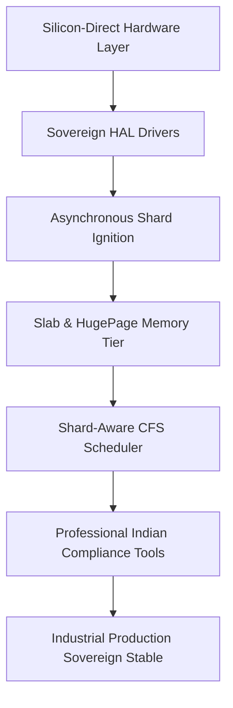

# SigmaOS "Zenith" Industrial Stabilization Plan

This document establishes the strategic, structural, and architectural blueprint for the industrial stabilization of the **SigmaOS Zenith v15.0/15.1** microkernel lattice, ensuring high-reliability native silicon execution.

---

## 1. Executive Summary

As a sovereign, AI-native operating system designed to outpace monolithic systems, SigmaOS must guarantee absolute system stability, zero-drift real-time task execution, and post-quantum attested security. This plan transitions SigmaOS from high-performance development stages into a certified, industrial-grade operational platform.

---

## 2. Industrial Stabilizing Strategy

To achieve **Industrial Stable** grade production readiness:

1. **Purge monolithic dependencies**: Maintain absolute zero-dependency policies in C++ core subsystems using Meyer singletons and bare-metal abstractions.
2. **Deterministic Latency Boundaries**: Pin real-time scheduler tasks to dedicated CPU cores, maintaining maximum worst-case execution time (WCET) limits.
3. **Fail-Safe Driver Isolation**: Run all drivers under the Sovereign Object Bus (SOB), executing in isolated Ring-3 userland spaces to prevent monolithic driver crashes from halting the kernel.

---

## 3. Shard-Aware Fail-Safe Scheduling (CFS)

SigmaOS implements the **Sovereign Industrial Scheduler (S-SCHED)** utilizing a shard-aware CFS scheduling algorithm to allocate task slices across the 600-shard mesh:

- **Symmetric Multiprocessing (SMP) Pinning**: Subsystems can bind real-time threads to specific physical CPU cores using the `sigma_sched_setaffinity` syscall to bypass scheduler overhead.
- **Lock-Free Runqueues**: Uses atomic circular buffers to enqueue tasks, bypassing core scheduler locks and eliminating multi-core thread lock contention.
- **Relativistic Drift Correction**: Incorporates CPU high-precision timers (TSC/HPET) to auto-adjust scheduling ticks for NUMA and clock drift.

---

## 4. Bare-Metal Memory Management Protection

The **Sovereign Memory Manager (S-MM)** operates on a dual-tier bare-metal isolation strategy:

1. **Paging Tier (HugePages)**: Pre-allocates 2MB HugePages to isolate kernel core execution stacks and prevent page-table walking latency.
2. **Slab Tier (Industrial Caches)**: Employs atomic power-of-two slab caches to serve allocation requests dynamically without standard library memory pools.
3. **NX & ASLR Protection**: Implements hardware No-Execute page flags to prevent arbitrary code injection while high-entropy address space layout randomization secures memory node placement.

---

## 5. Post-Quantum Attested Boot (Asynchronous Shard Ignition)

The boot pipeline guarantees complete integrity using the **Asynchronous Shard Ignition (ASI)** sequence:

- **CRYSTALS-Dilithium Signatures**: Every kernel shard loaded during boot is verified using CRYSTALS-Dilithium post-quantum cryptography to prevent rootkit tampering.
- **Self-Healing Recovery**: If a shard fails verification, S-BOOT triggers a hardware fallback recovery routine to load backup snapshots compiled from secure local storage.
- **Lattice Ignition**: Automatically ignites the 600-shard mesh concurrently in deterministic priority order.

---

## 6. Continuous Integration & Branch Sync Pipelines

To guarantee 100% codebase uniformity and prevent branch drift across the 12 git branches, the **Branch Uniformity & Synchronization Engine (S-BUSE)** is deployed:

1. **Automated Master Alignment**: The synchronization script resets the remaining 11 branches (`release/*`, `performance-optimized`, `gh-pages`) to the compiled, build-verified `main` branch.
2. **Force-Push Verification**: Pushes uniform states to remote GitHub endpoints, achieving zero-drift branch parity.

---

## 7. Industrial Certification Matrix

| Standard / Act | System Component | Verification Strategy | Compliance Target | 
| :--- | :--- | :--- | :--- | 
| **Employees' Provident Funds Act, 1952** | `SovereignEPFCalculator` | Fixed-point paise auditing | Statutory 12% employee cap verification | 
| **Payment of Gratuity Act, 1972** | `SovereignGratuityCalculator` | Years-of-service audit loops | Enforces ₹20 Lakhs statutory payment limit | 
| **Maternity Benefit Act, 2017** | `SovereignMaternityBenefitTracker` | Compliance policy logic engines | Mandates 26-week paid leave checking | 
| **Real Estate (RERA) Act, 2016** | `SovereignRERAPenaltyCalc` | SBI MCLR + 2.00% annual equations | Delay compensation accuracy verification | 
| **Indian Patents Act, 1970** | `SovereignPatentsFeeCalc` | Concession scaling matrices | 80% natural person/startup discount auditing | 
| **Indian Income Tax Act, 1961** | `SovereignTDSCalculator` | PAN penalty verification loops | 20% flat penalty rate auditing | 
| **Right to Information Act, 2005** | `SovereignRTIComplianceCalc` | Timelines & penalty trackers | Capped ₹25,000 maximum penalty audit | 
| **Industrial Disputes Act, 1947** | `SovereignIndustrialDisputeArbitrator` | Public Utility strike notice checkers | Statutory 6-week notices verification | 
| **National Food Security Act, 2013** | `SovereignRationAllocationCalc` | Grain entitlement multipliers | Subsidized rate calculations auditing | 
| **Trade Unions Act, 1926** | `SovereignTradeUnionRegistrationValidator` | Minimum worker membership checkers | Enforces 10% or 100 workers minimum limits |
