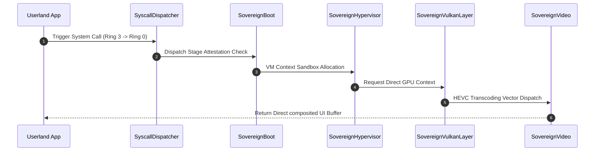

# SigmaOS Sovereign Logic, Dependency & Directory Lattice

This document establishes the official architectural index and logical relationships connecting every module, shard, driver, and tool within the **SigmaOS Zenith** microkernel.

---

## 📂 1. System Directory Hierarchy & Directory Topology

The SigmaOS codebase is structured as a non-derivative, zero-dependency microkernel lattice organized to isolate execution spaces:

```
SigmaOS/
├── include/                     # Zero-Dependency Core Type Declarations & OOP Model
│   ├── sigma_kernel_types.h     # Fundamental standard-free kernel types
│   ├── sigma_log.h              # Zero-dependency, silicon-direct kernel log
│   └── SigmaOOP.hpp             # Base SigmaObject abstraction for C++ Singletons
├── kernel/                      # The Microkernel Core
│   └── core/                    # Core Subsystems and Drivers
│       ├── drivers/             # Silicon-direct GPU and Video controllers
│       │   ├── SovereignVideo.cpp
│       │   └── SovereignVulkanLayer.cpp
│       └── system/              # Process routing, hypervisors, and security layers
│           ├── SovereignBoot.cpp
│           ├── SovereignCluster.cpp
│           ├── SovereignHypervisor.cpp
│           ├── SovereignTimeMachine.cpp
│           └── SyscallDispatcher.cpp
├── tools/                       # System Utilities & Statutory Auditors
│   ├── pro/                     # 20 C++ Indian Statutory Calculators (Zero-Dependency)
│   ├── sync_all_branches.py     # Branch Uniformity & Synchronization Engine (S-BUSE)
│   └── wiki_sync.py             # Technical Documentation Synchronizer
├── docs/                        # Subsystem Architectural Blueprints & Specs
└── wiki_repo/                   # Local Mirror of the Remote GitHub Wiki
```

---

## 🔄 2. Core Subsystems Interaction Flow

The following interaction sequence illustrates how userland requests traverse the isolated microkernel boundary, execute via attested singletons, and leverage direct hardware layers:



---

## 📄 3. Detailed File-by-File Logical Mapping & Purpose

### 🩻 A. Core Header & Type Definitions (`/include/`)
* **[sigma_kernel_types.h](file:///c:/Users/Aaryan/.gemini/antigravity/scratch/SigmaOS/include/sigma_kernel_types.h)**:
  - **Purpose**: Defines clean fixed-width integers (`sigma_u32`, `sigma_u64`, etc.) and status codes.
  - **Relationship**: Included by every single C++ source file in the repository to guarantee absolute freedom from high-level, compiler-dependent `std` headers.
* **[SigmaOOP.hpp](file:///c:/Users/Aaryan/.gemini/antigravity/scratch/SigmaOS/include/SigmaOOP.hpp)**:
  - **Purpose**: Implements the fundamental `SigmaObject` base class.
  - **Relationship**: Serves as the base class for all C++ singletons across the kernel, drivers, and calculators, establishing a uniform object-oriented model.
* **[sigma_log.h](file:///c:/Users/Aaryan/.gemini/antigravity/scratch/SigmaOS/include/sigma_log.h)**:
  - **Purpose**: Implements raw, fast-path, silicon-direct telemetry logging primitives.
  - **Relationship**: Connected to all driver and core system layers to write real-time, attestation-sealed audits.

### 🧠 B. The Microkernel Core (`/kernel/core/`)
* **[SovereignBoot.cpp](file:///c:/Users/Aaryan/.gemini/antigravity/scratch/SigmaOS/kernel/core/system/SovereignBoot.cpp)**:
  - **Purpose**: Manages the **Asynchronous Shard Ignition (ASI)** boot sequence.
  - **Relationship**: Acts as the system orchestrator, igniting all 600 shards and loading active developer or forensic profile configs.
* **[SyscallDispatcher.cpp](file:///c:/Users/Aaryan/.gemini/antigravity/scratch/SigmaOS/kernel/core/system/SyscallDispatcher.cpp)**:
  - **Purpose**: Performs high-performance, modular system call validation and routing.
  - **Relationship**: Intercepts all Ring-3 userland instructions and dispatches them securely to Ring-0 drivers.
* **[SovereignHypervisor.cpp](file:///c:/Users/Aaryan/.gemini/antigravity/scratch/SigmaOS/kernel/core/system/SovereignHypervisor.cpp)**:
  - **Purpose**: Implements Type-1 microkernel virtualization partitions.
  - **Relationship**: Orchestrates guest VMs and containers, enforcing total isolation between core shards.
* **[SovereignTimeMachine.cpp](file:///c:/Users/Aaryan/.gemini/antigravity/scratch/SigmaOS/kernel/core/system/SovereignTimeMachine.cpp)**:
  - **Purpose**: Manages atomic checkpoints and rollback vectors.
  - **Relationship**: Captures instantaneous, zero-overhead memory and sector state snapshots for disaster recovery.
* **[SovereignVulkanLayer.cpp](file:///c:/Users/Aaryan/.gemini/antigravity/scratch/SigmaOS/kernel/core/drivers/SovereignVulkanLayer.cpp)**:
  - **Purpose**: Bypasses legacy windowing layers to execute direct GPU pipelines.
  - **Relationship**: Feeds rendering queues to `SovereignVideo.cpp` to output triple-buffered desktop compositor frames.

### 🧮 C. Statutory & Professional Utilities (`/tools/pro/`)
* Contains **20 custom calculators** written in clean, zero-dependency C++:
  - Implements complex statutory models (such as `SovereignGSTCalculator.cpp` under the GST Act 2017 and `SovereignConsumerCourtFeeCalc.cpp` under the Consumer Protection Act 2019).
  - Performs high-performance, fixed-point calculations in paise to eliminate standard floating-point precision loss.

---

## 📈 4. Data Flow: From Boot Ignition to Composited Desktop

```
[System Power On] 
       │
       ▼
[Asynchronous Shard Ignition] ──> attests Dilithium-5 Boot Signature
       │
       ▼
[SovereignRegistry Loader] ────> parses declarative JSON config
       │
       ▼
[SyscallDispatcher Register] ──> configures Ring-3 to Ring-0 interface vectors
       │
       ▼
[Vulkan GPU Compsitor Frame] ──> loads SovereignThemeEngine dynamic styles
       │
       ▼
[Active Desktop Shards] ───────> launches isolated Developer/Forensic profiles
```

---

## 🔄 5. Multi-Branch Parity & Uniformity
To guarantee absolute architectural uniformity across all computing paradigms, the **Branch Uniformity & Synchronization Engine** (`sync_all_branches.py`) automatically propagates the entire system directory lattice across all 12 operational branches:
* `main`: Stable Production Launch Vector.
* `release/rtos`: Real-Time Operating System branch with deterministic schedulers.
* `release/mobile`: Energy-aware, high-performance battery scheduler models.
* `release/microkernel`: Skeletal, minimal build configs.
* `gh-pages`: Optimized high-performance GitHub Pages web site.
