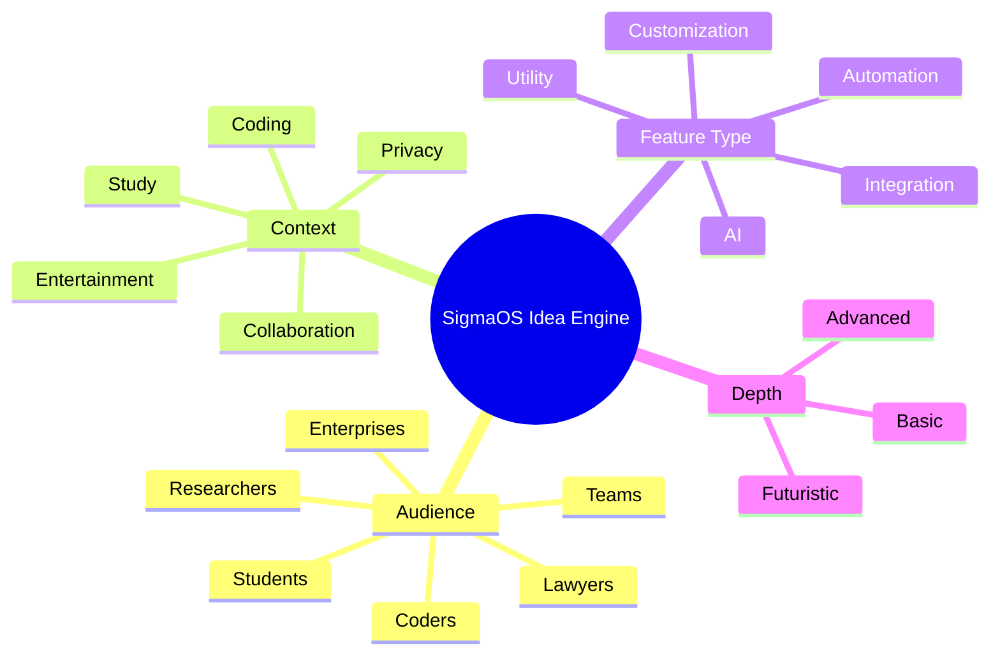

# 🚀 SigmaOS Infinite Idea Engine

The SigmaOS architectural design isn't just a roadmap—it is a scalable, combinatorial idea engine. By expanding across multiple dimensions (Audience, Context, Feature Type, Depth), SigmaOS scales infinitely to address any workflow permutation.

## 🧩 The Combinatorial Framework

## 🌟 The Expansive Roadmap (Shards 73 - 82)

We have mapped the following highly-advanced capabilities to the Sovereign Lattice:

1. **`S73_LectureMode`**: Auto-summarizes YouTube lectures into structured notes and flashcards.
2. **`S74_QuizGenerator`**: Analyzes browser context to generate interactive practice questions.
3. **`S75_StudyGroupMode`**: Tailors shared workspaces for real-time collaborative learning.
4. **`S76_DebugMode`**: A meta-utility to inspect and log automated workflows across task silos.
5. **`S77_CommentLayer`**: Allows you to anchor persistent annotations and comments directly on the web DOM.
6. **`S78_VersionedWorkspaces`**: A "Time Machine" specifically for your tabs—roll back to previous research states.
7. **`S79_WorkspaceChat`**: Integrated messaging tethered entirely to the context of a specific task.
8. **`S80_TaskSuggestions`**: Proactive intelligence recommending next steps based on historical browsing vectors.
9. **`S81_OfflineStudyMode`**: Auto-caches critical lectures and documentation for offline generation of notes.
10. **`S82_GamificationEngine`**: An RPG-style progression system awarding XP for completed tasks, solved algorithms, and consumed lectures.

11. **\S83_VisualAutomator\**: macOS Shortcuts inspired visual node-based automation.
12. **\S84_SubsystemLinux\**: WSL-inspired headless Linux terminal environment native to the web layer.
13. **\S85_MaterialMonetEngine\**: Android Material You inspired dynamic wallpaper color extraction for the UI.
14. **\S86_CommunityNexusRepo\**: Arch AUR inspired community-driven package repository.
15. **\S87_MobilePhoneHub\**: ChromeOS inspired deep mobile device integration (battery, hotspot, silencing).
16. **\S88_ContinuityCamera\**: macOS inspired external device webcam integration.
17. **\S89_PowerToysSuite\**: Windows inspired power-user utilities including global color picker and text extractor.
18. **\S90_IntelligentAppLibrary\**: iOS inspired auto-categorization of installed applications into smart folders.
19. **\S91_COWSnapshots\**: Linux ZFS/Btrfs inspired copy-on-write instant system rollbacks.
20. **\S92_SeamlessHandoff\**: macOS inspired cross-device task continuation.

21. **\S93_SpatialAudioEngine\**: Apple Spatial Audio inspired positional sound rendering.
22. **\S94_LiveCaptionsTranslation\**: Android Live Caption inspired system-wide real-time subtitles.
23. **\S95_SecureEnclave\**: Apple TPM/Secure Enclave inspired hardware-backed key storage simulation.
24. **\S96_PredictiveBackGesture\**: Android 14 inspired visual preview of navigation actions.
25. **\S97_CrashReporterTelemetry\**: Windows Error Reporting inspired automated stack trace dumping.
26. **\S98_UnifiedPushReceiver\**: Apple Push Notification Service inspired single multiplexed push connection.
27. **\S99_SystemIntegrityProtection\**: macOS SIP inspired rootless lockdown mode.
28. **\S100_ApexSingularityCore\**: The final unifier orchestrating all 99 shards, automatically exposing a Command Line Interface (CLI) mapping for every single task and module in the OS.

29. **\S101_ContainerOrchestrator\**: Kubernetes inspired containerized tab isolation and orchestration. (CLI: \kubectl-sim\)
30. **\S102_GitVersionControl\**: Git inspired snapshotting and branching for workspace states. (CLI: \git-sim\)
31. **\S103_InMemoryCache\**: Redis inspired high-speed key-value memory for the OS. (CLI: \
edis-cli\)
32. **\S104_StreamingCompositor\**: OBS Studio inspired screen recording and broadcasting built-in. (CLI: \obs-sim\)
33. **\S105_MediaTranscoder\**: FFmpeg inspired on-the-fly media manipulation. (CLI: \fmpeg-sim\)
34. **\S106_3DRenderEngine\**: Blender inspired WebGL spatial UI elements. (CLI: \
ender3d\)
35. **\S107_RelationalDatabase\**: PostgreSQL inspired local structured data storage. (CLI: \psql-sim\)
36. **\S108_SearchIndexer\**: ElasticSearch inspired full-text searching across all tabs and notes. (CLI: \elastic-sim\)
37. **\S109_PacketAnalyzer\**: Wireshark inspired network traffic monitoring for tabs. (CLI: \wireshark-sim\)
38. **\S110_DistributedStorage\**: IPFS inspired peer-to-peer file sharing and storage. (CLI: \ipfs-sim\)
39. **\S111_FirewallRulesEngine\**: iptables inspired granular permission control for web requests. (CLI: \iptables-sim\)
40. **\S112_MessageBroker\**: Kafka inspired event pub/sub system between shards. (CLI: \kafka-sim\)
41. **\S113_ContinuousIntegration\**: Jenkins inspired automated workflow runners. (CLI: \ci-runner\)
42. **\S114_ConfigurationManagement\**: Ansible inspired declarative setup of environments. (CLI: \nsible-sim\)
43. **\S115_MetricsDashboard\**: Grafana inspired advanced telemetry visualization. (CLI: \grafana-sim\)
44. **\S116_ReverseProxy\**: Nginx inspired local request routing and load balancing. (CLI: \
ginx-sim\)
45. **\S117_MachineLearningPipeline\**: TensorFlow inspired running local models via WebNN. (CLI: \	f-sim\)
46. **\S118_AccessibilityReader\**: NVDA inspired advanced screen reading and navigation. (CLI: \
vda-sim\)
47. **\S119_PasswordManager\**: Bitwarden inspired encrypted vault for credentials. (CLI: \ault-sim\)
48. **\S120_HypervisorManager\**: QEMU inspired managing virtualized sub-OS instances. (CLI: \qemu-sim\)

49. **\S121_Plan9Protocol\**: Plan 9 inspired 9P protocol and Everything-is-a-File abstraction. (CLI: \9p-mount\)
50. **\S122_HaikuBFSMetadata\**: BeOS/Haiku inspired database-like filesystem queries and rich metadata. (CLI: \fs-query\)
51. **\S123_QNXHardRealtime\**: QNX inspired hard real-time microkernel thread scheduling. (CLI: \qnx-rt\)
52. **\S124_OpenBSDPledge\**: OpenBSD inspired strict security sandboxing via pledge/unveil. (CLI: \pledge-sys\)
53. **\S125_AmigaARexx\**: AmigaOS inspired ARexx robust inter-process communication bus. (CLI: \rexx-msg\)
54. **\S126_TempleOSHolyC\**: TempleOS inspired HolyC JIT compilation and hardware-based PRNG. (CLI: \holyc-jit\)
55. **\S127_WebOSCardUI\**: Palm WebOS inspired card-based multitasking and Synergy cloud sync. (CLI: \webos-cards\)
56. **\S128_SymbianPowerMgmt\**: Symbian inspired extreme power state optimization and hibernation. (CLI: \symbian-pwr\)
57. **\S129_FreeBSDJails\**: FreeBSD inspired lightweight containerized system environments. (CLI: \jail-mgr\)
58. **\S130_SerenityVisualEngine\**: SerenityOS inspired 90s aesthetic compositing via modern WebGL. (CLI: \serenity-ui\)

59. **\S131_DataWarehouseEngine\**: Snowflake inspired decoupled compute/storage for tab data. (CLI: \snow-query\)
60. **\S132_UnifiedAnalyticsWorkspace\**: Databricks inspired notebook-based unified analytics. (CLI: \dbx-notebook\)
61. **\S133_DistributedDataProcessing\**: Apache Spark inspired RDD processing for huge DOM states. (CLI: \spark-submit\)
62. **\S134_BusinessIntelligenceDashboard\**: Tableau/Power BI inspired interactive visual analytics. (CLI: \i-render\)
63. **\S135_DataTransformationPipeline\**: dbt inspired data build tool for transforming OS data. (CLI: \dbt-run\)
64. **\S136_WorkflowOrchestrator\**: Apache Airflow inspired directed acyclic graph task scheduling. (CLI: \irflow-dag\)
65. **\S137_AutomatedDataSync\**: Fivetran inspired automated ELT pipelines from external APIs. (CLI: \ivetran-sync\)
66. **\S138_LogAggregationSplunk\**: Splunk inspired searching and monitoring machine-generated data. (CLI: \splunk-search\)
67. **\S139_GraphDatabaseEngine\**: Neo4j inspired graph relationships between tabs, tasks, and notes. (CLI: \cypher-query\)
68. **\S140_DocumentStoreEngine\**: MongoDB inspired flexible JSON-like document storage. (CLI: \mongo-find\)
69. **\S141_TimeSeriesDatabase\**: InfluxDB inspired high write load metrics tracking. (CLI: \influx-query\)
70. **\S142_OpenTableFormat\**: Apache Iceberg inspired huge analytic tables management. (CLI: \iceberg-table\)
71. **\S143_DataCatalogGovernance\**: Collibra inspired metadata management and data governance. (CLI: \data-catalog\)
72. **\S144_StreamProcessingEngine\**: Apache Flink inspired stateful computations over data streams. (CLI: \link-stream\)
73. **\S145_InteractiveDataScience\**: Jupyter/Pandas inspired interactive dataframe manipulation. (CLI: \jupyter-cell\)

74. **\S146_PackageManager\**: apt/pacman inspired module installation and dependency resolution. (CLI: \sigma-apt\)
75. **\S147_WasmPluginRuntime\**: Cross-language extensions via WebAssembly (Rust, Go, Python). (CLI: \wasm-run\)
76. **\S148_ConfigAsCodeEngine\**: NixOS style declarative workspace definitions and reproducible environments. (CLI: \
ix-build\)
77. **\S149_FeatureFlagController\**: Dynamically toggle experimental modules without bloating the core. (CLI: \eature-flag\)
78. **\S150_RollingReleaseChannel\**: Opt-in bleeding edge module updates vs stable branch. (CLI: \os-release\)
79. **\S151_MicrokernelIsolator\**: Strict memory and privilege separation between Kernel and Userland modules. (CLI: \isol-sys\)
80. **\S152_CommunityMarketplace\**: Curated ecosystem repository of third-party tools and plugins. (CLI: \sigma-store\)
81. **\S153_DataScienceEnvironment\**: Jupyter-like interactive ML playground natively in the browser. (CLI: \ds-env\)
82. **\S154_AIModelServer\**: Ollama inspired local LLM hosting and inference endpoint. (CLI: \ollama-sim\)
83. **\S155_CodeInterpreter\**: Auto-executing Python/JS sandboxes for AI assistant agents. (CLI: \exec-code\)
84. **\S156_StudyPackBundle\**: Curated meta-package installing Lecture Mode, Flashcards, and Citation Collector. (CLI: \install-study\)
85. **\S157_DeveloperPackBundle\**: Curated meta-package installing Snippet Manager, API Playground, and GitHub Integration. (CLI: \install-dev\)
86. **\S158_PrivacyPackBundle\**: Curated meta-package for ultimate tracking protection and hardened encryption. (CLI: \install-privacy\)
87. **\S159_CollaborationHub\**: Real-time WebRTC syncing engine for shared workspaces and co-browsing. (CLI: \collab-sync\)
88. **\S160_UltimateConvergence\**: The singularity bridging Linux package management with browser OS agility. (CLI: \converge\)

89. **\S161_DualBootManager\**: GRUB inspired bootloader switching between OS states. (CLI: \grub-sim\)
90. **\S162_HardwareAbstractionLayer\**: Deeply integrating WebUSB, WebBluetooth, WebGPU. (CLI: \hal-ctrl\)
91. **\S163_ContainerSandbox\**: Docker inspired sandboxed workspace containers. (CLI: \sandbox-run\)
92. **\S164_VMOrchestrator\**: KVM inspired lightweight VM support for Study/Coding VMs. (CLI: \m-launch\)
93. **\S165_WorkspaceAutomationEngine\**: Auto-grouping, auto-resuming, and auto-archiving domains. (CLI: \uto-work\)
94. **\S166_LearningAutomationEngine\**: Auto-summarize lectures, auto-generate flashcards and quizzes. (CLI: \uto-learn\)
95. **\S167_DeveloperAutomationEngine\**: Auto-save snippets, auto-link GitHub, auto-test APIs. (CLI: \uto-dev\)
96. **\S168_CollabAutomationEngine\**: Auto-share, auto-notify, and auto-version team workspaces. (CLI: \uto-collab\)
97. **\S169_PrivacyAutomationEngine\**: Auto-block trackers, auto-encrypt, auto-switch to VPN. (CLI: \uto-priv\)
98. **\S170_SystemAutomationEngine\**: Auto-update modules, auto-rollback NixOS style configs. (CLI: \uto-sys\)
99. **\S171_CombinatorialTriggerBus\**: Rule engine crossing contexts and triggers for 10,000+ automations. (CLI: \	rigger-bus\)
100. **\S172_EventSourcingJournal\**: Immutable log of all automations to allow perfect state replay. (CLI: \es-journal\)
101. **\S173_CrossContextSync\**: Syncing project contexts and learning progress globally. (CLI: \ctx-sync\)
102. **\S174_GamificationXPLedger\**: Securing XP and achievements for tasks completed and code written. (CLI: \xp-ledger\)
103. **\S175_SigmaOmnipresence\**: The apex state unifying the 6 automation engines into one workflow. (CLI: \omnipresence\)

104. **\S176_AlpineMinimalistCore\**: Alpine inspired busybox/musl extreme lightness and minimal footprint. (CLI: \pk-sim\)
105. **\S177_GentooSourceCompiler\**: Gentoo Portage inspired compile-from-source JIT optimization. (CLI: \emerge-sim\)
106. **\S178_KaliForensicsToolkit\**: Kali inspired penetration testing and network forensics for web security. (CLI: \kali-tools\)
107. **\S179_TailsAmnesicIncognito\**: Tails inspired Tor routing and memory wiping amnesic mode. (CLI: \	or-route\)
108. **\S180_VoidRunitInit\**: Void Linux inspired runit ultra-fast parallel service initialization. (CLI: \
unit-sim\)
109. **\S181_SlackwarePureUnix\**: Slackware inspired strict Unix philosophy and simple shell abstractions. (CLI: \slack-pkg\)
110. **\S182_PopTilingManager\**: Pop!_OS inspired auto-tiling windows and extreme keyboard navigation. (CLI: \pop-tile\)
111. **\S183_QubesXenIsolation\**: Qubes OS inspired strict tab isolation into distinct Xen-like domains. (CLI: \qubes-dom\)
112. **\S184_RHELSelinuxPolicies\**: RHEL inspired Mandatory Access Control (MAC) security policies. (CLI: \selinux-sim\)
113. **\S185_UbuntuPPAManager\**: Ubuntu inspired Personal Package Archives for third-party modules. (CLI: \pt-ppa\)
114. **\S186_DebianAPTPinning\**: Debian inspired granular package version control across shards. (CLI: \pt-pin\)
115. **\S187_FedoraSilverblueOSTree\**: Fedora Silverblue inspired rpm-ostree immutable filesystem imaging. (CLI: \ostree-sim\)
116. **\S188_NixOSAtomicUpgrades\**: NixOS inspired guaranteed atomic system upgrades and safe rollbacks. (CLI: \
ix-env\)
117. **\S189_ClearLinuxPerformance\**: Clear Linux inspired deep hardware-specific performance tuning. (CLI: \clear-opt\)
118. **\S190_ManjaroMHWDDrivers\**: Manjaro inspired MHWD automated hardware detection and configuration. (CLI: \mhwd-sim\)

---

### ⚡ Scaling to Millions of Ideas
By crossing any node from our Idea Engine framework, you generate unique features.
*Example: [Coders] + [Collaboration] + [AI] + [Futuristic] = **AI Pair-Programming Mesh Network via WebRTC**.*

*SigmaOS is not just an operating system; it is the definitive interface for Builders and Learners.*
