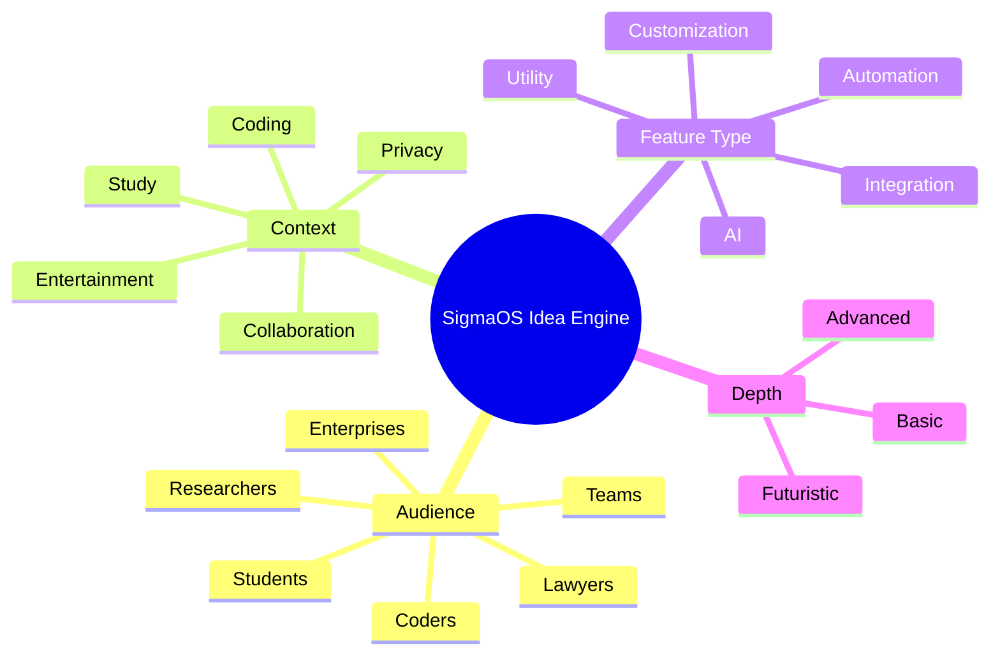

# 🚀 SigmaOS Infinite Idea Engine

The SigmaOS architectural design isn't just a roadmap—it is a scalable, combinatorial idea engine. By expanding across multiple dimensions (Audience, Context, Feature Type, Depth), SigmaOS scales infinitely to address any workflow permutation.

## 🧩 The Combinatorial Framework

## 🌟 The Expansive Roadmap (Shards 73 - 82)

We have mapped the following highly-advanced capabilities to the Sovereign Lattice:

1. **`S73_LectureMode`**: Auto-summarizes YouTube lectures into structured notes and flashcards.
2. **`S74_QuizGenerator`**: Analyzes browser context to generate interactive practice questions.
3. **`S75_StudyGroupMode`**: Tailors shared workspaces for real-time collaborative learning.
4. **`S76_DebugMode`**: A meta-utility to inspect and log automated workflows across task silos.
5. **`S77_CommentLayer`**: Allows you to anchor persistent annotations and comments directly on the web DOM.
6. **`S78_VersionedWorkspaces`**: A "Time Machine" specifically for your tabs—roll back to previous research states.
7. **`S79_WorkspaceChat`**: Integrated messaging tethered entirely to the context of a specific task.
8. **`S80_TaskSuggestions`**: Proactive intelligence recommending next steps based on historical browsing vectors.
9. **`S81_OfflineStudyMode`**: Auto-caches critical lectures and documentation for offline generation of notes.
10. **`S82_GamificationEngine`**: An RPG-style progression system awarding XP for completed tasks, solved algorithms, and consumed lectures.

11. **\S83_VisualAutomator\**: macOS Shortcuts inspired visual node-based automation.
12. **\S84_SubsystemLinux\**: WSL-inspired headless Linux terminal environment native to the web layer.
13. **\S85_MaterialMonetEngine\**: Android Material You inspired dynamic wallpaper color extraction for the UI.
14. **\S86_CommunityNexusRepo\**: Arch AUR inspired community-driven package repository.
15. **\S87_MobilePhoneHub\**: ChromeOS inspired deep mobile device integration (battery, hotspot, silencing).
16. **\S88_ContinuityCamera\**: macOS inspired external device webcam integration.
17. **\S89_PowerToysSuite\**: Windows inspired power-user utilities including global color picker and text extractor.
18. **\S90_IntelligentAppLibrary\**: iOS inspired auto-categorization of installed applications into smart folders.
19. **\S91_COWSnapshots\**: Linux ZFS/Btrfs inspired copy-on-write instant system rollbacks.
20. **\S92_SeamlessHandoff\**: macOS inspired cross-device task continuation.

---

### ⚡ Scaling to Millions of Ideas
By crossing any node from our Idea Engine framework, you generate unique features.
*Example: [Coders] + [Collaboration] + [AI] + [Futuristic] = **AI Pair-Programming Mesh Network via WebRTC**.*

*SigmaOS is not just an operating system; it is the definitive interface for Builders and Learners.*
