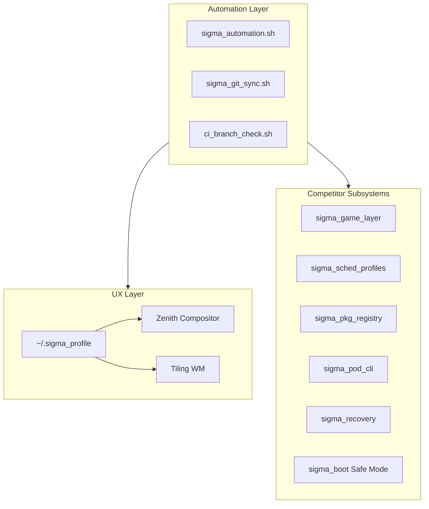

# SigmaOS Meta-Distro Unified Engine

SigmaOS treats other Linux distributions as **feature suppliers**, not competitors. Each distro’s unique capability maps to a sovereign subsystem that shares automation, CLI, Zenith GUI, and branch parity enforcement.

## Architecture



## Subsystem map

| Distro class | SigmaOS module | User-visible feature |
| -------------- | ---------------- | ---------------------- |
| SteamOS | `sigma_game_layer.c` | Gaming profile + compatibility shim hooks |
| Clear Linux | `sigma_sched_profiles.c` | Performance / balanced / power-save CPU policy |
| NixOS | `sigma_pkg_registry/` | Reproducible signed `.spkg` recipes |
| CoreOS / Flatcar | Boot + rollback | Immutable updates, Safe Mode, Fix-it menu |
| RancherOS | `sigma_pod_cli` | Namespaced workloads without Docker |
| Rescuezilla | `sigma_recovery.c` | Snapshots, rollback, forensic audit |
| Solus | Zenith + profile | Themes, gaps, auto-tile layouts |

## Branch parity

All `release/*` branches must satisfy profiles in `FEATURE_MATRIX.md`. CI runs `scripts/ci_branch_check.sh` on every push.

## Central registry

All competitor modules are initialized through one call:

```c
#include "sigma_meta_distro.h"

sigma_meta_distro_init(SIGMA_META_ALL_FEATURES);
```

Implementation: `kernel/subsystems/sigma_meta_distro.c`

| Flag | Subsystem |
| ------ | ----------- |
| `SIGMA_FEATURE_GAMING` | `sigma_game_layer.c` |
| `SIGMA_FEATURE_PERFORMANCE` | `sigma_sched.c` |
| `SIGMA_FEATURE_PACKAGES` | `sigma_pkg_registry/` |
| `SIGMA_FEATURE_IMMUTABLE` | `sigma_immutable_root.c` |
| `SIGMA_FEATURE_RECOVERY` | `sigma_recovery.c` + GUI |
| `SIGMA_FEATURE_DESKTOP` | Zenith compositor + tiling + profile |

## Maintainer workflow

```bash
./scripts/sigma_automation.sh meta-check
./scripts/sigma_automation.sh update
./scripts/ci_branch_check.sh
./scripts/sigma_branch_sync.sh --report
./scripts/sigma_git_sync.sh -m "docs: meta-distro wiki sync"
```

Wiki publishes from `wiki_repo/` via GitHub Actions.


---
## Merged from Meta-Distro-Unified-Engine.md
# Meta-Distro Unified Engine

SigmaOS absorbs competitor distro strengths as **modular subsystems** under one sovereign engine.

## Bootstrap

```c
#include "sigma_meta_distro.h"

sigma_meta_distro_init(SIGMA_META_ALL_FEATURES);
/* Profile boot (Minimal / Developer / Desktop / Cloud / Mobile): */
sigma_meta_boot_for_profile(2); /* Desktop */
```

## Subsystem map

| Competitor | Module | Feature |
| ------------ | -------- | --------- |
| SteamOS | `sigma_game_layer.c` | Gaming + Proton hooks |
| Clear Linux | `sigma_sched.c` | Performance profiles |
| NixOS | `sigma_pkg_registry/` | Reproducible `.spkg` recipes |
| CoreOS / Flatcar | `sigma_immutable_root.c` + `sigma_boot.c` | Immutable root + Safe Mode |
| RancherOS | `sigma_pod_cli.cpp` | Native namespaces/cgroups |
| Rescuezilla | `sigma_recovery.c` + GUI | Rollback wizard |
| Solus | Zenith + `~/.sigma_profile` | Theme, tiling, personalization |

## Automation

```bash
./scripts/sigma_automation.sh meta-check
./scripts/ci_branch_check.sh
./scripts/sigma_git_sync.sh --dry-run
```

Canonical docs: [META_DISTRO_UNIFIED_ENGINE.md](https://github.com/AaryanSinghChauhan09/SigmaOS/blob/main/docs/META_DISTRO_UNIFIED_ENGINE.md)
