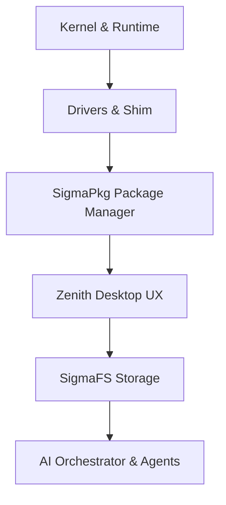

# SigmaOS Maturity & Distro-Parity Roadmap

> **Status**: 🔄 Active | **Scope**: `Strategic Planning & Maturity Milestones`

---

## 1. Core Priorities and Success Metrics

To reach and surpass mature Linux distributions, SigmaOS adheres to a set of strict core engineering priorities and success metrics.

### Primary Goals:
- **Stability**: Implementation of fully reproducible builds, comprehensive test suite coverage, and automated integration regression testing.
- **Hardware Support**: Broad driver availability for standard consumer devices (x86_64, ARM64, and RISC-V platforms).
- **Package Ecosystem**: A robust, decentralized, and sandboxed package manager (`SigmaPkg`) featuring transaction-based rollbacks and support adapters.
- **Security**: Syscall capability-token boundaries, secure boot validation, and immutable write-ahead logging (WAL).
- **Polished UX**: The Zenith Desktop environment behaving as a production-ready, low-latency display manager.

### Success Metrics:
1. Bootable installation ISO with GUI installer deployed within 6 months.
2. 90% test coverage passing in CI on all core modules.
3. GPU, Wi-Fi, and standard desktop peripherals supported on 80% of tested consumer hardware configurations.
4. `SigmaPkg` running 90% of imported core packages in sandboxes within 12 months.

---

## 2. Technical Workstreams and Concrete Actions

### 2.1 Kernel & Runtime
- **Action**: Implement syscall capability token boundaries. Each thread is spawned with specific tokens mapping resource permissions, rejecting unauthorized kernel interactions.
- **Deliverables**: Syscall capability gate logic, local access policies.

### 2.2 Drivers & Hardware Shim
- **Action**: Build a dual driver strategy consisting of native drivers for common hardware and a compatibility driver shim to load standard Linux kernel module interfaces when native ones are absent.
- **Deliverables**: Linux driver shim prototype layer, whitelisted PCI/USB ID driver database.

### 2.3 Package Management (`SigmaPkg`)
- **Action**: Build a sandboxed, declarative package management system with adapters to read and translate packages from legacy ecosystems (`apt`, `pacman`, `dnf`, `nix`).
- **Deliverables**: `SigmaPkg` specifications, translation adapter modules, transaction rollback tool.

### 2.4 Filesystem & Storage (`SigmaFS`)
- **Action**: Build `SigmaFS` using Copy-on-Write (CoW), checksummed data validation, and transactional volume snapshots.
- **Deliverables**: `SigmaFS` driver prototype, snapshot API hooks.

### 2.5 AI Orchestration & Automation
- **Action**: Deploy a local LLM runtime (run on NPU/GPU via Wasmtime) for local desktop automation, predictive diagnostics, and compliance analysis.
- **Deliverables**: `sigma-ai-daemon`, local inference API, compliance logging.

---

## 3. CI/CD, Branching, & Release Policy

### Pipeline Execution:
1. **Lint Phase**: Syntax validation and static code analysis.
2. **Unit Phase**: Isolated module testing.
3. **Integration Phase**: Testing component interactions using QEMU virtual drivers.
4. **Hardware Verification**: Running smoke tests on standard bare-metal hardware testing rigs.
5. **ISO Build**: Assembling reproducible installation media.

### Branching Policy:
- Master branch (`main`) is protected. All modifications require passing CI pipelines and signed commits.
- Release tags represent tested milestones. Rolling updates are shipped weekly via the `canary` update channel.

---

## 4. Phased Timeline

| Phase | Duration | Core Outcomes |
| :--- | :--- | :--- |
| **Immediate** | 0-3 Months | Repo audit & docs consolidation, package manager spec, driver priority whitelists, baseline CI. |
| **Short** | 3-9 Months | `SigmaPkg` prototype, capability token layer v1, Zenith compositor alpha, `SigmaFS` prototype, bootable installer ISO. |
| **Mid** | 9-18 Months | Linux driver shim layer, package adapters for `apt`/`pacman`, TPM secure boot, rolling channel launch. |
| **Long** | 18-36 Months | Native LLM runtime integration, hardware-certification programs, LTS release target, global contributor scale. |
